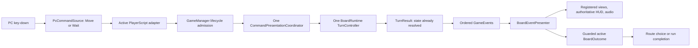

# HallowBlaze — Technical Roadmap

> Status dokumentu: **Accepted / execution roadmap v0.6 — M3.6, M3.7 and M3.8.1-M3.8.6 accepted; M3.8.7 next; route-leg amendments accepted; M9 deferred**
> Data ostatniej weryfikacji: 2026-10-09
> Właściciel statusów i kolejności: **Coordinator**  
> Kontrakt produktu: [`GameDesignContract.md`](./GameDesignContract.md)  
> Zasady pracy agentów: [`../AGENTS.md`](../AGENTS.md)

## 1. Cel dokumentu

Ten dokument zamienia kontrakt projektowy na kolejność małych, weryfikowalnych zmian technicznych. Każda karta odpowiada nie tylko na pytanie „co zrobić”, lecz także „dlaczego robimy to teraz”, czego celowo nie robić i jak udowodnić poprawność.

### Rationale — dlaczego roadmapa jest osobnym dokumentem

`GameDesignContract.md` opisuje docelowe zachowanie gry, natomiast ta roadmapa opisuje drogę od istniejącego prototypu do tego zachowania. Oddzielenie tych ról zapobiega sytuacji, w której chwilowa kolejność implementacji zaczyna po cichu zmieniać projekt gry.

## 2. Jak korzystać z roadmapy

1. Coordinator wybiera pierwszą niezakończoną kartę, której zależności są spełnione.
2. Przed przydzieleniem zmienia jej status z `Ready` na `Active` i wskazuje jednego writera.
3. Developer realizuje wyłącznie tę kartę zgodnie z `AGENTS.md`.
4. Po handoffie Reviewer/Tester pracuje read-only i wydaje werdykt `Accept`, `Changes requested` albo `Blocked`.
5. Tylko Coordinator zmienia status na `Done` albo zwraca kartę do `Active`.
6. Karta `Planned` musi zostać ponownie sprawdzona i, jeśli potrzeba, doprecyzowana przed zmianą na `Ready`.

Dozwolone statusy:

- `Done` — zaakceptowane i zweryfikowane;
- `Ready` — kompletne, zależności spełnione, można przydzielić;
- `Active` — ma aktualnie jednego writera;
- `Planned` — kolejność jest zaakceptowana, ale zależności nie są jeszcze spełnione;
- `Blocked` — wymaga decyzji, dostępu albo działania właściciela projektu;
- `Deferred` — świadomie poza vertical slice.

W danej chwili może istnieć najwyżej jedna karta `Active`. Równolegle można wykonywać wyłącznie niezależne audyty i review w trybie read-only.

### 2.1. Numeracja i granice kart

- Normal cards use `M<milestone>.<number>`, for example `M0.7` or `M3.2`.
- A card that is too large for one safe writer/review iteration may become a tracking umbrella with executable child cards named `M<milestone>.<card>.<child>`, for example `M3.6.1`. Every child is an independently scoped implementation and review unit and carries the complete card fields, acceptance evidence, and handoff.
- An umbrella is `Done` only after every child is accepted. A dependency on the umbrella ID means that all of its children are accepted; callers do not depend on a partially completed umbrella unless they name a specific child explicitly.
- Each card or child starts after a horizontal rule with its numbered heading. The one-writer rule still permits at most one `Active` executable card or child at a time; an umbrella tracking an active child is not a second writer lease.
- Current identifiers, including child identifiers where used, remain authoritative in dependencies, historical handoffs, execution queues, and planned validation-report names.

### Rationale — dlaczego tylko jeden aktywny writer

Agenci współdzielą ten sam katalog, a Unity może automatycznie modyfikować assety, pliki `.meta`, `Library` i ustawienia. Jeden writer oraz jawny handoff redukują konflikty, przypadkową reserializację i pomieszanie zmian kilku ticketów.

## 3. Stan wyjściowy i założenia

- Repozytorium Git ma root w `E:\Repos\HallowBlaze`, a projekt Unity w `E:\Repos\HallowBlaze\HallowBlaze`.
- Projekt używa Unity `6000.3.21f1`.
- Unity Test Framework `1.6.0` jest zadeklarowany. Dwa test assemblies są zaakceptowane; końcowa bramka M0 wykonała EditMode `1/1` i PlayMode `5/5`, a Player build nie zawierał assembly testowych.
- `Visible Meta Files` jest włączone i bieżący audyt nie wykazał brakujących ani osieroconych plików `.meta`.
- Po `M0.5` aktywne są `Force Text` i `Visible Meta Files`; wszystkie 57 wspieranych scen/prefabów/animacji/kontrolerów jest w YAML, a sceny mają osobne assety `LightingSettings`. Po `M0.6` `ProjectSettings/NetworkManager.asset` nie istnieje; audyt nie wykazał binarnego pliku w objętej tymi kartami grupie.
- Rootowy `.gitignore` nadal jest źle zakotwiczony dla zagnieżdżonego projektu, ale projektowy `/.gitignore` z `M0.1` skutecznie kompensuje ten problem.
- Wyniki M0 zostały scalone do `master` przez PR #1. Preflight przed rozpoczęciem M1 wykazał czysty working tree bez zmian staged, unstaged i nieignorowanych untracked; każdą późniejszą zmianę nadal należy traktować jako własność jej autora i chronić zgodnie z `AGENTS.md`.
- Branch `M1/StateFoundation` zawiera wcześniejszą, niezaakceptowaną próbę `RunState` z commita `3d10d54`. Jej obecność nie zmienia statusu żadnej karty i nie stanowi dowodu spełnienia kryteriów `M1.2`.
- Po `M0.10` bieżący klient nie zawiera wartości Dreamlo ani transportu leaderboardu i działa wyłącznie offline. Historyczna wartość pozostaje w Git; nie wolno jej cytować, kopiować, ponownie używać ani testować przez sieć.

### 3.1. Operacyjny pre-flight Git

Git jest dostępny bez zmiany globalnego `safe.directory`, a rzeczywisty root to `E:/Repos/HallowBlaze`. Dnia 2026-08-29 wykonano `fetch --prune`: `origin/master` wskazuje `68080fa`, czyli merge PR #1 zawierający zaakceptowany tip M0 `4813b5a`. Lokalny `master` został zaktualizowany wyłącznie przez fast-forward, następnie scalony do `M1/StateFoundation` jako `b36c689`; merge zachowuje także wcześniejszy `3d10d54`. Jedyny konflikt tekstowy w `PlayerScript.cs` połączył zaakceptowane pojedyncze rozstrzygnięcie ruchu z zastaną delegacją kosztu do `RunState`; po merge nie pozostały wpisy unmerged ani zmiany w working tree.

Jeżeli błąd `unsafe repository` powróci, agent zatrzymuje zapis, zgłasza dokładny katalog i nie ustawia samodzielnie globalnego zaufania. Właściciel może jawnie zaufać wyłącznie dokładnej ścieżce repo, nigdy wildcardowi `*`.

### 3.2. Audyt zmian po baseline — 2026-08-25

Audyt objął status i diff Git, karty M0, powiązane sekcje kontraktu, statyczną walidację YAML/GUID oraz niezależną próbę EditMode w Unity `6000.3.21f1`. Nie wykonano stagingu, commita, operacji sieciowej ani rewrite'u historii.

- Repo-wide working tree ma `78` zmodyfikowanych plików, `1` usunięty i `17` untracked; brak zmian staged i konfliktów. Całość od `M0.4` wzwyż nadal nie ma osobnego checkpointu Git.
- Potwierdzono statycznie `57/57` docelowych assetów w YAML, `163/163` unikalnych GUID-ów, po jednej poprawnej referencji do każdego nowego `LightingSettings`, brak tekstowych wpisów `Missing Script` oraz usunięcie `NetworkManager.asset`.
- Niezależny EditMode batch zakończył się kodem `1` przed uruchomieniem testów. `ManageRecords.cs` zgłosił wiele `CS0106` i końcowe `CS1513` z powodu niezbilansowanych klamer; nie powstał wynik XML. PlayMode i smoke nie zostały uruchomione, ponieważ projekt nie kompiluje się.
- Próba testowa nie zmieniła hasha żadnego śledzonego ani nieignorowanego pliku. Utworzyła wyłącznie ignorowany log pod `Temp/TestResults/`.
- `M0.10` usunęło transport i wartość Dreamlo z bieżącego klienta, przywróciło kompilację oraz potwierdziło offline smoke. Właściciel 2026-08-27 odłożył leaderboard online i rotację historycznej wartości poza bieżący projekt, jawnie akceptując pozostające ryzyko historii bez deklarowania technicznego unieważnienia klucza.
- `PlayerScript.cs` usuwa drugie wywołanie `Move`, ale wraz z nim znika jedyne odtworzenie dźwięku poprawnego ruchu. Obecny test sprawdza tylko końcową pozycję po stałym czasie; nie odróżnia jednej próby od dwóch, nie sprawdza kosztu, blokady ani wyjścia.
- `com.unity.ai.assistant` został poza zakresem kart podniesiony z `2.17.0-pre.1` do `2.18.0-pre.2`. Rejestr Unity sprawdzony 2026-08-27 wskazuje `2.18.0-pre.2` jako `latest`, zgodne od Unity `6000.0`; manifest, lock i HEAD są ze sobą spójne. `M0.11` waliduje i formalnie przyjmuje ten stan bez sztucznej zmiany wersji.
- W root repo znajduje się nieśledzony `bfg-1.15.0.jar`. Brak `refs/original` i wpisów refloga wskazujących rewrite; pliku nie uruchomiono ani nie usunięto. Każda zmiana historii wymaga osobnej, jawnej autoryzacji i planu rotacji credentialu.
- `GameDesignContract.md` Appendix A nadal zawiera historyczne opisy podwójnego `Move` i pozostającego `NetworkManager.asset`; wymaga osobnej korekty po przyjęciu odpowiednich wyników, a nie może służyć jako dowód bieżącej kompilacji.

**Wniosek Coordinatora 2026-08-28:** blokady audytu zostały zamknięte: `M0.7`, `M0.8` i `M0.11` przeszły niezależne review, a pełna bramka M0 jest zielona. `M0.9` pozostaje świadomie odłożone po ukończeniu lokalnej kwarantanny `M0.10`; nie blokuje development milestone, ale zachowuje jawne ryzyko historii Git.

### Rationale — dlaczego higiena poprzedza gameplay

Nowy atlas, resolver tur i save system dotkną wielu plików. Bez poprawnego ignorowania katalogów generowanych, tekstowej serializacji i testów każda kolejna zmiana będzie trudniejsza do review, a konflikty mogą uszkodzić referencje Unity. Te zadania nie są kosmetyką — tworzą warunki do bezpiecznej rozbudowy gry i pracy agentowej.

## 4. Mapa etapów

| Etap | Rezultat | Bramka przejścia |
| --- | --- | --- |
| M0 — Safe Repository | repo jest czytelne dla Git, Unity i agentów; istnieje baseline oraz test runner | brak katalogów generowanych w statusie, tekstowe assety, zielony smoke test |
| M1 — State Foundation | pauza nie mutuje planszy, a `RunState` i `ProfileState` mają jednego właściciela i bezpieczny zapis | pause/exit są bezpieczne; restart sceny i aplikacji nie miesza profilu z runem |
| M2 — Persistent Atlas Prototype | stały graf około pięciu dni zachowuje odkrycia pomiędzy runami | tester używa wiedzy z pierwszej próby w drugiej |
| M3 — Deterministic Tactical Core | a command has one result/turn, intents are explicit, and multi-board travel has stable segment identity | replay gives the same hash and route legs advance only at valid boundaries |
| M4 — Generation, Noise and Enemies | model-first generator jest walidowany, a hałas tworzy decyzje | 10 000 seedów bez softlocka; Listener jest przewidywalny |
| M5 — Tools | dwa narzędzia tworzą odmienne decyzje i alternatywne trasy | brak losowego softlocka; koszty narzędzi są czytelne |
| M6 — Landmark | systemowa zagadka łączy pchanie, płyty i bramy | każdy wariant jest rozwiązywalny; co najmniej dwa sensowne rezultaty |
| M7 — Ten-day Vertical Slice | the two-biome journey has a finale, historical route-supply memory, fixed tool-source knowledge, and a summary | the player understands atlas evidence/intents/tools and wants another run |
| M8 — Optional Post-slice Work | explicitly deferred capabilities remain isolated from the validated core | each item requires its own product decision and evidence |
| M9 — Spatial Inventory and Resource Pressure | a 3×3 bag, two quick pockets, and satiety turn route knowledge into resource decisions | no duplication/loss; players choose routes from current need and learned supply |

Etapy są sekwencyjne jako bramki jakości, ale nie oznaczają masowego refaktoru. Każda karta ma pozostawić projekt w uruchamialnym stanie.

## 5. Reguły wspólne dla wszystkich kart

### 5.1. Domyślny obszar zmian

Dozwolony obszar plików w karcie jest zamkniętą listą. Pliki `.meta` odpowiadające nowym, przeniesionym lub usuniętym assetom są domyślnie częścią tego samego obszaru. `ProjectSettings`, `Packages`, sceny i prefaby są zabronione, jeśli karta nie wymienia ich jawnie.

### 5.2. Save compatibility

Do czasu powstania `M1.5` nie ma gwarancji kompatybilności prototypowych `PlayerPrefs`. Od `M1.5` każda zmiana DTO musi:

- zwiększyć `schemaVersion`, jeśli zmienia format;
- dostarczyć migrację albo jawnie odrzucić starszy zapis z bezpiecznym komunikatem;
- nigdy nie kasować pliku profilu przed utworzeniem poprawnego backupu.

### 5.3. Testy

- Czyste reguły: EditMode.
- Cykl Unity, sceny, input i prezentacja: PlayMode oraz ręczny smoke test.
- Generator: deterministyczność, osiągalność i testy wielu seedów.
- Regresja: test odtwarzający błąd, gdy jest technicznie rozsądny.

„Projekt się kompiluje” nie oznacza „testy przeszły”. Każdy handoff podaje dokładne wyniki oraz luki w weryfikacji.

### 5.4. Domyślny handoff

Każda karta wymaga handoffu z `AGENTS.md`: ID, rationale rozwiązania, zmienione pliki, potwierdzone non-goals, dokładne testy, ręczne kroki, ryzyka, otwarte decyzje i stan working tree. Karty poniżej dopisują tylko wymagania specyficzne.

### Rationale — dlaczego wspólne reguły nie są kopiowane do każdej karty

Powtarzanie tych samych zasad w kilkudziesięciu miejscach tworzyłoby sprzeczne wersje. Każda karta nadal jawnie podaje własny wpływ na save, testy, obszar plików i dodatkowy handoff; ten rozdział definiuje wyłącznie niezmienny baseline.

### 5.5. Accepted future-feature readiness audit — 2026-09-27

This audit reviewed every existing milestone against the accepted multi-board route, atlas-observation, and deferred inventory contract in `GameDesignContract.md` section 27. Completed cards remain historical evidence; follow-up cards supersede their intentionally narrower assumptions.

| Existing scope | Required preparation or conclusion | Owning follow-up |
| --- | --- | --- |
| M0 | No gameplay structure is affected. Repository and Unity safety rules remain unchanged. | none |
| M1.1–M1.11 (`Done`) | Do not rewrite history. Current run schema, `Food`, node-ID route, node/day seed, and profile discovery lists are migrated explicitly rather than extended opportunistically. Pause/menu behavior remains compatible; new route/inventory state is migrated explicitly rather than added opportunistically. | M3.11, M7.4, M7.5, M9.2–M9.3 |
| M2.1–M2.8 (`Done`) | Preserve the accepted atlas prototype. Edge selection must later begin travel instead of immediately reaching its destination; node-based `BoardRequest` is replaced by a stable segment address. | M3.11–M3.12 |
| M3.1–M3.4 (`Done`) | Grid/item layers and the one-turn result remain valid. Automatic food and cost `1` are transitional behavior, explicitly replaced only by M9. | M9.2 and M9.5 |
| M3.5, M3.6, M3.10 | Keep orchestration command-agnostic, modal input draft-only, and replay/version/hash extensible. M3.7–M3.9 need no inventory-specific redesign. | amendments in those cards |
| M4.1–M4.6 | Generate by stable board address; represent generic items/source IDs and a read-only resource manifest; measure segment and aggregate route supply. M4.7–M4.9 remain structurally unchanged. | amendments in those cards, M7.4–M7.5 |
| M5.1–M5.7 | Preserve ground instances until atomic commit; keep generic tool equipment separate from the bag; distinguish tool source, definition, and instance IDs. O-003 is resolved and transitional. | amendments in M5.1–M5.7, M9.5 |
| M6.1–M6.6 | Landmark/template addressing must not assume node equals one board; rewards use stable item IDs. Puzzle, solver, and gate semantics otherwise remain unchanged. | M6.1/M6.4 readiness notes, M3.11 |
| M7.1–M7.3 | Author variable segment sequences, route-aware biome/config data, truthful resource bands, and route length. | amended cards |
| M7 finale/summary/gate | Add resource observations and fixed tool-source knowledge before the finale; summaries use structured leg history; the final gate makes a separate M9 decision. | M7.4–M7.8 |
| M8.1 | A future snapshot includes active leg state, observation accumulator, and—if M9 has shipped—satiety, item instances, bag, and pockets. | amended card |
| M8.2 and M8.5 | Campaign budgets count boards/turns as well as days; accepted inventory is not part of the deferred crafting/combat/rarity proposal. M8.3, M8.4, and M8.6 require no inventory redesign. | amended cards |
| New inventory work | Do not pull backpack UI or economy into M5. Implement it only after a no-backpack playtest and an explicit owner checkpoint. | M9.1–M9.8 |

#### Rationale

The route-leg model changes identity and persistence before the bag changes UI. Establishing stable edge/segment addresses before generator work avoids later rewrites of seeds, replay, tool locations, and atlas samples. Keeping M9 last still lets the owner play the complete no-backpack game before committing to its new economy.

---

# M0 — Safe Repository

---

## `M0.1` — Project-local Unity `.gitignore`

**Status:** `Done`
**Ukończono:** 2026-08-20 — review `Pass`; 17/17 testów pozytywnych i 8/8 negatywnych `git check-ignore`.  
**Priorytet:** P0  
**Powiązany kontrakt:** Appendix A oraz sekcja 22.

**Rationale:** Rootowy `.gitignore` jest o jeden poziom za wysoko i używa zakotwiczonych wzorców, więc Git widzi wygenerowane katalogi zagnieżdżonego projektu Unity. Lokalny plik w katalogu projektu rozwiązuje problem bez modyfikowania plików poza zakresem aktualnego `AGENTS.md` i bez kasowania danych.

**Obecne zachowanie:** `Library`, `Temp`, `Logs`, `obj`, `Build`/`Builds` i podobne katalogi mogą pojawiać się jako untracked mimo istniejącego rootowego `.gitignore`.

**Oczekiwany rezultat:** Git ignoruje artefakty generowane przez Unity, IDE i buildy wewnątrz `HallowBlaze`, ale nadal widzi `Assets`, `Packages`, `ProjectSettings`, `Docs` i źródła.

**Zakres:** Utworzyć projektowy `/.gitignore` z zakotwiczonymi względem projektu regułami dla katalogów i plików generowanych. Zweryfikować reguły poleceniem `git check-ignore`, nie przez tworzenie albo usuwanie katalogów.

**Non-goals:** Nie usuwać istniejących katalogów; nie wykonywać `git clean`, `git rm`, stagingu ani commita; nie zmieniać `../.gitignore`; nie uruchamiać Unity; nie włączać `Force Text`.

**Zależności:** `AGENTS.md` i ten dokument. Brak zależności gameplayowych.

**Dozwolony obszar plików:** `/.gitignore`; status tej karty w `Docs/TechnicalRoadmap.md` może zmienić wyłącznie Coordinator.

**Kryteria akceptacji:**

- Z rootu Git `git check-ignore -v --no-index HallowBlaze/Library/probe.tmp` wskazuje regułę z projektowego `.gitignore`.
- Analogicznie ignorowane są `Temp`, `obj`, `Logs`, `Build`, `Builds`, `UserSettings`, wygenerowane solution/project files i typowe pliki IDE.
- `Assets/Scripts/GameManager.cs`, `Packages/manifest.json`, `ProjectSettings/ProjectVersion.txt`, `Docs/GameDesignContract.md`, `.vscode`, `.vsconfig` oraz pliki `.meta` nie są ignorowane.
- Żaden istniejący plik ani katalog nie został skasowany lub przeniesiony.
- Diff zawiera wyłącznie nowy `.gitignore` i ewentualną zmianę statusu wykonaną przez Coordinatora.

**Plan testów:** Uruchomić `git check-ignore -v --no-index` dla co najmniej sześciu ścieżek pozytywnych i pięciu negatywnych. Następnie sprawdzić `git status --short` z prawdziwego rootu Git i potwierdzić, że zniknęły wyłącznie artefakty objęte regułami.

**Wpływ na save i kompatybilność:** Brak. Lokalnych save'ów nie wolno dodawać do repo; ticket ich nie usuwa.

**Wymagany handoff:** Dołączyć listę sprawdzonych ścieżek, źródło każdej reguły z `git check-ignore` i porównanie statusu przed/po bez ujawniania zawartości generowanych katalogów.

---

## `M0.2` — Audyt baseline po migracji

**Status:** `Done`  
**Ukończono:** 2026-08-20 — review `Pass`; raport baseline zweryfikowany bez ustaleń P0–P3.  
**Priorytet:** P0  
**Powiązany kontrakt:** Appendix A i sekcja 22.

**Rationale:** Zastane ostrzeżenia, binarne assety i zmiany migracyjne muszą być opisane przed kolejnymi modyfikacjami. Inaczej agent może przypisać stary problem nowemu ticketowi albo „naprawić” zmianę użytkownika.

**Obecne zachowanie:** Istnieją cząstkowe obserwacje z audytu, lecz nie ma wersjonowanego baseline'u wskazującego co jest śledzone, binarne, wygenerowane i możliwe do uruchomienia.

**Oczekiwany rezultat:** `Docs/Validation/RepositoryBaseline.md` zawiera datę, wersję Unity, stan pakietów, kategorie binarnych assetów, wynik audytu `.meta`, śledzone katalogi generowane, stan testów i znane ostrzeżenia smoke testu.

**Zakres:** Audyt read-only projektu po `M0.1` oraz zapis zredagowanego raportu. Wartości wyglądających na sekrety raportuje się tylko nazwą pliku i kategorią.

**Non-goals:** Bez napraw kodu, konwersji assetów, zmiany pakietów, usuwania plików, publikacji, wywołań Dreamlo ani przepisywania historii.

**Zależności:** `M0.1`.

**Dozwolony obszar plików:** `/Docs/Validation/RepositoryBaseline.md` i jego `.meta`, jeśli Unity je utworzy później. Cała reszta tylko do odczytu.

**Kryteria akceptacji:** Raport odróżnia fakty od przypuszczeń, podaje polecenia audytowe, nie zawiera wartości Dreamlo, identyfikuje wszystkie śledzone artefakty generowane i kończy się listą znanych ograniczeń baseline'u.

**Plan testów:** `git status --short`, `git ls-files`, kontrola rozszerzeń/formatów bez otwierania sekretów, audyt par asset–`.meta`, odczyt `ProjectVersion.txt` i `Packages/manifest.json`; opcjonalny ręczny smoke w Unity tylko po potwierdzeniu, że Editor użytkownika jest zamknięty.

**Wpływ na save i kompatybilność:** Brak; raport nie może zawierać lokalnych save'ów ani danych gracza.

**Wymagany handoff:** Podać, które wyniki były możliwe do potwierdzenia, a które blokował stan Git/Unity. Każdy nowy problem otrzymuje proponowane ID follow-upu, ale nie jest naprawiany w tym tickecie.

---

## `M0.3` — Usunięcie artefaktów generowanych wyłącznie z indeksu

**Status:** `Done`  
**Ukończono:** 2026-08-20 — review `Pass`; 173 artefakty usunięte tylko z indeksu, lokalny manifest zachowany.  
**Decyzja właściciela:** 2026-08-20 — nie tworzyć osobnego archiwum; priorytetem jest minimalny bieżący indeks Git. Build może pozostać lokalnie i w istniejącej historii.  
**Priorytet:** P0  
**Powiązany kontrakt:** Appendix A i sekcja 22.

**Rationale:** `.gitignore` nie działa na pliki już śledzone. Audyt indeksu wykazał około 168 plików pod `Builds/` i pięć plików pod `.vs/`; ich kolejne zmiany nadal zasłaniałyby diff i zwiększały repo.

**Obecne zachowanie:** Buildy i dane Visual Studio są śledzone. Lokalne katalogi zawierają około 176 MiB i 5 MiB danych, a historia Git zachowuje ich starsze wersje.

**Oczekiwany rezultat:** `Builds/` i `.vs/` nie są już w bieżącym indeksie, pozostają lokalnie na dysku i nie wracają jako untracked dzięki `M0.1`.

**Zakres:** Po zapisaniu dokładnej listy wykonać wyłącznie kontrolowane `git rm -r --cached --` dla jawnych ścieżek `HallowBlaze/Builds` i `HallowBlaze/.vs` z rootu Git. Zweryfikować istnienie lokalnych katalogów przed i po.

**Non-goals:** Bez fizycznego kasowania, `git clean`, przepisywania historii, usuwania innych tracked files, stagingu całego repo, publikowania buildów lub tworzenia release'u.

**Zależności:** `M0.1` i `M0.2`; jawna decyzja właściciela dotycząca ewentualnego archiwum starych buildów.

**Dozwolony obszar plików:** Wyłącznie wpisy indeksu pod `/Builds/**` i `/.vs/**`; żaden plik roboczy nie może zostać usunięty.

**Kryteria akceptacji:** `git ls-files HallowBlaze/Builds HallowBlaze/.vs` nie zwraca wpisów; oba katalogi nadal istnieją lokalnie; `git status` pokazuje wyłącznie oczekiwane usunięcia z indeksu i inne zastane zmiany; zawartość nie pojawia się ponownie jako `??`.

**Plan testów:** Porównać liczbę i rozmiar lokalnych plików przed/po; wykonać `git ls-files`, `git status --short`, `git check-ignore -v --no-index` i przejrzeć dokładny staged diff. Nie uruchamiać Unity.

**Wpływ na save i kompatybilność:** Brak. Stare buildy mogą zawierać ujawnioną wartość Dreamlo, dlatego nie powinny być ponownie rozpowszechniane.

**Wymagany handoff:** Liczba usuniętych wpisów z każdej ścieżki, potwierdzenie zachowania lokalnych plików i jawne stwierdzenie, że historia Git nie została zmieniona.

### Checkpoint właściciela po `M0.3`

Po review `M0.1`–`M0.3` zalecany jest osobny baseline commit obejmujący właściwe źródła projektu, `Assets` z `.meta`, `Packages/manifest.json`, `Packages/packages-lock.json`, `ProjectSettings`, przenośne ustawienia `.vscode`, `AGENTS.md` i `Docs`. Agent nie tworzy commita ani nie wykonuje bulk stagingu bez jawnego polecenia użytkownika. Reserializacja musi pozostać osobną zmianą.

### Rationale — dlaczego checkpoint jest przed reserializacją

Pozwala rozróżnić faktyczną migrację projektu i porządki indeksu od mechanicznej konwersji binarnych assetów. Jeśli po reserializacji coś przestanie działać, istnieje mały, znany punkt odniesienia.

---

## `M0.4` — Włączenie `Force Text`

**Status:** `Done`  
**Ukończono:** 2026-08-20 — review `Pass`; ustawienia przetrwały kontrolowany reopen, a finalny diff ticketu obejmuje dwa pliki `ProjectSettings` i zero plików pod `Assets`.  
**Priorytet:** P0  
**Powiązany kontrakt:** Appendix A oraz sekcja 21.

**Rationale:** Tekstowy YAML umożliwia sensowny diff, review i scalanie assetów Unity. Samo ustawienie trybu należy oddzielić od masowej reserializacji, aby łatwo wykryć nieoczekiwane skutki.

**Obecne zachowanie:** `Visible Meta Files` jest już aktywne, ale asset serialization nie używa `Force Text`; część `ProjectSettings` jest binarna.

**Oczekiwany rezultat:** Projekt zapisuje nowe i modyfikowane assety jako tekst, a tryb wersjonowania `.meta` pozostaje widoczny.

**Zakres:** W Unity `6000.3.21f1` ustawić Asset Serialization Mode na `Force Text`, zweryfikować Version Control Mode i zapisać ustawienia. Zakończyć Editor przed diffem.

**Non-goals:** Bez `Force Reserialize Assets`, gameplayu, aktualizacji Unity/pakietów, ręcznej edycji binarnych `ProjectSettings` ani czyszczenia `Library`.

**Zależności:** `M0.3` i zaakceptowany checkpoint baseline; Unity Editor użytkownika musi być zamknięty przed przejęciem lease.

**Dozwolony obszar plików:** Tylko ustawienia Unity faktycznie zmienione przez tę opcję, przede wszystkim `/ProjectSettings/EditorSettings.asset`; odpowiadające `.meta`, jeśli istnieją.

**Kryteria akceptacji:** Unity pokazuje `Force Text` i `Visible Meta Files`; zapisany plik ustawienia jest możliwy do odczytu/diffu; po ponownym otwarciu opcje pozostają aktywne; diff nie zawiera scen, prefabów ani kodu.

**Plan testów:** Ponowne otwarcie projektu dokładnie w `6000.3.21f1`, odczyt opcji w Editorze, kontrola Console i diffu po zamknięciu.

**Wpływ na save i kompatybilność:** Brak wpływu na runtime save. Zmienia wyłącznie format przyszłej serializacji assetów.

**Wymagany handoff:** Screenshot albo precyzyjny zapis ustawień, lista automatycznie zmienionych plików, ostrzeżenia Console i potwierdzenie wersji Unity.

**Wynik wykonania:** Ustawienie `Force Text` przez API Unity `6000.3.21f1` wywołało automatyczną konwersję 57 assetów, 14 plików `ProjectSettings` i utworzenie dwóch par lighting/`.meta`. Falę zarchiwizowano poza repo i precyzyjnie wycofano; kontrolowany reopen nie odtworzył zmian pod `Assets` ani lighting. Przy łagodnym zamknięciu Unity powtarzalnie zapisało wyłącznie `EditorBuildSettings.asset`, identycznie jak w pierwszej fali, dlatego Reviewer zaakceptował go wraz z `EditorSettings.asset` jako nieuniknioną zmianę towarzyszącą. `Force Text`, `Visible Meta Files`, czysta scena i Console `0/0/0` zostały potwierdzone po reopenie.

---

## `M0.5` — Izolowana reserializacja assetów Unity

**Status:** `Done`  
**Ukończono:** 2026-08-20 — review `Pass`; 57 assetów i 12 wspieranych ustawień przekonwertowano do YAML, zachowując wszystkie istniejące GUID-y i zachowanie runtime.  
**Priorytet:** P0  
**Powiązany kontrakt:** Appendix A, sekcje 21 i 22.

**Rationale:** W Unity `6000.3.21f1` samo włączenie `Force Text` może wywołać szeroką automatyczną konwersję. `M0.4` celowo wycofał tę falę, aby zachować mały i sprawdzalny checkpoint ustawienia. Jednorazowa, izolowana reserializacja w tej karcie usuwa pozostałą binarną barierę dla późniejszych zmian scen/prefabów, a oddzielny diff pozwala sprawdzić zachowanie GUID-ów.

**Obecne zachowanie:** 57 scen/prefabów/animacji/kontrolerów oraz 13 plików `ProjectSettings` pozostaje binarnych; `EditorSettings.asset` i `EditorBuildSettings.asset` są już w YAML po `M0.4`. Zweryfikowane archiwum fali wygenerowanej przez Unity w `M0.4` zawiera YAML dla wszystkich 57 assetów i 12 z tych 13 ustawień; legacy `NetworkManager.asset` nie został przez Unity przekonwertowany.

**Oczekiwany rezultat:** 57 wspieranych assetów i 12 wspieranych ustawień jest zapisanych jako Unity YAML bez zmiany zachowania gry i referencji. Dwie sceny zachowują wymagane przez Unity 6, osobne assety `LightingSettings` wraz z `.meta`. `NetworkManager.asset` pozostaje jawnie udokumentowanym wyjątkiem legacy, o ile publiczny workflow Unity nadal go nie konwertuje.

**Zakres:** Promować dokładny wynik reserializacji wygenerowany wcześniej przez Unity `6000.3.21f1` i zachowany w zweryfikowanym archiwum `M0.4`: 57 śledzonych assetów, 12 nadal-binarnych wspieranych `ProjectSettings` oraz dwie pary `*Settings.lighting`/`.meta` wymagane przez skonwertowane sceny. Przed promocją ponownie zweryfikować manifest i zgodność wejściowych plików z baseline'em; po niej otworzyć projekt w tej samej wersji Unity i wykonać pełną walidację. Nie używać niepublicznego API do wymuszania konwersji `ProjectSettings`.

**Non-goals:** Bez refaktoru, poprawiania prefabów, zmian gameplayu, zmiany nazw/położenia assetów, aktualizacji pakietów lub normalizacji całego repo zewnętrznym formatterem.

**Zależności:** `M0.4`; osobny writer lease; zamknięte wszystkie inne instancje Unity.

**Dozwolony obszar plików:** Istniejące śledzone pliki Unity pod `/Assets` i `/ProjectSettings`, które Unity zreserializowało w zweryfikowanej fali, oraz wyłącznie `/Assets/Scenes/MainSettings.lighting{,.meta}` i `/Assets/Scenes/MenuSettings.lighting{,.meta}` utworzone przez Unity 6 i referencjonowane przez odpowiadające sceny. Kod `.cs`, `Packages` i pozostałe pliki dokumentacji są zabronione.

**Kryteria akceptacji:** 57 assetów i 12 wspieranych ustawień ma poprawny nagłówek Unity YAML; `NetworkManager.asset` jest jedynym pozostałym binarnym wyjątkiem w tej grupie i jest niezmieniony; istniejące GUID-y `.meta` nie zmieniły się, a dokładnie dwa nowe GUID-y lighting są unikalne i zgodne z referencjami scen. Wszystkie sceny otwierają się; prefab references nie zgłaszają `Missing`; projekt kompiluje się; menu i obecna plansza przechodzą smoke test.

**Plan testów:** Weryfikacja manifestu archiwum oraz hashy wejściowych, skryptowy audyt sygnatur plików przed/po, porównanie mapy GUID, przegląd pełnego diffu, otwarcie obu scen, kontrola referencji lighting i `Missing`, Console bez nowych błędów oraz uruchomienie menu → gra → przejście poziomu → game over.

**Wpływ na save i kompatybilność:** Brak zamierzonego wpływu. Każda zmiana wartości serializowanych jest błędem lub musi zostać osobno wyjaśniona.

**Wymagany handoff:** Podać liczbę plików w każdej kategorii, wynik kontroli GUID i pełny smoke test. Nie mieszać handoffu z żadną poprawką gameplayową.

**Wynik wykonania:** Manifest archiwum `M0.4` przeszedł kontrolę `78/78`, po czym wypromowano byte-identyczny wynik Unity `6000.3.21f1`: 57 assetów, 12 wspieranych `ProjectSettings` i dwie wymagane pary lighting/`.meta`. Wszystkie 149 istniejących GUID-ów pod `Assets` pozostało bez zmian; dwa nowe GUID-y są unikalne i prawidłowo referencjonowane przez sceny. `NetworkManager.asset` pozostał niezmienionym wyjątkiem legacy. Obie sceny i 30/30 prefabów przeszły kontrolę bez `Missing Script` i uszkodzonych zależności, projekt się skompilował, a Console po smoke miała `0/0/0`. Z uwagi na automatyczny request Dreamlo bezpieczny smoke rozdzielono na live Menu z ochroną sieci i sprawdzeniem bindingu Start oraz live Main: Day 1, rzeczywisty Exit do Day 2 i game over przez `PlayerScript.LoseHealth`; `HighScore` został atomowo przywrócony. Końcowe spacje generowane przez serializer Unity zachowano bez normalizacji, aby nie zmieniać zweryfikowanego outputu.

---

## `M0.6` — Rozstrzygnięcie legacy `NetworkManager.asset`

**Status:** `Done` — wynik `Removed`; build i pierwszy poziom potwierdzone po usunięciu pliku  
**Zgoda właściciela:** 2026-08-20 — warunkowe usunięcie jest dozwolone po zweryfikowanym backupie; przy odtworzeniu pliku lub regresji należy przywrócić oryginalne bajty w bajt w bajt.
**Priorytet:** P0 — higiena przed checkpointem reserializacji
**Powiązany kontrakt:** Appendix A oraz sekcje 21 i 22.

**Rationale:** Po `M0.5` `ProjectSettings/NetworkManager.asset` jest jedynym znanym binarnym ustawieniem. Plik zawiera nieużywany w Unity 6 manager przed-UNetowego networkingu RakNet z Unity `4.6.1f1`; pozostawienie martwego artefaktu utrwala zbędny wyjątek, ale usunięcie pliku nadal używanego przez Editor lub build byłoby ryzykowne. Ticket usuwa go wyłącznie po odwracalnej próbie i pełnym dowodzie.

**Obecne zachowanie:** Plik ma 4112 B, class ID `149`, domyślne ustawienia i pustą mapę prefabów. Od 2018 roku zachowuje ten sam blob. Unity usunęło odpowiadający system w 2018.2, Unity `6000.3` oznacza ID 149 jako nieużywany, a audyt repo i bieżącej instalacji nie wykazał żadnego konsumenta. Współczesny `MultiplayerManager.asset` jest odrębnym ustawieniem i pozostaje poza zakresem.

**Oczekiwany rezultat:** `Removed`, jeśli Unity nie odtwarza pliku i przechodzą kompilacja, sceny, prefaby, bezsieciowy smoke oraz Development Build bieżącego targetu. Jeżeli plik wraca lub test ujawnia zależność, oryginalne bajty zostają przywrócone, a wynik `Retained` dokumentuje konkretny powód. Brak dowodu oznacza `Blocked`, nigdy domyślne usunięcie.

**Zakres:** Przy zamkniętym Unity zweryfikować stan i hash, utworzyć sprawdzony backup poza repo, przenieść wyłącznie `NetworkManager.asset`, wykonać reopen Unity `6000.3.21f1`, kontrolę odtworzenia pliku, scen/prefabów/Console, bezsieciowy smoke `Main` i Development Build do izolowanego katalogu tymczasowego, a następnie łagodnie zamknąć Editor i porównać pełny status/hash manifest.

**Non-goals:** Bez ręcznej konwersji do YAML, niepublicznego API, zmiany `MultiplayerManager.asset`, pakietów, targetu, scen, prefabów, kodu lub gameplayu; bez requestów Dreamlo, stagingu, commita i sprzątania worktree.

**Zależności:** `M0.5`; wyłączny lease Unity; zweryfikowany backup; jawna zgoda właściciela na warunkowe usunięcie.

**Dozwolony obszar plików:** Developer może zmienić wyłącznie `/ProjectSettings/NetworkManager.asset`; po review Coordinator może zaktualizować ten dokument, Appendix A i raport baseline. Backup i build trafiają wyłącznie do nowych, jednoznacznych katalogów poza repo.

**Kryteria akceptacji:** Oryginał ma zweryfikowany backup; statyczny audyt nie wykazuje konsumenta legacy class ID 149; Unity nie odtwarza pliku przy starcie, kompilacji, buildzie ani zamknięciu; obie sceny i 30/30 prefabów nie mają `Missing Script` lub zerwanych referencji; bezsieciowy smoke i Development Build przechodzą; poza jednym kontrolowanym usunięciem nie zmienia się żaden istniejący plik lub hash. Przy `Retained` status wraca dokładnie do preflightu.

**Plan testów:** Manifest statusu/hashów, backup i kwarantanna pojedynczego pliku, reopen, kontrola scen/prefabów/Console, smoke `Main`, Development Build aktywnego targetu do katalogu tymczasowego, łagodne zamknięcie, kontrola braku regeneracji oraz niezależny review. Każde odtworzenie pliku, nowe ostrzeżenie/błąd, regresja, class ID 149 w buildzie albo zmiana chronionego pliku powoduje przywrócenie oryginału i wynik `Retained`.

**Wpływ na save i kompatybilność:** Brak wpływu na runtime save i `PlayerPrefs`; build testowy nie jest publikowany.

**Wymagany handoff:** Wynik `Removed`/`Retained`/`Blocked`, hash i lokalizacja backupu, dowód użycia albo braku użycia, wersja Unity i target, wyniki odtworzenia/kompilacji/scen/prefabów/Console/smoke/builda, liczba requestów sieciowych i pełne porównanie statusu przed/po.

**Handoff wykonania 2026-08-21:**

- **Ticket:** `M0.6` — Rozstrzygnięcie legacy `NetworkManager.asset`.
- **Rezultat:** `Removed`. Po kontrolowanym usunięciu plik nie wrócił; właściciel zbudował i uruchomił grę oraz przeszedł pierwszy poziom.
- **Jak rozwiązanie realizuje Rationale:** Usunięcie legacy wyjątku upraszcza ProjectSettings bez wpływu na działanie gry. Backup pozostaje poza repo jako punkt powrotu.
- **Zmienione pliki:** Tylko ten wpis w `Docs/TechnicalRoadmap.md`. `ProjectSettings/NetworkManager.asset` nie był modyfikowany przez agenta.
- **Decyzje implementacyjne:** Nie przywracano oryginalnego bloba 4112 B, ponieważ zastany plik 8234 B jest zmianą użytkownika i nie ma w tej sesji zweryfikowanego backupu ani zgody na jego nadpisanie.
- **Odstępstwa od karty:** Brak. Wynik spełnia wariant `Removed`.
- **Testy i dokładne wyniki:** MCP Unity działał poprawnie w Unity `6000.3.21f1`. Skan wykazał `30/30` prefabów bez `Missing Script` oraz `2/2` scen bez `Missing Script`. `Menu.unity` otworzyła się poprawnie w smoke command. Po usunięciu pliku właściciel wykonał pełny build, uruchomił grę, kliknął Start i przeszedł pierwszy poziom. Po tym przebiegu `ProjectSettings/NetworkManager.asset` nadal nie istnieje. Backup ma hash `BE2FBB402CF9639A6C88535B8F6A7DA43BC7E58453C13476C0CC1C020BC42554`.
- **Testy niewykonane i powód:** Nie wykonano niezależnego builda z MCP, ponieważ discovery Unity utraciło połączenie, a wcześniejsza próba command-line nie miała modułu WindowsStandalone. Nie blokuje to wyniku, ponieważ właściciel wykonał build i smoke test ręcznie. Console nie wykazała błędów; pozostały ostrzeżenia o deprecated Input Managerze i podpisie procesu.
- **Wpływ na save'y/kompatybilność:** Brak zmian w save'ach. Usunięcie nie wpłynęło na build, uruchomienie gry ani przejście pierwszego poziomu.
- **Manualne kroki w Unity:** Potwierdzono aktywne MCP, wersję Unity, aktywną scenę `Assets/Scenes/Menu.unity`, skan scen/prefabów i ponowne otwarcie Menu.
- **Znane ryzyka:** Historyczny plik pozostaje w backupie poza repo; nie należy przywracać go bez konkretnej regresji. MCP ma dwa niezwiązane z ticketem ostrzeżenia środowiskowe.

---

## `M0.7` — Minimalna infrastruktura testowa

**Status:** `Done` — writer: `qwen-developer`; review 2026-08-27: `Pass`
**Priorytet:** P0  
**Powiązany kontrakt:** sekcja 22.

**Rationale:** Kolejne refaktory stanu i resolvera wymagają szybkiej informacji zwrotnej. Sam zainstalowany pakiet Test Framework nie daje uruchamialnych zestawów ani ustalonej struktury.

**Obecne zachowanie:** W untracked working tree istnieją dwa asmdefy i trzy testy, a projekt ponownie się kompiluje po `M0.10` i `M0.11`. EditMode asmdef nadal nie ogranicza platformy do `Editor`, osobny batch EditMode odkrywa zero testów, a wykluczenie test assemblies z Player builda nie ma bieżącego dowodu.

**Oczekiwany rezultat:** Istnieją osobne katalogi i asmdefy EditMode/PlayMode oraz minimalne testy infrastruktury wykonywane lokalnie i w trybie batch.

**Zakres:** Utrzymać i skorygować `/Assets/Tests/EditMode` oraz `/Assets/Tests/PlayMode` wraz z asmdefami, `.meta`, prostym smoke testem każdej warstwy i udokumentowanymi poleceniami uruchomienia.

**Non-goals:** Bez przenoszenia istniejących skryptów do nowych assembly, testowania przyszłych mechanik, CI w chmurze lub aktualizacji pakietów.

**Zależności:** `M0.5`, `M0.6`, `M0.10`, `M0.11` i zaakceptowany checkpoint bieżącego baseline'u.

**Dozwolony obszar plików:** `/Assets/Tests/**`, `/Docs/Testing.md`, odpowiadające `.meta`.

**Kryteria akceptacji:** Test Runner wykrywa oba zestawy; każdy ma co najmniej jeden przechodzący test infrastruktury; kompilacja gracza nie zawiera assembly testowych; `Docs/Testing.md` podaje wersję Unity, komendy, ścieżki wyników i zasadę jednej instancji.

**Plan testów:** Uruchomić osobno EditMode i PlayMode w Unity `6000.3.21f1`; zapisać passed/failed/skipped oraz sprawdzić kod wyjścia batch mode.

**Wynik ponownego review 2026-08-25:** Istnieją oba asmdefy, testy i odpowiadające `.meta`, ale dowód akceptacji jest niewystarczający. EditMode asmdef nie ogranicza platformy do `Editor`, nie potwierdzono wykluczenia test assemblies ze zwykłego Player build, a `Docs/Testing.md` jest po angielsku. Aktualny batch zakończył się kodem `1` na kompilacji `ManageRecords.cs`, zanim uruchomiono testy; brak XML. Po usunięciu blokad karta wraca do pełnego review, nie tylko do powtórzenia jednej zielonej asercji.

**Pozostało do ukończenia:**

1. Przyjąć `M0.10` i `M0.11`, aby projekt ponownie się kompilował, a wersja pakietu testowanego baseline'u była zamrożona.
2. Ograniczyć assembly EditMode do platformy `Editor` i potwierdzić właściwą separację assembly PlayMode.
3. Ujednolicić `Docs/Testing.md` po polsku oraz zachować dokładne komendy, ścieżki wyników i zasadę jednej instancji Unity.
4. Uruchomić osobno EditMode i PlayMode w batch mode; zachować kod wyjścia oraz poprawny XML dla obu zestawów.
5. Wykonać zwykły Player build i potwierdzić, że nie zawiera test assemblies.
6. Przeprowadzić niezależny review całej karty i dopiero po nim zmienić status na `Done`.

**Zastany handoff wykonania — nieprzyjęty jako bieżący dowód:**

- Utworzono dwa asmdefy, dwa smoke testy i `Docs/Testing.md`; Unity wygenerowało odpowiadające `.meta`.
- Kompilacja nowych assembly przeszła bez diagnostyki w plikach testowych. Log Unity potwierdza zbudowanie `UnityEngine.TestRunner.dll` i `UnityEditor.TestRunner.dll`.
- EditMode Test Runner: `2 passed`.
- PlayMode Test Runner: testy wykryte i zakończone pozytywnie.
- Player Test Runner: testy wykryte i zakończone pozytywnie.
- Próby batch-mode zakończyły się bez XML (EditMode kod `2`, PlayMode kod `0`), ale zostały zastąpione wynikiem z interaktywnego Test Runnera Unity. Nie traktujemy batch-mode jako dowodu testów.
- Przy pracy z MCP wymagane są dłuższe timeouty oraz retry po przeładowaniu assembly, ponieważ Unity chwilowo traci discovery podczas importu.
- Wyniki i logi prób trafiły do ignorowanego `Temp/TestResults/`; nie należą do commita.

**Wpływ na save i kompatybilność:** Brak.

**Wymagany handoff:** Dokładne polecenia oraz wyniki obu zestawów; wskazać wszystkie pliki wygenerowane przez uruchomienie i potwierdzić, że są ignorowane.

---

## `M0.8` — Regresja pojedynczej akcji ruchu

**Status:** `Done`

**Priorytet:** P0  
**Powiązany kontrakt:** sekcje 9, 10, 21.2 i Appendix A.

**Rationale:** `PlayerScript.AttemptMove()` wywołuje obecnie ścieżkę ruchu, a następnie próbuje wykonać `Move` ponownie. Rozbudowywanie zasobów i tur na tej podstawie utrwaliłoby podwójny koszt albo podwójny skutek wejścia.

**Obecne zachowanie:** Bieżący `PlayerScript.AttemptMove()` wywołuje `base.AttemptMove(...)`, a następnie ponownie wywołuje `Move(...)`, więc podwójna ścieżka rozstrzygnięcia nadal istnieje. Test sprawdza tylko końcową pozycję po stałym czasie i nie dowodzi liczby prób, kosztu, blokady ani zachowania wyjścia. Projekt nie kompiluje się z powodu niezależnej regresji `ManageRecords`.

**Oczekiwany rezultat:** Jedno zaakceptowane wejście gracza powoduje dokładnie jedną próbę ruchu, jeden koszt i najwyżej jedną zmianę pola.

**Zakres:** Dodać test czerwony dla kodu sprzed poprawki i zielony po niej, utrzymać jedno rozstrzygnięcie oraz zachować istniejące animacje, dźwięk poprawnego ruchu i blokowanie ruchu.

**Non-goals:** Bez pełnego `TurnResolver`, przebudowy AI, zmiany balansu jedzenia lub przejęcia stanu przez `RunState`.

**Zależności:** `M0.7`.

**Dozwolony obszar plików:** `/Assets/Scripts/PlayerScript.cs`, niezbędny test pod `/Assets/Tests/**` i odpowiadające `.meta`.

**Kryteria akceptacji:** Test wykazuje jedną próbę na jedno wejście i odtwarza błąd przed poprawką; koszt zasobu nalicza się raz; zablokowana próba nie przesuwa postaci; poprawny ruch zachowuje pojedynczy dźwięk; obecne przejście planszy nadal działa.

**Plan testów:** Czerwony/zielony test regresji obserwujący stan zamiast stałego czasu, pełne EditMode/PlayMode oraz ręczny ruch w wolne pole, ścianę, przeszkodę i wyjście wraz z kontrolą dźwięku.

**Wynik wykonania 2026-08-28:** `PlayerScript.AttemptMove()` wykonuje jeden linecast i rozstrzyga z jego wyniku wolny ruch, interakcję albo odrzucenie. Test jednoudarowej ściany był czerwony na legacy (`0/1`) i zielony po poprawce (`1/1`); pełne EditMode przeszło `1/1`, a pełne PlayMode `5/5`. Testy potwierdzają pojedynczy koszt i brak wejścia na pole zwolnionej ściany, odrzucenie zwykłej blokady bez kosztu oraz wolny ruch z zachowaniem dźwięku.

**Wynik niezależnego review 2026-08-28:** `qwen-reviewer` — `Pass`; wszystkie kryteria akceptacji spełnione. Reviewer potwierdził jedno wywołanie `Move`, prawidłowe ścieżki kosztu, blokady i audio oraz brak zmiany obsługi `Exit`. Manualny smoke przejścia planszy pozostaje częścią końcowej bramki M0.

**Wynik ponownego review 2026-08-25:** Zmiana usuwa drugie `Move`, ale test sprawdza wyłącznie końcowe `x == 1` po stałym `WaitForSeconds`; taki wynik nie liczy prób i nie odróżnia kodu przed/po. Brakuje dowodu jednokrotnego kosztu, blokady, ściany, przeszkody i wyjścia. Usunięty blok zawierał również jedyne wywołanie dźwięku poprawnego ruchu, więc obecna zmiana wprowadza nieweryfikowaną regresję audio. Aktualny projekt nie kompiluje się z powodu regresji objętej `M0.10`, dlatego żadnego wcześniejszego zielonego wyniku nie uznaje się za bieżący.

**Zastany handoff wykonania 2026-08-21 — odrzucony w ponownym review:**

- **Ticket:** `M0.8` — Regresja pojedynczej akcji ruchu.
- **Rezultat:** `Done`. Usunięto drugie wywołanie `Move()` z `PlayerScript.AttemptMove()`; bazowa ścieżka `MovingObject.AttemptMove()` pozostaje jedynym rozstrzygnięciem ruchu.
- **Jak rozwiązanie realizuje Rationale:** Jedno wejście nie wykonuje już dwóch niezależnych linecastów ani dwóch skutków ruchu.
- **Zmienione pliki:** `Assets/Scripts/PlayerScript.cs`, `Assets/Tests/PlayMode/PlayModeInfrastructureTests.cs` oraz konfiguracja test assemblies/dokumentacja z `M0.7`.
- **Testy i dokładne wyniki:** Test Runner wykrył `1` test EditMode assembly i `2` testy PlayMode assembly; wszystkie trzy testy przeszły pozytywnie. `PlayerMoveResolvesOnce` przeszedł w PlayMode i Player.
- **Wyjaśnienie widoku Test Runnera:** Widok PlayMode może pokazywać oba DLL-e, ponieważ oba są oznaczone jako `TestAssemblies`; nie oznacza to duplikacji DLL.
- **Testy niewykonane i powód:** Batch-mode nie dostarczył wiarygodnego XML; przyjęto wynik interaktywnego Test Runnera Unity.
- **Wpływ na save'y/kompatybilność:** Brak wpływu na save i format danych.
- **Manualne kroki w Unity:** Uruchomiono EditMode, PlayMode i Player; wszystkie testy przeszły.
- **Znane ryzyka:** Test używa refleksji, aby uniknąć cyklu zależności między test assembly a `Assembly-CSharp`.

**Wpływ na save i kompatybilność:** Brak formatu save; chwilowa dynamika rozgrywki może się poprawić, bo znika niezamierzony drugi skutek.

**Wymagany handoff:** Pokazać reprodukcję przed i wynik po bez cytowania dużego diffu; jawnie potwierdzić, że nie rozpoczęto docelowego resolvera.

---

## `M0.9` — Kwarantanna ujawnionej integracji Dreamlo

**Status:** `Deferred` — decyzja właściciela 2026-08-27; funkcja online i rotacja poza bieżącym projektem
**Priorytet:** Odłożone do osobnej decyzji o ponownym wprowadzeniu funkcji online
**Powiązany kontrakt:** O-005, sekcja 21.5 i Appendix A.

**Rationale:** Uprzywilejowana wartość osadzona w kliencie Unity jest możliwa do odczytania, a usunięcie jej z bieżącego pliku nie unieważnia wartości obecnej w historii. Bezpieczny vertical slice nie powinien wysyłać wyników z klienta przy użyciu prywatnego kodu.

**Obecne zachowanie:** Po `M0.10` bieżące źródła i scena nie zawierają prywatnej wartości ani transportu Dreamlo; `ManageRecords` działa offline i zachowuje lokalny rekord. Historyczna wartość pozostaje w Git i nie została technicznie unieważniona po stronie usługi.

**Oczekiwany rezultat:** Bieżący klient pozostaje offline bez sekretu i uploadu. Jeżeli funkcja online wróci dużo później, otrzymuje osobny model bezpieczeństwa, backend i nowe poświadczenia; historycznej wartości nie wolno ponownie użyć.

**Zakres:** Ukończony lokalny containment dokumentuje `M0.10`. Dalsza rotacja, czyszczenie historii i nowa integracja online są odłożone do osobnego przyszłego zakresu.

**Non-goals:** Bez przepisywania historii Git, tworzenia backendu, testowych wywołań produkcyjnego Dreamlo, nowego leaderboardu lub samodzielnego logowania się przez agenta.

**Zależności:** O-005 rozstrzygnięte dla bieżącego zakresu 2026-08-27; ponowne otwarcie wymaga nowej decyzji produktowej i bezpieczeństwa.

**Dozwolony obszar plików:** `/Assets/Scripts/ManageRecords.cs`, jawnie wskazane testy i — tylko jeśli potrzebne — scena/prefab zawierający ten komponent.

**Kryteria akceptacji dla odłożenia:** Brak prywatnej wartości w bieżącym working tree; brak uploadu i transportu; gra działa offline; właściciel jawnie akceptuje ryzyko nieunieważnionej wartości historycznej; żadna dokumentacja nie przedstawia jej jako obróconej.

**Plan testów:** Test zachowania offline bez prawdziwego requestu, ręczny smoke menu/game over, zredagowany skan bieżącego drzewa. Historia jest raportowana jako osobne ryzyko, nie modyfikowana.

**Wynik review 2026-08-25:** `Blocked`. AC braku credentialu w bieżącym drzewie, braku uploadu, działania offline i potwierdzonej rotacji są niespełnione. Nie wykonano żadnego requestu. Zastanych zmian nie wolno ani przyjmować, ani cofać automatycznie; lokalną kwarantannę i odzyskanie kompilacji wydziela `M0.10`, natomiast rotacja i decyzja o docelowym leaderboardzie pozostają w tej karcie.

**Decyzja właściciela 2026-08-27:** Leaderboard online nie istnieje w bieżącym zakresie i nie będzie teraz przywracany. Wynik `M0.10` spełnia lokalny containment. Właściciel świadomie odkłada rotację historycznej wartości i akceptuje związane z tym ryzyko; decyzja nie jest deklaracją technicznego unieważnienia klucza.

**Wpływ na save i kompatybilność:** Lokalne rekordy można zachować; zewnętrzne wyniki mogą stać się niedostępne zgodnie z decyzją O-005.

**Wymagany handoff:** Bez sekretów. Przy ponownym otwarciu podać nowy model bezpieczeństwa, status historycznej wartości, zachowanie klienta i ryzyko historii Git.

---

## `M0.10` — Odzyskanie kompilowalnego, bezpiecznego offline baseline'u

**Status:** `Done` — writer: `qwen-developer`; review 2026-08-26: `Pass`
**Decyzja właściciela:** 2026-08-26 — zachować kierunek zmian Qwena w `ManageRecords`; nie wracać automatycznie do wersji z baseline. Decyzja nie zastępuje naprawy kompilacji, usunięcia credentialu ze sceny ani review.
**Priorytet:** P0 — pierwszy następny ticket naprawczy  
**Powiązany kontrakt:** sekcje 21.5, 22, O-005 i Appendix A.

**Rationale:** Nieukończona próba kwarantanny jednocześnie psuje kompilację i pozostawia credential w serializowanej scenie. Przed ponowną walidacją testów potrzebny jest mały, jawny etap containment, który nie rozstrzyga jeszcze docelowego losu leaderboardu i nie wykonuje operacji zewnętrznych.

**Obecne zachowanie:** `ManageRecords.cs` nie kompiluje się; `Menu.unity` nadal serializuje ujawnioną wartość; ścieżki sieciowe i UI są częściowo zmienione; aktualny listener pola nazwy został usunięty. Zastane zmiany są własnością użytkownika.

**Oczekiwany rezultat:** Projekt ponownie się kompiluje, bieżące źródła i assety nie zawierają prywatnej wartości, a leaderboard działa wyłącznie w jednoznacznym trybie offline bez requestów. Lokalny wynik i bezpieczne elementy UI pozostają dostępne. `M0.9` dokumentuje odłożenie funkcji online i zaakceptowane ryzyko historii.

**Zakres:** Zachować kierunek bieżącego diffu, przeprowadzić jego zredagowany review, naprawić wyłącznie nieukończoną część `ManageRecords`, usunąć serializowaną prywatną wartość przez Unity Editor oraz dodać minimalny test offline. Najpierw kod musi uniemożliwić request, dopiero potem wolno otworzyć `Menu.unity`.

**Non-goals:** Bez wywołań Dreamlo, rotacji po stronie serwisu, rewrite'u historii, uruchamiania BFG, backendu, nowego leaderboardu, zmiany pakietów, refaktoru tury i naprawy `M0.8`.

**Zależności:** `M0.6`; decyzja właściciela z 2026-08-26; zamknięte Unity. Nie zależy od rozstrzygnięcia docelowego produktu O-005, ponieważ jest wyłącznie tymczasową kwarantanną bezpieczeństwa.

**Dozwolony obszar plików:** `/Assets/Scripts/ManageRecords.cs`, `/Assets/Scenes/Menu.unity`, niezbędny test pod `/Assets/Tests/**` i odpowiadające `.meta`. Inne skrypty, prefaby, `Packages`, `ProjectSettings`, historia Git i pliki rodzica są zabronione.

**Kryteria akceptacji:** Projekt kompiluje się; zredagowany skan bieżącego indeksu i working tree zwraca zero trafień prywatnej wartości; żadna ścieżka runtime nie wysyła ani nie próbuje wysłać requestu; menu i game over działają offline; obsługa nazwy/lokalnego wyniku ma jawny wynik; scena nie ma `Missing Script`; testy nie używają produkcyjnej sieci; diff mieści się w dozwolonym obszarze.

**Plan testów:** Najpierw statyczny test braku możliwości requestu i zredagowany skan nazw plików, następnie kompilacja, EditMode/PlayMode z fake'em lub całkowicie wyłączonym transportem, otwarcie `Menu.unity`, kontrola `Missing Script`, manualny smoke menu → gra → game over przy zablokowanej sieci oraz końcowy audit hash/status.

**Wpływ na save i kompatybilność:** Brak zmiany formatu save. Lokalne `PlayerPrefs` wyników nie mogą zostać skasowane. Zewnętrzne wyniki pozostają niedostępne do czasu osobnej decyzji.

**Wymagany handoff:** Potwierdzenie zachowania kierunku bieżącej zmiany, lista zmienionych plików, zredagowany wynik skanu, dowód zero requestów, wyniki kompilacji/testów/smoke, zachowanie UI i potwierdzenie braku operacji na historii.

**Wynik wykonania 2026-08-26:** `ManageRecords` działa wyłącznie offline, zachowuje lokalny `HighScore`, czyści nazwę i jawnie wyłącza upload. Scena zapisana przez Unity ma jeden komponent `ManageRecords`, zero `Missing Script` i zero pól `privateCode`. Zredagowany skan jednej historycznej wartości po 290 bieżących plikach zwrócił zero trafień; kod i smoke nie wykazały ścieżki requestu. Diff ticketu obejmuje wyłącznie `ManageRecords.cs`, `Menu.unity` oraz test PlayMode z `.meta`.

**Wynik testów:** Filtrowany `ManageRecordsOfflineTests` przeszedł `1/1`; live smoke przeszedł ścieżkę Menu → Start → Main (`Day: 1`) → game over z lokalnym rekordem i przywróceniem `HighScore`. Pełny PlayMode wykonał cztery testy: trzy przeszły, a zastany `PlayerMoveResolvesOnce` z `M0.8` pozostał czerwony (`x = 0.524470687` zamiast `1`). Osobny runner EditMode zakończył się bez błędu, ale odkrył zero testów; istniejący `EditModeAssemblyLoads` przeszedł w PlayMode z powodu konfiguracji assembly śledzonej przez `M0.7`. Oba ograniczenia są poza zakresem i nie zmieniają wyniku testu M0.10.

**Wynik niezależnego review 2026-08-26:** `qwen-reviewer` — `Pass`; wszystkie kryteria akceptacji M0.10 spełnione. Reviewer potwierdził poprawny lifecycle listenera, obsługę null/pustej nazwy, brak transportu i produkcyjnej sieci w teście oraz przypisał istniejące problemy discovery i ruchu odpowiednio do `M0.7` i `M0.8`. Ryzyko historycznej wartości zostało następnie jawnie odłożone w `M0.9` decyzją właściciela.

---

## `M0.11` — Kontrolowana aktualizacja Unity AI Assistant

**Status:** `Done` — writer: `qwen-developer`; review 2026-08-27: `Pass`
**Decyzja właściciela:** 2026-08-27 — zielone światło bez dodatkowej decyzji. Coordinator zamraża `2.18.0-pre.2`, ponieważ rejestr Unity wskazuje ją jako bieżące `latest`, zgodne od Unity `6000.0`, a lokalny manifest, lock i HEAD już zawierają dokładnie tę wersję.
**Priorytet:** P1 — wymagane przed ponowną akceptacją `M0.7` i checkpointem M0
**Powiązany kontrakt:** sekcja 22 i zasady zamkniętego zakresu zmian.

**Rationale:** Niejawna aktualizacja pakietu pre-release utrudnia przypisanie problemów kompilacji i Test Runnera do kodu albo środowiska. Właściciel wybrał upgrade zamiast rollbacku, dlatego następna zmiana musi świadomie zamrozić jedną wersję zgodną z Unity `6000.3.21f1` i pozostać osobnym diffem.

**Obecne zachowanie:** `Packages/manifest.json` i `Packages/packages-lock.json` są czyste względem HEAD i spójne na `2.18.0-pre.2`. Rejestr sprawdzony 2026-08-27 nie oferuje nowszej wersji; `2.18.0-pre.2` opublikowano 2026-08-18 i oznaczono tagiem `latest`.

**Oczekiwany rezultat:** Formalnie przyjęta wersja jest nowsza niż baseline `2.17.0-pre.1`, identyczna w manifest/lock i zgodna z projektem. Unity kończy resolve/import i kompilację bez nowego błędu; brak sztucznego diffu plików pakietów jest poprawnym wynikiem, gdy zamrożona wersja już jest obecna.

**Zakres:** Zweryfikować metadane rejestru i dokładne wpisy manifest/lock, wykonać kontrolowany resolve/import istniejącej `2.18.0-pre.2` i udokumentować wynik. Nie zmieniać wersji, jeżeli rejestr nadal wskazuje ją jako `latest`.

**Non-goals:** Bez aktualizacji kolejnych pakietów, wersji Unity, kodu, assetów, ustawień AI Assistant, instalowania nowych narzędzi i zmian gameplayu.

**Zależności:** Spełnione: decyzja właściciela 2026-08-27; `M0.10`; jawnie zamrożona `2.18.0-pre.2`.

**Dozwolony obszar plików:** `/Packages/manifest.json` i `/Packages/packages-lock.json`; ewentualne automatyczne zmiany poza tym zakresem zatrzymują ticket i wymagają review.

**Kryteria akceptacji:** Docelowa wersja jest nowsza niż baseline, zgodna z Unity `6000.3.21f1`, oznaczona przez rejestr jako `latest` i identyczna w manifest/lock; JSON jest poprawny; nie ma innego driftu pakietów; Unity kończy resolve/import i kompilację bez nowego błędu; wygenerowane pliki pozostają ignorowane.

**Plan testów:** Walidacja JSON i zgodności lock, izolowany diff pakietów, Unity resolve/import po `M0.10`, kontrola Console oraz statusu po zamknięciu.

**Wpływ na save i kompatybilność:** Brak wpływu na save i gameplay.

**Wymagany handoff:** Decyzja i uzasadnienie właściciela, wersja przed/po, dokładny diff dwóch plików, wynik resolve/import/kompilacji i lista ewentualnych ostrzeżeń.

**Wynik wykonania 2026-08-27:** Rejestr Unity wskazał `2.18.0-pre.2` jako `latest`, zgodne od Unity `6000.0`. Manifest i lock pozostały poprawnym JSON-em, identycznym z HEAD i bez zmian w `Packages` lub `ProjectSettings`. Unity `6000.3.21f1` zarejestrowało 62 pakiety, w tym `com.unity.ai.assistant@2.18.0-pre.2`, wykonało kompilację skryptów i zakończyło batch kodem `0`. Log: `Temp/TestResults/M0.11-Import.log`.

**Uwagi wykonawcze:** Stream raportu `qwen-developer` został zerwany przez adapter Ollama po uruchomieniu batcha. Coordinator nie uznał raportu za dowód; potwierdził zakończony proces, pełny log, stan JSON oraz brak driftu na dysku. Początkowy błąd handshake klienta licencji został automatycznie odzyskany, licencja została zainicjalizowana i nie wpłynęło to na resolve ani kompilację.

**Wynik niezależnego review 2026-08-27:** `qwen-reviewer` — `Pass`; wszystkie kryteria akceptacji M0.11 spełnione. Reviewer potwierdził wersję, zgodność manifest/lock, poprawny import i kompilację, kod wyjścia `0`, brak zmian assetów oraz nieblokujący charakter odzyskanych ostrzeżeń licencyjnych.

### Bramka M0

M0 jest zaliczony, gdy `M0.1`–`M0.8` oraz `M0.10`–`M0.11` mają status `Done`, nie ma nieopisanych artefaktów generowanych ani binarnych assetów wymaganych do dalszej pracy, projekt się kompiluje, a EditMode, PlayMode, Player build i manualny smoke są zielone. `M0.9` może pozostać `Deferred` po lokalnej kwarantannie `M0.10`: bieżące drzewo nie zawiera credentialu i nie może wykonać requestu. Historyczna wartość pozostaje jawnym, zaakceptowanym ryzykiem i nie jest uznawana za technicznie unieważnioną.

**Wynik bramki 2026-08-28:** `Pass` — `M0.1`–`M0.8` oraz `M0.10`–`M0.11` mają status `Done`, a `M0.9` pozostaje zaakceptowane jako `Deferred`. EditMode przeszło `1/1`, PlayMode `5/5`, a Windows Player build zakończył się kodem `0`, utworzył `201` plików i nie zawiera `HallowBlaze.Tests*.dll`. Manualny smoke potwierdził Menu → Start, wolny ruch o jedno pole z jednym dźwiękiem, interakcję ze ścianą bez wejścia na zwolnione pole, zwykłą przeszkodę bez ruchu oraz przejście przez `Exit`; log Playera zawiera `0` markerów wyjątków runtime.

Odzyskany test offline M0.10 wraz z odpowiadającym `.meta` jest częścią zamykanego milestone. Po akceptacji właściciela usunięto artefakty robocze, które nie są wymagane przez build ani dalszy development: śledzone i nieśledzone sondy `.agent-test`, wcześniejsze wyniki w `System.Xml.XmlDocument`, nieaktualne podsumowanie i jednorazowy skrypt testowy oraz nieuruchomione narzędzie `../bfg-1.15.0.jar`.

### Rationale — dlaczego bramka jest twarda

Po M0 zaczynają się zmiany własności stanu i zapisu. Ich review nie może być zasłonięte tysiącami plików generowanych, migracją YAML albo znaną podwójną akcją.

---

# M1 — State Foundation

---

## `M1.1` — Menu pauzy i bezpieczny powrót do menu głównego

**Status:** `Done`  
**Ukończono:** 2026-09-01 — niezależny review `Accept`; integrity gate `PASS`; EditMode `1/1`, PlayMode `15/15`, Windows build `Succeeded`.  
**Priorytet:** P0  
**Powiązany kontrakt:** sekcja 6.6 oraz sekcje 18, 21.5 i 22.

**Rationale:** Gracz nie ma obecnie bezpiecznej drogi przerwania rozgrywki ani dostępu do ustawień z aktywnej planszy. Jawna granica `Running / Paused / Settings / Exit` musi powstać przed dalszą migracją stanu, aby nakładka UI nie wykonywała komend, nie naliczała kosztów i nie pozostawiała starego runu w obiektach `DontDestroyOnLoad`. Jedna współdzielona funkcjonalność ustawień zapobiega rozjazdowi zachowania pomiędzy menu głównym i rozgrywką.

**Obecne zachowanie:** Escape w scenie `Main` jest ignorowany. Bieżące opcje istnieją wyłącznie jako animowany `SettingsMenuPanel` w scenie `Menu`; osobne skrypty Music/Sound zapisują `PlayerPrefs` i są związane z referencjami do scenowych `AudioSource`. `GameManager` i `SoundManager` przeżywają zmianę sceny, więc samo `SceneManager.LoadScene("Menu")` nie gwarantuje świeżego następnego startu. Branch zawiera wcześniejszą, niezaakceptowaną próbę `RunState`; ten ticket nie może uzależniać od niej działania pauzy ani rozszerzać jej zakresu.

**Oczekiwany rezultat:** Podczas aktywnej planszy Escape otwiera modalne menu z angielskimi etykietami `Resume`, `Settings` i `Exit to Menu`. Rozgrywka oraz jej input są zatrzymane. `Settings` otwiera tę samą współdzieloną funkcjonalność Music/Sound co menu główne. `Exit to Menu` przywraca normalny czas, porzuca niezapisany legacy run i wraca do menu bez usuwania ustawień ani lokalnego rekordu.

**Zakres:** Dodać kontroler z jawnymi stanami `Closed`, `PauseRoot` i `Settings`; obsłużyć Escape również przy `Time.timeScale == 0`; zarządzać fokusem `EventSystem`; wydzielić współdzielony prefab i kontroler bieżących ustawień audio używany w obu scenach; kierować ustawienia do żywego `SoundManager`; dodać niezależną od skali czasu bramkę wejścia rozgrywkowego oraz jawną operację porzucenia legacy runu. Każda ścieżka wznowienia, wyjścia, wyłączenia kontrolera lub zmiany sceny musi przywrócić `Time.timeScale = 1` i zdjąć blokadę wejścia.

**Non-goals:** Bez implementacji lub poprawiania `RunState`, `ProfileState`, `GameSession`, save/`Continue`, dialogu potwierdzenia wyjścia, nowego Input Systemu, mobilnego przycisku pauzy, nowych opcji lub sliderów, zmiany balansu, resolvera tur, przebudowy całego menu głównego oraz zmian `Packages` lub `ProjectSettings`.

**Zależności:** Zielona bramka M0 i zaakceptowana decyzja właściciela z 2026-08-29: Escape oraz `Resume` zamykają pauzę; `Exit to Menu` porzuca legacy run bez zapisu i potwierdzenia; opcje używają wspólnej implementacji; etykiety pozostają angielskie. Ticket nie zależy od docelowego `RunState`.

**Dozwolony obszar plików:** `/Assets/Scripts/MenuScripts/PauseMenuController.cs`, `/Assets/Scripts/MenuScripts/SettingsPanelController.cs`, `/Assets/Scripts/MenuScripts/PanelScript.cs`, `/Assets/Scripts/MenuScripts/MusicOnBttnScript.cs`, `/Assets/Scripts/MenuScripts/MusicOffBttnScript.cs`, `/Assets/Scripts/MenuScripts/SoundOnBttnScript.cs`, `/Assets/Scripts/MenuScripts/SoundOffBttnScript.cs`, `/Assets/Scripts/GameManager.cs`, `/Assets/Scripts/PlayerScript.cs`, `/Assets/Scripts/SoundManager.cs`, `/Assets/Scripts/RunState.cs.meta`, `/Assets/Prefabs/SettingsPanel.prefab`, `/Assets/Scenes/Menu.unity`, `/Assets/Scenes/Main.unity`, `/Assets/Tests/PlayMode/PauseMenuTests.cs`, `/Docs/Validation/M1.1.md` i odpowiadające `.meta`. `RunState.cs.meta` jest jednorazowym uzupełnieniem brakującego assetu z zastanego commita `3d10d54`, generowanym wyłącznie przez Unity; kod `RunState.cs` pozostaje poza zakresem. Inne skrypty menu, sceny, prefaby, animacje, `Packages` i `ProjectSettings` są zabronione.

**Kryteria akceptacji:**

- Na aktywnej planszy pierwsze Escape otwiera dokładnie jedną instancję `PauseRoot`, ustawia `Time.timeScale` na `0`, blokuje wejście rozgrywkowe i ustawia fokus na `Resume`.
- Ponowne Escape w `PauseRoot` oraz przycisk `Resume` zamykają nakładkę, przywracają `Time.timeScale = 1`, odblokowują input i nie zmieniają stanu planszy.
- `Settings` otwiera współdzielony panel ustawień. Escape i `Back` wracają z niego do `PauseRoot`; dopiero kolejna akcja wznawia grę.
- Podczas `PauseRoot` i `Settings` ruch, gathering, AI, pozycje, numer tury, food i health pozostają niezmienione także po próbie użycia klawiszy rozgrywkowych.
- Music/Sound On/Off działają natychmiast na aktywnym `SoundManager`, zachowują istniejące klucze `PlayerPrefs` i po ponownym otwarciu pokazują ten sam stan zarówno w menu głównym, jak i w pauzie.
- `Exit to Menu` jest odporne na wielokrotne wywołanie: zdejmuje pauzę, porzuca tylko aktywny legacy run, ładuje scenę `Menu`, a kolejne `Start` rozpoczyna grę od wartości początkowych. `HighScore`, `Music`, `Sound` i przyszły profil pozostają nietknięte; kod nie używa `PlayerPrefs.DeleteAll`.
- Escape nie otwiera pauzy w scenie `Menu`, podczas końcowego ekranu game over ani zanim plansza przyjmie input. Wyłączenie lub zniszczenie kontrolera nigdy nie pozostawia `Time.timeScale == 0`.
- Obie sceny otwierają się bez `Missing Script` i utraconych referencji; nawigacja klawiaturą i myszą działa przy zatrzymanej skali czasu, a UI nie tworzy własnej kopii stanu rozgrywki.

**Plan testów:** Dodać PlayMode dla pełnej tabeli przejść `Closed ↔ PauseRoot ↔ Settings`, wielokrotnego Escape, bramki ruchu/gatheringu, braku kosztu, zatrzymania AI, odtworzenia czasu po disable/load, synchronizacji ustawień w obu hostach oraz ścieżki `Main → Exit to Menu → Menu → Start` ze świeżym legacy runem. Osobne przypadki udowadniają idempotencję dwóch wywołań `Exit to Menu` oraz brak otwarcia pauzy w scenie `Menu`, podczas game over i przed gotowością inputu. Testy snapshotują i dokładnie przywracają dotknięte klucze `PlayerPrefs`; nie używają prawdziwych save'ów. Uruchomić pełne EditMode i PlayMode, otworzyć obie sceny w Unity, sprawdzić `Missing Script`, wykonać Windows Player build oraz ręczny smoke: Menu → Start → ruch → Escape → próby ruchu/space bez skutku → Settings → Back → Resume → Escape → Exit to Menu → Start od świeżego stanu.

**Wpływ na save i kompatybilność:** Bez nowej schemy i bez trwałego zapisu runu. Wyjście świadomie porzuca wyłącznie bieżący, niezapisany legacy run. Klucze `Music`, `Sound` i `HighScore` zachowują znaczenie; docelowa relacja tej akcji z wersjonowanym `Continue` zostanie rozstrzygnięta w O-006 przed `M1.7`.

**Wymagany handoff:** Diagram przejść UI, lista wszystkich punktów blokowania inputu i przywracania czasu, wskazanie wspólnego prefabu/kontrolera używanego przez obie sceny, opis tymczasowego cleanupu legacy do zastąpienia w `M1.4`/`M1.7`, dokładne wyniki testów/builda/smoke, kontrola `Missing Script` i potwierdzenie braku zmian poza allowlistą.

---

## `M1.2` — Autorytatywny `RunState`

**Status:** `Done` — writer: `codex-lead` po trzech przerwanych sesjach `qwen-developer`; review 2026-09-01: `Pass`
**Ukończono:** 2026-09-01 — filtrowane EditMode `16/16`, pełne EditMode `17/17`, pełne PlayMode `15/15`, integrity gate `PASS`.
**Priorytet:** P0  
**Powiązany kontrakt:** sekcje 6.1, 6.2, 21.1–21.3 i przykład z sekcji 23.

**Rationale:** Dane wyprawy są obecnie kopiowane pomiędzy `GameManager` i prefab gracza. Jeden czysty właściciel zapobiega resetom sceny, współdzieleniu danych i rozbieżnym kosztom akcji.

**Obecne zachowanie:** Zdrowie i jedzenie istnieją w kilku komponentach, a `OnDisable` uczestniczy w zachowaniu danych. Branch zawiera wcześniejszą, niezaakceptowaną próbę z commita `3d10d54`: `RunState` jest w niej `MonoBehaviour`, zależy od `UnityEngine` i został częściowo podłączony do komponentów legacy. Próba jest zastanym materiałem migracyjnym, nie dowodem realizacji tej karty, i musi zostać oceniona od początku względem Rationale oraz kryteriów akceptacji.

**Oczekiwany rezultat:** Czysty C# `RunState` posiada zasoby, bieżący etap, seed, wyposażenie i wynik wyprawy; można go utworzyć, zmienić i zresetować bez sceny.

**Zakres:** Nowa assembly domenowa, wartości i inwarianty `RunState`, jawne metody mutacji oraz testy. Pola przyszłych systemów mogą mieć stabilne typy/placeholdery, ale bez ich mechanik.

**Non-goals:** Bez JSON-a, atlasu, generatora, pełnego snapshotu planszy, UI lub przepisywania wszystkich komponentów.

**Zależności:** `M1.1` i zielona bramka M0.

**Dozwolony obszar plików:** `/Assets/Scripts/Core/State/**`, odpowiedni asmdef, `/Assets/Tests/EditMode/**` i `.meta`.

**Kryteria akceptacji:** Nowy run ma poprawne wartości początkowe z konfiguracji; mutacje respektują inwarianty; `Dead`/`Won` są jawne; dwa runy nie współdzielą kolekcji; kod domenowy nie zależy od `UnityEngine`.

**Plan testów:** EditMode dla tworzenia, mutacji, granic, resetu, kopiowania kolekcji i końca runu; pełny dotychczasowy zestaw regresji.

**Wpływ na save i kompatybilność:** Brak trwałego zapisu w tym tickecie. Struktura staje się źródłem przyszłego DTO, ale nie jest nim bezpośrednio.

**Wymagany handoff:** Opisać inwarianty i uzasadnić każde pole. Wskazać, jak potraktowano próbę z `3d10d54` oraz które obecne komponenty nadal przechowują kopie do czasu `M1.4`.

**Wynik wykonania 2026-09-01:** Dodano niezależną od Unity assembly `HallowBlaze.Core.State` z `noEngineReferences = true`. `RunState` posiada caller-supplied `RunId` i deterministyczny `RunSeed` jako tożsamość wyprawy, `CurrentDay` i stabilny tekstowy `WorldNodeId` jako postęp, `Health` i `Food` jako nieujemne zasoby, dokładnie dwa niezmienne placeholdery `ToolSlotState`, historię trasy tylko do odczytu oraz jawny status `Active` / `Dead` / `Won`. Jedna walidowana `RunStateConfiguration` dostarcza wszystkie wartości początkowe. Puste ID i ID z brzegowymi białymi znakami są odrzucane; zużycie zasobów clampuje do zera bez automatycznego wyboru wyniku, wzrost używa kontrolowanego overflow, a terminalny run odrzuca dalsze mutacje. Reset przyjmuje nową tożsamość i seed, odtwarza konfigurację, czyści trasę oraz oba sloty i ponownie ustawia `Active`.

Próbę `3d10d54` oceniono jako legacy `MonoBehaviour` zależny od `UnityEngine`; nie została przyjęta jako domenowy model ani zmieniona w tej karcie. `Assets/Scripts/RunState.cs`, `GameManager` i `PlayerScript` pozostają tymczasowymi kopiami/integracją legacy do migracji w `M1.4`. Nie dodano DTO, JSON-a, UI, profilu ani mechaniki używania narzędzi.

**Wynik walidacji:** Filtrowane `RunStateTests` przeszły `16/16`, pełne EditMode `17/17`, a pełne PlayMode `15/15`; wszystkie przebiegi Unity `6000.3.21f1` zakończyły się kodem `0`. `git diff --check`, diagnostyka edytora, komplet wymaganych `.meta`, zamknięta allowlista oraz brak zmian w legacy i `ProjectSettings` przeszły końcowy gate. Pierwszy niezależny review wykrył akceptowanie ID z brzegowym whitespace i zakończył się `Fail`; po dodaniu walidacji i testów regresji ponowny `qwen-reviewer` nie znalazł materialnych problemów i wydał `Pass`.

---

## `M1.3` — Autorytatywny `ProfileState`

**Status:** `Done` — writer: `qwen-developer`; review 2026-09-03: `Pass`
**Ukończono:** 2026-09-03 — ProfileStateTests `15/15`, pełne EditMode `32/32`, pełne PlayMode `15/15`, integrity gate `PASS_WITH_AUTHORIZED_EXCEPTIONS`.
**Priorytet:** P0  
**Powiązany kontrakt:** sekcje 4, 5, 6.1–6.3 i 21.3.

**Rationale:** Atlas i wiedza mają przetrwać śmierć, lecz nie mogą wyciekać do stanu pojedynczego runu. Osobny profil jest technicznym odpowiednikiem obietnicy „wiedza gracza jest progresją”.

**Obecne zachowanie:** Trwałość ogranicza się głównie do wyników/`PlayerPrefs`; nie istnieje model profilu ani rozróżnienie odkryć od bieżącej trasy.

**Oczekiwany rezultat:** Czysty `ProfileState` przechowuje stabilne ID odkrytych miejsc, dróg i faktów oraz statystyki potrzebne wyłącznie profilowi.

**Zakres:** Typy profilu, monotoniczne operacje odkrywania, deduplikacja i testy niezależności od `RunState`.

**Non-goals:** Bez UI atlasu, zapisu plikowego, procentu ukończenia, bonusów statystyk, odkrywania ukrytej topologii ani rozstrzygnięcia fabularnego O-001.

**Zależności:** `M1.2`.

**Dozwolony obszar plików:** `/Assets/Scripts/Core/State/**`, `/Assets/Tests/EditMode/**` i `.meta`.

**Kryteria akceptacji:** Ponowne odkrycie jest idempotentne; nowy run nie czyści profilu; nowy profil jest pusty; kolekcje nie są publicznie modyfikowalne; brak zależności od Unity.

**Plan testów:** EditMode dla wszystkich przejść discovery, duplikatów, serializowalnych stabilnych ID i izolacji dwóch profili/runów.

**Wpływ na save i kompatybilność:** Definiuje przyszłe dane trwałe, ale jeszcze ich nie zapisuje. Nie importuje automatycznie obecnych rekordów.

**Wymagany handoff:** Macierz „żyje w Profile / Run / późniejszym BoardState” oraz lista świadomie pominiętych danych.

**Wynik wykonania 2026-09-03:** Dodano czysty `ProfileState` z niezmienną tożsamością profilu i wersją świata, uporządkowanymi widokami tylko do odczytu dla trwałych ID oraz idempotentnymi operacjami discovery. `ProfileRunSummary` przyjmuje terminalne `Dead`/`Won`; duplikaty są idempotentne, konflikty kontrolowane, a agregaty runów i dni aktualizowane transakcyjnie z kontrolą overflow. Kod nie zależy od Unity.

**Macierz własności:** profil posiada tożsamość świata, trwałą wiedzę, terminalne summaries i agregaty; run posiada seed, dzień, bieżący węzeł, zasoby, trasę, wynik i narzędzia; przyszły BoardState posiada siatkę, aktorów, przedmioty i efekty pola.

**Świadomie pominięto:** stopnie discovery M2.3, pełne summary M7.7, persistence, UI, session i BoardState. Profil nie zawiera health, food, weather ani tools.

**Walidacja:** Unity 6000.3.21f1: `15/15`, `32/32`, `15/15`, wszystkie kody `0`; build, diagnostyka, `git diff --check`, `.meta` i integrity gate przeszły. Właściciel zaakceptował usunięcie nieużywanego `SENTIS_ANALYTICS_ENABLED`. Niezależny `qwen-reviewer`: `Pass`.

---

## `M1.4` — `GameSession` i migracja własności stanu

**Status:** `Done` — writer: `GitHub Copilot`; review 2026-09-04: `Pass`
**Ukończono:** 2026-09-04 — `GameSessionTests` `10/10`, pełne EditMode `42/42`, pełne PlayMode `21/21`, integrity gate `PASS`.
**Priorytet:** P0  
**Powiązany kontrakt:** sekcje 6, 21.2 i 21.5.

**Rationale:** Same klasy stanu nie usuną błędu, jeśli `GameManager` i `PlayerScript` nadal są równoległymi właścicielami. Sesja ma zapewnić jedno miejsce składania profilu i runu, a widoki mają wyłącznie obserwować lub wysyłać intencje.

**Obecne zachowanie:** `GameManager` łączy stan, tury, sceny, UI i listę przeciwników; `PlayerScript.OnDisable` kopiuje dane.

**Oczekiwany rezultat:** `GameSession` posiada dokładnie jeden `ProfileState` i opcjonalny `RunState`; `GameManager` jest przejściową fasadą/composition root, a gracz nie zapisuje stanu przy wyłączeniu.

**Zakres:** Wprowadzić sesję, przepiąć zdrowie/jedzenie/dzień na pojedyncze źródło, dodać zdarzenia/odczyt dla UI i usunąć kopiowanie w cyklu życia.

**Non-goals:** Bez docelowego resolvera tur, atlas UI, JSON-a, nowego menu czy zmiany balansu.

**Zależności:** `M1.2` i `M1.3`.

**Dozwolony obszar plików:** `/Assets/Scripts/Core/Session/**`, `GameManager.cs`, `PlayerScript.cs`, bezpośrednie adaptery UI, testy i jawnie wymagane prefaby/sceny dopiero po zatwierdzeniu przez Coordinatora.

**Kryteria akceptacji:** Zmiana sceny zachowuje ten sam run; wyłączenie prefabu nie zmienia zasobów; UI pokazuje dane sesji; nowy run tworzy nową instancję; brak dwóch zapisywalnych kopii health/food/day.

**Plan testów:** EditMode sesji; PlayMode z przeładowaniem sceny i odtworzeniem prefabu; ręczny menu → poziom → następny poziom → game over.

**Wpływ na save i kompatybilność:** Obecne `PlayerPrefs` nie są jeszcze migrowane; w handoffie należy jawnie opisać tymczasowe zachowanie rekordów.

**Wymagany handoff:** Diagram własności przed/po, lista usuniętych kopii oraz dowód przejścia cyklu sceny.

**Wynik wykonania 2026-09-04:** Dodano niezależną od Unity assembly `HallowBlaze.Core.Session`. `GameSession` posiada jeden `ProfileState` i opcjonalny domenowy `RunState`, zapewnia jawne lifecycle i typowane eventy oraz odrzuca mutacje bez aktywnego runu. `GameManager` stał się composition root utrzymującym sesję między scenami, a `PlayerScript` adapterem bez zapisywalnych kopii health, food lub dnia. Usunięto legacy `RunState : MonoBehaviour`. Przejście `Main → Main` zachowuje run i zwiększa dzień raz; produkcyjny game over terminalizuje run, a restart przez przycisk tworzy świeży run `100/100/day 1` przy tej samej sesji i profilu. Gathering przestrzega walidacji, nagrody przed kosztem i jednej tury. `HighScore` świadomie pozostaje w `PlayerPrefs`; save/`Continue` i pełny resolver tur nie weszły do zakresu.

**Wynik walidacji:** Unity `6000.3.21f1`: filtrowane `GameSessionTests` `10/10`, `PlayModeInfrastructureTests` `6/6`, `GameSessionLifecycleTests` `4/4`, pełne EditMode `42/42` i pełne PlayMode `21/21`; wszystkie końcowe przebiegi miały kod `0`, bez failed/skipped. Diagnostyka, logi Unity, `git diff --check`, legacy GUID, chroniony `.meta` i porównanie ze snapshotami przeszły końcowy gate. Niezależny `qwen-reviewer` nie znalazł materialnych problemów i wydał `Pass`. Pełny raport: [`Validation/M1.4.md`](Validation/M1.4.md).

---

## `M1.5` — Wersjonowane DTO i mapowanie stanu

**Status:** `Done` — writer: `GitHub Copilot`; review 2026-09-05: `Pass`
**Ukończono:** 2026-09-05 — `PersistenceDtoTests` `18/18`, pełne EditMode `60/60`, integrity gate `PASS`.
**Priorytet:** P0  
**Powiązany kontrakt:** sekcje 6.3 i 21.3–21.4.

**Rationale:** Atlas będzie najcenniejszym artefaktem gracza, a serializowanie bezpośrednio klas domenowych związałoby rozwój reguł z formatem pliku. Osobne DTO i mapowanie tworzą kontrolowaną granicę wersjonowania przed dodaniem operacji dyskowych.

**Obecne zachowanie:** Brak jawnych DTO profilu/runu, wersjonowania i mapowania; bieżące modele są obiektami runtime.

**Oczekiwany rezultat:** Osobne DTO profilu i runu mają `schemaVersion`, jawne mapowanie do/z domeny oraz walidację wymaganych pól. Round-trip nie traci informacji.

**Zakres:** DTO schema v1, mappery, walidacja danych i serializacja/deserializacja do tekstu przez istniejące możliwości platformy. Test używa pamięci lub katalogu tymczasowego, ale nie implementuje jeszcze produkcyjnego filesystem store.

**Non-goals:** Bez produkcyjnego zapisu plikowego, atomowej zamiany, backupu, chmury, szyfrowania, leaderboardu, pełnego mid-board snapshotu lub importu dowolnych starych wersji prototypu.

**Zależności:** `M1.4`.

**Dozwolony obszar plików:** `/Assets/Scripts/Core/Persistence/Dto/**`, `/Mapping/**`, testy; `Packages` i sceny zabronione.

**Kryteria akceptacji:** Round-trip zachowuje profil i run; brak/duplikat wymaganych ID daje kontrolowany błąd; nieznana przyszła wersja nie jest interpretowana jako v1; DTO nie zawiera Unity object references; log nie wypisuje pełnych danych profilu.

**Plan testów:** EditMode dla round-trip, minimalnych/maksymalnych danych, błędnych ID, brakujących pól i przyszłej wersji. Testy serializacji nie dotykają realnego profilu użytkownika.

**Wpływ na save i kompatybilność:** Powstaje logiczna schema v1. Prototypowe `PlayerPrefs` pozostają nietknięte, chyba że Coordinator zatwierdzi osobną prostą migrację.

**Wymagany handoff:** Przykład zredagowanego DTO, tabela pole domeny ↔ pole DTO i błędów walidacji.

**Wynik wykonania 2026-09-05:** Dodano niezależną od `UnityEngine` assembly `HallowBlaze.Core.Persistence` z osobnymi DTO schema v1 dla profilu i runu, jawnymi mapperami oraz tekstowym serializerem Json.NET. Mappery odtwarzają pełny `ProfileState` i `RunState`, zachowując kolejność kolekcji, oba sloty narzędzi i status terminalny. Walidacja odbywa się przed utworzeniem obserwowalnego stanu, odrzuca brakujące pola, niepoprawne i zduplikowane stabilne ID, wadliwe wartości, duplikaty właściwości JSON oraz każdą wersję inną niż v1. Komunikaty błędów nie zawierają danych profilu. Nie dodano store'a, I/O, backupu, migracji `PlayerPrefs`, `Continue` ani snapshotu planszy.

**Wynik walidacji:** Unity `6000.3.21f1`: filtrowane `PersistenceDtoTests` `18/18` i pełne EditMode `60/60`; oba końcowe przebiegi miały kod `0`, bez failed/skipped/inconclusive. Diagnostyka, `git diff --check`, komplet `.meta`, zamknięta allowlista i porównanie ze snapshotami przeszły. Pierwszy review wykrył akceptowanie `null` jako pustego `toolId`; po naprawie i teście regresji ponowny niezależny `qwen-reviewer` wydał `Pass`. Pełny raport: [`Validation/M1.5.md`](Validation/M1.5.md).

---

## `M1.6` — Atomowy file store, backup i recovery

**Status:** `Done`
**Priorytet:** P0
**Powiązany kontrakt:** sekcje 6.3 i 21.4.

**Rationale:** Poprawny format nie wystarcza, jeśli przerwany zapis może skasować atlas. Oddzielny ticket filesystemu pozwala wstrzykiwać awarie i reviewować operacje I/O bez równoczesnej zmiany lifecycle gry.

**Obecne zachowanie:** DTO v1 działa w pamięci/testach, lecz gra nie ma produkcyjnego repozytorium, backupu ani recovery.

**Oczekiwany rezultat:** Osobne repozytoria profilu i runu zapisują pod `persistentDataPath` przez plik tymczasowy, kontrolowaną zamianę oraz ostatni poprawny backup; load ma typowane wyniki.

**Zakres:** `ISaveStore`, adapter ścieżki Unity, implementacja filesystemu, flush/replace właściwe dla platformy referencyjnej, backup, recovery i migracja testowa v0→v1.

**Non-goals:** Bez menu/lifecycle, chmury, background sync, szyfrowania, mid-board snapshotu i pisania do prawdziwych danych użytkownika w testach.

**Zależności:** `M1.5` i rozstrzygnięta O-004 dla gwarancji platformowych filesystemu.

**Dozwolony obszar plików:** `/Assets/Scripts/Core/Persistence/Storage/**`, adapter Unity persistence path, tests i dokumentacja formatu; `Packages` zabronione.

**Kryteria akceptacji:** Przerwany zapis nie niszczy ostatniej poprawnej wersji; uszkodzony aktywny plik próbuje backupu; profil i run są osobnymi plikami; brak pliku jest normalnym typowanym wynikiem; przyszła schema nie jest nadpisywana.

**Plan testów:** EditMode na unikalnym katalogu tymczasowym dla success, missing, corrupt, interrupted replace, backup, permissions/error i migration; PlayMode ścieżki `persistentDataPath` z nazwą testową, nigdy realnym profilem.

**Wpływ na save i kompatybilność:** Materializuje schema v1 na dysku. Każda migracja działa na kopii/backupie i jest testowana przed zastąpieniem aktywnego pliku.

**Wymagany handoff:** Diagram plik temp/current/backup, tabela błędów/reakcji, lokalizacje testowe i potwierdzenie cleanupu wyłącznie własnego katalogu tymczasowego.

**Wynik wykonania 2026-09-08:** Dodano niezależny od Unity filesystem store dla osobnych plików profilu i runu. Zapis używa unikalnego pliku tymczasowego w katalogu docelowym, trwałego flushu oraz `File.Replace` z ostatnią poprawną kopią na referencyjnym PC. Load zwraca typowane wyniki dla braku, uszkodzenia, recovery, przyszłej schemy i błędów I/O. Minimalna migracja v0→v1 zmienia wyłącznie jawną wersję dokumentu, waliduje pełne v1 przed zastąpieniem i zachowuje źródło jako backup. Adapter Unity izoluje testowe katalogi pod `persistentDataPath/tests`.

**Wynik walidacji:** Unity `6000.3.21f1`: filtrowane `PersistenceStorageTests` `9/9`, pełne EditMode `69/69` i filtrowane PlayMode `PersistencePathTests` `1/1`; wszystkie przebiegi zakończone kodem `0`, bez failed/skipped/inconclusive. Pełny raport: [`Validation/M1.6.md`](Validation/M1.6.md).

## `M1.7` — Cykl `New Run`, `Continue`, `Dead`, `Won`

**Status:** `Done`  
**Priorytet:** P0  
**Powiązany kontrakt:** sekcje 6.2, 6.6, 19 oraz O-001 i O-006.

**Rationale:** Oddzielne modele i zapis muszą zostać spięte jawną maszyną stanów. Inaczej śmierć może skasować profil albo `Continue` wznowić nieprawidłowy moment.

**Obecne zachowanie:** Gra posiada głównie game over i rosnący licznik dni; nie ma jawnego zwycięstwa ani rozróżnionych operacji sesji.

**Oczekiwany rezultat:** Sesja obsługuje tworzenie runu, wznowienie między planszami, zakończenie `Dead`/`Won` oraz powrót do profilu bez utraty odkryć.

**Zakres:** Jawne przejścia lifecycle, autosave na granicach plansz, bezpieczne menu actions, zachowanie `Exit to Menu` zgodne z rozstrzygniętą O-006 oraz komunikaty dla braku/uszkodzonego run save.

**Non-goals:** Bez pełnego finału fabularnego, mid-board save, atlasowej grafiki i ostatecznej narracji tożsamości postaci.

**Zależności:** `M1.6` i zaakceptowana decyzja O-006 wpisana do `GameDesignContract.md`; O-001 może pozostać nierozstrzygnięte tylko na poziomie tekstu, nie semantyki wspólnego profilu.

**Dozwolony obszar plików:** Sesja/persistence, adapter scen/menu, jawnie wskazane sceny/prefaby UI i testy.

**Kryteria akceptacji:** `Continue` istnieje tylko dla aktywnego poprawnego runu; `ActiveSavedRun + ExitToMenu` zachowuje albo zamyka run save dokładnie według zaakceptowanej O-006, nigdy nie usuwa profilu i pozostawia widoczność `Continue` spójną z wynikiem; death/win zamykają run save po zapisaniu profilu; crash pomiędzy planszami wraca do ostatniej zatwierdzonej granicy; nowy run nie czyści profilu.

**Plan testów:** EditMode tabela wszystkich dozwolonych/zabronionych przejść, w tym `ActiveSavedRun + ExitToMenu` według O-006; PlayMode powrót do menu i restart aplikacji na każdej granicy; ręczne testy przycisków, widoczności `Continue` i błędnego save.

**Wpływ na save i kompatybilność:** Używa schema v1; semantyka zachowania lub zamknięcia run save wynika wyłącznie z zaakceptowanej O-006, a każda zmiana musi przejść przez repozytorium i backup.

**Wymagany handoff:** Odniesienie do rozstrzygniętej O-006, tabela stanów/przejść wraz z `ActiveSavedRun + ExitToMenu` oraz lista dokładnych momentów autosave.

**Wynik wykonania 2026-09-09:** O-006 rozstrzygnięto na zachowanie poprawnego run save po `Exit to Menu`. Dodano domenowy koordynator lifecycle dla `New Run`, `Continue`, checkpointów planszy, `Dead`, `Won` i jawnego porzucenia. Menu pokazuje osobny `Continue`, aktywny wyłącznie dla poprawnego aktywnego save. Terminalny wynik zapisuje podsumowanie profilu, usuwa oba pliki runu i może bezpiecznie ponowić persistence po błędzie bez duplikowania podsumowania.

**Wynik walidacji:** Unity `6000.3.21f1`: końcowe pełne EditMode `78/78`, pełne PlayMode `23/23`, inspekcja scen `Menu` i `Main` przez Unity CLI bez Missing Script oraz poprawny callback `ContinueByName`; failed/skipped/inconclusive `0`. Niezależny review doprowadził do ujednolicenia walidacji `Continue` dla UI i wykonania. Pełny raport: [`Validation/M1.7.md`](Validation/M1.7.md).

---

## `M1.8` — Test kontraktu własności i trwałości

**Status:** `Done`
**Priorytet:** P0
**Powiązany kontrakt:** sekcje 6, 19 i 22.

**Rationale:** M1 jest refaktorem ryzykownym, bo błędy ujawniają się dopiero po zmianie sceny, śmierci lub restarcie procesu. Jedna macierz integracyjna chroni przed regresją w kolejnych etapach.

**Obecne zachowanie:** Poszczególne testy ticketów nie tworzą jeszcze pełnego dowodu, że profil i run zachowują się odmiennie przez cały lifecycle.

**Oczekiwany rezultat:** Automatyczna macierz potwierdza własność danych, granice zapisu i izolację kolejnych runów.

**Zakres:** Testy scenariuszy: nowy profil, nowy run, pauza i wznowienie, porzucenie legacy runu, `Exit to Menu` dla docelowego runu zgodne z rozstrzygniętą O-006, przejście planszy, restart, death, kolejny run, win, uszkodzony save i dwa profile w izolacji.

**Non-goals:** Bez nowego gameplayu, balansu, UI atlasu lub optymalizacji.

**Zależności:** `M1.1`–`M1.7`.

**Dozwolony obszar plików:** `/Assets/Tests/**`, fixtures/fakes persistence i `/Docs/Validation/M1.8.md`.

**Kryteria akceptacji:** Wszystkie przejścia z kontraktu mają test pozytywny i istotne przejścia zabronione test negatywny; testy nie dotykają prawdziwych save'ów; kolejność uruchomienia nie wpływa na wynik.

**Plan testów:** Pełne EditMode i PlayMode uruchomione dwukrotnie w innej kolejności; ręczny smoke na kopii testowego profilu.

**Wpływ na save i kompatybilność:** Nie zmienia schematu; fixtures muszą jawnie podawać wersję.

**Wymagany handoff:** Macierz scenariusz → test → wynik oraz wszystkie niepokryte zachowania.

**Wynik wykonania 2026-09-10:** Rozszerzono macierz o strukturalne potwierdzenie schema v1, odrzucenie `Continue` przy uszkodzonym profilu bez mutowania poprawnych plików runu oraz PlayMode dla odtworzenia zatwierdzonej granicy przez świeży `GameManager`, `GameOver` i `WinGame`. Wszystkie testy używają izolowanych katalogów tymczasowych. Właściciel zaakceptował ręczny smoke: ruch kafelkowy i kontakt z zombie działały poprawnie, a `Continue` zachował właściwy dzień. Brak odtworzenia układu planszy pozostaje osobnym zakresem M1.10; powrót z ekranu porażki pozostaje osobnym M1.11.

**Wynik walidacji:** Unity `6000.3.21f1`: Pass 1 EditMode → PlayMode `85/85` i `26/26`; Pass 2 PlayMode → EditMode `26/26` i `85/85`; failed/skipped/inconclusive `0`. Niezależny review nie wykazał materialnych błędów automatycznej macierzy. Pełny raport: [`Validation/M1.8.md`](Validation/M1.8.md).

## `M1.9` — Regresja ruchu kafelkowego i kontaktu z zombie

**Status:** `Done` — poprawka, niezależny review i ponowny manualny smoke 2026-09-12: `Pass`
**Priorytet:** P0
**Powiązany kontrakt:** sekcje 6.4, 9.2, 9.3 i 22.

**Rationale:** Ręczny smoke M1.8 ujawnił regresję podstawowej pętli gry: postać nie przesuwa się stabilnie o dokładnie jedno pole na zaakceptowane wejście, a kontakt z zombie rzadko wywołuje oczekiwaną interakcję. Dalsza walidacja lifecycle nie jest wiarygodna, jeśli ruch, koszt tury i kolizja zależą od chwilowego położenia colliderów lub trwającej coroutine.

**Obecne zachowanie:** `PlayerScript` i `MovingObject` nadal używają `Transform`/`Rigidbody2D`, `Physics2D.Linecast`, colliderów i coroutine jako bieżącego rozstrzygnięcia ruchu. W smoke postać poruszała się nieregularnie, a atak przy spotkaniu z zombie był trudny do wywołania. Wcześniejszy M0.8 potwierdził pojedynczą próbę wejścia, ale nie chroni obecnej geometrii ruchu i kontaktu po zmianach M1.

**Oczekiwany rezultat:** Jedno zaakceptowane wejście przesuwa gracza z centrum jednego pola do centrum dokładnie jednego sąsiedniego pola i nalicza dokładnie jeden koszt. Przytrzymany kierunek wykonuje kolejne kroki, gdy sterowanie wraca do gracza. Zombie zachowują obecny rytm jednej faktycznej akcji na dwa ruchy gracza. Odrzucone wejście nie przesuwa i nie kosztuje. Kontakt gracza i zombie jest rozstrzygany niezawodnie dla właściwego pola, bez wymagania przypadkowego nakładania colliderów.

**Zakres:** Odtworzyć regresję testem, usunąć zależność tempa interpolacji od relacji klatek renderu do kroków fizyki oraz ustabilizować wykrywanie interakcji gracz–zombie. Zachować przytrzymane wejście, obecną turowość, rytm zombie i delegację kosztów do `RunState`; bez nowej synchronizacji ruchu.

**Non-goals:** Bez pełnego resolvera M3, nowego Input Systemu, pathfindingu, nowych typów przeciwników, balansu obrażeń, przebudowy generatora i zmian save schema.

**Zależności:** `M1.7`; ewentualne ponowne otwarcie wymaga deterministycznej reprodukcji.

**Dozwolony obszar plików:** `PlayerScript`, `MovingObject`, `Enemy`, niezbędne adaptery tury oraz skupione testy EditMode/PlayMode. Sceny i prefaby tylko wtedy, gdy test wykaże błędną konfigurację istniejących colliderów lub Rigidbody2D.

**Kryteria akceptacji:** Test przed poprawką odtwarza nieregularny lub wielopolowy ruch albo zawodny kontakt; po poprawce seria wejść kończy się zawsze na całkowitych współrzędnych siatki; jedno rozstrzygnięcie daje najwyżej jeden ruch i jeden koszt; przytrzymany kierunek może wykonać kolejny ruch po odzyskaniu tury; zombie wykonuje jedną faktyczną akcję na dwa ruchy gracza; zwykła przeszkoda pozostaje darmowa, a ściana zużywa jedną turę; kontakt z zombie wywołuje dokładnie jeden właściwy skutek; przejście przez wyjście nadal działa.

**Plan testów:** Skupione PlayMode bez stałego oczekiwania jako jedynej asercji: szybkie naprzemienne wejścia, przytrzymanie klawisza, ruch po czterech kierunkach, blokada, ściana, wyjście i kontakt z zombie z obu osi. Następnie pełne EditMode/PlayMode oraz ręczny smoke na co najmniej dwóch wygenerowanych planszach z kontrolą pozycji, food, numeru dnia i rytmu zombie.

**Wpływ na save i kompatybilność:** Bez zmiany schematu. Naprawa nie może zapisywać pozycji scenowego `Transform` jako stanu domenowego.

**Wymagany handoff:** Minimalna reprodukcja przed poprawką, opis przyczyny źródłowej, tabela wejście → ruch → koszt → faza zombie oraz wynik manualnego kontaktu z zombie.

**Wynik wykonania 2026-09-12:** Po wycofaniu nieudanej blokady ruchu i latcha wejścia czerwony PlayMode potwierdził, że `Rigidbody2D.MovePosition` użyte w coroutine renderowej pozostawiało gracza na `x = 0.057` po sekundzie ruchu o skonfigurowanym czasie `0.2 s`. `MovingObject` aktualizuje teraz bezpośrednio pozycję kinematycznego body w istniejącej coroutine. Nie dodano stanu ruchu ani synchronizacji tur; `PlayerScript.Update()` i `Enemy.skipMove` pozostają zgodne z bazą M1.10. `LevelImage` jest przenoszony pod HUD Food/Health. Bez zmiany schematu save. Pełny raport: [`Validation/M1.9.md`](Validation/M1.9.md).

**Wynik walidacji:** Unity `6000.3.21f1`: końcowe PlayMode `32/32`, EditMode `88/88`; failed/skipped/inconclusive `0`. Skupione testy potwierdziły czas ruchu, rozłączne pola gracza i zombie, rytm dwóch ruchów gracza na jedną akcję zombie oraz HUD realnej sceny. Niezależny review i ponowny ręczny smoke: `Pass`.

## `M1.10` — Stabilna plansza po `Continue`

**Status:** `Done` — writer: `codex-lead` po dwóch błędach `502` lokalnego writera; review 2026-09-11: `Pass`
**Priorytet:** P0
**Powiązany kontrakt:** sekcje 6.5, 7, 16 i 19.

**Rationale:** Ręczny smoke M1.8 wykazał, że `Continue` zachowuje dzień i zasoby runu, lecz ponowne załadowanie sceny generuje inny układ planszy i ustawia gracza w pozycji startowej. Pozwala to bez kosztu wielokrotnie wracać do menu i losować korzystniejszą sytuację, więc zapis granicy planszy nie odtwarza faktycznie zatwierdzonego stanu.

**Obecne zachowanie:** M1.7 zapisuje `RunState` na granicy planszy, ale nie zapisuje pełnego snapshotu środka planszy. `BoardManager` generuje układ przy wejściu do sceny z losowości niezwiązanej wystarczająco z trwałym identyfikatorem bieżącej planszy. Sam `runSeed` nie gwarantuje obecnie identycznego układu po `Continue`.

**Oczekiwany rezultat:** `Exit to Menu` i restart aplikacji na zatwierdzonej granicy wczytują ten sam układ planszy oraz tę samą pozycję startową dla danego runu i etapu. Powtarzanie `Continue` nie rerolluje przeszkód, zasobów ani zombie. Mid-board resume pozostaje poza zakresem: niezapisane akcje wracają do początku tej samej zatwierdzonej planszy.

**Zakres:** Wprowadzić stabilną tożsamość/seeda lokalnej planszy wyprowadzoną z trwałych danych runu i etapu albo zapisać minimalny deterministyczny opis potrzebny do rekonstrukcji. Rozdzielić RNG gameplayowe od kosmetycznego i dopiąć rekonstrukcję w ścieżce `Continue`.

**Non-goals:** Bez pełnego `BoardState` snapshotu środka planszy, wyboru trasy M2, nowego generatora model-first, solvera, balansu i zmian kosmetycznych.

**Zależności:** `M1.7`; rozwiązanie ma pozostać kompatybilne z planowanymi `M2.1`–`M2.6` i nie zastępować ich.

**Dozwolony obszar plików:** Minimalny stan runu/persistence potrzebny dla identyfikacji planszy, `BoardManager` i adapter uruchomienia sceny, migracja save v1 jeśli konieczna oraz testy i `/Docs/Validation/M1.10.md`.

**Kryteria akceptacji:** Dwa kolejne `Continue` tego samego zapisu dają identyczny hash gameplayowego układu i tę samą pozycję startową; inny run lub zatwierdzony następny etap może dać inny układ; dodatkowy dźwięk/animacja nie zmienia planszy; powrót po niezapisanej akcji nie zachowuje tej akcji, ale nie rerolluje planszy; istniejące save'y mają jawną migrację lub zaakceptowaną obsługę braku nowego pola.

**Plan testów:** EditMode deterministycznego wyprowadzenia seeda i round-trip/migracji; PlayMode New Run → hash planszy → Exit to Menu → Continue → ten sam hash, wykonane wielokrotnie i po restarcie procesu. Negatywny test oddzielnego runu oraz ręczna próba wielokrotnego `Continue` bez możliwości rerollu.

**Wpływ na save i kompatybilność:** Potencjalne rozszerzenie wersjonowanego DTO runu. Nie wolno uzależniać od `UnityEngine.Random.state`, kolejności `Instantiate`, czasu ani `InstanceID`.

**Wymagany handoff:** Definicja tożsamości planszy, reguła seeda, wynik hashy przed/po restartach oraz decyzja migracyjna dla istniejącego save v1.

**Wynik wykonania 2026-09-11:** Tożsamość planszy jest wyprowadzana deterministycznie z wersjonowanej domeny `hallowblaze.board-layout.v1`, `RunId`, `RunSeed`, `CurrentDay` i `WorldNodeId`. Nowe `RunId` używa utrwalanego GUID zamiast zegara. Gameplayowy `System.Random` steruje pozycjami, liczbą i typem obiektów oraz dropem jedzenia; `UnityEngine.Random` pozostał wyłącznie w warstwie kosmetycznej. `Exit to Menu` zachowuje ostatni checkpoint i nie utrwala mutacji środka planszy. Schema v1 nie wymaga zmiany, ponieważ wszystkie składniki tożsamości były już zapisane.

**Wynik walidacji:** Po korekcie review końcowa sekwencja w świeżych procesach Unity `6000.3.21f1`: PlayMode `26/26`, następnie EditMode `88/88`; failed/skipped/inconclusive `0`. Dwa kolejne `Continue` odtworzyły hash `7BFA4514C1D91EF0D9D3AD92A898CE523C0CF15AD424D45F9B07D72FF5CCFA2F` oraz pozycję startową `(0, 0, 0)`. Niezależny re-review zakończył się `Pass`; ręczny smoke pozostaje jawnie `Not run`. Pełny raport: [`Validation/M1.10.md`](Validation/M1.10.md).

## `M1.11` — Powrót do menu z ekranu porażki

**Status:** `Done` — writer: `GitHub Copilot`; review 2026-09-12: `Pass`
**Ukończono:** 2026-09-12 — pełne EditMode `83/83`, pełne PlayMode `27/27`, ręczny smoke przycisku `Menu` `Passed`.
**Priorytet:** P1
**Powiązany kontrakt:** sekcje 6.5, 6.6 i 19.

**Rationale:** Ekran porażki udostępnia obecnie tylko natychmiastowy restart. W ręcznym smoke M1.8 wymuszało to rozpoczęcie kolejnego runu i uniemożliwiało naturalne sprawdzenie, że zakończony run nie oferuje `Continue` w menu głównym.

**Obecne zachowanie:** Po `GameOver` aktywowany jest `RestartBttn`, który wywołuje `RestartGame`. Brakuje jawnej akcji powrotu do menu z terminalnego stanu.

**Oczekiwany rezultat:** Widok porażki oferuje rozłączne akcje `Restart` i `Menu`. `Menu` wraca do menu głównego bez tworzenia nowego runu; zakończony run pozostaje zamknięty, profil i jego podsumowanie są zachowane, a `Continue` nie jest dostępne dla zakończonego runu.

**Zakres:** Dodać akcję i kontrolkę `Menu` do istniejącego widoku game over, wykorzystać obecną ścieżkę terminalizacji i bezpiecznie załadować scenę menu. Ujednolicić blokadę wielokrotnego kliknięcia z restartem.

**Non-goals:** Bez nowego ekranu podsumowania, UI atlasu, leaderboardu sieciowego, zmiany warunków death/win i redesignu menu głównego.

**Zależności:** `M1.7`; pozostaje wymagane do domknięcia bramki całego M1.

**Dozwolony obszar plików:** `GameManager`, istniejący ekran game over i jego skrypty/przyciski, konieczna scena/prefab oraz skupione testy PlayMode i `/Docs/Validation/M1.11.md`.

**Kryteria akceptacji:** Po death przyciski `Restart` i `Menu` są widoczne i działają dokładnie raz; `Menu` nie tworzy runu ani nie usuwa profilu; po wejściu do menu `Continue` jest niedostępne dla zakończonego runu; `Restart` nadal tworzy świeży run; czas i input nie pozostają zablokowane; scena nie ma brakujących referencji ani `Missing Script`.

**Plan testów:** PlayMode death → Menu → brak `Continue` → zachowany profil oraz death → Restart → świeży run. Ręczny smoke obu przycisków, wielokrotnego kliknięcia i powrotu do menu.

**Wpływ na save i kompatybilność:** Bez zmiany schematu. Akcja `Menu` korzysta z już zakończonego lifecycle i nie może ponownie dopisywać podsumowania.

**Wymagany handoff:** Zrzut struktury widoku game over, tabela obu akcji i stanów persistence oraz wynik ręcznego smoke’a.

**Wynik wykonania 2026-09-12:** Widok game over udostępnia osobne przyciski `Restart` i `Menu` z jedną bramką dokładnie-raz. `Menu` jest dostępne wyłącznie po pełnym sukcesie terminalizacji, wraca do sceny menu bez tworzenia runu i zachowuje profil z pojedynczym podsumowaniem `Dead`; `Continue` pozostaje wtedy nieinteraktywne. `Restart` nadal tworzy jeden świeży run. Obie akcje przywracają czas i input, a `GameManager` zachowuje subskrypcję zmian scen. Schema save pozostała bez zmian.

**Wynik walidacji:** Unity `6000.3.21f1`: końcowe pełne PlayMode `27/27`, pełne EditMode `83/83` oraz skupione przypadki Menu i błędu terminalizacji `2/2`; failed/skipped/inconclusive `0`. Rzeczywisty test scenowy wykonał serializowane callbacki `Restart` i `ReturnToMenu`, potwierdził brak `Missing Script`, zachowany `profile.json`, usunięty `run.json` i wyłączone `Continue`. Niezależny re-review zakończył się `Pass`. Właściciel potwierdził ręczny smoke nowego przycisku `Menu` jako poprawny; wielokrotne kliknięcie i nawigacja klawiaturą mają pokrycie automatyczne, ale nie były osobno potwierdzone ręcznie. Pełny raport: [`Validation/M1.11.md`](Validation/M1.11.md).

### Bramka M1

M1 jest zaliczony, gdy istnieje dokładnie jeden właściciel profilu i runu, przejścia lifecycle są jawne, save v1 przechodzi test uszkodzenia/backup, restart sceny i aplikacji nie przenosi danych do niewłaściwej warstwy ani nie rerolluje zatwierdzonej planszy, podstawowy ruch pozostaje kafelkowy i jednoznaczny, a z terminalnego widoku można wrócić do menu bez rozpoczęcia nowego runu.

---

# M2 — Persistent Atlas Prototype

---

## `M2.1` — Katalog świata: stabilne ID i definicja pięciodniowego grafu

| Status | Priorytet | Powiązany kontrakt |
| --- | --- | --- |
| `Done` | P0 | sekcje 4, 5, 6.1, 7.1, 7.2, 7.5, 8, 20 i 21.1 |

**Rationale:** Wiedza może być trwała tylko wtedy, gdy opisuje ten sam świat pomiędzy runami. Stały, mały graf pozwala sprawdzić obietnicę atlasu przed produkcją dziesięciu lub czterdziestu dni contentu.

**Cel w jednym zdaniu:** Utworzyć jedno źródło prawdy opisujące, jakie stałe miejsca istnieją w świecie, jakimi drogami są połączone i pod jakimi ID mogą się do nich odwoływać run, profil oraz późniejszy atlas.

**Jak rozumieć tę kartę:** M2.1 definiuje katalog świata, a nie stan konkretnej wyprawy. `NodeId` oznacza to samo miejsce we wszystkich runach, nawet jeśli lokalna plansza, łupy lub zombie zostaną wygenerowane ponownie. `EdgeId` oznacza tę samą możliwość podróży między dwoma miejscami. Kolejność elementów w assetach, indeks listy, nazwa sceny, tekst wyświetlany graczowi ani Unity GUID nie są ich tożsamością.

**Obecne zachowanie:** `RunState` i `ProfileState` potrafią przechować tekstowe ID, a `GameManager` zna zahardkodowane ID startu, ale nie istnieje definicja świata rozstrzygająca, które węzły i drogi istnieją, jak są połączone oraz jakie mają stabilne właściwości. Sekwencyjne poziomy nie modelują alternatywnych tras ani różnicy między stałym miejscem świata a ponownie generowaną planszą.

**Oczekiwany rezultat:** Czysty, tylko do odczytu model grafu oraz jedna ręcznie przygotowana definicja prototypowego świata. Kod korzystający z modelu potrafi bez ładowania sceny:

- znaleźć węzeł lub drogę po stabilnym ID;
- odczytać start i cel prototypu;
- pobrać drogi wychodzące z węzła oraz ich cele;
- odróżnić stałą topologię świata od danych bieżącego runu i planszy.

**Minimalny kontrakt danych:** Nazwy typów mogą zostać dopasowane do konwencji projektu, ale model MUSI reprezentować poniższe informacje.

| Definicja | Minimalne dane | Znaczenie |
| --- | --- | --- |
| Świat | stabilne `WorldDefinitionId`, dodatni `Version`, `StartNodeId`, jawny cel prototypu, kolekcje węzłów i dróg | identyfikuje wersję stałego makrografu, do której odnosi się profil |
| Węzeł | tekstowe `NodeId`, pozycja atlasowa, warstwa dystansu, rodzaj miejsca oraz klucz rodziny biomu | opisuje stałe miejsce; pozycja atlasowa nie jest pozycją `Transform` ani kaflem planszy |
| Droga | tekstowe `EdgeId`, `FromNodeId`, `ToNodeId`, kierunek świata oraz dane lub klucz wskazówki | opisuje kierunkową możliwość podróży; droga powrotna, jeśli istnieje, musi być reprezentowana jawnie |

Nazwy wyświetlane graczowi, tekst wskazówki i biome content mogą być placeholderami. Stabilne ID są jawnymi, czytelnymi stringami i nie są wyliczane z indeksu, pozycji ani nazwy assetu.

**Minimalny kształt prototypowego fixture:**

- jeden jawny start na południu;
- placeholder landmarku jako jawny cel w okolicy piątego dnia;
- co najmniej dwa osobne miejsca, w których bieżący węzeł ma więcej niż jedną drogę wychodzącą;
- co najmniej jedno ponowne złączenie alternatywnych tras;
- przynajmniej jedna pełna trasa od startu do celu oraz brak wymagania odwiedzenia wszystkich węzłów;
- kierunki i pozycje atlasowe czytelnie pokazujące zasadniczy ruch z południa na północ.

W tym fixture dzień oznacza jedno przejście krawędzi. Diagram i test topologii mają pokazać, po ilu przejściach każda zamierzona trasa dociera do landmarku; sformułowanie „około pięciu dni” nie oznacza pięciu węzłów ani pięciu scen.

**Zakres:**

- czyste definicje świata, węzła i drogi bez zależności od scen, prefabów, `MonoBehaviour`, `GameObject` ani `Transform`;
- API lookupu po ID i odczytu dróg wychodzących, bez ujawniania modyfikowalnych kolekcji;
- jedna ręcznie utworzona, data-driven definicja prototypowego grafu pod `/Assets/GameData/World/**` oraz kod potrzebny do zmaterializowania jej jako czystego modelu;
- skupione testy EditMode opisujące znane ID, połączenia i trasy tego fixture.

Topologia nie może być drugi raz zahardkodowana w `GameManager`, scenie ani UI. Jeżeli dane authoringowe używają typu Unity, granica ładowania przekazuje do domeny zwykłe wartości i nie zapisuje Unity object references w `ProfileState` ani `RunState`.

**Granice względem kolejnych kart:**

- M2.1 dostarcza dane i podstawowy odczyt; M2.2 dostarczy wielobłędowy walidator produkcyjny dla dowolnej definicji grafu;
- M2.1 nie zmienia booleanowych odkryć w pełny model wiedzy; stany `Unknown`–`Visited` i ich persistence należą do M2.3;
- M2.1 nie wybiera trasy, nie przesuwa runu, nie zwiększa dnia i nie zapisuje checkpointu; ten przepływ należy do M2.4–M2.5;
- M2.1 nie renderuje mapy ani nie odsłania graczowi topologii; prezentacja należy do M2.6.

**Non-goals:** Bez losowego makrografu, pełnego walidatora z M2.2, zmian schematu discovery, logiki podróży, UI mapy, finalnej narracji, biome artu, generacji lokalnych plansz i migracji istniejącego prototypu na wiele światów.

**Zależności:** Bramka M1.

**Dozwolony obszar plików:** `/Assets/Scripts/Core/World/**`, `/Assets/GameData/World/**`, EditMode tests i `.meta`.

**Kryteria akceptacji:**

1. Każdy węzeł i każda droga fixture mają niepuste, unikalne stabilne ID, a wszystkie końce dróg wskazują istniejące węzły.
2. Lookup po ID oraz odczyt dróg wychodzących działają niezależnie od kolejności danych wejściowych; nieznane ID ma jawnie przetestowany, kontrolowany wynik.
3. Fixture ma dokładnie jeden wskazany start, osiągalny placeholder celu, co najmniej dwa punkty decyzji i co najmniej jedno złączenie; jawny test wymienia oczekiwane połączenia i długości zamierzonych tras.
4. Zmiana kolejności węzłów lub dróg nie zmienia ich tożsamości, połączeń ani wyniku lookupu.
5. Model domenowy nie zależy od scen ani obiektów Unity i nie udostępnia zewnętrznemu kodowi możliwości mutowania definicji po utworzeniu.
6. `WorldDefinitionId` i `Version` fixture mogą zostać jednoznacznie porównane z istniejącymi polami `ProfileState`; karta nie rozszerza jeszcze discovery ani nie mutuje profilu.

**Plan testów:** EditMode dla lookupu poprawnego i nieznanego ID, unikalności ID w fixture, rozwiązywania końców dróg, dróg wychodzących, startu/celu i oczekiwanych tras. Osobny test buduje tę samą definicję z odwróconą kolejnością kolekcji i potwierdza identyczne wyniki. Snapshot topologii ma jawnie wymieniać `NodeId`, `EdgeId`, kierunek i końce krawędzi zamiast opierać się wyłącznie na snapshotcie serializowanego pliku. Testy M2.1 mogą sprawdzać poprawność znanego fixture, ale nie zastępują reużywalnego walidatora i tabeli błędów z M2.2.

**Wpływ na save i kompatybilność:** Bez oczekiwanej zmiany schematu save: istniejące stany już przechowują `WorldDefinitionId`, wersję i tekstowe ID. Od przyjęcia fixture jego opublikowane ID stają się częścią kontraktu zapisu. Zmiana lub usunięcie ID wymaga migracji albo aliasu, a nie cichego przemianowania; niekompatybilna zmiana topologii wymaga podniesienia wersji definicji świata.

**Wymagany handoff:** Czytelny diagram grafu z warstwami dystansu, rejestr stabilnych ID i ich znaczeń, tabela wszystkich dróg `EdgeId → FromNodeId → ToNodeId → kierunek`, wyjaśnienie granicy danych authoringowych i czystego modelu oraz dokładne wyniki testów topologii.

**Validation result:** Unity `6000.3.21f1` focused EditMode `6/6 Passed`; failed, skipped, and inconclusive `0`. The fixture contains 8 nodes, 9 directed edges, two decision points, two route rejoins, and four intended five-edge routes to the landmark. Independent review: `PASS`. Full handoff: [`Validation/M2.1.md`](Validation/M2.1.md).

---

## `M2.2` - Macrograph validator

**Status:** `Done` - writer: `GitHub Copilot`; review 2026-09-13: `PASS`
**Completed:** 2026-09-13 - focused EditMode `20/20 Passed`; integrity gate `PASS`.
**Priority:** P0
**Related contract:** sections 7.1, 7.2, 8, 16, 21.1, and 21.3.

**Rationale:** A broken road can block an entire run or persist discovery for content that cannot be resolved. Validation moves these failures from playtesting and save handling to a fast, deterministic data check.

**Current behavior:** M2.1 materializes an immutable `WorldDefinition`, but its constructors reject malformed values and duplicate IDs immediately. That fail-fast boundary protects runtime lookup, yet it cannot provide an author with all independent problems in one report.

**Expected result:** A pure validator inspects a snapshotted raw graph before `WorldDefinition` construction and returns every independent diagnostic it can establish safely. It may also offer a convenience entry point for an already valid `WorldDefinition`, but malformed authoring data must not require successful runtime-model construction first.

**Validation semantics:**

- every declared node is required and must be reachable from one uniquely resolved start;
- the explicit goal is the only node allowed to have no usable outgoing road; every other such node is an unexpected dead end;
- one day is one directed-edge traversal; the computed day of a node is its shortest directed distance from the start;
- every reachable node's `DistanceLayer` must equal that computed distance;
- the expected goal day is a validation option, not a global constant; the prototype fixture is validated with day `5`;
- duplicate or otherwise ambiguous IDs and roads with unresolved endpoints do not participate in graph traversal;
- a dependent rule is skipped when its prerequisite cannot be resolved uniquely, preventing misleading cascades while preserving unrelated diagnostics.

**Required diagnostic rules:** At minimum: duplicate node ID, duplicate edge ID, missing or unresolved start, missing or unresolved goal, missing edge source, missing edge destination, unreachable node, unexpected dead end, distance-layer mismatch, and goal-day mismatch.

**Diagnostic contract:** Each diagnostic exposes a stable error code, the relevant stable ID or field as its subject, and a readable reason. The result exposes an explicit `IsValid` and a read-only diagnostic collection. Diagnostic order is deterministic and independent of input collection order. Data errors are reported as diagnostics rather than thrown exceptions, and validation never mutates caller-owned collections or elements.

**Scope:** Add Unity-independent raw validation input, result and diagnostic contracts, plus a multi-error graph validator under `/Assets/Scripts/Core/World/Validation/**`. Add focused EditMode fixtures and tests, and record evidence in `/Docs/Validation/M2.2.md`.

**Non-goals:** No narrative-quality scoring, local-board balance checks, graph generation, automatic repair, runtime travel integration, discovery or profile mutation, save-schema changes, UI, or changes to the M2.1 authoring loader.

**Dependencies:** `M2.1`.

**Allowed file area:** `/Assets/Scripts/Core/World/Validation/**`, focused EditMode tests and their `.meta` files, and `/Docs/Validation/M2.2.md`.

**Acceptance criteria:**

1. The production validator accepts the M2.1 prototype with `expectedGoalDay = 5` and returns an empty, valid, read-only result.
2. Every required diagnostic rule has a focused malformed fixture asserting its stable code, subject, and reason.
3. One malformed fixture containing at least a duplicate ID and a broken endpoint returns both independent diagnostics in one call without throwing.
4. Reordering nodes and roads produces an identical ordered diagnostic snapshot.
5. Validation does not mutate source collections or elements, exposes no mutable result collection, and has no Unity dependency.
6. Graph-dependent checks ignore invalid or ambiguous entries and skip only checks whose prerequisites are unresolved; tests prevent duplicate cascade diagnostics.
7. Shortest directed distances drive both per-node layer checks and the optional goal-day check; no route-order or first-path behavior can change the result.

**Test plan:** Focused EditMode coverage for the valid prototype, each rule listed above, simultaneous independent failures, prerequisite/cascade suppression, input reordering, shortest-path selection, omitted versus supplied expected goal day, result immutability, input non-mutation, and referenced-assembly independence. Malformed data must produce results without data-validation exceptions.

**Save and compatibility impact:** No format change. The validator protects later discovery and run writes from referencing nonexistent content, but this card does not yet connect validation to persistence or runtime loading.

**Required handoff:** A `rule -> fixture -> code -> subject -> reason` table, exact focused test results, and explicit evidence for deterministic ordering, cascade suppression, input non-mutation, result immutability, and Unity independence.

**Validation result:** Unity `6000.3.21f1` focused EditMode `20/20 Passed`; failed, skipped, and inconclusive `0`. The validator accepts the M2.1 prototype at expected goal day `5`, reports all required stable diagnostics, preserves independent failures while suppressing only uncertain dependent conclusions, and remains deterministic, read-only, non-mutating, and Unity-independent. Independent confirmation review: `PASS`. Full handoff: [`Validation/M2.2.md`](Validation/M2.2.md).

---

## `M2.3` — Model odkryć atlasu

**Status:** `Done` — completed 2026-09-13; writer: `GitHub Copilot`
**Priorytet:** P0  
**Powiązany kontrakt:** sekcje 5.2, 5.4 i 6.1.

**Rationale:** `Unknown`, `Rumored`, `Sighted` i `Visited` niosą różną ilość informacji. Jeden boolean „odkryte” ujawniłby za dużo albo nie potrafił pokazać postępu.

**Obecne zachowanie:** `ProfileState` utrzymuje typowane, monotoniczne stany discovery węzłów i dróg; persistence schema v2 zapisuje je tekstowo i migruje istniejące ID ze schema v1 do `Sighted`.

**Oczekiwany rezultat:** Profil obsługuje stany węzła `Unknown → Rumored → Sighted → Visited` i drogi `Unknown → Sighted → Traversed`, bez cofania wiedzy.

**Zakres:** Typy, reguły przejść, jawne operacje odkrywania oraz wynik opisujący czy profil faktycznie się zmienił.

**Non-goals:** Bez procentu mapy, fog-of-war lokalnej planszy, UI, fałszywych wskazówek lub automatycznego odsłaniania sąsiadów poza regułą zadania.

**Zależności:** `M2.1` i `M1.3`.

**Dozwolony obszar plików:** Core World/State, persistence mapping jeśli schema tego wymaga, testy.

**Kryteria akceptacji:** Przejścia są monotoniczne i idempotentne; niewłaściwe ID daje kontrolowany błąd; stan trasy runu nie jest zapisywany jako wiedza profilu bez zdarzenia discovery.

**Plan testów:** Pełna tabela przejść w EditMode, round-trip przez schema save i test dwóch runów na jednym profilu.

**Wpływ na save i kompatybilność:** Jeśli schema v1 nie przewidziała stanów, powstaje migracja v1→v2 z jednoznacznym mapowaniem istniejących ID.

**Wymagany handoff:** Macierz przejść i przykład migracji; wskazać każde miejsce, które emituje discovery.

**Validation result:** Unity `6000.3.21f1` post-review focused EditMode `79/79 Passed`; failed, skipped, and inconclusive `0`. Full solution build passed with `0` errors and `2` pre-existing out-of-scope warnings. Independent confirmation review: `PASS`. Full handoff: [`Validation/M2.3.md`](Validation/M2.3.md).

---

## `M2.4` — `WorldMapService` i zdarzenia odkryć

**Status:** `Done` — completed 2026-09-13; writer: `GitHub Copilot` after two interrupted `qwen-developer` sessions
**Priorytet:** P0  
**Powiązany kontrakt:** sekcje 5, 7.1 i 18.

**Rationale:** UI, save i przejście poziomu nie powinny niezależnie decydować, co gracz odkrył. Jedna usługa łączy definicję świata, profil i aktualną pozycję runu.

**Obecne zachowanie:** `WorldMapService` łączy definicję świata, profil i pozycję aktywnego runu; zwraca filtrowany snapshot atlasu i legalne wyjścia oraz koordynuje discovery events i idempotentny autosave profilu bez przejmowania ruchu należącego do M2.5.

**Oczekiwany rezultat:** Usługa zwraca widok mapy ograniczony wiedzą gracza, legalne wyjścia i domenowe zdarzenia discovery, które wyzwalają zapis profilu.

**Zakres:** Query/commands serwisu, reguła ujawniania informacji i integracja z `GameSession` bez grafiki.

**Non-goals:** Bez renderowania, animacji mapy, lokalnej generacji planszy i heurystyki rekomendowania najlepszej trasy.

**Zależności:** `M2.2` i `M2.3`.

**Dozwolony obszar plików:** Core World/Session, persistence orchestration i testy.

**Kryteria akceptacji:** Nieznane węzły nie wyciekają przez query; wszystkie aktualnie dostępne wybory są jednoznaczne; wejście/traversal emituje dokładnie jedno zdarzenie; powtórzenie nie tworzy duplikatu zapisu.

**Plan testów:** EditMode scenariuszy pierwszego i drugiego runu, ukrywania informacji i illegal route; integration test z fake repository.

**Wpływ na save i kompatybilność:** Korzysta z discovery schema `M2.3` i zapisuje profil po rzeczywistej zmianie.

**Wymagany handoff:** Przykładowe odpowiedzi query dla kolejnych stanów wiedzy oraz lista momentów autosave.

**Validation result:** Unity `6000.3.21f1` focused EditMode `10/10 Passed`; failed, skipped, and inconclusive `0`. `HallowBlaze.Core.Session` and `HallowBlaze.Tests.EditMode` builds passed with `0` warnings and errors after restoring generated NuGet assets. The final full solution build passed with `0` errors and `2` pre-existing out-of-scope warnings. Integrity gate and `git diff --check` passed; independent review: `PASS`. Full handoff: [`Validation/M2.4.md`](Validation/M2.4.md).

---

## `M2.5` — Logika wyboru trasy pomiędzy planszami

**Status:** `Done` — completed 2026-09-13; writer: `GitHub Copilot` after two failed delegated validation attempts; independent review: `PASS`
**Priorytet:** P0  
**Powiązany kontrakt:** sekcje 7.1, 7.3, 18 i O-002.

**Rationale:** Atlas ma wpływać na decyzję, a nie być galerią odkryć. Wybór po ukończeniu planszy musi używać trwałej wiedzy, lecz zapisywać wybraną trasę tylko w bieżącym runie.

**Obecne zachowanie:** Reaching Exit opens an explicit, save-backed route choice and blocks gameplay. A legal edge advances the run once and loads the next board only after the run checkpoint succeeds; a raw scene reload does not advance the day.

**Oczekiwany rezultat:** Po wyjściu gracz otrzymuje legalne kierunki, wybiera jeden, zapisuje `currentNodeId`/trasę w runie i dopiero potem uruchamia następną planszę.

**Zakres:** Stan wyboru, komenda `ChooseRoute`, walidacja, integracja lifecycle i placeholder prezentacji możliwy do testowania.

**Non-goals:** Bez finalnego atlas UI, fałszywych podpowiedzi, cofania wyboru po zatwierdzeniu i bez rozstrzygnięcia O-002 w kodzie poza istniejącą rekomendację.

**Zależności:** `M2.4` i `M1.7`.

**Dozwolony obszar plików:** Core World/Session, adapter LevelFlow, testy; scena UI tylko po jawnej zgodzie w karcie aktywnej.

**Kryteria akceptacji:** Nielegalny wybór nie zmienia stanu; poprawny wybór zmienia run raz; crash po zatwierdzeniu wraca do wybranego węzła; profil pamięta traversed edge; brak domyślnego losowego kierunku.

**Plan testów:** EditMode wszystkich krawędzi grafu, podwójnego submitu i błędnego ID; PlayMode przejścia dwóch węzłów i restartu pomiędzy nimi.

**Wpływ na save i kompatybilność:** The existing run schema v1 already stores the current node, day, and route, so no DTO migration is required. Traversal discovery remains in profile schema v2 and the chosen run checkpoint remains independently resumable.

**Wymagany handoff:** Sekwencja zdarzeń od exit do rozpoczęcia nowej planszy oraz punkty zapisu profilu/runu.

**Validation result:** Unity `6000.3.21f1` focused EditMode `54/54 Passed` and final lifecycle PlayMode `12/12 Passed`; failed, skipped, and inconclusive `0`. The final solution build passed with `0` errors and `2` pre-existing warnings. Exact baseline restoration for Unity-mutated `ProjectSettings` and the recovered test `.meta`, closed-scope integrity, and `git diff --check` passed. Independent final review: `PASS`. Full handoff: [`Validation/M2.5.md`](Validation/M2.5.md).

---

## `M2.6` — Pierwszy ekran atlasu

**Status:** `Done` — prototype accepted 2026-09-15; transactional New Game reset validated and independently reviewed; detailed `Visited` semantics and comprehension testing deferred to a later atlas-design task
**Priorytet:** P0  
**Powiązany kontrakt:** sekcje 5.2, 5.4, 7.3 i 18.

**Rationale:** Główna hipoteza jest percepcyjna: gracz ma zobaczyć fizyczny postęp uzupełniającej się mapy i odróżnić go od bieżącej trasy. Sam poprawny model tego nie potwierdzi.

**Obecne zachowanie:** Brak widoku makromapy i języka wizualnego stanów odkrycia.

**Oczekiwany rezultat:** Ekran pokazuje wyłącznie dozwolone informacje, rozróżnia cztery stany węzłów i trzy stany dróg oraz wyróżnia bieżącą pozycję i legalne kierunki.

**Zakres:** Funkcjonalny UI prototypowy, dostępne etykiety/ikony, wybór trasy i komunikat nowego odkrycia. Dane płyną tylko z `WorldMapService`.

**Non-goals:** Bez finalnego artu, swobodnego pan/zoom dla dużej kampanii, procentu ukończenia, animowanej pogody i ukrytej topologii renderowanej „na zapas”.

**Zależności:** `M2.5` oraz zaakceptowana O-004 określająca platformę referencyjną i minimalny input/layout.

**Dozwolony obszar plików:** `/Assets/Scripts/Presentation/Atlas/**`, dedykowana scena/prefab/UI assets, testy i `.meta`. The accepted closeout fix also covers the menu launch mode, profile-reset persistence boundary, and their focused tests.

**Kryteria akceptacji:** Stan nie opiera się wyłącznie na kolorze; ukryty node nie zdradza nazwy/typu; wszystkie legalne wybory są dostępne z klawiatury/myszy; ponowne otwarcie mapy nie mutuje stanu; drugi run pokazuje odkrycia pierwszego.

**Plan testów:** PlayMode dla mapowania wszystkich stanów i inputu; ręczny test w standardowej rozdzielczości oraz z wyłączonymi animacjami; krótki playtest rozumienia legendy.

**Wpływ na save i kompatybilność:** UI nie zapisuje własnych danych; obserwuje profile/run DTO.

**Wymagany handoff:** Screenshoty każdego stanu, lista zastosowanych sygnałów innych niż kolor i wyniki krótkiego testu rozumienia.

**Current validation:** Focused atlas PlayMode `1/1 Passed`; New Game atlas-reset PlayMode `1/1 Passed`; transactional persistence EditMode `1/1 Passed`, pre-commit snapshot failure `1/1 Passed`, and replace-failure rollback `2/2 Passed`; full lifecycle PlayMode `13/13 Passed`; full EditMode `172/172 Passed`; final solution build passed with `0` errors and two pre-existing warnings. A `1920x1080` PC smoke verified five known nodes, three known edges, one keyboard-focused legal route, and animations disabled. The earlier broader PlayMode run reached `37/39 Passed`; its two failures are pre-existing infrastructure-test issues outside the `Main`-scene atlas bootstrap. The original atlas review and final transactional closeout re-review both passed with no findings. The user accepted the current map as a functional prototype; detailed legend comprehension is deferred until the exact `Visited` semantics are designed. Full evidence: [`Validation/M2.6.md`](Validation/M2.6.md).

---

## `M2.7` — World node-to-board adapter

**Status:** `Done` — implementation accepted 2026-09-16 after lifecycle startup-block review fix
**Priority:** P0
**Related contract:** sections 5, 7.1, 7.2, 9, and 21.5.

**Rationale:** The world graph and a local board have different identities and lifetimes. A board must represent one specific world node in one specific run, while the legacy `BoardManager` currently understands only a numeric level and a seed. This ticket introduces an explicit compatibility boundary without pulling the model-first board rewrite from M3/M4 into M2.

**Current behavior:** `GameManager` calls `BoardManager.SetupScene(currentDay, boardSeed)`. The stable node ID and its world definition never cross that boundary, the day is implicitly reused as enemy difficulty, and board completion is reported through separate direct calls for exit and death rather than one explicit result contract.

**Expected outcome:** Entering the active run's current node creates an immutable `BoardRequest`, resolves the matching `WorldNodeDefinition`, and passes the request through a thin adapter to the existing board setup. The board boundary reports exactly one `BoardOutcome`; the game flow translates that outcome into route choice or run death handling.

**Required flow:**

```text
RunState + WorldNodeDefinition
→ BoardRequest factory/adapter
→ legacy BoardManager setup
→ active local board
→ BoardOutcome
→ GameManager/session flow
	├─ ExitReached → begin route choice; do not advance the day or reload the scene
	└─ PlayerDied  → persist profile changes and close the run; do not offer a route
```

**`BoardRequest` contract:**

- stable `worldNodeId` resolved from the active `RunState` against the loaded world definition;
- stable `runId`, `runSeed`, and the deterministic local `boardSeed` already derived by `RunState.GetBoardSeed()`;
- `currentDay`, carried as run context rather than interpreted as the board's identity;
- node `placeKind` and `biomeFamily`, even if the legacy generator cannot use them yet;
- `legacyDifficultyLevel = max(1, currentDay)`, used only by the existing logarithmic enemy-count formula. This preserves zero enemies on the initial day and the current curve from day 1 onward while avoiding `log(0)`; the compatibility value must not enter the world or persistence models.

**`BoardOutcome` contract:**

- every outcome identifies its source with the immutable request tuple `runId + worldNodeId + currentDay + boardSeed`, allowing the active handler to reject results from a previous run or board;
- `ExitReached` for the active request;
- `PlayerDied` for the active request, with the current `Starvation` or `HealthDepleted` reason required by the existing presentation;
- no route ID, next-node mutation, day increment, scene reload, or save operation performed by `BoardManager` itself.

**Scope:** Add the request/outcome contracts, a request factory or equivalent pure mapping, and a thin Unity-facing adapter around the current `BoardManager`. Replace the direct `SetupScene(level, seed)` call with the request path. Route the existing exit and death signals through one guarded outcome handler while preserving the M2.5 route-choice and checkpoint sequence.

**Ownership boundaries:** `RunState` remains authoritative for run ID, run seed, day, current node, and deterministic board seed. `WorldDefinition` remains authoritative for place kind and biome family. The adapter only translates these values. `BoardManager` creates the current legacy board. `WorldMapService` remains the sole route/day mutation path and persists profile discoveries plus the committed route checkpoint. `RunLifecycleService` owns start, continue, exit-to-menu, death, and win persistence. The adapter and `BoardManager` perform no persistence.

**Non-goals:** No `BoardState`/`BoardBlueprint` rewrite, generator validation, mid-board snapshot, board-size change, new zombie behavior, tools, landmarks, biome-specific content, or difficulty rebalance. Do not move route selection, day advancement, or persistence into `BoardManager`.

**Dependencies:** `M2.5`; use the deterministic board seed and single route-commit path already provided by M1/M2 state and session work.

**Allowed file area:** Session/World board-boundary contracts and adapters, `BoardManager.cs`, `GameManager.cs`, focused tests, and only the serialized references strictly required by that integration. Scene or prefab edits require explicit approval in the active ticket.

**Acceptance criteria:**

- board startup fails explicitly before generation when there is no active run or its `worldNodeId` cannot be resolved;
- every successful startup can be identified by stable node ID and deterministic board seed;
- re-entering the same saved board boundary produces the same request and seed without advancing the day;
- choosing a route produces a request for the newly committed node and day, with a correspondingly derived seed;
- `ExitReached` begins route choice but does not itself reload the scene, mutate the route, advance the day, or save;
- `PlayerDied` closes the run without opening route choice;
- a stale or duplicate outcome cannot trigger a second state transition or persistence call;
- ordinary 8×8 boards remain playable and retain the current enemy-count behavior through the isolated legacy mapping;
- `BoardManager` no longer receives a bare `level` value as the identity of a newly started board.

**Test plan:** EditMode tests cover complete request mapping, unknown node rejection, stable seed reproduction, changed node/day/seed inputs, and legacy difficulty mapping. PlayMode tests cover startup for two different nodes, scene restart at the same saved boundary, one `ExitReached`, one `PlayerDied` for each existing death reason, and duplicate/stale outcome rejection. The focused lifecycle tests must also prove that route choice remains the only place that advances the day.

**Save and compatibility impact:** No schema migration is expected. Run schema v1 already stores `runSeed`, `currentDay`, and `worldNodeId`, and `boardSeed` is derived rather than persisted. Continue resumes at the last saved between-board boundary and regenerates the same local board request. Mid-board state remains intentionally unsaved.

**Required handoff:** Provide a macro/local boundary diagram, the final field lists for `BoardRequest` and `BoardOutcome`, evidence that each outcome is handled once, and a list of temporary legacy dependencies to remove in M3/M4, including numeric difficulty mapping and direct prefab instantiation.

**Implementation handoff:** `BoardRequest` is defined in `Core.Session` and carries `runId`, `runSeed`, `worldNodeId`, `currentDay`, `boardSeed`, `placeKind`, `biomeFamily`, and `legacyDifficultyLevel`. `BoardOutcome` carries the originating request identity and is guarded by `GameManager` against stale or duplicate handling. The macro/local boundary is `RunState + WorldNodeDefinition → BoardRequest → BoardManager.SetupScene → BoardOutcome → GameManager/session flow`; the adapter and `BoardManager` do not mutate route, day, or persistence. Temporary legacy dependencies retained for M3/M4 are the numeric difficulty mapping and direct prefab instantiation in `BoardManager`.

**Validation result:** Focused `BoardFlowContractsTests` `7/7 Passed`; full EditMode `179/179 Passed`; focused `GameSessionLifecycleTests` `17/17 Passed`, including two-node route flow, restart boundary, stale/duplicate outcomes, both death reasons, and the real startup failure path after `OnRunStarted`. Final solution build passed with `0` errors and two pre-existing warnings. `git diff --check`, exact allowlist integrity, required `.meta` files, and no drift in `Packages`, scenes, prefabs, persistence, or `ProjectSettings` pasna jakim branchu właśnie jesteśmy?sed. Final Lead/Reviewer review found and fixed startup input-window regressions; post-fix validation passed. The independent reviewer agent was unavailable in the final configuration, so the final acceptance review was performed by the coordinating Lead.

---

## `M2.8` — Dowód trwałości atlasu między runami

**Status:** `Done` — completed 2026-09-22; writer: `GitHub Copilot`  
**Priorytet:** P0  
**Powiązany kontrakt:** sekcje 4, 5, 6 i bramka atlasu z sekcji 22.

**Rationale:** To najwcześniejszy moment, w którym można sfalsyfikować główną hipotezę produktu bez budowania narzędzi, biomów i finału.

**Obecne zachowanie:** Elementy atlasu mogą działać osobno, lecz nie ma jednego testu pełnej pętli dwóch runów.

**Oczekiwany rezultat:** Test i ręczny scenariusz dowodzą, że pierwsza wyprawa odkrywa trasę, śmierć czyści run, a druga wyprawa widzi atlas i może podjąć lepszy wybór.

**Zakres:** Integracyjny fixture pięciodniowego grafu, automatyczna sekwencja dwóch runów i skrypt moderowanego playtestu.

**Non-goals:** Bez deklarowania sukcesu rynkowego, rozszerzania grafu, finalnego artu i trwałych bonusów mocy.

**Zależności:** `M2.1`–`M2.7`.

**Dozwolony obszar plików:** Testy, fixtures i `/Docs/Validation/M2.8.md`; poprawki produkcyjne wymagają powrotu do właściwej karty.

**Kryteria akceptacji:** Automatyczny test przechodzi po restarcie repozytorium save; skrypt playtestu mierzy rozumienie trwałości i użycie wiedzy; odkrycia nie zdradzają nieodwiedzonych tras.

**Plan testów:** EditMode/PlayMode pełnej pętli, ręcznie co najmniej trzy sesje obserwacyjne; zanotować nie tylko deklaracje, ale faktyczny wybór w drugim runie.

**Wpływ na save i kompatybilność:** Weryfikuje aktualną wersję schema; używa wyłącznie profili testowych.

**Wymagany handoff:** Wyniki każdej sesji, obserwowane błędne modele mentalne i rekomendacja `Proceed`, `Revise` albo `Stop` dla M3. Bez zmiany kontraktu na podstawie pojedynczego testera.

### Bramka M2

M2 jest zaliczony, gdy pięciodniowy graf przechodzi walidację, discovery pozostaje po śmierci i co najmniej część testerów faktycznie wykorzystuje wcześniejszą wiedzę w kolejnym runie. Jeśli mapa jest odbierana wyłącznie jako ekran wyboru poziomu, należy poprawić informację lub strukturę przed M3.

---

# M3 — Deterministic Tactical Core

---

## `M3.1` — Stabilne typy siatki i encji

**Status:** `Done` - completed 2026-09-23; accepted by Lead after independent review.

**Priorytet:** P0  
**Powiązany kontrakt:** sekcje 8, 9.1, 11.1 i 21.1–21.3.

**Rationale:** Resolver, generator, AI i solver muszą mówić tym samym językiem pozycji oraz tożsamości. `Transform`, indeks listy i Unity `InstanceID` nie są stabilnym stanem domenowym ani bezpiecznym ID save'a.

**Obecne zachowanie:** Pozycje wynikają głównie z obiektów sceny i fizyki 2D, a przeciwnicy są rejestrowane jako komponenty.

**Oczekiwany rezultat:** Czyste typy `GridPosition`, `Direction`, `EntityId`, `EntityKind` oraz jawne zasady sąsiedztwa działają bez Unity.

**Zakres:** Niemutowalne value types, porównywanie, stabilne sortowanie, konwersje tylko w adapterze prezentacji oraz testy granic.

**Non-goals:** Bez ruchu, pathfindingu, generatora, serializacji scen i finalnej reprezentacji wszystkich rodzajów terenu.

**Zależności:** Bramka M2.

**Dozwolony obszar plików:** `/Assets/Scripts/Core/Board/Primitives/**`, testy EditMode i `.meta`.

**Kryteria akceptacji:** Równość/hash są deterministyczne; brak zależności od `UnityEngine`; kolejność encji nie zależy od kolejności utworzenia obiektów; niedozwolona pozycja jest odrzucana przez jawny boundary, nie collider.

**Plan testów:** EditMode dla równości, hashowania, kierunków, sąsiedztwa, granic i stabilnego sortowania.

**Wpływ na save i kompatybilność:** `EntityId` runtime nie musi przetrwać kolejnej planszy; ID contentu nadal są tekstowe. Ewentualny zapis pozycji pojawi się dopiero w Deferred `M8.1`.

**Wymagany handoff:** Krótki kontrakt wartości i lista adapterów, które później zastąpią odczyt `Transform`.

**Validation result:** Unity `6000.3.21f1`, focused EditMode filter `HallowBlaze.Tests.EditMode.BoardPrimitivesTests`: `15/15 Passed`, `0 failed`, exit code `0`. The primitives assembly also compiled successfully. Independent `qwen-reviewer` verdict: `PASS`.

**Value contract:** Immutable primitives have deterministic equality, hashing, and ordering without Unity dependencies. Positive Y points north; cardinal neighbors use north/east/south/west order. Coordinate overflow throws instead of wrapping. Inclusive `GridBounds` accepts every cell of the default 8x8 board, including its perimeter, and `RequireContains` rejects positions outside it. `EntityId` is board-local; callers own unique, deterministic assignment independently of view creation order.

**Adapter handoff:** Future work will replace position reads in `MovingObject` and `Enemy` with domain queries, keep grid-to-view conversion in the `BoardManager` presentation boundary, and route `PlayerScript` input through commands. These adapters and existing gameplay were not changed in M3.1.

---

## `M3.2` — Warstwowy `BoardState`

**Status:** `Done` - completed 2026-09-23; writer: `GitHub Copilot`
**Priorytet:** P0  
**Powiązany kontrakt:** sekcje 8, 9.1, 11.1 i 21.1.

**Rationale:** Teren, przeszkoda, przedmiot i aktor mogą współistnieć na polu oraz zmieniać się niezależnie. Jedna tablica GameObjectów utrudni pchanie głazu, dół, otwartą bramę i solver.

**Obecne zachowanie:** Autorytatywny stan wynika z colliderów, obiektów oraz pól komponentów takich jak `Wall`.

**Oczekiwany rezultat:** Czysty `BoardState` posiada rozmiar, warstwy terrain/obstacle/item/actor, indeks encji i bezpieczne query/mutacje respektujące inwarianty.

**Zakres:** Model 8×8 bez narzuconego bezpiecznego obwodu, podstawowe typy istniejącego contentu, immutable definitions oraz jawny mutable state planszy.

**Non-goals:** Bez prezentacji, generatora, AI, hałasu, narzędzi, pełnego HP przeszkód i zmiany assetów sceny.

**Zależności:** `M3.1`.

**Dozwolony obszar plików:** `/Assets/Scripts/Core/Board/State/**`, testy i fixtures.

**Kryteria akceptacji:** Nie można umieścić dwóch aktorów na jednym polu; warstwy nie nadpisują się; lookup ID i pozycji jest spójny po mutacji; clone/snapshot nie współdzieli kolekcji; model działa w teście bez Unity.

**Plan testów:** EditMode dla dodawania/usuwania/przenoszenia, konfliktów warstw, granic, clone i inwariantów.

**Wpływ na save i kompatybilność:** Brak mid-board save. Model ma być możliwy do snapshotu, ale DTO nie jest częścią ticketu.

**Wymagany handoff:** Diagram warstw i lista stanów nadal tymczasowo pozostających w widokach.

**Validation result:** Unity `6000.3.21f1`, focused EditMode filter `HallowBlaze.Tests.EditMode.BoardStateTests`: `6/6 Passed`, `0 failed`, `0 skipped`, `0 inconclusive`. Independent `qwen-reviewer` verdict: `PASS`.

**Layer contract:**

```text
GridPosition
|- Terrain  (maximum one entity)
|- Obstacle (maximum one entity)
|- Item     (maximum one entity)
`- Actor    (maximum one entity)

EntityId -> BoardEntityState (globally unique within the board)
```

Different layers may coexist at one position. `BoardState` owns both the global ID index and per-layer occupancy indexes; rejected add, move, and remove operations leave them unchanged. Query snapshots are detached and ordered deterministically, while `Clone()` creates independent mutable collections.

**Legacy-state handoff:** `BoardManager` still owns transform-based grid allocation and prefab generation; `Wall` still owns obstacle HP and existence; `Enemy` still owns target selection, skip cadence, and transform position; `PlayerScript` still owns transform position and item-trigger state. Migrating those view-owned values belongs to later board integration tickets.

---

## `M3.3` — `PlayerCommand`, `TurnResult` i `GameEvent`

**Status:** `Done` - completed 2026-09-26; writer: `qwen-developer`, completion fixes: `GitHub Copilot`
**Priorytet:** P0  
**Powiązany kontrakt:** sekcje 9, 10 i 21.2.

**Rationale:** Jedna reprezentacja intencji i wyniku pozwala oddzielić zasady od animacji. Bez niej input, AI, UI i coroutine mogą ponownie policzyć tę samą akcję.

**Obecne zachowanie:** Input bezpośrednio wywołuje zachowanie `MonoBehaviour`, a wynik jest rozproszony pomiędzy ruch, coroutine, zasoby i collidery.

**Oczekiwany rezultat:** Jawne komendy co najmniej `Move`, `Wait`, `Interact` oraz wyniki `Rejected`/`Accepted` z uporządkowanym `GameEvent[]`.

**Zakres:** Dyskryminowane typy komend, kody odrzucenia, kontrakt kosztu tury i minimalny katalog zdarzeń do obecnej planszy.

**Non-goals:** Bez implementacji narzędzi, pełnej fazy zombie, animacji i sieciowego event busa.

**Zależności:** `M3.2`.

**Dozwolony obszar plików:** `/Assets/Scripts/Core/Turns/Contracts/**`, testy EditMode.

**Kryteria akceptacji:** Rejected zawsze ma stabilną przyczynę i nie deklaruje kosztu; Accepted jawnie mówi, że zużywa turę; kolejność events jest stabilna; kontrakty nie zawierają referencji Unity.

**Plan testów:** EditMode dla konstrukcji wszystkich wariantów, semantyki kosztu i stabilnej kolejności.

**Wpływ na save i kompatybilność:** Komendy nie są jeszcze trwałym replay formatem; wszelkie ID w zdarzeniach muszą być stabilne w obrębie planszy.

**Wymagany handoff:** Tabela command → możliwe result codes → events oraz lista celowo niezaimplementowanych komend.

**Validation result:** Unity `6000.3.21f1`, focused EditMode filter `HallowBlaze.Tests.EditMode.TurnContractsTests`: `9/9 Passed`, `0 failed`, `0 skipped`, `0 inconclusive`. Independent `qwen-reviewer` verdict: `PASS` with no findings.

**Contract handoff:**

| Command | Generic rejection codes | Accepted events |
| --- | --- | --- |
| `MoveCommand` | `InvalidState`, `OutOfBounds`, `Blocked` | ordered `EntityMovedEvent` |
| `WaitCommand` | `InvalidState` | ordered `EntityWaitedEvent` |
| `InteractCommand` | `InvalidState`, `InvalidTarget`, `NoInteractionAvailable` | ordered `InteractionPerformedEvent` |
| unsupported `PlayerCommand` | `InvalidCommand` | none |

Every accepted result consumes exactly one turn. Every rejected result consumes no turn and carries no events. Event collections are defensively copied, read-only, null-free, and retain resolver order. Board references use board-local `EntityId` values and immutable grid primitives.

Tool use, pickup semantics, zombie phases, additional commands, the resolver, presentation, animation, and an event bus remain intentionally unimplemented. Commands are not a durable replay or save format.

---

## `M3.4` — Resolver ruchu, `Wait` i podstawowej interakcji

**Status:** `Done` - completed 2026-09-27; writer: `GitHub Copilot`

**Priorytet:** P0  
**Powiązany kontrakt:** sekcje 9 i 10.

**Rationale:** Walidacja i skutek muszą korzystać z jednego modelu. Czysty resolver usuwa `Physics2D.Linecast` jako źródło prawdy i gwarantuje, że odrzucona akcja jest bezpłatna.

**Obecne zachowanie:** `MovingObject` i collidery decydują o możliwości ruchu, a koszt może być naliczany przez komponent gracza.

**Oczekiwany rezultat:** Czysty resolver przyjmuje `BoardState`, `RunState` i komendę, a zwraca nowy wynik/mutacje oraz events dla ruchu, wait, blokady, wyjścia i prostego collect/interact.

**Zakres:** Jedna kratka ortogonalnie, jawne walkability, koszt zaakceptowanej akcji, nagroda przed kosztem i early result dla exit/death.

**Non-goals:** Bez fazy zombie, pchania, narzędzi, losowego hit chance, diagonali i animacji.

**Zależności:** `M3.3` oraz decyzja O-003 tylko dla semantyki testowego pickup; jeśli nie jest potrzebny, pickup pozostaje poza kartą.

**Dozwolony obszar plików:** Core Board/Turns/State i testy EditMode.

**Kryteria akceptacji:** Jedna komenda zmienia najwyżej jedno pole gracza; invalid target nie zmienia żadnego stanu; accepted action nalicza koszt dokładnie raz; poprawna nagroda może uratować przed głodem; wejście na exit emituje jawny outcome.

**Plan testów:** Tabela przypadków wolne/zablokowane/out of bounds/wait/pickup/exit/death, immutability odrzuconego wyniku i powtórzenie tych samych danych.

**Wpływ na save i kompatybilność:** Modyfikuje tylko aktywny model run/board. Run save na granicy planszy pozostaje zgodny.

**Wymagany handoff:** Macierz komend i kosztów; wskazać roboczą semantykę O-003 albo potwierdzić, że jej nie implementowano.

**Validation result:** Unity `6000.3.21f1`, focused EditMode filter `HallowBlaze.Tests.EditMode.MovementResolverTests`: `14/14 Passed`, `0 failed`, `0 skipped`, `0 inconclusive`; full EditMode: `223/223 Passed`, `0 failed`, `0 skipped`, `0 inconclusive`. The pure domain graph and focused test file also compiled independently through Roslyn against `netstandard2.1`. Independent `qwen-reviewer` verdict: `PASS` with no findings.

**Resolver handoff:**

| Command | Accepted cost | Rejection codes | Ordered accepted events |
| --- | --- | --- | --- |
| `MoveCommand` | exactly one turn and `1` Food | `InvalidState`, `OutOfBounds`, `Blocked` | `EntityMoved`, optional `ItemCollected` + `FoodRestored`, `ActionCostApplied`, then `PlayerStarved` or optional `ExitReached` |
| `WaitCommand` | exactly one turn and `1` Food | `InvalidState` | `EntityWaited`, `ActionCostApplied`, optional `PlayerStarved` |
| `InteractCommand` | exactly one turn and `1` Food | `InvalidState`, `InvalidTarget`, `NoInteractionAvailable` | `InteractionPerformed`, `ActionCostApplied`, optional `PlayerStarved` |
| null or unsupported `PlayerCommand` | none | `InvalidCommand` | none |

Movement requires explicit walkable terrain, rejects non-walkable obstacles and actor occupancy, and changes the player position by exactly one orthogonal cell. Interaction requires an existing explicitly interactable target on the player's cell or one orthogonal cell away. Every rejection occurs before board or run mutation.

Food pickup follows resolved O-003: entering a food item's cell removes it and restores its explicit reward before the action cost; non-food items remain for explicit interaction. Terminal ordering follows resolved O-002: starvation after the cost stops resolution before `ExitReached`, while food collected during the same move may keep the player alive and allow the exit outcome. Zombie phases, tool effects, pushing, animation, presentation, and legacy `MonoBehaviour` integration remain intentionally outside M3.4.

---

## `M3.5` — Centralny `TurnController`

**Status:** `Done` - completed 2026-09-29; accepted by Lead after independent `qwen-reviewer` review (`PASS`).
**Priorytet:** P0  
**Powiązany kontrakt:** sekcja 10 oraz O-002.

**Rationale:** Priorytet nagrody, kosztu, śmierci, wyjścia, intentów i środowiska jest regułą gry. Jawny kontroler umożliwia deterministyczne testy oraz zatrzymuje późniejsze fazy po końcu planszy.

**Obecne zachowanie:** Kolejność integracyjna nadal zależy od callbacków, coroutine i flag w `GameManager`; O-002 jest rozstrzygnięte w kontrakcie i zaimplementowane w resolverze M3.4.

**Oczekiwany rezultat:** Kontroler realizuje dokładnie dziewięć faz z kontraktu, posiada blokadę wejścia i zwraca jeden `TurnResult` do prezentacji. It orchestrates a resolved player phase without enumerating a closed list of concrete command types or hard-coding the current `Food == 1` policy.

**Zakres:** Faza gracza, early terminal checks zgodne z rozstrzygniętym O-002, placeholder fazy zablokowanych intentów, środowisko i ponowne planowanie. Define one validation-before-mutation/atomic-result boundary that later composite commands can reuse.

**Non-goals:** Bez zaawansowanego AI, real-time input buffering, animacji, narzędzi i pogody. No backpack, quick-pocket use, satiety rebalance, or generic transaction framework beyond the boundary required by this card.

**Zależności:** `M3.4` oraz zaakceptowana decyzja O-002 wpisana do `GameDesignContract.md`.

**Dozwolony obszar plików:** `/Assets/Scripts/Core/Turns/**`, testy i ewentualna aktualizacja kontraktu wykonana przed ticketem przez Coordinatora.

**Kryteria akceptacji:** Fazy mają stałą kolejność; rejected command kończy się bez tury; accepted command wykonuje jedną pełną turę; death/exit zatrzymuje dalsze fazy zgodnie z O-002; drugi resolver nie może rozpocząć się równolegle; a nowy testowy typ komendy może przejść tę samą ścieżkę bez modyfikowania orkiestracji faz.

**Plan testów:** EditMode każdej ścieżki terminalnej i kolejności events, w tym simultaneous exit/starvation; test reentrancy.

**Wpływ na save i kompatybilność:** Brak zmiany schema; outcome jest zapisywany przez istniejący lifecycle po zakończeniu planszy.

**Wymagany handoff:** Chronologiczny log przykładowych tur oraz odniesienie do rozstrzygniętej O-002.

### Implementation handoff (2026-09-29)

[TurnController](../Assets/Scripts/Core/Turns/Resolution/TurnController.cs) owns one board's synchronous resolution boundary and returns one immutable `TurnResult`. [IPlayerPhaseResolver](../Assets/Scripts/Core/Turns/Resolution/IPlayerPhaseResolver.cs) validates the entire command before mutation and resolves phases 1-4: validation, direct effects/rewards, one action cost, and immediate terminal outcomes. The existing `TurnResolver` implements this contract. Orchestration does not enumerate concrete commands or impose a fixed cost; a custom command with cost 2 is covered by tests. This boundary does not provide exception rollback.

After the first terminal check, [TurnPhaseHandlers](../Assets/Scripts/Core/Turns/Resolution/TurnPhaseHandlers.cs) supplies phase 5 (locked intents), phase 6 (environment), and phase 8 (next intents); defaults are no-ops. Phase 7 checks terminal outcomes after the environment. Phase 9 releases the resolution lock in `finally`, including rejection and exceptions. Concurrent and reentrant commands return `InvalidState` without effects. Terminal results stop later phases and latch the board closed. Health depletion or an explicit dead run state produces `PlayerDied`; starvation takes precedence over exit. Run lifecycle and persistence remain the caller's responsibility; presentation retains its own input gate while replaying results.

The following chronological traces are verified by [TurnControllerTests](../Assets/Tests/EditMode/TurnControllerTests.cs); phase markers are test fixtures, not production events. They follow [GameDesignContract section 10.2](GameDesignContract.md#102-kolejność-faz) and resolved O-002 (2026-09-27): rewards precede cost, then starvation prevents completion of an exit reached by the same action.

| Example | Chronological trace | Outcome |
| --- | --- | --- |
| Accepted move, Food 5 | validate -> `EntityMoved` -> `ActionCostApplied` (Food 4) -> terminal check -> locked intents -> environment -> terminal check -> next intents -> unlock | One accepted turn; one cost. |
| Blocked move | validate -> rejected `Blocked` -> unlock | No events, turn, resource cost, or later phases; board and run unchanged. |
| Exit and starvation, Food 1 | validate -> `EntityMoved` -> `ActionCostApplied` (Food 0) -> `PlayerStarved` -> unlock | Board terminal; no `ExitReached`, enemies, environment, or planning. |
| Food reward 2 on exit, Food 1 | validate -> `EntityMoved` -> `ItemCollected` -> `FoodRestored` (Food 3) -> `ActionCostApplied` (Food 2) -> `ExitReached` -> unlock | Live exit; no later phases. |
| Health death during locked intents or environment | validate -> `EntityWaited` -> `ActionCostApplied` -> first terminal check -> locked intents -> environment -> second terminal check -> `PlayerDied` -> unlock | Board terminal; next-intent planning skipped. |

Validation observed on Unity 6000.3.21f1: **48/48 EditMode tests passed** (25 `TurnControllerTests`, 14 `MovementResolverTests`, 9 `TurnContractsTests`; no failures or skips). Command: `unity test . --mode EditMode --filter "HallowBlaze.Tests.EditMode.TurnControllerTests;HallowBlaze.Tests.EditMode.MovementResolverTests;HallowBlaze.Tests.EditMode.TurnContractsTests" --output "Temp/TestResults/M3.5-EditMode.xml" --timeout 240 -- -nographics`. Independent local review: **PASS**. Baseline: branch `M3/TurnController`, commit `aec6486360cf6e8b789ac1b02fefe2ad0247079a`. Input/presentation integration remains M3.6; AI, weather, inventory, and save schema changes are outside this card.

---

## `M3.6` — Runtime input-to-presentation integration (tracking umbrella)

**Status:** `Done` — all three children independently accepted; M3.6.3 closeout accepted 2026-10-08 after Reviewer `PASS`.
**Priority:** P0
**Related contract:** sections 10.2, 18, and 21.1/21.2/21.5; resolved O-004.

**Rationale:** The view must reproduce a resolved result rather than decide rules again. This migration closes the paths to duplicate movement, duplicate resource cost, trigger-owned outcomes, and competing coroutines, while leaving one reusable seam for later enemy, interaction, route-leg, and inventory commands.

**Current behavior:** `BoardManager` instantiates a legacy board made of Unity objects but does not publish the authoritative `BoardState`, player `EntityId`, `TurnController`, and entity-to-view registry required by the accepted turn core. `PlayerScript`, `MovingObject`, `GameManager`, triggers, physics queries, UI, and coroutines still share input, rule mutation, turn scheduling, and presentation responsibilities.

**Expected outcome:** The production path is:

```text
PC input
→ complete PlayerCommand
→ TurnController.Resolve exactly once
→ TurnResult + ordered GameEvent[]
→ sequential Presentation replay from authoritative state
→ input unlock
```

The migration is deliberately split because command submission cannot safely precede an authoritative runtime, while production cutover cannot be reviewed safely in the same iteration that invents the reusable presenter. `M3.6.1`, `M3.6.2`, and `M3.6.3` run in order with a separate writer and independent review for each child.

| Child | Delivers | Proves | Explicitly leaves for the next child |
| --- | --- | --- | --- |
| `M3.6.1` | one authoritative runtime and entity-to-view map | the generated board and domain start synchronized | input submission and event replay |
| `M3.6.2` | reusable command/gate/presenter pipeline | single resolution, ordered replay, and safe failure recovery in isolation | replacement of legacy production callbacks |
| `M3.6.3` | production cutover | one live gameplay authority under rapid input, lifecycle gates, reload, and terminal outcomes | enemy AI and later interaction/tool/inventory rules |

**Umbrella scope:** Establish the board runtime boundary, implement reusable command submission/event replay, then replace the legacy production path and prove the complete PC loop.

**Umbrella non-goals:** No enemy AI, target-selection rules, tool or inventory flow, model-first generator, final HUD, multi-platform input, new gameplay rules, or save schema. Those remain with `M3.7+`, `M4`, `M5`, and deferred `M9`.

**Dependencies:** `M3.5`, the accepted M2 board-request/outcome boundary, and resolved O-004 selecting PC as the reference platform.

**Completion evidence:** All three children are `Done`; their handoffs compose one ownership diagram and leave no second gameplay-mutation path. Later dependencies on `M3.6` mean this complete umbrella, not an individual child.

**Save and compatibility impact:** No schema change. Gameplay state remains in domain/session owners; input focus, animation progress, presenter queues, and view registries are never persisted.

---

## `M3.6.1` — Legacy board-to-domain runtime composition

**Status:** `Done` — accepted 2026-10-04 after independent Reviewer `PASS`.
**Priority:** P0
**Related contract:** sections 9, 10.2, and 21.1/21.2/21.5.

**Rationale:** `TurnController` cannot own a live turn until the generated scene and the domain describe the same board. Making this boundary explicit first prevents the input adapter from reconstructing legality from colliders or creating a second partial model.

**Current behavior:** `BoardManager.SetupScene` instantiates floor, exit, obstacles, resources, enemies, and other legacy views directly. The active board request is stable, but there is no published runtime containing `BoardState`, a player ID, one controller, and a read-only view lookup. Unsupported trigger content can still mutate `RunState` outside the resolver.

**Expected outcome:** Every successful board startup atomically publishes exactly one runtime containing the authoritative `BoardState`, the board-local player `EntityId`, one `TurnController`, and a read-only `EntityId → Unity view` registry. The legacy generator may choose the initial layout, but after bootstrap `BoardState` alone answers gameplay queries.

**Scope:** Add a Unity-facing composition/import boundary for the current generated layout; allocate stable board-local IDs for the lifetime of that board; create the controller and view registry; classify every current prefab/content category as `mapped gameplay entity`, `presentation-only`, or `intentionally disabled`; expose lifecycle/disposal and startup diagnostics. Composition itself performs no gameplay mutation. The handoff identifies every unsupported pickup/trigger path that `M3.6.3` must detach during production cutover.

**Non-goals:** No player input submission, event replay, movement animation, enemy planning/execution, target-interaction semantics, model-first generation, content rebalance, or persistence. No scene or prefab change is authorized by default; any later serialized change requires its own exact allowlist.

**Dependencies:** `M3.5` and `M2.7`.

**Allowed file area:** Board runtime/composition adapters under Presentation or Session, the minimum `BoardManager`/`GameManager` composition seam, and focused EditMode/PlayMode tests. Core Board/Turns changes are limited to read-only access required by composition and may not change rules. Scenes, prefabs, packages, and `ProjectSettings` are excluded unless a later child allowlist names an exact asset.

**Acceptance criteria:**

- one successful `BoardRequest` produces one complete runtime and never publishes a partial runtime;
- the runtime references the active run, one authoritative board, one player ID, and one controller;
- every collision-relevant or event-addressable current view is mapped or explicitly disabled, and every remaining visual is documented as presentation-only;
- the registry is read-only, IDs remain stable for the board lifetime, and domain objects contain no Unity references;
- model positions and initial view positions agree for every mapped entity;
- a reload disposes the old runtime and creates a new registry/controller without leaking IDs or views;
- unknown/duplicate/out-of-bounds content fails startup with a reproducible diagnostic and keeps gameplay input blocked;
- composing and publishing the runtime does not mutate `RunState`, and every legacy pickup/trigger mutation path still awaiting `M3.6.3` is enumerated rather than hidden.

**Test plan:** EditMode mapping fixtures for every classification, duplicate IDs/positions, bounds, missing player/terrain/exit, and unsupported content; PlayMode startup for representative generated boards, model/view parity, failed-start input blocking, reload isolation, and runtime disposal. No gameplay command is submitted in this child.

**Save and compatibility impact:** None. The runtime is reconstructed from the between-board checkpoint and deterministic board inputs; entity-view bindings and partially presented state are not saved.

**Required handoff:** Runtime ownership/lifetime diagram, complete current-content classification table, `BoardRequest → runtime` field map, failure matrix, and proof that no Unity object entered the domain graph.

**Implementation handoff (accepted 2026-10-04):**

Runtime ownership and lifetime:

```text
GameManager
├─ borrows the active RunState owned by the session
├─ publishes ActiveBoardRequest and ActiveBoardRuntime together after SetupScene succeeds
└─ disposes the runtime on failure, non-gameplay scene load, run restart/abandon, or destruction
   └─ BoardRuntime
      ├─ references the same active RunState without mutating it
      ├─ owns the authoritative BoardState and one TurnController
      ├─ owns the board-local PlayerId
      └─ owns a read-only EntityId -> GameObject presentation registry

BoardManager
├─ generates all views under one inactive staging root
├─ composes and validates the complete runtime before publication
├─ activates and publishes the staging root only after composition succeeds
└─ on failure/reload, disposes the runtime and destroys the generated root
```

The player view remains scene-owned; generated board views are owned by the active `BoardManager` root. Disposal clears the registry and releases runtime references. A reload creates a fresh root, registry, ID set, and controller; IDs are stable only for the lifetime of that board and never derive from Unity `InstanceID` or descriptor enumeration order.

Current-content classification:

| Legacy category | Classification | Domain mapping / note |
| --- | --- | --- |
| `Player` | mapped gameplay entity | `Actor`, `Player`, `legacy.player` |
| `Floor` | mapped gameplay entity | walkable `Terrain`, `legacy.floor`; every in-bounds cell is required |
| `OuterWall` | presentation-only | decorative boundary outside authoritative board bounds |
| `Wall` | mapped gameplay entity | `Obstacle`, `legacy.wall` |
| `Exit` | mapped gameplay entity | `Item`, `legacy.exit`, `IsExit` |
| `Food` | mapped gameplay entity | `Item`, `legacy.food`, automatic Food reward `10` |
| `Soda` | mapped gameplay entity | `Item`, `legacy.soda`, automatic Food reward `20` |
| `BushFood` | mapped gameplay entity | `Item`, `legacy.bush-food`, automatic Food reward `10` |
| `BuriedFood` | mapped gameplay entity | interactable `Item`, `legacy.buried-food` |
| `Aid` | mapped gameplay entity | interactable `Item`, `legacy.aid`; final effect remains deferred |
| `Enemy` | mapped gameplay entity | `Actor`, `Enemy`, `legacy.enemy`; execution remains deferred |

No currently generated known category is intentionally disabled. The classification exists as an explicit safe state for future known content; an unknown category is a startup error rather than an implicit fallback.

`BoardRequest → runtime` field map:

| Request field | Composition/runtime use |
| --- | --- |
| `RunId` | must equal the active `RunState.RunId`; retained through `BoardRuntime.Request` |
| `RunSeed` | must equal `RunState.RunSeed`; retained for deterministic board identity |
| `WorldNodeId` | must equal `RunState.WorldNodeId`; retained as board boundary identity |
| `CurrentDay` | must equal `RunState.CurrentDay`; retained as board boundary identity |
| `BoardSeed` | must equal `RunState.GetBoardSeed()`; drives the legacy generator before composition |
| `PlaceKind` | retained in the request for the generation/content boundary |
| `BiomeFamily` | retained in the request for the generation/content boundary |
| `LegacyDifficultyLevel` | supplied to legacy board generation; it does not mutate the run during composition |

Generated grid width/height become `GridBounds`; the complete descriptor set becomes `BoardState` plus the presentation registry. Mapped descriptors are sorted by layer, grid position, content ID, and kind before sequential board-local IDs are assigned.

Failure matrix:

| Invalid condition | Stable diagnostic | Publication/lifecycle result |
| --- | --- | --- |
| null request, run, layout, descriptor, or view; inactive/mismatched run identity | `InvalidInput` | no runtime/request publication; staging root destroyed; gameplay input remains blocked |
| category absent from the explicit catalog | `UnknownContent` | same atomic failure behavior |
| repeated Unity view or repeated gameplay layer/cell | `DuplicateEntity` | same atomic failure behavior |
| mapped content outside declared bounds | `OutOfBounds` | same atomic failure behavior |
| descriptor grid position differs from the Unity view position | `ViewPositionMismatch` | same atomic failure behavior |
| player count is not exactly one | `MissingPlayer` | same atomic failure behavior |
| no mapped exit exists | `MissingExit` | same atomic failure behavior |
| any in-bounds cell lacks mapped terrain | `MissingTerrain` | same atomic failure behavior |

Domain-isolation evidence: the Unity references exist only in `LegacyBoardView` and the presentation-owned runtime registry. `BoardState`, `BoardEntityState`, and `BoardEntityDefinition` receive only domain primitives, stable textual content IDs, traits, and integer rewards. `BoardRuntimeCompositionTests.Compose_DoesNotMutateRunStateAndKeepsUnityOutOfDomainTypes` verifies that composition leaves the supplied `RunState` snapshot unchanged and reflects over the owning domain types to reject direct `UnityEngine.Object` fields. The runtime registry is exposed through `IReadOnlyDictionary<EntityId, GameObject>` and is emptied on disposal.

Legacy mutation paths intentionally deferred to the `M3.6.3` production cutover:

- `PlayerScript.AttemptMove`: movement and Food cost;
- `PlayerScript.OnTriggerEnter2D`: Exit/Food/Soda/Aid pickup and outcome mutations;
- `PlayerScript.AttemptGathering`: Carrot pickup and Food cost;
- `PlayerScript.OnCantMove`: wall damage;
- `GameManager.Update` / `MoveEnemies`: enemy scheduling;
- `Enemy.MoveEnemy` / `OnCantMove`: enemy movement, attack, and player health loss.

Validation evidence: Unity 6000.3.21f1 compiled the changed assemblies; focused EditMode coverage (`BoardRuntimeCompositionTests` plus `TurnControllerTests`) passed `36/36`; focused PlayMode coverage (`BoardRuntimeStartupTests` plus `GameSessionLifecycleTests`) passed `21/21`; editor Problems reported no errors; `git diff --check` passed. The accepted implementation baseline was branch `M3/RuntimeInputToPresentation` at `7083228c8889399299a2ad8cf957e0cd6cf9bcd8`. Independent `qwen-reviewer` verdict: `PASS`. At M3.6.1 acceptance, `M3.6.2` was the next executable child; the M3.6 umbrella remains `Planned` until all three children are accepted.

---

## `M3.6.2` — Command submission and ordered event presentation

**Status:** `Done` — Lead implementation accepted 2026-10-07 after mechanical validation and independent Reviewer `PASS`.
**Priority:** P0
**Related contract:** sections 10.1/10.2, 18, and 21.2.

**Rationale:** Input locking and ordered replay are reusable presentation concerns. Proving them against the runtime in isolation makes rapid-submit, zero-duration animation, failure recovery, and future command extension testable before legacy production callbacks are removed.

**Current behavior:** No Unity adapter submits a complete `PlayerCommand` to the active `TurnController`, and no presenter owns the ordered `GameEvent` queue. Existing movement/resource/outcome feedback is coupled to the methods that mutate state.

**Expected outcome:** An extensible command-source seam translates the current PC controls into complete commands without enumerating every future concrete command in one closed switch. The reference binding provides cardinal `MoveCommand` and an explicit `WaitCommand`; target interaction remains unbound until `M5.1` can expose an unambiguous target query. Every admitted submission invokes `Resolve` exactly once, then one presenter replays the returned result while its own input gate remains closed.

**Scope:** Implement the reusable command-submission coordinator, presentation gate, ordered dispatcher/handler registry, zero-duration animation mode, authoritative HUD refresh, rejection feedback, terminal-outcome sink abstraction, explicit unknown-event policy, and isolated test views/sinks. A future modal may build or cancel a draft for free, but it may submit only one complete command and never create a partial turn.

**Non-goals:** No production `PlayerScript`/`GameManager` cutover, enemy AI, target picker, wall-damage rule, final input remapping UI, final HUD/art, mobile controls, scene/prefab edit, or new command/event type.

**Dependencies:** `M3.6.1`.

**Allowed file area:** Presentation Input/Turns/HUD adapters and focused EditMode/PlayMode tests. Existing production input and lifecycle scripts remain unchanged until `M3.6.3`; scenes and prefabs are excluded.

**Acceptance criteria:**

- each admitted command calls the active controller once; submissions while setup, modal, resolution, or presentation is blocked call it zero times;
- a rejected result presents its stable reason, changes no view/domain resource, and releases the presentation gate;
- accepted events are awaited in resolver order, with no parallel handler or second resolver;
- `EntityMoved` animates or immediately snaps the registered view and verifies the authoritative position;
- `EntityWaited` and `InteractionPerformed` produce feedback only; `ItemCollected` removes/hides the registered item view; `FoodRestored` and `ActionCostApplied` refresh the HUD from `RunState` rather than applying their amounts again;
- `ExitReached`, `PlayerStarved`, and `PlayerDied` notify an injected guarded outcome sink only at their ordered replay position; production binding remains for `M3.6.3`;
- animations enabled and disabled use the same handlers and produce identical final transforms, visibility, HUD, outcome, and input-gate state;
- an unknown event is never ignored: it produces a testable diagnostic, aborts the remaining visual replay, resynchronizes registered views/HUD from authoritative state, and releases the gate without resolving again;
- completion, rejection, cancellation before submit, and controlled presentation failure cannot leave input permanently locked.

**Test plan:** EditMode coordinator/dispatcher tests for single dispatch, result order, rejection, all current event types, unknown event, and exception-safe gate release; isolated PlayMode fake-view tests for rapid repeated input, animation on/off parity, item removal, HUD refresh, terminal sink ordering, and disabled-input states.

**Save and compatibility impact:** None. Only the already-resolved domain state crosses existing save boundaries; input focus, queues, animation progress, and modal drafts remain transient.

**Required handoff:** Command-source extension diagram, event-to-handler responsibility table, gate state machine, enabled/disabled animation trace, unknown-event recovery trace, and exact single-submit evidence.

**Implementation handoff (accepted 2026-10-07):**

Command-source extension and ownership:

```text
PC arrows/WASD -> MoveCommand factory
PC Space       -> WaitCommand factory
future binding -> complete-command factory (PcCommandSource.Bind)
future modal   -> ICommandSource.TryTakeCommand / CancelDraft
                         |
                         v
CommandPresentationCoordinator (one main-thread owner per BoardRuntime)
   -> PresentationGate admission
   -> runtime.Controller.Resolve exactly once
   -> immutable TurnResult
   -> OrderedEventDispatcher exact-type registry, one awaited event at a time
   -> BoardEventPresenter registered views / IRunHud / ITurnFeedback / IBoardOutcomeSink
   -> finally: release submission ownership, preserve external blocks
```

`PcCommandSource` samples key-down edges at most once per frame. No command is buffered; absent or ambiguous chords produce no command. A blocked coordinator does not sample the source. `CancelDraft` is free and never resolves a partial intent. `Bind` adds complete-command factories without switching over concrete future commands. Target interaction is intentionally unbound; tests may submit an already-complete `InteractCommand` directly.

Event responsibilities:

| Existing domain event | Ordered handler responsibility | Forbidden side effect |
| --- | --- | --- |
| `EntityMoved` | interpolate or snap the registered view, preserve its Z, verify the authoritative destination | no occupancy mutation or physics legality query |
| `EntityWaited` | `ITurnFeedback.ShowEvent` | no move or resource mutation |
| `InteractionPerformed` | `ITurnFeedback.ShowEvent` | no interaction rule or target picker |
| `ItemCollected` | verify removal from `BoardState`, hide the registered view | no second collection/reward |
| `FoodRestored` | refresh HUD with current `RunState.Health/Food` | never apply `Amount` again |
| `ActionCostApplied` | refresh HUD with current `RunState.Health/Food` | never apply `CostAmount` again |
| `ExitReached` | `IBoardOutcomeSink.TryNotify(runtime.Request, event)` at this replay index | no production lifecycle binding in this child |
| `PlayerStarved` | same guarded outcome sink at this replay index | no second starvation rule or persistence |
| `PlayerDied` | same guarded outcome sink at this replay index | no second damage/death rule or persistence |

The injected outcome owner must reject stale/duplicate requests without effects. Isolated PlayMode sinks prove that guard and ordered delivery. Production `BoardOutcome` composition remains in M3.6.3; controlled exit/death event fixtures do not introduce new domain rules.

Gate state machine:

```text
Idle + Setup/Modal/Disabled block -> no admission, zero controller calls
Idle + no external blocks       -> Resolving (gate acquired before sampling)
Resolving + canceled/no command -> Idle, zero controller calls
Resolving + domain rejection   -> stable rejection feedback -> Idle
Resolving + accepted result    -> Presenting
Presenting + any new submit    -> blocked, zero additional controller calls
Presenting + completion/fault/cancellation -> Idle in finally
```

Setup starts blocked and its owner releases it only after synchronization. External blocks are independent flags and are rechecked after command sampling; completing a turn cannot clear a modal/setup/disabled block. Disposed coordinators/runtimes and terminal/resolving controllers also prevent admission. The lifecycle owner disposes the coordinator before replacing the runtime. Disposal requests cooperative cancellation; handlers must finish/stop before their completion task returns.

Animation trace for a Move onto automatic Food, starting at Food 100:

```text
Resolve once: move -> remove item -> reward 10 -> cost 1; authoritative Food = 109
enabled:  await movement frames -> hide item -> HUD(100,109) -> HUD(100,109) -> gate Idle
disabled: snap in same handler -> hide item -> HUD(100,109) -> HUD(100,109) -> gate Idle
```

Both traces finish with the same player transform, hidden item, unchanged domain result and HUD. Full controlled terminal sequences additionally prove that Exit/Starvation/Death notification comes after movement, removal and HUD refresh in both modes. A real starvation result blocks later input through the terminal controller even after the presentation gate returns to Idle.

Unknown-event/failure recovery trace:

```text
already-resolved result -> awaited known events -> unknown exact event type at index N
   -> diagnostic(Code, EventIndex, EventType)
   -> abort all remaining visual events, including later terminal notifications
   -> snap/activate existing registered entities; hide removed ones; refresh authoritative HUD
   -> release submission ownership; do not call Resolve again or roll back the accepted turn
```

Handler exceptions and replay cancellation use the same recovery path. Diagnostic and recovery callback faults are recorded as secondary errors, not allowed to strand the gate. Recovery attempts every registered view and the HUD independently; missing/destroyed views are explicit errors rather than silently successful recovery. Source/rejection callback exceptions propagate with the gate still released; they do not replay or mutate rejected domain state.

Single-submit evidence: `PendingHandler_BlocksRapidSubmissionsAndPreservesModalOwner` holds the first movement handler unfinished, rejects ten repeat submissions, and asserts `ResolutionCount == 1`, Food 99, no cost handler before movement completion, ordered replay afterward, and preservation of the modal block. PlayMode repeats twenty inputs during a real animation and verifies one resolution and Food 109 after exactly one pickup/reward/cost.

Validation: baseline `M3/OrderedEventPresentation` at `36bfbdd145fb0e9350d849c3e64f7ebaea81e015`; Unity 6000.3.21f1 compiled the implementation; focused `CommandPresentationPipelineTests` passed `30/30` EditMode and `OrderedBoardPresentationTests` passed `14/14` PlayMode. Reports/logs were written outside the project and fresh XML identities/counts/results were inspected. Editor Problems and `git diff --check` passed. Independent `qwen-reviewer` verdict: `PASS`. Only new presentation/test sources, Unity-generated matching metadata, two required assembly references, and this Lead-owned handoff changed. Core rules, production scripts, scenes, prefabs, packages, settings and save schemas are unchanged. M3.6.3 is the next executable child; the M3.6 umbrella remains `Planned` until production cutover is independently accepted.

---

## `M3.6.3` — Production cutover and PlayMode acceptance gate

**Status:** `Done` — accepted 2026-10-08 after final independent Reviewer `PASS`; owner-confirmed manual PC smoke resolves the previous evidence blocker.
**Priority:** P0
**Related contract:** sections 10, 18, and 21.1/21.2/21.5; `M0.8` regression contract.

**Rationale:** The reusable path is valuable only when the scene has exactly one gameplay authority. A separate cutover makes removal of legacy linecast, trigger, direct-resource, and coroutine paths reviewable and prevents a temporary dual system from becoming permanent.

**Behavior at ticket entry:** `PlayerScript` read input and mutated resources/outcomes, `MovingObject` used `Physics2D.Linecast` to decide movement, trigger callbacks collected resources and reached exits, and `GameManager` scheduled turns with `playerTurn`, `EndPlayerTurn`, and `MoveEnemies` coroutines. The implementation described below removes these paths.

**Expected outcome:** Production PC gameplay routes every supported board action through the `M3.6.2` coordinator and the one controller created by `M3.6.1`. `PlayerScript` becomes an input/view adapter, `MovingObject` is animation-only or removed, and `GameManager` composes the runtime plus guarded board outcomes without deciding turn legality. The existing art and supported feedback remain, but physics, transforms, triggers, and coroutines no longer mutate or adjudicate gameplay.

**Scope:** Bind PC movement/Wait to the command source; connect registered production views, HUD, sounds, and guarded `BoardOutcome`; remove or disable legacy player movement, pickup, cost, death/exit, and turn-scheduling paths; update the relevant M0.8 reflection tests to the new public behavior; document the intentionally deferred legacy content behavior.

**Non-goals:** No domain enemy AI or enemy damage, target-selection UI, bare-hand wall rule, tool behavior, aid/unsupported-pickup rule, generator rewrite, final HUD/art, mobile input, save migration, or future M5/M9 interaction. Legacy enemy views remain logically inert until `M3.7`/`M3.8`; they must not continue through a hidden coroutine path.

**Dependencies:** `M3.6.2` and the accepted guarded `BoardOutcome` lifecycle from M2.

**Allowed file area:** `PlayerScript.cs`, `MovingObject.cs`, `GameManager.cs`, the M3.6 Presentation/runtime adapters, strictly required legacy input/UI helpers, and focused EditMode/PlayMode tests. `BoardManager.cs` may change only if the accepted `M3.6.1` composition seam requires final wiring. `Enemy.cs` may only be detached from legacy scheduling, not given new AI. Any scene/prefab change requires a separately declared exact allowlist and reference validation.

**Acceptance criteria:**

- one admitted PC input produces one command, one controller call, one accepted turn result, at most one player move, one action cost, and one matching presentation/audio sequence;
- blocked/out-of-bounds/invalid input is cost-free, does not move the view, and does not damage a legacy wall or start an enemy/environment phase;
- `Physics2D.Linecast`, collider/trigger order, and `Transform` never decide movement, pickup, resource cost, death, or exit legality;
- legacy trigger pickup/exit and direct `RunState` cost/reward paths cannot fire alongside event replay;
- `EndPlayerTurn`, `playerTurn`, and legacy `MoveEnemies` no longer schedule consequences of player commands; legacy enemies are visibly classified as inert until their domain cards;
- the presentation gate composes correctly with setup, pause, route-choice, terminal, and reload blocking and rejects rapid duplicate input;
- each terminal result reaches the guarded active `BoardOutcome` path exactly once after preceding events are presented; stale/duplicate outcomes remain rejected;
- animation enabled/disabled and scene reload produce the same authoritative board/run result and synchronized view/HUD;
- the rebaselined `M0.8` regression proves input → one `Resolve`, one accepted move/cost/sound, a free blocked attempt with no wall damage, and one exit outcome;
- no production gameplay mutation source remains outside the documented domain/controller path.

**Test plan:** Focused EditMode tests for production command mapping and retired-method/source assertions where practical; PlayMode rapid input, free rejection, accepted movement/Wait, automatic supported pickup, resource/HUD order, pause/setup/route gates, animations on/off, death/exit/stale outcome, reload isolation, and rebaselined M0.8 regression; then the full relevant PlayMode regression and manual PC smoke across free tile, obstacle, supported resource, Wait, exit, pause, route choice, death, and reload.

**Save and compatibility impact:** No schema change. Existing between-board lifecycle persists only completed domain outcomes. Mid-animation, queued input, presentation failure, view registry, and intentionally disabled legacy content state are not saved.

**Required handoff:** Final Input → Command → Result → Events → View diagram, removed/disabled source-of-truth inventory with code-search evidence, current-content/deferred-behavior table, input/gate map, exact automated and manual results, and proof that terminal outcomes and resource costs occur once.

### M3.6.3 implementation handoff (2026-10-07)

The Lead implemented this candidate directly after the owner explicitly authorized discarding the failed local-worker attempt. The recovery baseline is branch `M3/ProductionCutover`, commit `af030818d5de705968e26907139c435bc26ecd86`, Git root `D:/Repos/HallowBlaze`, Unity project `D:/Repos/HallowBlaze/HallowBlaze`. No commit or branch was created by the agent.



`BoardState` and `RunState` decide legality, supported rewards, action cost, and terminal results. Presentation does not apply amounts again. The composer marks the terrain under a legacy Exit descriptor as walkable exit terrain, retaining stable IDs, content IDs, and its registered Exit item/view. This repairs the import boundary to the existing resolver's terrain-based exit rule without changing Core rules.

The active player view is checked against the runtime registry before it can submit. The manager owns one presenter per board and disposes it before disposing the runtime. Replaced-board replay is canceled; the ordered outcome sink requires the exact current request instance, not merely the same logical board identity. Terminal run abandonment does not dispose the presenter from inside its own death callback.

#### Retired mutation sources

| Previous source | Cutover state |
| --- | --- |
| `PlayerScript.AttemptMove`, axis/touch polling and direct Food cost | Removed; PC key-down produces complete commands only |
| `MovingObject.Move`, `SmoothMovement`, `AttemptMove`, `OnCantMove`, `Physics2D.Linecast` | Removed; the base component retains serialized animation/layer compatibility fields only |
| Player pickup/exit trigger callbacks, `AttemptGathering`, `OnCantMove`, wall damage | Removed; no parallel pickup, exit, wall-attack, or unsupported interaction path |
| `PlayerScript.LoseHealth`, `CheckIfGameOver`, resource-delta subscriptions | Removed; HUD/feedback read authoritative state and terminal events |
| `GameManager.Update`, `playerTurn`, `EndPlayerTurn`, `MoveEnemies`, enemy coroutine state | Removed; no legacy consequence scheduling |
| `Enemy` registration, movement, cadence and attack callbacks | Removed; serialized art/audio tuning remains, with no AI or damage authority |
| `LegacyBoardContentCatalog.DeferredLegacyMutationPaths` | Preserved public API, now an empty inventory of connected legacy mutation paths |

Code-search evidence: `Assets/Scripts/{GameManager,PlayerScript,MovingObject,Enemy}.cs` has no matches for `Physics2D\.Linecast|OnTriggerEnter2D|OnTriggerExit2D|AttemptMove|AttemptGathering|OnCantMove|EndPlayerTurn|MoveEnemies|MoveEnemy|playerTurn|enemiesMoving|ConsumeFood|RestoreFood|TakeDamage|TryMove|TryRemove|Input\.GetAxis`. The rebaselined M0.8 test additionally asserts absence of retired methods. Transforms are outputs of composition/presentation, not runtime legality checks.

#### Current content and deferred behavior

| Content | Production behavior after cutover | Deferred behavior |
| --- | --- | --- |
| Player | Cardinal Move and Wait through the single controller | Mobile input and future interaction bindings |
| Floor | Authoritative walkable terrain | None in this card |
| OuterWall | Presentation-only perimeter art | No separate gameplay mutation |
| Wall | Domain obstacle; blocked movement is free and does not damage it | Bare-hand/tool interaction rules |
| Exit | Existing terrain exit rule; one ordered guarded route-choice outcome | Future route-segment identity work |
| Food / Soda / BushFood | Existing automatic rewards 10 / 20 / 10, then one action cost; item view hidden by replay | No trigger-based alternative |
| BuriedFood / Aid | Mapped content without a supported PC interaction; no trigger reward/healing | Later accepted interaction/tool/aid rules |
| Enemy | Inert registered actor occupying and blocking its domain cell | Domain AI and damage in M3.7/M3.8 |

Food/Soda feedback uses the registered collected view only to choose an audio cue; tags do not decide rewards. Missing audio clips/managers are skipped without introducing gameplay effects. Existing prefabs, scenes and serialized tuning references are unchanged.

#### Input and gate map

| Owner or input | Behavior |
| --- | --- |
| Arrow keys / WASD | One cardinal `MoveCommand` per unambiguous key-down frame |
| Space | One `WaitCommand` |
| No key / ambiguous chord | No command; no Resolve or cost; no buffering |
| Setup / board startup | Setup block; source is not sampled and controller is not called |
| Resolving / presenting | Coordinator rejects duplicate submissions until ordered replay completes |
| Pause / settings | Pause's Modal block remains even if unscaled replay completes or intro ends |
| Route choice | Independent Modal ownership; releasing pause or a late intro callback cannot reopen input |
| Resume | Input remains blocked in the release frame; eligible on the next frame |
| Terminal / disabled manager / requested reload | Disabled ownership prevents further admission |
| Stale, disabled or inactive player view | Adapter rejects before manager/controller submission |
| Replaced runtime | Presenter/coordinator disposal cancels old replay and rejects old outcomes |

Starting another run discards the previous `WorldMapService` choice-state cache. Reload creates a fresh runtime/controller and resynchronizes player view and HUD from the active run. No presentation queue or mid-animation state is persisted.

#### Validation and once-only evidence

Unity version: `6000.3.21f1`; Unity Test Framework: `1.6.0`. Tests use isolated temporary persistence roots. Reports/logs are outside the project; the Lead checked fresh XML identities, nonzero execution counts, `Passed`, zero failures and zero skipped tests.

```powershell
unity test "D:\Repos\HallowBlaze\HallowBlaze" --mode PlayMode --output "$env:TEMP\HB-M363-lead-full-playmode-20261007.xml" -- -nographics -logFile "$env:TEMP\HB-M363-lead-full-playmode-20261007.log"
unity test "D:\Repos\HallowBlaze\HallowBlaze" --mode EditMode --filter "HallowBlaze.Tests.EditMode.BoardRuntimeCompositionTests;HallowBlaze.Tests.EditMode.CommandPresentationPipelineTests" --output "$env:TEMP\HB-M363-lead-focused-editmode-20261007.xml" -- -nographics -logFile "$env:TEMP\HB-M363-lead-focused-editmode-20261007.log"
```

| Final automated gate | Passed / total | Failed / skipped |
| --- | --- | --- |
| Full `HallowBlaze.Tests.PlayMode` assembly | 66 / 66 | 0 / 0 |
| `BoardRuntimeCompositionTests` | 12 / 12 | 0 / 0 |
| `CommandPresentationPipelineTests` | 30 / 30 | 0 / 0 |
| Changed-file editor diagnostics | No errors | Not a substitute for Unity compilation |
| `git diff --check` | Passed | Only existing LF/CRLF normalization warnings |

Full PlayMode includes infrastructure/M0.8 (12), ordered presentation (14), pause (11), lifecycle (18), startup (4), atlas (1), ownership/persistence (3), atlas persistence (1), persistence path (1), and offline records (1).

`PlayerMoveResolvesOnce` admits injected PC input, blocks twenty rapid duplicate submissions during animation, and observes exactly one Resolve, one move, one Food cost and one movement sound. Rejected wall/out-of-bounds attempts preserve Food, wall health and view/audio state; invalid Direction is rejected before submission. Space costs once without movement. Supported Food rewards occur before cost, with HUD and item view changes only at their ordered replay positions. Soda pickup has the same authoritative result, final HUD and two audio cues with animation on or off.

`EnteringExitSnapsOnceCostsOnceAndGuardsOneOutcome` uses legal commands, checks the final view before route notification, costs once per move and rejects duplicate outcomes. Main-scene route lifecycle tests now traverse a legal path using injected PC key bindings rather than synthesizing Exit events. Starvation is produced by a real Wait at Food 1; health death remains an explicit existing-event fixture and does not invent an enemy-damage rule.

Reload-mid-animation proves old replay cancellation/disposal, zero resolutions in the replacement controller, preserved already-resolved resources, and rejection of an old request even when both boards have the same logical identity. Setup completion, pause/resume, route ownership, terminal admission and replacement-view isolation are covered by PlayMode and coordinator tests.

Manual PC smoke: **Passed, confirmed by the owner on 2026-10-08 for the manual session on 2026-10-07**. The owner confirmed that the manually tested behavior matched expectations, completing the agreed PC smoke gate. This is owner-reported acceptance, not an agent-run manual test or a claim based on automated input. Inert enemies and deferred BuriedFood/Aid interaction are accepted non-goals, not smoke failures. The earlier Editor connection blocker was resolved by opening the active D: project; CLI then confirmed a reachable Pipeline server. No legacy Unity integration or package upgrade was used.

Closeout display adjustment: at the owner's request, the `Day` label uses `CurrentDay + 1`. Internal day, completed-day score, board identity and save values remain unchanged. Automated tests were not rerun for this one-line display adjustment, as explicitly requested; the test results above belong to the production cutover validation on 2026-10-07.

Initial independent read-only `qwen-reviewer` verdict: **BLOCKED**, solely for missing manual PC smoke evidence, with no material semantic code defect reported after inspecting terminal handling, stale requests, runtime replacement, presentation, gates and stale input. Final independent closeout review on 2026-10-08: **PASS**; the owner's confirmation supplies the missing smoke evidence and the Lead accepts M3.6.3. The automated results above remain the 2026-10-07 evidence and were not rerun for this closeout. Scope is thirteen code/test files plus this Lead-owned handoff; Core, BoardManager, scenes, prefabs, `.meta` files, packages, settings, save schemas and protected agent configuration remain unchanged.

---

## `M3.7` - Pure Shambler model and locked intent (tracking umbrella)

**Status:** `Done` - all eleven children independently accepted by 2026-10-09. Deterministic pursuit, alternating cadence, locked movement/attacks, declared player-entry hits, and isolated controller phases are validated. Production composition and intent visibility remain outside this umbrella.
**Priority:** P0
**Related contract:** sections 10.2, 11.1, and the accepted owner decision in 11.3.1.

**Rationale:** A predictable enemy is part of the puzzle. Planning, retaining a plan, and executing it are separate contracts. Fixed-cell attacks and the declared attack-on-entry condition must preserve the announced target rather than select a hidden replacement action.

**Current behavior:** The M3.6.3 production candidate leaves enemy actors inert in the authoritative grid. `TurnController` already exposes phase 5 (`ExecuteLockedIntents`) and phase 8 (`PlanNextIntents`) through `TurnPhaseHandlers`, but their default implementations are no-ops. No accepted pure Shambler planner or executor is connected to those hooks.

**Expected outcome:** A pure Shambler uses shortest-path pursuit with alternating rest. Board-local turn state retains the exact intent and its declared conditions until execution. Ordinary blocked movement produces `Wait`; a player entering the locked movement destination is attacked there without enemy movement; a player leaving a planned attack cell causes a zero-damage miss. No execution branch invokes planning, changes the recorded destination, or follows another target. The next plan is created only at the next planning boundary.

**Scope:** Enemy intent values, definition and state, deterministic pursuit and tie-break, cadence, locked movement/attack events, and isolated integration with the existing turn-phase hooks.

**Non-goals:** No Listener, noise, RNG, hidden aggro, final VFX, multi-enemy initiative/reservations/swaps (`M3.8`), intent UI (`M3.9`), production input/runtime cutover, or legacy enemy migration. Do not change `Enemy.cs`, `GameManager`, scenes, prefabs, generator, assemblies, packages, or settings in these children.

**Dependencies:** `M3.5`; `M3.6.3` was independently accepted on 2026-10-08, including owner-confirmed manual PC smoke. The execution prerequisite is satisfied.

**Allowed file area:** Only the exact source/test paths listed in the selected child, plus their Unity-generated `.meta` companions under section 5.1. Use the existing Turns Contracts/Resolution assemblies rather than introducing an Enemies assembly. The Lead owns roadmap updates and must not include this document in a Developer write scope.

**Readiness gate (Lead-owned):** The owner resolved pursuit, tie-break, attack, damage, cadence, and the same-cell conditional attack on 2026-10-07; [GameDesignContract section 11.3.1](GameDesignContract.md#1131-accepted-shambler-rule) is authoritative. The accepted defaults are whole-board shortest-path pursuit, orthogonal movement/attack, North -> East -> West -> South on equal paths, active -> rest starting active, one cadence advancement per executed enemy phase even on failure, and damage 10/20 for the existing variants. A rest phase never attacks. Before assignment, verify dependencies and the accepted M3.6.3 gate, confirm proposed type paths against current code, reuse equivalent APIs, and seal any adjusted exact allowlist. No additional gameplay choice is delegated to the Developer; statuses remain `Planned` until the execution prerequisites are met.

Each row is one delegation and one independent acceptance/review unit, normally one implementation file plus one focused test file. New test fixtures are reused by later children. Run `M3.7.1` through `M3.7.8`, then `M3.7.11`, `M3.7.9`, and `M3.7.10`; the added conditional-execution child preserves the existing child identifiers. Dependency order, not numerical order, controls assignment. Do not combine rows or implement a later row while preparing an earlier one. The model and executor are exercised with one enemy; batch conflict rules remain in M3.8.

| Child | One observable effect | Primary files | One focused validation |
| --- | --- | --- | --- |
| `M3.7.1` | An immutable intent identifies the action, fixed target, and declared attack-on-entry condition. | `EnemyIntent.cs`, existing `TurnContractsTests.cs` | EditMode `TurnContractsTests` |
| `M3.7.2` | A validated Shambler definition exposes explicit rule/cadence parameters. | `ShamblerDefinition.cs`, `ShamblerModelTests.cs` | EditMode `ShamblerModelTests` |
| `M3.7.3` | One enemy retains and consumes its locked intent without double cadence advancement. | `ShamblerState.cs`, reused `ShamblerModelTests.cs` | EditMode `ShamblerModelTests` |
| `M3.7.4` | The same board snapshot produces the same pursuit intent. | `ShamblerPlanner.cs`, `ShamblerPlannerTests.cs` | EditMode `ShamblerPlannerTests` |
| `M3.7.5` | The planner respects the explicit cadence instead of acting on every opportunity. | reused planner and planner tests | EditMode `ShamblerPlannerTests` |
| `M3.7.6` | A locked `Move` executes exactly or becomes `Wait`. | `ShamblerIntentExecutor.cs`, `ShamblerIntentExecutorTests.cs` | EditMode `ShamblerIntentExecutorTests` |
| `M3.7.7` | An attack result has an immutable presentation event contract. | `EnemyAttackResolvedEvent.cs`, existing `TurnContractsTests.cs` | EditMode `TurnContractsTests` |
| `M3.7.8` | A locked `Attack` hits its recorded target or misses at the same cell. | reused executor and executor tests | EditMode `ShamblerIntentExecutorTests` |
| `M3.7.11` | A player occupying the locked movement destination receives one same-cell attack. | reused executor and executor tests | EditMode `ShamblerIntentExecutorTests` |
| `M3.7.9` | An accepted turn consumes the old intent and plans the next one through existing hooks. | `ShamblerTurnPhases.cs`, existing `TurnControllerTests.cs` | EditMode `TurnControllerTests` |
| `M3.7.10` | One controller-level regression distinguishes a fixed-cell miss from hidden pursuit replanning. | existing `TurnControllerTests.cs` only | EditMode the named regression test |

**Acceptance criteria:** All eleven children are `Done`; identical state yields identical intent; North/East/West/South tie-break examples are explicit; planning does not mutate board/run/cadence; definition/state own the active/rest cycle; ordinary blocked movement produces `Wait`; the same-cell player-entry condition produces one attack, no movement, and subsequent rest; planned attacks miss without following an escaped player; both 10/20 damage variants are covered; rejected and terminal commands preserve the accepted turn contract. Multi-enemy conflicts and player-facing display remain M3.8/M3.9 work, not implementation gates for this umbrella.

**Test plan:** The child filters collectively cover directions, obstacles, tie-breaks, active/rest cadence, locked-target invalidation, attack hits/misses and range, same-cell conditional attacks, rest-phase adjacency, initial planning, and accepted/rejected/terminal phase behavior. These are planned EditMode gates, not claims that tests already exist or have passed.

**Save and compatibility impact:** No save schema change. Intent and cadence state live only for the current board; intents are not persisted between boards. Mid-board save remains `Deferred`.

**Required handoff:** Link each child's independent validation/review evidence; provide the one-sentence player-readable AI rule, complete tie-break examples, and traces of initial planning -> accepted action -> locked movement, hit, miss, or `Wait` -> next planning/rest. Record the conditional-visibility requirement left for M3.9 without activating production enemies here.

---

## `M3.7.1` - Immutable enemy intent contract

**Status:** `Done` — direct Lead implementation accepted 2026-10-08 after focused Unity validation (22/22) and independent Reviewer `PASS`; the user authorized discarding the failed local attempt.
**Priority:** P0
**Related contract:** section 11.1.

**Rationale:** Execution cannot preserve a plan unless the plan captures its action and target as immutable data.

**Current behavior:** Turn events and stable grid/entity IDs exist, but there is no accepted enemy-intent value contract.

**Expected outcome:** A caller can create and inspect a valid `Move`, `Attack`, or `Wait` intent without Unity dependencies or mutable target references. `Move` captures its fixed destination and explicit attack-on-player-entry condition; `Attack` captures the player identity and original target cell.

**Scope:** Add only the intent value contract and focused value/validation tests. Capture the actor and the target identity/cell required by the approved action policy.

**Non-goals:** No definition, enemy-state owner, planner, executor, cadence, or phase wiring.

**Dependencies:** `M3.5`; the umbrella readiness gate for intent target semantics.

**Allowed file area:** `Assets/Scripts/Core/Turns/Contracts/EnemyIntent.cs`; `Assets/Tests/EditMode/TurnContractsTests.cs`.

**Acceptance criteria:** All three intent kinds are representable; invalid payloads fail explicitly; previously created intents cannot change when caller-owned data changes; no Unity object, clock, or RNG is referenced.

**Test plan:** EditMode filter `HallowBlaze.Tests.EditMode.TurnContractsTests`, extended only with intent value cases.

**Save and compatibility impact:** No schema change; this value is board-local and not a save DTO.

**Required handoff:** Payload examples for each intent kind, immutable-target semantics, and exact focused-test results.

### Implementation handoff (2026-10-08)

The user authorized Git recovery of the failed local attempt and direct implementation by the Lead. Recovery restored the existing fixture and roadmap, removed the failed new asset with its metadata and the worker's temporary project, and verified a clean worktree before writing. Baseline: branch `M3/PureShamblerModel`, commit `6f0eaea0febaae0e2ba4adc9f15777193a784de8`. Branch and `HEAD` remain unchanged; no commit was created.

[EnemyIntent.cs](../Assets/Scripts/Core/Turns/Contracts/EnemyIntent.cs) defines `EnemyIntentKind` and a sealed, getter-only `EnemyIntent`. The actor, action, target identity, target cell, and declared condition are copied scalar values. Move retains the fixed destination and original player's identity with `AttackOnPlayerEntry = true`; attack retains its original player and cell without that condition; wait has no target or condition. Undefined kinds, missing targets, self-targets, and contradictory fields fail explicitly. Zero/negative IDs and origin/extreme coordinates are valid; board bounds and action legality are deliberately validated elsewhere.

```csharp
var actorId = new EntityId(0);
var playerId = new EntityId(-1);
var move = new EnemyIntent(actorId, EnemyIntentKind.Move,
    new GridPosition(0, 1), playerId, attackOnPlayerEntry: true);
var attack = new EnemyIntent(actorId, EnemyIntentKind.Attack,
    new GridPosition(1, 0), playerId);
var wait = new EnemyIntent(actorId, EnemyIntentKind.Wait);
```

Changing caller-owned IDs or cell arrays cannot modify an existing intent. The conditional attack refers only to the move's recorded cell and player; it is not a new target search. The contract has English XML documentation and no Unity, clock, RNG, planner, or executor dependency. Unity generated only the new asset's `.meta`; no existing metadata was replaced.

Focused validation:

```powershell
unity test "D:\Repos\HallowBlaze\HallowBlaze" --mode EditMode --filter HallowBlaze.Tests.EditMode.TurnContractsTests --output "$results\editmode.xml" --timeout 240 -- -nographics -logFile "$results\editmode.log"
```

`$results` was the external session directory `HB-M371-direct-20261008`, not a project directory. Unity `6000.3.21f1` compiled the project and returned CLI exit code `0`. The Lead checked the fresh XML's expected fixture identities: **22/22 passed**, **0 failed**, **0 skipped**, **0 inconclusive**. This includes the original nine contract tests and thirteen intent cases covering all actions, primitive boundary values, invalid kinds/payloads, immutable snapshots, and the getter-only public API. `git diff --check` passed. Full-suite and PlayMode tests were not run for this pure value contract.

Independent `qwen-reviewer` verdict: **PASS**, after inspecting the actual source, tests, diff, and all validation branches. Unity's incidental post-test scripting-define change was preserved as external validation evidence and reverted through the authorized Git recovery; final `ProjectSettings` content matches the baseline.

No definition, cadence/state owner, planning, execution, production enemy activation, intent UI, scene/prefab, assembly, package, save schema, or protected agent-configuration change is included. M3.7.2 remains the next, unstarted child; acceptance of this value does not activate production enemies.

---

## `M3.7.2` - Explicit Shambler definition

**Status:** `Done` - direct Lead implementation accepted 2026-10-08 after focused Unity validation (29/29), independent `reviewer` PASS, and owner acceptance of the unverified reviewer-provider limitation.
**Priority:** P0
**Related contract:** sections 11.1 and 11.3.

**Rationale:** The named rule and movement rhythm must be data, not implicit behavior inherited from a prefab or coroutine.

**Current behavior:** No accepted pure definition exposes the parameters required by the Shambler rule.

**Expected outcome:** A valid definition exposes the accepted rule identity, initial active phase, alternating active/rest cadence, orthogonal attack range, and damage 10 or 20 for the existing variants; invalid configuration is rejected before planning or execution.

**Scope:** Add the definition and configuration-validation tests. Use approved parameters without choosing balance values in code.

**Non-goals:** No per-enemy state, intent planning, attacks, production configuration, or ScriptableObject/prefab changes.

**Dependencies:** `M3.5`; the umbrella readiness gate for rule and configuration semantics. This child does not require production integration.

**Allowed file area:** `Assets/Scripts/Core/Turns/Resolution/ShamblerDefinition.cs`; `Assets/Tests/EditMode/ShamblerModelTests.cs`.

**Acceptance criteria:** Cadence and attack configuration are explicit and validated; the rule has one stable name; the definition is pure data and cannot advance a turn or mutate a board/run.

**Test plan:** EditMode filter `HallowBlaze.Tests.EditMode.ShamblerModelTests`, initially covering valid and rejected definitions.

**Save and compatibility impact:** No schema change; no definition is added to persistence in this child.

**Required handoff:** The approved parameter contract, its source-of-truth reference, and rejected-configuration examples.

### Implementation handoff (2026-10-08)

The owner authorized Git cleanup of the failed local definition and direct implementation by the Lead. Cleanup removed only the task-attributable file and restored a clean worktree before implementation. Baseline: Git root `D:/Repos/HallowBlaze`, branch `M3/ExplicitShamblerDefinition`, commit `6331c4e97b3324945963398c61faef560a912d48`. Branch and `HEAD` remain unchanged; the Lead created no commit and did not alter the owner's staging.

[ShamblerDefinition.cs](../Assets/Scripts/Core/Turns/Resolution/ShamblerDefinition.cs) implements immutable configuration in the existing Resolution assembly. Its source of truth is [GameDesignContract section 11.3.1](GameDesignContract.md#1131-accepted-shambler-rule), the accepted owner decision of 2026-10-07.

| Parameter | Accepted contract |
| --- | --- |
| `RuleName` | `Shortest-path pursuit with alternating rest`, fixed for both variants |
| `InitialPhase` | `ShamblerPhase.Active`, not configurable |
| `ActivePhaseTurns` / `RestPhaseTurns` | Exactly 1 / 1 executed enemy phases |
| `AttackRange` / `OrthogonalAttacksOnly` | Exactly one grid cell / always true |
| `Damage` | Exactly 10 HP for the existing Enemy1 variant or 20 HP for Enemy2 |

```csharp
var enemy1 = new ShamblerDefinition(10);
var enemy2 = new ShamblerDefinition(20, activePhaseTurns: 1, restPhaseTurns: 1, attackRange: 1);
```

Unsupported damage such as 0, 11, or 21; active/rest lengths other than 1; and attack ranges other than 1 throw `ArgumentOutOfRangeException` at construction with the offending parameter and value. Initial rest, an alternate rule, and diagonal attacks cannot be configured. All properties are getter-only scalar/string values; no mutable collection, cadence advancement, planning, execution, or board/run mutation is exposed. `ShamblerPhase` is a value enum, not a state owner. Public APIs have English XML contract documentation.

[ShamblerModelTests.cs](../Assets/Tests/EditMode/ShamblerModelTests.cs) covers both accepted damage variants, explicit/default configuration, all four rejection branches with boundary values, immutable API/fields, and the existing Resolution assembly's independence from Unity. Unity generated only the two new assets' metadata; no existing GUID was edited.

Lead-owned validation, Unity `6000.3.21f1`:

```powershell
unity test "D:\Repos\HallowBlaze\HallowBlaze" --mode EditMode --filter HallowBlaze.Tests.EditMode.ShamblerModelTests --output "$env:TEMP\HB-M372-direct-20261008-71c5fc4e.xml" --timeout 240 -- -nographics -logFile "$env:TEMP\HB-M372-direct-20261008-71c5fc4e.log"
```

Unity import/compilation and the CLI command succeeded with exit code 0. The Lead parsed the fresh external XML report and confirmed the exact `HallowBlaze.Tests.EditMode.ShamblerModelTests` fixture: **29/29 passed**, **0 failed**, **0 skipped**, **0 inconclusive**, executed on 2026-10-08 at 14:59:20Z. Changed-file editor diagnostics reported no errors. Tracked and new-file diff checks found no whitespace errors, with only the existing LF/CRLF normalization warning. Full-suite and PlayMode tests were not run for this pure definition; no tests were rerun for the documentation-only closeout.

Independent read-only `reviewer` verdict: **PASS**, with no material defects after inspecting the actual code, configuration-validation branches, tests, diff, metadata, and Lead-owned validation evidence. The invocation used the configured reviewer without a runtime model override. The actual provider/model routing was not exposed; the agent's self-introduction did not establish it. The owner explicitly authorized closing this card despite that limitation. No Copilot-provider attribution is claimed.

Unity removed `SENTIS_ANALYTICS_ENABLED` from the Standalone scripting defines during validation, leaving `APP_UI_EDITOR_ONLY`. The owner explicitly accepted retaining this sole change in [ProjectSettings.asset](../ProjectSettings/ProjectSettings.asset); it was not reverted. No other task-attributable settings, package, assembly, scene/prefab, persistence, or protected agent-configuration change is included.

Scope is the definition, focused fixture, their Unity-generated metadata, the owner-approved scripting-define removal, and this Lead-owned roadmap closeout. Production enemies remain inert. M3.7.3 is the next unstarted child; M3.7 remains `Planned` until all eleven children are independently accepted.

---

## `M3.7.3` - Board-local enemy state and intent retention

**Status:** `Done` - direct Lead implementation accepted 2026-10-08 after focused Unity validation (58/58), independent `reviewer` PASS, and owner acceptance without reviewer-provider confirmation.
**Priority:** P0
**Related contract:** sections 11.1 and 11.3.

**Rationale:** One board-local owner must retain the intent and cadence phase until consumption, independently of animation timing.

**Current behavior:** Definitions and intent values are available after M3.7.1/M3.7.2, but no enemy state owns their lifecycle.

**Expected outcome:** One enemy retains a locked intent unchanged until it is consumed once. Fresh state starts active; consuming either an active or resting phase advances the active/rest cycle once, including unsuccessful active opportunities.

**Scope:** Add pure state keyed by `EntityId`, its definition association, cadence phase, and lock/consume/reset operations. Read position from `BoardState`; do not create another position authority.

**Non-goals:** No pathfinding, board/run mutation, movement/damage, event emission, production runtime binding, or multi-enemy store.

**Dependencies:** `M3.7.1`, `M3.7.2`; the umbrella readiness gate for initial phase and consumption semantics.

**Allowed file area:** `Assets/Scripts/Core/Turns/Resolution/ShamblerState.cs`; existing `Assets/Tests/EditMode/ShamblerModelTests.cs` from M3.7.2.

**Acceptance criteria:** Locking preserves the exact intent; accidental overwrite/double consumption cannot silently advance cadence; read/plan operations do not advance it; a fresh board starts with no retained previous-board intent. Board/run state is untouched.

**Test plan:** EditMode filter `HallowBlaze.Tests.EditMode.ShamblerModelTests`, extended with lock/consume/reset and cadence-transition cases.

**Save and compatibility impact:** No schema change; state is discarded with its board, not copied into `ProfileState` or persisted `RunState`.

**Required handoff:** A short state-transition table including first plan, one consumption, duplicate consumption, and fresh-board reset.

### Acceptance (2026-10-08)

The owner explicitly assigned implementation to the Lead. [ShamblerState.cs](../Assets/Scripts/Core/Turns/Resolution/ShamblerState.cs) owns one enemy's exact locked intent and once-only cadence consumption without storing position or mutating board/run state. The existing [ShamblerModelTests.cs](../Assets/Tests/EditMode/ShamblerModelTests.cs) adds 29 state cases; fresh Unity XML confirms 58/58 passed, zero failed, skipped, or inconclusive. Compilation, changed-file diagnostics, scope/integrity, and diff checks passed. Branch `M3/ExplicitShamblerDefinition` and baseline `f1e388850972f0b7a9ff691bb00d6c2382ba95a8` remain unchanged.

Independent read-only `reviewer` returned PASS without a runtime model override. On 2026-10-08 the owner explicitly accepted this review without provider confirmation, resolving the sole acceptance blocker; no provider attribution is claimed. Code and test content still match the validated and reviewed candidate. Tests were not rerun for this documentation-only closeout. M3.7.4 is the next unstarted child; M3.7 remains `Planned` until all eleven children are independently accepted. Production enemies remain inert, with no save, scene/prefab, assembly, package, settings, or protected-configuration changes.

| Operation | Retained intent | Cadence effect |
| --- | --- | --- |
| Fresh state / first lock | None initially; first lock retains the exact actor-matching intent | Starts Active; locking and reads do not advance |
| Consume active opportunity, including an unsuccessful action or wait | Returns the exact intent and clears it | Active -> Rest once |
| Lock and consume rest | Rest accepts only Wait; consumption clears it | Rest -> Active once |
| Duplicate consume / overwrite attempt | Explicit exception; existing state preserved | No advancement |
| Fresh-board reset | Discards the previous-board intent; preserves actor and definition | Restores initial Active; repeated reset is idempotent |

---

## `M3.7.4` - Deterministic pursuit planner

**Status:** `Done` - direct Lead implementation accepted 2026-10-09 after focused Unity validation (51/51) and independent `reviewer` PASS.
**Priority:** P0
**Related contract:** sections 11.1 and 11.3.

**Rationale:** Pursuit must be explainable from the authoritative grid, including ties and blocked routes.

**Current behavior:** Intent/definition/state contracts exist, but no pure function chooses a Shambler action.

**Expected outcome:** For an active opportunity, identical board and enemy/player state produce the same `Move`, `Attack`, or `Wait` intent: orthogonally adjacent legal player target -> attack; otherwise one shortest-path step with North -> East -> West -> South ties, or wait if unreachable. A move retains the declared same-cell attack condition.

**Scope:** Implement pursuit, action selection, grid legality, and explicit path/direction tie-break for one enemy. Use existing board layers, bounds, and actor occupancy rather than physics. This child handles eligible opportunities only; cadence eligibility is added in M3.7.5.

**Non-goals:** No state advancement, locked execution, damage, RNG, hidden aggro, multi-enemy conflict solver, or phase wiring.

**Dependencies:** `M3.7.3`; the umbrella readiness gate for pursuit, tie-break, and attack selection/range.

**Allowed file area:** `Assets/Scripts/Core/Turns/Resolution/ShamblerPlanner.cs`; `Assets/Tests/EditMode/ShamblerPlannerTests.cs`.

**Acceptance criteria:** Directions, obstacles, unreachable targets, attack-range boundaries, and equal alternatives follow the approved rule; insertion order cannot change the result; planning leaves board/run/enemy state unchanged.

**Test plan:** EditMode filter `HallowBlaze.Tests.EditMode.ShamblerPlannerTests` with fixed grid fixtures and explicit tie-break expectations.

**Save and compatibility impact:** No schema change; the planner neither loads nor writes save data.

**Required handoff:** The one-sentence AI rule and complete tie-break examples with expected intent payloads.

### Acceptance (2026-10-09)

On an eligible opportunity, Shambler attacks a legally reachable orthogonal neighbor, otherwise takes one step along a shortest legal route using North -> East -> West -> South ties, or waits if unreachable.

[ShamblerPlanner.cs](../Assets/Scripts/Core/Turns/Resolution/ShamblerPlanner.cs) performs read-only BFS using authoritative bounds, walkable terrain, obstacle traits, and actor occupancy. The player is a terminal target, never a movement destination; items do not block. Missing or incorrectly classified actors produce wait, null dependencies fail explicitly, and integer-coordinate limits do not overflow. Planning neither consumes cadence nor replaces a locked intent and has no run, save, Unity, or RNG dependency. Cadence eligibility remains M3.7.5; production enemies remain inert.

Complete equal-first-step examples from enemy cell `(3,3)`, with walkable terrain and no other blockers:

| Equal alternatives | Player cell | Impassable obstacle | Move target cell |
| --- | --- | --- | --- |
| North / East | `(4,4)` | none | `(3,4)` |
| North / West | `(2,4)` | none | `(3,4)` |
| North / South | `(5,3)` | `(4,3)` | `(3,4)` |
| East / West | `(3,5)` | `(3,4)` | `(4,3)` |
| East / South | `(4,2)` | none | `(4,3)` |
| West / South | `(2,2)` | none | `(2,3)` |

Each table payload has `ActorId = 0`, `Kind = Move`, `TargetId = -1`, the listed fixed `TargetPosition`, and `AttackOnPlayerEntry = true`. A legal player at `(3,4)` instead yields `Attack` with the same IDs, target `(3,4)`, and no entry condition. An unreachable player yields `Wait` with actor `0`, no target cell/identity, and no condition. Shorter routes take precedence over direction priority.

Lead-owned Unity `6000.3.21f1` compilation and EditMode filter `HallowBlaze.Tests.EditMode.ShamblerPlannerTests` passed: fresh external XML confirms **51/51 passed**, zero failed, skipped, inconclusive, or foreign-fixture cases. [ShamblerPlannerTests.cs](../Assets/Tests/EditMode/ShamblerPlannerTests.cs) covers directions, all six tie pairs, shortest detours, layer legality, disconnected regions, full-board pursuit, bounds, insertion order, and unchanged board/enemy state. Changed-file diagnostics, whitespace, and closed-scope checks passed; independent read-only `reviewer` returned **PASS** without a runtime model override. No provider attribution is claimed. Full-suite and PlayMode checks were not run for this isolated pure-domain addition.

Baseline Git root `D:/Repos/HallowBlaze`, branch `M3/DeterministicPursuitPlanner`, and `HEAD` `8b50d7c54a27d45122083f92beae709ea7f84c0f` remain unchanged. Changes are limited to the planner, its fixture, their Unity-generated metadata, and this roadmap closeout; no commit, staging, settings, package, assembly, scene/prefab, persistence, or protected-configuration change is included. M3.7.5 is next; M3.7 remains `Planned` until all eleven children are accepted.

---

## `M3.7.5` - Cadence-aware planning

**Status:** `Done` - direct implementation accepted 2026-10-09 after focused Unity EditMode validation (59/59) and independent `reviewer` PASS.
**Priority:** P0
**Related contract:** section 11.3.

**Rationale:** A visible movement rhythm must derive from definition/state, not elapsed frames or callback counts.

**Current behavior:** The planner handles eligible opportunities, and state exposes cadence, but the planner does not yet apply eligibility.

**Expected outcome:** The initial active phase yields the accepted action, the following rest phase yields `Wait` even beside the player, and the cycle repeats without planning advancing state.

**Scope:** Extend the existing planner only to apply the approved cadence policy. Reuse the state transitions accepted in M3.7.3 rather than introducing another counter.

**Non-goals:** No new rule/balance choice, state-owner changes, timer, executor, production wiring, or multi-enemy scheduling.

**Dependencies:** `M3.7.4`.

**Allowed file area:** Existing `Assets/Scripts/Core/Turns/Resolution/ShamblerPlanner.cs`; existing `Assets/Tests/EditMode/ShamblerPlannerTests.cs`.

**Acceptance criteria:** First phase and a complete cadence cycle match the approved policy; repeated planning at one phase returns the same intent without advancement; cadence gating does not change the accepted pursuit tie-break.

**Test plan:** EditMode filter `HallowBlaze.Tests.EditMode.ShamblerPlannerTests`, extended with a table-driven cadence cycle.

**Save and compatibility impact:** No schema change; cadence remains board-local.

**Required handoff:** The phase -> intent table and confirmation that no planning call consumes a cadence step.

### Acceptance (2026-10-09)

[ShamblerPlanner.cs](../Assets/Scripts/Core/Turns/Resolution/ShamblerPlanner.cs) reads the existing board-local phase and returns target-free `Wait` during rest. Active pursuit and the North -> East -> West -> South tie-break are unchanged. Both 10/20 HP variants follow the same cycle:

| Phase | Legal adjacent player | Legal pursuit route | No legal route |
| --- | --- | --- | --- |
| Initial Active | Attack | Move | Wait |
| Rest | Wait | Wait | Wait |
| Next Active | Attack | Move | Wait |
| Next Rest | Wait | Wait | Wait |

Only the existing `ConsumeIntent()` transition advances to the next row, including after an unsuccessful active opportunity. No `Plan` call consumes a cadence step or changes the board, definition, or exact locked intent. [ShamblerPlannerTests.cs](../Assets/Tests/EditMode/ShamblerPlannerTests.cs) verifies two complete cycles, repeated planning, rest beside the player, and unchanged pursuit selection. Production enemies remain inert; M3.7.6 is next and M3.7 remains `Planned`.

---

## `M3.7.6` - Locked movement and wait execution

**Status:** `Done` - accepted 2026-10-09 after focused Unity EditMode validation (26/26) and independent Reviewer `PASS`. Direct Lead implementation; the owner removed the routing-confirmation gate. No Developer agent was invoked.
**Priority:** P0
**Related contract:** sections 10.2 and 11.1.

**Rationale:** A move must use its recorded destination even when the board has changed since planning.

**Current behavior:** A cadence-aware intent can be retained, but no executor applies a locked movement action.

**Expected outcome:** A locked `Move` moves its actor to the recorded legal empty cell or resolves as `Wait`; an explicit `Wait` leaves position/resources unchanged. This isolated foundation does not yet implement the player-entry attack condition; M3.7.11 must add it before phase integration or umbrella acceptance.

**Scope:** Add one-enemy execution of `Move`/`Wait`, revalidate against current board state, and append the existing movement/wait event payloads. Consume the intent/cadence once using M3.7.3 state semantics. `Attack` is explicitly unsupported until M3.7.8. Preserve the conditional intent payload without applying damage until M3.7.11; no production activation occurs in this intermediate step.

**Non-goals:** No planner call during execution, retargeting, damage, extra player cost/turn, environment rule, initiative/reservation solver, or production binding.

**Dependencies:** `M3.7.5`.

**Allowed file area:** `Assets/Scripts/Core/Turns/Resolution/ShamblerIntentExecutor.cs`; `Assets/Tests/EditMode/ShamblerIntentExecutorTests.cs`.

**Acceptance criteria:** Legal movement updates authoritative occupancy once; a now-blocked/occupied target gives `Wait` without replacement movement; stale/missing actors have no board/run effect; event facts match the actual outcome; no additional player action cost is applied.

**Test plan:** EditMode filter `HallowBlaze.Tests.EditMode.ShamblerIntentExecutorTests` for legal movement, explicit wait, target invalidation, and stale actor handling.

**Save and compatibility impact:** No schema change; execution only mutates the active board and board-local enemy state.

**Required handoff:** Locked intent -> resulting position/event examples, including a blocked destination, and confirmation that no planner is invoked.

---

## `M3.7.7` - Immutable attack-result event

**Status:** `Done` - accepted 2026-10-09 after focused Unity EditMode validation (29/29) and independent Reviewer `PASS`; direct Lead implementation.
**Priority:** P0
**Related contract:** sections 10.2 and 11.1.

**Rationale:** Attack execution needs a fact payload for later presentation; adding that contract must not also activate damage or production animation.

**Current behavior:** Generic `GameEvent` and movement/wait events exist; the required attack-result payload must be confirmed at readiness.

**Expected outcome:** An immutable event describes an attempted attack at its fixed cell, with a hit/miss outcome and actual health effect, without requiring presentation to recalculate targets or damage.

**Scope:** Add the missing attack-result payload and its contract tests only. If an equivalent event already exists, reuse and verify it; do not add a duplicate type. The Lead seals that reduced exact scope before delegation.

**Non-goals:** No executor changes, damage application, planner, death decision, presenter, or VFX.

**Dependencies:** `M3.7.1`, `M3.7.2`; the umbrella readiness gate for attack semantics. This contract-only child may be accepted before movement execution; it does not activate enemies.

**Allowed file area:** Proposed `Assets/Scripts/Core/Turns/Contracts/EnemyAttackResolvedEvent.cs`; existing `Assets/Tests/EditMode/TurnContractsTests.cs`. An equivalent existing payload requires an explicit adjusted allowlist, not a wildcard.

**Acceptance criteria:** The payload identifies the attacker, fixed target cell, hit/miss result, actual affected target where present, and actual health change. It represents an empty-cell miss with zero damage as well as 10/20 hits. Data is immutable and Unity-free; creating/reading an event never mutates board/run state.

**Test plan:** EditMode filter `HallowBlaze.Tests.EditMode.TurnContractsTests`, extended only with attack-event payload cases.

**Save and compatibility impact:** No schema change; events are turn results, not persisted DTOs.

**Required handoff:** The payload contract, example values, and the reuse-versus-new-type decision.

---

## `M3.7.8` - Locked attack execution

**Status:** `Done` - accepted 2026-10-09 after focused Unity EditMode validation (52/52) and independent Reviewer `PASS`; direct Lead implementation.
**Priority:** P0
**Related contract:** sections 10.2 and 11.1.

**Rationale:** An attack must not follow a player who moved away or hit a replacement occupant selected after the player's action. A visible swing at the original cell remains a miss, not a new plan.

**Current behavior:** The executor handles locked movement/wait, and an attack event contract is available, but attack effects are not implemented.

**Expected outcome:** A locked `Attack` deals its variant's 10/20 damage once to the original player still on the recorded legal cell. An escaped or missing target produces a fixed-cell attack miss with zero damage; a stale source or illegal attack cannot deal damage. No branch retargets or becomes movement.

**Scope:** Extend the existing executor with target/range revalidation, health mutation through the existing `RunState` API, and the accepted attack event. Consume the intent once through existing enemy-state semantics. Leave terminal checks to `TurnController`.

**Non-goals:** No pursuit changes, opportunity attack, replacement target, new attack balance, independent death/save lifecycle, additional player cost, multi-enemy ordering, or production binding.

**Dependencies:** `M3.7.6`, `M3.7.7`.

**Allowed file area:** Existing `Assets/Scripts/Core/Turns/Resolution/ShamblerIntentExecutor.cs`; existing `Assets/Tests/EditMode/ShamblerIntentExecutorTests.cs`.

**Acceptance criteria:** Orthogonal range boundaries and recorded target identity/cell follow section 11.3.1; 10/20 hits and event effects occur once; escaped, missing, or replaced targets cause an attack miss and no damage; illegal attacks cannot hit; attempted active attacks advance to rest once; movement/wait behavior remains unchanged; execution never invokes planning.

**Test plan:** EditMode filter `HallowBlaze.Tests.EditMode.ShamblerIntentExecutorTests`, extended with both damage variants, orthogonal range boundaries, escaped/replaced target misses, zero-damage miss events, and duplicate-consumption cases.

**Save and compatibility impact:** No schema change; health uses existing run state, while intent/cadence remain board-local.

**Required handoff:** Locked target -> actual health/event examples and confirmation that terminal handling remains with the controller.

---

## `M3.7.9` - Shambler adapter for existing turn phases

**Status:** `Done` - accepted 2026-10-09 after focused Unity EditMode validation (35/35) and independent Reviewer `PASS`; direct Lead implementation.
**Priority:** P0
**Related contract:** sections 10.2 and 11.1.

**Rationale:** The independently accepted planner and executor must use the existing phase boundaries, not create another turn controller or production gameplay path.

**Current behavior:** All Shambler components work in isolation, but `TurnPhaseHandlers` still defaults to no-op enemy phases.

**Expected outcome:** An isolated controller with one Shambler executes the retained intent in phase 5 and retains the next plan in phase 8, exactly once per accepted nonterminal turn.

**Scope:** Add a thin adapter supplying existing `ExecuteLockedIntents`/`PlanNextIntents` delegates. Expose initial planning before the first command, without advancing cadence or mutating board/run. Compose it with a controller in focused tests only; do not alter the controller's phase order or the production runtime importer.

**Non-goals:** No new AI algorithm/state owner, changes to `TurnController`/`TurnPhaseHandlers`, environment behavior, multi-enemy composition, production `GameManager`/`Enemy.cs` wiring, legacy removal, or intent UI.

**Dependencies:** `M3.7.8`, `M3.7.11`.

**Allowed file area:** `Assets/Scripts/Core/Turns/Resolution/ShamblerTurnPhases.cs`; existing `Assets/Tests/EditMode/TurnControllerTests.cs`.

**Acceptance criteria:** Initial active intent exists before first input; phase 5 uses its recorded target/condition rather than planning again; phase 8 publishes only the next intent; blocked actions, misses, and conditional hits are followed by one rest phase; rest never attacks despite adjacency; rejected commands do not consume intent/cadence or emit enemy effects; phase-4 terminal outcomes skip enemy execution; phase-7 terminal outcomes skip next planning; environment order and player cost remain unchanged.

**Test plan:** EditMode filter `HallowBlaze.Tests.EditMode.TurnControllerTests`, extended with single-enemy initialization and accepted/rejected/terminal phase traces, including attack-induced death.

**Save and compatibility impact:** No schema change; a fresh adapter/state is composed per board. Tests use isolated in-memory board/run data, not a player's profile.

**Required handoff:** Initial and subsequent turn traces, hook ownership, and exact behavior still excluded from production and M3.8/M3.9.

---

## `M3.7.10` - Fixed-cell attack miss regression

**Status:** `Done` - accepted 2026-10-09 after the exact focused Unity EditMode regression passed (1/1) and independent Reviewer `PASS`; direct Lead implementation.
**Priority:** P0
**Related contract:** sections 10.2 and 11.1.

**Rationale:** Unit checks alone may miss accidental replanning at the controller boundary after player mutation.

**Current behavior:** The isolated controller path is covered, but it needs one explicit regression that would fail if phase 5 replaced the pre-input intent.

**Expected outcome:** One regression proves that a planned `Attack` misses at its original cell after the player's accepted move away, even when replanning the resulting board in an active phase would choose pursuit movement.

**Scope:** Add one named EditMode regression to the existing controller test fixture. Capture the initial intent, submit the player action, and assert old-intent execution versus separately expected next-phase planning.

**Non-goals:** No production implementation changes, executor/planner repair, extra test fixture, multi-enemy conflict case, replay framework, UI, or manual gameplay activation.

**Dependencies:** `M3.7.9`.

**Allowed file area:** Existing `Assets/Tests/EditMode/TurnControllerTests.cs` only.

**Acceptance criteria:** `LockedShamblerAttack_PlayerLeavesTarget_MissesWithoutReplanning` checks one player turn/cost, unchanged enemy position, a miss event at the original attack cell with zero health change in phase 5, and next planning only at phase 8, producing the required rest intent. The fixture is chosen so fresh active-phase pursuit would move toward the escaped player; hidden replanning cannot also pass by returning the expected miss. Same-cell movement-to-attack is tested separately in M3.7.11 and must not be mistaken for a replan failure.

**Test plan:** EditMode filter `HallowBlaze.Tests.EditMode.TurnControllerTests.LockedShamblerAttack_PlayerLeavesTarget_MissesWithoutReplanning`; require exactly one passing test with that identity.

**Save and compatibility impact:** None; in-memory regression only.

**Required handoff:** The initial and post-player grid/intent examples, the behavior the regression discriminates, and its exact identity/result. A failure is evidence against umbrella acceptance, not permission to expand this test-only delegation.

---

## `M3.7.11` - Declared movement-to-attack condition

**Status:** `Done` - accepted 2026-10-09 after focused Unity EditMode validation (61/61) and independent Reviewer `PASS`; direct Lead implementation.
**Priority:** P0
**Related contract:** sections 10.2, 11.1, and the accepted owner decision in 11.3.1.

**Rationale:** The owner's player-entry exception needs its own observable implementation effect, not a hidden target search or an expansion of movement foundation work.

**Current behavior:** Locked movement/wait and planned attacks work in isolation after M3.7.6/M3.7.8, but the player's entry into a movement destination still needs its declared conditional outcome.

**Expected outcome:** If the player occupies the recorded legal movement destination during an active opportunity, the Shambler remains in its original cell and attacks that player there once, then advances to rest.

**Scope:** Extend the existing executor only with the condition already captured in the immutable move intent. Reuse the accepted attack effect/event and intent-consumption path; do not call the planner, choose another target, or add an action.

**Non-goals:** No planner/state/event contract redesign, new target search, friendly fire, attack during rest, movement after an attack, multi-enemy conflict rule, UI, or production activation.

**Dependencies:** `M3.7.6`, `M3.7.8`.

**Allowed file area:** Existing `Assets/Scripts/Core/Turns/Resolution/ShamblerIntentExecutor.cs`; existing `Assets/Tests/EditMode/ShamblerIntentExecutorTests.cs`.

**Acceptance criteria:** Both 10/20 variants hit only the player on the recorded legal destination; enemy position is unchanged; intent and cadence are consumed once and the next phase is rest. A player on a different adjacent cell does not trigger an attack; another enemy or impassable destination gives `Wait`; a missing source has no effect; locked `Wait` never attacks. No extra turn/resource cost or planner invocation occurs.

**Test plan:** EditMode filter `HallowBlaze.Tests.EditMode.ShamblerIntentExecutorTests`, extended with exact-destination player hits for both variants, another-adjacent-cell player, non-player/terrain blockers, rest, and duplicate-consumption cases.

**Save and compatibility impact:** No schema change; existing board/run mutation ownership and board-local cadence remain unchanged.

**Required handoff:** A table of locked cell -> current occupant -> outcome/event -> next cadence phase. Identify the pre-command conditional-visibility requirement still owned by M3.9. This child must be accepted before M3.7.9 binds the executor to controller phases.

---

## `M3.8` - Intent conflicts and stable initiative (tracking umbrella)

**Status:** `Planned` - tracking umbrella; it becomes `Done` only after `M3.8.1` through `M3.8.10` are independently accepted.
**Priority:** P0
**Related contract:** sections 10.2, 11.2, and the accepted Shambler condition in 11.3.1.

**Rationale:** Input collection order must not decide which enemy acts first or enters a contested cell. Ordering, shared-state planning, conflict handling, and controller integration are separate effects; implementing them together would require the Developer to design several cooperating classes before any result could be accepted.

**Current behavior:** The accepted turn core supplies execution/planning hooks and authoritative occupancy. M3.7 now provides the accepted single-enemy model, planner, executor, and cadence. This card describes a follow-up batch path over those APIs, not existing production enemy behavior.

**Expected outcome:** All enemies plan from the same board state without advancing cadence. Locked intents execute serially in stable initiative order; the first legal move into a contested free cell succeeds, later contenders wait, swaps are forbidden, and invalid actions never replan. Ordered events and final board/run/enemy state are identical for every permutation of the same input actors.

**Scope:** Deterministic ordering, batch planning, serial execution, same-destination conflicts, swap prevention, live sequential chain occupancy, stale actors, reuse of Shambler hits/misses/conditional attacks, and isolated binding to existing turn phases.

**Non-goals:** No new AI, group strategy, chain reactions, opportunity attacks, knockback, parallel execution, UI, replay/hash framework, production runtime/input cutover, legacy migration, scene/prefab changes, new assembly, or persistence change. Do not change `Enemy.cs`, `GameManager`, `BoardManager`, `BoardState`, `EntityId`, `TurnController`, packages, or settings.

**Dependencies:** The complete `M3.7` umbrella, not a partially accepted child. This split does not bypass M3.6.3 or start enemy implementation.

**Allowed file area:** Only the selected child's exact source/test paths and their Unity-generated `.meta` companions under section 5.1. All new implementation files belong to the existing Turns Resolution assembly. Reuse one `EnemyBatchTests.cs` fixture throughout; controller integration extends the existing `TurnControllerTests.cs`. The roadmap is Lead-owned, never part of a Developer allowlist.

**Readiness gate (Lead-owned):** Before assignment, read the actual accepted M3.7 APIs and seal a compact packet with the one requested effect, exact allowlist, implementation/test references, a few explicit input -> outcome examples, and the child filter. Confirm reusable operations for retaining plans, executing one intent, and consuming a conflict as `Wait` exactly once without replacing the locked target. Proposed filenames are not permission to duplicate equivalent accepted APIs. If a required operation is absent or needs changes outside the child, stop and define a separate bounded prerequisite; do not ask the Developer to redesign neighboring classes inside this assignment.

**Accepted owner decision:** Section 11.2, "Accepted sequential occupancy - owner decision 2026-10-09", chooses live sequential occupancy. A later actor may enter an earlier actor's vacated source; an actor blocked before its predecessor moves waits without a retry. The contract seals 2-3 actor examples for both initiative orders and blocked leaders. M3.8.5/M3.8.6 and final integration must preserve that policy and the existing no-swap rule.

Run the children in order as separate delegations. Foundation children are validated in isolation and must not be wired into production or treated as a complete batch implementation. The final adapter is assigned only after the planner, executor, and every conflict branch have passed their own gates.

| Child | One observable effect | Primary files | One focused validation |
| --- | --- | --- | --- |
| `M3.8.1` | A detached enemy list has stable initiative order. | `EnemyInitiativeOrder.cs`, new `EnemyBatchTests.cs` | EditMode `InitiativeOrder_IsStableAndDetached` |
| `M3.8.2` | Every next intent is planned from the same unchanged board state. | `EnemyBatchPlanner.cs`, reused batch tests | EditMode `BatchPlanning_UsesOneBoardState` |
| `M3.8.3` | Nonconflicting locked intents execute once in initiative order. | `EnemyBatchExecutor.cs`, reused batch tests | EditMode `BatchExecution_NonconflictingIntentsExecuteOnce` |
| `M3.8.4` | An initially free contested destination has one legal winner. | reused executor and batch tests | EditMode `ContestedDestination_FirstLegalMoveWins` |
| `M3.8.5` | Two enemies cannot exchange their source cells. | reused executor and batch tests | EditMode `Swap_IsBlockedForBothInitiativeOrders` |
| `M3.8.6` | A movement chain follows the explicitly approved occupancy policy. | reused executor and batch tests | EditMode `MovementChain_UsesApprovedOccupancyPolicy` |
| `M3.8.7` | A removed source actor cannot act or reserve a destination. | reused executor and batch tests | EditMode `RemovedActor_DoesNotActOrReserve` |
| `M3.8.8` | Batch execution preserves the accepted Shambler attack outcomes. | reused executor and batch tests | EditMode `BatchAttacks_PreserveLockedOutcomes` |
| `M3.8.9` | The controller runs one complete enemy batch per eligible turn. | `EnemyBatchTurnPhases.cs`, existing controller tests | EditMode `EnemyBatchPhases_RespectControllerBoundaries` |
| `M3.8.10` | Input permutations preserve outcomes and ordered event payloads. | reused `EnemyBatchTests.cs` only | EditMode `InputPermutations_PreserveOutcomesAndOrderedEvents` |

**Acceptance criteria:** All ten children are `Done`; ascending `EntityId.CompareTo` determines initiative independently of input or view order; planning leaves board/run/cadence unchanged; one legal mover wins a shared free cell; losers consume their opportunity as `Wait`; swaps never occur; chains match the approved decision; missing sources have no gameplay effect; Shambler fixed-cell hits/misses and attack-on-player-entry remain intact; ordered events and authoritative state are invariant under input permutations.

**Test plan:** The child filters cover 2-5 enemies, both relative initiative orders, shared targets, swaps, chains, stale actors, hits/misses, conditional attacks, rest, and controller boundaries. The final regression compares typed event payloads and expected authoritative values rather than only event counts or two equally incorrect runs. These are future EditMode gates, not claims that tests already exist or passed.

**Save and compatibility impact:** No schema change. Initiative ordering and movement reservations belong to one board/phase; they do not survive a new board or alter profile/run persistence.

**Required handoff:** Per-child test/review evidence, the initiative rule, the approved chain-policy reference, and a compact conflict table covering shared destination, swap, chain, removed actor, and conditional attack. Identify the remaining UI and production composition work without implementing it here.

---

## `M3.8.1` - Stable initiative ordering

**Status:** `Done` - accepted 2026-10-09 after the focused Unity EditMode test passed (1/1; all 120 input permutations) and independent Reviewer `PASS`; direct Lead implementation.
**Priority:** P0
**Related contract:** section 11.2.

**Rationale:** A small deterministic ordering contract removes input-list and Unity hierarchy order from every later batch operation.

**Current behavior:** `EntityId.CompareTo` and `BoardState.GetEntities()` already use signed numeric ID order; a batch of M3.7 enemy states needs the same detached ordering.

**Expected outcome:** The same unique enemies produce the same ascending-ID list for any input permutation, without changing the caller's collection.

**Scope:** Add only ordering for the accepted enemy-state type, or reuse an equivalent existing ordering API. Reject duplicate IDs or malformed input explicitly before any enemy operation; do not silently deduplicate. Use `CompareTo`, not arithmetic subtraction or a new initiative stat.

**Non-goals:** No board queries, planning, execution, reservations, cadence changes, or phase wiring.

**Dependencies:** `M3.7` and the umbrella readiness check of actual state APIs.

**Allowed file area:** Proposed `Assets/Scripts/Core/Turns/Resolution/EnemyInitiativeOrder.cs`; `Assets/Tests/EditMode/EnemyBatchTests.cs`.

**Acceptance criteria:** Ordering is detached and deterministic; signed IDs including zero/negative/extreme values follow `CompareTo`; duplicate identities cannot lead to two actions; input and enemy states are unchanged.

**Test plan:** EditMode filter `HallowBlaze.Tests.EditMode.EnemyBatchTests.InitiativeOrder_IsStableAndDetached`, with parameterized permutations and invalid-input cases.

**Save and compatibility impact:** None; no IDs or initiative data are persisted or reassigned.

**Required handoff:** Input IDs -> ordered IDs examples, invalid-input behavior, and exact test identity/count/result.

---

## `M3.8.2` - Shared-state batch planning

**Status:** `Done` - accepted 2026-10-09 after the focused Unity EditMode test passed (1/1; all 24 input permutations) and independent Reviewer `PASS`; direct Lead implementation.
**Priority:** P0
**Related contract:** sections 10.2, 11.1, and 11.2.

**Rationale:** Planning one enemy must not move it or change the board seen by the next enemy.

**Current behavior:** M3.7 provides a pure single-enemy planner and intent retention; M3.8.1 provides a deterministic actor list.

**Expected outcome:** Every enemy receives one next intent computed from the same board state, with retained payloads presented in stable initiative order.

**Scope:** Add a thin loop over ordered enemy states using the existing planner and lock operation. Keep one borrowed unchanged board or detached planning snapshot for the entire call; do not simulate movement between planner calls. Retain each accepted plan without creating another enemy-state store.

**Non-goals:** No new pursuit algorithm, initiative choice, conflict resolution, execution, cadence advancement, board/run mutation, or production wiring.

**Dependencies:** `M3.8.1`.

**Allowed file area:** Proposed `Assets/Scripts/Core/Turns/Resolution/EnemyBatchPlanner.cs`; existing `Assets/Tests/EditMode/EnemyBatchTests.cs`.

**Acceptance criteria:** The same pre-plan values give the same per-ID intent map regardless of input order; board/run/cadence remain unchanged; only next-intent retention changes; a shared planned destination is not secretly replaced with another direction; rest remains `Wait`.

**Test plan:** EditMode filter `HallowBlaze.Tests.EditMode.EnemyBatchTests.BatchPlanning_UsesOneBoardState`, using a fixed multi-enemy board and expected intent payloads.

**Save and compatibility impact:** None; retained plans remain board-local as in M3.7.

**Required handoff:** Before/after board and cadence values, per-ID planned intents, and confirmation that no executor is called.

---

## `M3.8.3` - Serial execution of nonconflicting intents

**Status:** `Done` - accepted 2026-10-09 after focused Unity EditMode validation (3/3; 2/3/5 actor permutations) and independent Reviewer `PASS`; direct Lead implementation.
**Priority:** P0
**Related contract:** sections 10.2 and 11.2.

**Rationale:** Ordered dispatch should be proven before adding any contested-cell or dependency-chain behavior.

**Current behavior:** A single-enemy executor exists, but no accepted batch path sequences its calls and their event output.

**Expected outcome:** A fixed nonconflicting batch executes each retained intent once in ascending initiative and appends each actor's event block in that order.

**Scope:** Add a thin batch executor over the existing ordering and single-enemy executor. Validate the batch structure before dispatch, then preserve each actor's local event order. Use only disjoint legal movement/wait fixtures in this foundation; later children prove conflict and attack cases before integration.

**Non-goals:** No planner calls, conflict policy choice, new event type, duplicate action cost, terminal-controller rewrite, parallel dispatch, or production binding.

**Dependencies:** `M3.8.1`.

**Allowed file area:** Proposed `Assets/Scripts/Core/Turns/Resolution/EnemyBatchExecutor.cs`; existing `Assets/Tests/EditMode/EnemyBatchTests.cs`.

**Acceptance criteria:** Every live fixture actor consumes one retained intent/cadence step, not zero or two; source and destination indexes match expected positions; events are grouped by ascending actor ID without altering their internal order; no player turn/resource cost is added.

**Test plan:** EditMode filter `HallowBlaze.Tests.EditMode.EnemyBatchTests.BatchExecution_NonconflictingIntentsExecuteOnce`, with disjoint moves and planned waits.

**Save and compatibility impact:** None; batch dispatch uses existing authoritative state only.

**Required handoff:** A short ID -> action -> event trace and confirmation that this isolated foundation is not yet the accepted conflict resolver.

---

## `M3.8.4` - One winner for a contested destination

**Status:** `Done` - accepted 2026-10-09 after focused Unity EditMode validation (6/6; 2-4 contenders, invalid earlier candidate, all input permutations, fresh next phase) and independent Reviewer `PASS`; no executor changes were needed.
**Priority:** P0
**Related contract:** section 11.2.

**Rationale:** Several locked movements into one free cell must have one deterministic winner, not one winner per input ordering.

**Current behavior:** Serial dispatch is accepted for disjoint cells; shared destinations need their own verified outcome.

**Expected outcome:** The first legal movement in initiative order enters an initially free contested cell; every later movement contender waits and stays at its source.

**Scope:** Extend or verify the existing executor's same-destination branch. Reuse authoritative occupancy; add phase-local reservations only if needed by the accepted APIs. A failed or invalid earlier candidate must not reserve a cell. Consume each losing live actor's opportunity as `Wait` through the existing M3.7 operation, without overwriting its locked target.

**Non-goals:** No chain/vacated-cell choice, swap solver, attack-target reservation, replanning, another movement choice, persistent reservation state, or executor API redesign.

**Dependencies:** `M3.8.3`.

**Allowed file area:** Existing `Assets/Scripts/Core/Turns/Resolution/EnemyBatchExecutor.cs`; existing `Assets/Tests/EditMode/EnemyBatchTests.cs`.

**Acceptance criteria:** Exactly one legal winner occupies the initially free cell; losers remain at source, emit the existing wait outcome, and advance cadence once; an invalid earlier contender does not block a later legal one; reservations cannot leak into another execution call. If accepted dispatch/occupancy already enforces this behavior, a focused test-only diff is sufficient.

**Test plan:** EditMode filter `HallowBlaze.Tests.EditMode.EnemyBatchTests.ContestedDestination_FirstLegalMoveWins`, parameterized for 2-4 orthogonally adjacent contenders, a fifth unrelated actor, and a nonwinning earlier candidate. Do not invent a fifth legal adjacent source cell.

**Save and compatibility impact:** None; reservations, if used, last only for the current enemy phase.

**Required handoff:** Initiative order, contender legality, winning ID, loser wait/cadence values, and proof of fresh next-phase behavior.

---

## `M3.8.5` - Explicit swap prevention

**Status:** `Done` - accepted 2026-10-09 after focused Unity EditMode validation (4/4; both initiative assignments and input orders) and independent Reviewer `PASS`; no executor changes were needed.
**Priority:** P0
**Related contract:** section 11.2.

**Rationale:** A pair targeting each other's source cells must not bypass actor occupancy or turn into an accidental simultaneous exchange.

**Current behavior:** Initially free contested cells are covered; reciprocal occupied destinations need a separate acceptance case.

**Expected outcome:** Two retained reciprocal moves cannot exchange positions, whichever actor has higher initiative.

**Scope:** Extend or verify swap blocking in the existing batch executor using fixed source/destination pairs. Both live actors resolve as `Wait`, consuming their opportunity once. Reuse current actor occupancy rather than implementing simultaneous movement or a general graph solver. Build an explicit locked-intent fixture; do not weaken the M3.7 planner to make it plan into another enemy's occupied cell.

**Non-goals:** No chain propagation, arbitrary cycle optimizer, future-cell reservation strategy, conditional attacks against other enemies, or production binding.

**Dependencies:** `M3.8.4`.

**Allowed file area:** Existing `Assets/Scripts/Core/Turns/Resolution/EnemyBatchExecutor.cs`; existing `Assets/Tests/EditMode/EnemyBatchTests.cs`.

**Acceptance criteria:** Both source positions and occupancy indexes are unchanged; both actors wait once without replanning; both initiative assignments and input orders have the same no-swap result. Existing correct occupancy may make this a test-only change.

**Test plan:** EditMode filter `HallowBlaze.Tests.EditMode.EnemyBatchTests.Swap_IsBlockedForBothInitiativeOrders`, with swapped ID assignments and reversed input lists.

**Save and compatibility impact:** None; no extra state is persisted.

**Required handoff:** The two-cell fixture, both relative ID assignments, and ordered wait/cadence evidence.

---

## `M3.8.6` - Approved occupancy policy for movement chains

**Status:** `Done` - accepted 2026-10-09 after focused Unity EditMode validation (8/8; 32 chain executions across all input permutations), batch regression validation (23/23), and independent Reviewer `PASS`. Section 11.2 records the owner-approved live sequential occupancy policy. No executor algorithm changes, production binding, or planner changes were needed.
**Priority:** P0
**Related contract:** section 11.2 and the owner-approved chain occupancy decision required by the umbrella.

**Rationale:** The Developer must not infer whether following into a freshly vacated cell is legal from whichever data structure is easiest to implement.

**Current behavior:** Single destinations and swaps are covered. The contract now selects live sequential occupancy, and the existing serial executor needs explicit chain acceptance tests.

**Expected outcome:** A short chain uses exactly the separately approved occupancy policy in both initiative orders, with no implicit cascade or replanning.

**Scope:** Extend only the existing executor's chain occupancy decision. The Lead supplies an accepted decision reference and explicit examples before assignment: A targets B's source, B targets a free cell; and the same chain with B unable to move. Seal expected positions/waits for both initiative orders rather than asking the Developer to choose them. Use explicit retained-intent fixtures to exercise execution-time occupancy; do not change the accepted planner's rule against planning into occupied enemy cells.

**Non-goals:** No owner decision inside implementation, group pathfinding, chain reaction, parallel commit, hidden replan, or modification of `BoardState`/the single-enemy planner.

**Dependencies:** `M3.8.5`; the accepted sequential occupancy owner decision in contract section 11.2, recorded 2026-10-09.

**Allowed file area:** Existing `Assets/Scripts/Core/Turns/Resolution/EnemyBatchExecutor.cs`; existing `Assets/Tests/EditMode/EnemyBatchTests.cs`.

**Acceptance criteria:** A 2-3 actor chain matches the approved expected positions/events for both ID orderings; a blocked leading actor does not cause illegal overlap or invented movement; every executed live actor consumes cadence once. Any occupancy snapshot/reservation remains local to the phase, and the no-swap behavior remains intact.

**Test plan:** EditMode filter `HallowBlaze.Tests.EditMode.EnemyBatchTests.MovementChain_UsesApprovedOccupancyPolicy`, with Lead-supplied expected results, not implementation-derived expectations.

**Save and compatibility impact:** None; no snapshot or reservation is saved.

**Required handoff:** Accepted decision reference and chain table: starting occupancy -> initiative -> expected final cells/waits -> observed result.

---

## `M3.8.7` - Removed actors do not participate

**Status:** `Planned`
**Priority:** P0
**Related contract:** sections 11.1, 11.2, and 11.3.1.

**Rationale:** A retained intent can outlive its source actor; it must not reserve space or stop valid actors from executing.

**Current behavior:** Conflict cases use live actors. A source removed after planning needs a focused batch regression.

**Expected outcome:** A removed enemy cannot move, attack, or reserve its intended destination, while remaining live actors continue in initiative order.

**Scope:** Extend or verify stale-source handling in the existing executor. Remove the source in the in-memory fixture after intent retention, before dispatch; preserve the single-enemy stale-source contract and do not manufacture a replacement actor.

**Non-goals:** No entity lifecycle feature, ID reassignment, cleanup of production objects, save migration, new terminal policy, or additional planner call.

**Dependencies:** `M3.8.6`.

**Allowed file area:** Existing `Assets/Scripts/Core/Turns/Resolution/EnemyBatchExecutor.cs`; existing `Assets/Tests/EditMode/EnemyBatchTests.cs`.

**Acceptance criteria:** Removed sources cause no board/run effect or successful action event; they reserve no cell; a later legal actor can still enter an initially free shared destination; surviving actors retain ordered events and one consumption each. An already correct stale-source branch may be verified by a test-only diff.

**Test plan:** EditMode filter `HallowBlaze.Tests.EditMode.EnemyBatchTests.RemovedActor_DoesNotActOrReserve`, covering retained move/attack from a removed source and a surviving contender.

**Save and compatibility impact:** None; tests use isolated board/run state and no real profile directory.

**Required handoff:** Removed source ID, retained intent, actual live actor IDs, absence of stale effects/reservations, and surviving actor results.

---

## `M3.8.8` - Preserve Shambler attack outcomes in a batch

**Status:** `Planned`
**Priority:** P0
**Related contract:** sections 11.2 and 11.3.1.

**Rationale:** Movement conflict handling must not suppress fixed-cell attacks or reinterpret the explicit player-entry condition as a new plan.

**Current behavior:** M3.7 accepts hits, fixed-cell misses, conditional attacks, and rest in isolation; batch dispatch must preserve those branches.

**Expected outcome:** A multi-enemy phase retains the same per-source hit, miss, conditional attack, or rest outcome as the accepted single-enemy rules, with event blocks in initiative order.

**Scope:** Extend or verify dispatch of the accepted attack outcomes through the existing executor. Reuse existing damage/event APIs; reserve only actual movement destinations, not attacks on the player's occupied cell. Keep fixtures nonlethal so this child does not introduce a death-timing policy.

**Non-goals:** No attack redesign, new balance, new event contract, retargeting, friendly fire, attack during rest, per-enemy terminal short-circuit, UI, or production wiring.

**Dependencies:** `M3.8.7`.

**Allowed file area:** Existing `Assets/Scripts/Core/Turns/Resolution/EnemyBatchExecutor.cs`; existing `Assets/Tests/EditMode/EnemyBatchTests.cs`.

**Acceptance criteria:** Both 10/20 variants preserve actual health change and fixed event cell; escaped players yield zero-damage misses; player entry on the locked movement destination yields one attack without movement; another enemy remains a blocker; rest never attacks. Attack outcomes do not claim a free movement reservation, add a turn/cost, or invoke planning; each executed actor advances cadence once.

**Test plan:** EditMode filter `HallowBlaze.Tests.EditMode.EnemyBatchTests.BatchAttacks_PreserveLockedOutcomes`, using small nonlethal multi-enemy fixtures for each existing outcome.

**Save and compatibility impact:** None; health/cadence retain their accepted owners.

**Required handoff:** Per-ID locked action/condition -> actual event and health change -> next cadence, plus confirmation that no new attack/terminal policy was chosen.

---

## `M3.8.9` - Bind accepted batches to existing turn phases

**Status:** `Planned`
**Priority:** P0
**Related contract:** sections 10.2 and 11.2.

**Rationale:** Phase integration should compose already verified operations rather than implement conflict rules inside the controller.

**Current behavior:** M3.8.2 and M3.8.8 provide independently accepted planning/execution paths; the controller has reusable phase hooks.

**Expected outcome:** One isolated controller executes one retained enemy batch in phase 5 and plans one next batch in phase 8 only when the existing controller permits it.

**Scope:** Add a thin adapter that exposes the existing `TurnPhaseHandlers` delegates and initial batch planning before first input. Reuse the accepted batch planner/executor unchanged. Compose the adapter in tests only; preserve the controller's environment/terminal order, existing phase-7 death check, and single-enemy APIs.

**Non-goals:** No conflict implementation, new state store, change to `TurnController`/`TurnPhaseHandlers`, per-enemy death-timing decision, new command type, production `GameManager`/runtime wiring, UI, or legacy removal.

**Dependencies:** `M3.8.2`, `M3.8.8`.

**Allowed file area:** Proposed `Assets/Scripts/Core/Turns/Resolution/EnemyBatchTurnPhases.cs`; existing `Assets/Tests/EditMode/TurnControllerTests.cs`.

**Acceptance criteria:** Initial intents exist before input; an accepted nonterminal command executes the old batch once, then plans the next batch in the existing phase order; rejected commands preserve all intents/cadence; exit/starvation before phase 5 skip the batch; a lethal enemy phase prevents phase-8 planning through the existing terminal check. One player cost remains one cost; integration never reorders events or activates production enemies.

**Test plan:** EditMode filter `HallowBlaze.Tests.EditMode.TurnControllerTests.EnemyBatchPhases_RespectControllerBoundaries`, parameterized for accepted, rejected, early-terminal, and lethal-enemy outcomes.

**Save and compatibility impact:** None; fresh board-local batch state is composed in memory, with no profile access.

**Required handoff:** Initial/accepted/rejected/terminal phase traces and exact reusable API references. Record production composition and intent presentation as remaining work, not delivered functionality.

---

## `M3.8.10` - Input permutation regression

**Status:** `Planned`
**Priority:** P0
**Related contract:** section 11.2.

**Rationale:** A final bounded regression must detect an input-order dependency that isolated conflict examples can miss.

**Current behavior:** All batch branches and phase integration are accepted; permutation invariance needs one explicit cross-case acceptance check.

**Expected outcome:** Fixed batches of 2, 3, 4, and 5 enemies yield the same expected authoritative values and ordered event payloads for every permutation of their input collection.

**Scope:** Add one parameterized test method to the existing batch fixture. Reuse the accepted fixture helpers and batch APIs; recreate independent board/run/enemy states per permutation. Cover contested destination, no-swap, the approved chain case, and stale-source behavior across the four small fixtures. Compare final per-ID positions/cadence, health, and typed event payloads with explicit expected values, not only with the first permutation.

**Non-goals:** No production source edits, repairs of failed executor behavior, additional test file, fuzzing framework, canonical hash/replay implementation, performance benchmark, or broad refactor.

**Dependencies:** `M3.8.9`.

**Allowed file area:** Existing `Assets/Tests/EditMode/EnemyBatchTests.cs` only.

**Acceptance criteria:** All permutations of each 2-5 actor fixture pass; winner, waits, source/destination indexes, health, cadence, and event order/payload match the expected contract. Fresh per-permutation state prevents reservation or consumed-intent leakage. Test output identifies the fixture and ID permutation on failure.

**Test plan:** EditMode filter `HallowBlaze.Tests.EditMode.EnemyBatchTests.InputPermutations_PreserveOutcomesAndOrderedEvents`; require parameterized evidence for all four actor counts, with no skips or zero-test pass.

**Save and compatibility impact:** None; isolated in-memory regression only.

**Required handoff:** Actor counts, permutations exercised, expected conflict outcomes, exact test results, and reproducible failing IDs if any. A regression failure is not permission to widen this test-only delegation into implementation repair.

---

## `M3.9` - Readable locked-intent presentation (tracking umbrella)

**Status:** `Planned`
**Priority:** P0
**Related contract:** sections 10.2, 11, 18, 21.2, and the intent gate in section 22; [accepted Shambler rule](GameDesignContract.md#1131-accepted-shambler-rule).

**Rationale:** Intent projection, drawing, replay timing, board lifetime, production binding, and human readability are different acceptance problems. A symbol assignment must not also require inventing AI, changing turn ownership, migrating legacy enemies, and running a playtest.

**Current behavior:** `BoardEventPresenter` already registers exact-type ordered handlers and recovers views/HUD from authoritative state. There is no locked-intent projection, symbol renderer, or legend. The current `BoardRuntime` constructs its controller without enemy phase hooks, and legacy enemy content remains intentionally disabled; isolated M3.7/M3.8 acceptance does not itself deliver production enemy composition.

**Expected outcome:** Each active enemy visibly identifies its retained action and fixed target before input. `Move`, conditional `Move`, `Attack`, `Investigate`, and `Wait` have distinct non-color-only symbols. The next plan becomes visible only after its planning and preceding replay are complete. A missed attack remains visible at the announced cell. `Investigate` presentation support does not introduce Listener behavior before its owning ticket.

**Scope:** Execute the children below separately: read-only projection, prototype symbols and targets, shared-cell identity, explicit publication/lifetime, attack replay, legend, one replay-completion hook, presentation integration, production UI binding, regression, and the Lead-owned readability gate.

**Delegation readiness:** Before each implementation child, the Lead supplies one observable effect, the closed file scope, actual accepted M3.7/M3.8 API references, one nearby test/helper, small input -> visible output examples, and the single filter below. Proposed names are not permission to duplicate an equivalent existing operation. Use the existing Presentation Runtime assembly and Unity Test Framework. If a required API, asset, or ownership decision is missing, stop and define a separate bounded prerequisite rather than expanding the child.

**Production readiness boundary:** Before M3.9.11 becomes `Ready`, separately accepted production composition must provide stable board-local enemy IDs, the approved 10/20 Shambler definitions/states, the accepted batch phase hooks on the runtime's sole controller, initial plans before input, and read-only access to retained plans for the active runtime. The Lead must name that accepted prerequisite and its evidence. The M3.9.11 fixture must use that boundary, not replace a private controller through reflection or introduce a second resolver. These UI children do not authorize changes to `BoardRuntime`, `LegacyBoardRuntimeComposer`, `LegacyBoardLayout`, `BoardManager`, or `Enemy.cs` to fill this gap. M3.9 cannot be accepted with only a synthetic fixture or with production enemies still disabled.

**Visual readiness:** The Lead supplies a small prototype symbol sheet, target/source association examples, fixed marker sizes and sorting/depth conventions, and exact existing asset references if needed. The renderer can use simple runtime-owned prototype geometry; no asset generation, prefab/scene mutation, final art, or new package is bundled into drawing. Any required serialized asset work needs its own explicit file allowlist and Unity-aware validation.

**Non-goals:** No AI/noise/cadence/conflict changes, production enemy activation or legacy migration, new domain intent/event, gameplay prediction, multi-turn previews, hidden future randomness, replay/hash framework, final VFX, broad tutorial, new assembly, package/settings change, or persistence work. Presentation never calls a planner, resolves a command again, or mutates board/run/enemy state.

**Dependencies:** Full acceptance of `M3.8` and `M3.6`; the explicit production prerequisite before M3.9.11. An umbrella dependency requires all its children, not partial acceptance.

**Allowed file area:** The exact source/test paths named by M3.9.1-M3.9.13 and the single Lead-owned report in M3.9.14. They are individual allowlists, not permission to edit the full directory. Unity-generated `.meta` companions must be recorded and inspected; never invent GUIDs or replace existing metadata.

**Execution order:** Accept M3.9.1 through M3.9.10 as separate delegations, resolve the production prerequisite before M3.9.11, then accept M3.9.11 through M3.9.13 separately. The Lead performs M3.9.14 after automated gates pass. One writer at a time; independent prerequisites do not authorize simultaneous writers.

**Acceptance criteria:** Every implemented action and the declared player-entry condition remain readable without color or animation; targets and source associations are unambiguous, including shared destinations. Rejection does not refresh/replan; replay does not expose next intents early; terminal/replaced boards cannot publish stale markers. Fixed-cell misses are shown without following the player. Production has visible initial intents before input and a working legend. All fourteen children are independently accepted, including the human gate; screenshots or enum assertions alone do not prove readability.

**Test plan:** Use each child's one focused EditMode/PlayMode filter. Reuse `EnemyIntentProjectionTests`, `EnemyIntentPresentationTests`, and the existing pipeline/ordered/startup fixtures rather than adding a fixture per behavior. Finish with animation-on/off regression and the contract's manual blind-prediction gate. The filters below are planned checks, not claims that tests exist or have passed.

**Save and compatibility impact:** None; display snapshots are disposable presentation data, never a second gameplay owner or save DTO. No profile directory is used by these tests.

**Required handoff:** Link each child's validation/review evidence, retained plan -> symbol/target examples, publication/recovery traces, the accepted production prerequisite, and the readability report with screenshots and prediction counts. Do not mark this umbrella `Done` while the production binding or human gate is blocked.

---

## `M3.9.1` - Project a retained intent without computing behavior

**Status:** `Planned`
**Priority:** P0
**Related contract:** sections 11.1, 11.3.1, 18, and 21.2.

**Rationale:** The renderer needs a small read-only input, not access to a planner or mutable enemy state.

**Current behavior:** Accepted M3.7/M3.8 APIs retain intents; there is no detached display projection.

**Expected outcome:** One retained intent maps to immutable source ID/cell, action symbol, exact target when present, and the explicit player-entry condition.

**Scope:** Add the projection value and mapping operation in one source file. Copy accepted intent fields and a supplied authoritative source cell; do not infer a new target from player position, pathfinding, occupancy, or a Transform. Include distinct `Move`, conditional `Move`, `Attack`, `Wait`, and an `Investigate` presentation key. Map `Investigate` from the domain only if the accepted intent contract already supports it; otherwise retain a presentation-only example for future Listener binding. Unsupported domain values fail explicitly rather than becoming `Wait`.

**Non-goals:** No renderer, batch owner, planner call, domain contract expansion, Listener/noise implementation, production wiring, or persistence.

**Dependencies:** `M3.8`, `M3.6`.

**Allowed file area:** Proposed `Assets/Scripts/Presentation/Runtime/EnemyIntentProjection.cs`; proposed `Assets/Tests/EditMode/EnemyIntentProjectionTests.cs`.

**Acceptance criteria:** Source identity, recorded cell/target identity, and condition survive projection unchanged; a rest intent has no invented attack target. Repeated projection is equal and does not advance cadence or mutate any input. Later input/state changes cannot rewrite an already projected value. Invalid/unsupported input has a tested explicit failure.

**Test plan:** EditMode filter `HallowBlaze.Tests.EditMode.EnemyIntentProjectionTests.RetainedIntent_ProjectsWithoutMutation`, parameterized over accepted actions/conditions and invalid input.

**Save and compatibility impact:** None; the value is presentation-only and recreated from retained plans.

**Required handoff:** Mapping table, actual accepted intent API reference, invalid-input behavior, and the boundary between current domain support and future `Investigate` binding.

---

## `M3.9.2` - Draw distinct persistent action symbols

**Status:** `Planned`
**Priority:** P0
**Related contract:** sections 11.3.1 and 18.

**Rationale:** Different enum values are not evidence that the player sees different symbols.

**Current behavior:** M3.9.1 supplies projection data; no visible action glyph consumes it.

**Expected outcome:** A single view renders five distinguishable prototype states: ordinary movement, conditional movement, attack, investigation, and wait.

**Scope:** Add one runtime-owned symbol view using the Lead's supplied prototype sheet and reusable project rendering conventions. Encode meaning in shape and a persistent conditional badge, not only hue or a timed effect. Render `Investigate` from a presentation fixture without introducing its AI. Use runtime-created test objects and geometry/existing assets; do not modify a prefab or scene.

**Non-goals:** No target placement, batch ownership, UI refresh policy, final art, external asset generation, localization overhaul, or gameplay code.

**Dependencies:** `M3.9.1`.

**Allowed file area:** Proposed `Assets/Scripts/Presentation/Runtime/EnemyIntentView.cs`; proposed `Assets/Tests/PlayMode/EnemyIntentPresentationTests.cs`.

**Acceptance criteria:** All five shapes/badge combinations differ visibly when given the same color; each remains drawn with animation disabled and does not resize when its action changes. The conditional marker is present before any command, not only on impact. Tests inspect active rendered elements/geometry, not just a symbol enum; screenshots remain part of the later human gate.

**Test plan:** PlayMode filter `HallowBlaze.Tests.PlayMode.EnemyIntentPresentationTests.Symbols_AreDistinctWithoutColorOrAnimation`.

**Save and compatibility impact:** None; view objects are transient and presentation-owned.

**Required handoff:** Symbol -> visible shape/badge table, fixed dimensions, actual render assertions, and screenshot capture points for M3.9.14.

---

## `M3.9.3` - Anchor one symbol to its recorded grid target

**Status:** `Planned`
**Priority:** P0
**Related contract:** sections 11.1, 11.3.1, and 18.

**Rationale:** Correct action art is insufficient when the threatened or destination cell is ambiguous.

**Current behavior:** M3.9.2 renders action meaning without a tested board target association.

**Expected outcome:** One enemy's marker/connector identifies the supplied source and exact locked target cell in the current grid-to-world convention.

**Scope:** Extend the existing view with source/target placement using projected grid coordinates and the supplied sorting/depth conventions. Reuse the current unit-grid position convention from `BoardEventPresenter`; do not introduce a new grid transform abstraction. Keep `Wait` associated with its source and conditional movement associated with the same fixed destination as its attack condition.

**Non-goals:** No batch collision layout, following the player/Transform, occupancy prediction, retargeting, AI, or refresh timing.

**Dependencies:** `M3.9.2`.

**Allowed file area:** Existing `Assets/Scripts/Presentation/Runtime/EnemyIntentView.cs`; existing `Assets/Tests/PlayMode/EnemyIntentPresentationTests.cs`.

**Acceptance criteria:** Four cardinal targets and board-edge cells map to the exact recorded cell; no diagonal or replacement cell is invented. A moved player or interpolating enemy view does not move the locked target. Target glyphs remain visible within the camera/board-edge fixture, and placement does not modify authoritative positions.

**Test plan:** PlayMode filter `HallowBlaze.Tests.PlayMode.EnemyIntentPresentationTests.TargetMarker_UsesRecordedGridCell`, parameterized for directions, edges, and `Wait`.

**Save and compatibility impact:** None; coordinates are disposable display values.

**Required handoff:** Source/target placement examples, sorting/depth values, and evidence that player/view movement cannot retarget the marker.

---

## `M3.9.4` - Preserve source identity at a shared target

**Status:** `Planned`
**Priority:** P0
**Related contract:** sections 11.2 and 18.

**Rationale:** Several correctly drawn arrows can still become one unreadable mark on a contested cell.

**Current behavior:** Single-enemy target placement is accepted; overlapping source associations are unverified.

**Expected outcome:** Markers for several enemies sharing one destination retain distinguishable links to their own sources without changing the target cell.

**Scope:** Extend only the view's small presentation layout using the Lead's shared-cell examples. Stable offsets/connector endpoints may separate glyphs within the recorded cell; they must not imply another gameplay destination. Cover two to four orthogonally adjacent contenders and an unrelated fifth enemy, not five impossible orthogonal contenders. Do not compute or display a new initiative winner prediction.

**Non-goals:** No reservation/initiative logic, label-heavy tutorial, view pooling, batch planner, authoritative-state change, or camera redesign.

**Dependencies:** `M3.9.3`.

**Allowed file area:** Existing `Assets/Scripts/Presentation/Runtime/EnemyIntentView.cs`; existing `Assets/Tests/PlayMode/EnemyIntentPresentationTests.cs`.

**Acceptance criteria:** Each marker remains attributable to its `EntityId`/source with color removed; layouts retain the exact common target and stable dimensions. Permuting marker input does not arbitrarily swap source associations. The fifth unrelated marker does not overlap the contested group in the supplied fixture.

**Test plan:** PlayMode filter `HallowBlaze.Tests.PlayMode.EnemyIntentPresentationTests.SharedTarget_PreservesSourceAssociations`.

**Save and compatibility impact:** None; offsets are cosmetic and are never fed back into grid state.

**Required handoff:** Shared-target before/after layout, source association assertions, and a screenshot fixture for the human gate.

---

## `M3.9.5` - Publish one detached locked-intent display batch

**Status:** `Planned`
**Priority:** P0
**Related contract:** sections 10.2, 11.1, and 18.

**Rationale:** A presenter must display the retained batch rather than continuously reading mutable state during a turn.

**Current behavior:** Projection and views are accepted; no owner publishes a complete display batch.

**Expected outcome:** One explicit publication replaces the current markers from a detached retained-plan snapshot, with no partial frame or automatic replan.

**Scope:** Add a thin presenter that composes the accepted projection/view operations, keyed by board-local ID. Accept a read-only retained-plan source or supplied batch and explicit publication calls. Capture source cells at publication, build/validate the whole projection before replacing the previous display, and reuse existing stable ordering. Test callers control publication here; automatic controller/replay integration belongs to M3.9.11.

**Non-goals:** No polling in `Update`, direct planner call, new enemy state store, production runtime API, controller change, replay hook, pooling framework, or legend.

**Dependencies:** `M3.9.4`.

**Allowed file area:** Proposed `Assets/Scripts/Presentation/Runtime/EnemyIntentPresenter.cs`; existing `Assets/Tests/PlayMode/EnemyIntentPresentationTests.cs`.

**Acceptance criteria:** Initial publication shows the complete supplied batch; later domain changes do not alter displayed intent until another explicit publication. Duplicate/malformed input cannot leave a partially replaced batch. Publication never mutates board/run/cadence, and markers contain the original targets/conditions rather than inferred replacements.

**Test plan:** PlayMode filter `HallowBlaze.Tests.PlayMode.EnemyIntentPresentationTests.Publication_ReplacesOnlyCompleteDetachedBatch`.

**Save and compatibility impact:** None; the snapshot is a temporary display of authoritative plans, not persisted gameplay state.

**Required handoff:** Read-only input contract, explicit publication trace, malformed-batch behavior, and owned versus borrowed view/state references.

---

## `M3.9.6` - Clear markers at the owning board lifetime boundary

**Status:** `Planned`
**Priority:** P0
**Related contract:** sections 11.1, 18, and 21.2.

**Rationale:** Board-local IDs can recur on another board; an old presenter must never publish into the new board.

**Current behavior:** M3.9.5 owns one published batch; disposal, source removal, and replacement are not yet accepted.

**Expected outcome:** Removing a source at the next explicit refresh or ending/replacing a board removes its owned markers, and stale publication is rejected.

**Scope:** Add idempotent clear/dispose and active-board identity/lifetime guarding to the existing presenter. A new complete publication removes markers absent from its authoritative batch. Clear on explicit terminal/disposal ownership; an old async caller cannot republish after replacement, including when IDs match. Keep borrowed runtime/enemy views intact.

**Non-goals:** No scene polling, session persistence, controller/AI changes, global registry, replay recovery integration, or automatic per-frame source checks.

**Dependencies:** `M3.9.5`.

**Allowed file area:** Existing `Assets/Scripts/Presentation/Runtime/EnemyIntentPresenter.cs`; existing `Assets/Tests/PlayMode/EnemyIntentPresentationTests.cs`.

**Acceptance criteria:** Refresh removes stale source markers; repeated clear/dispose is harmless; terminal/old-board calls cannot resurrect symbols. A new board with reused IDs has only its own markers. Disposing the presenter destroys only its owned UI objects and does not dispose borrowed runtime/views or mutate domain state.

**Test plan:** PlayMode filter `HallowBlaze.Tests.PlayMode.EnemyIntentPresentationTests.BoardLifetime_ClearsAndRejectsStalePublication`.

**Save and compatibility impact:** None; lifecycle handling does not touch player persistence.

**Required handoff:** Removal/replacement/disposal trace, stale-call outcome, and object ownership assertions.

---

## `M3.9.7` - Replay one fixed-cell attack outcome

**Status:** `Planned`
**Priority:** P0
**Related contract:** sections 11.3.1, 18, and 21.2.

**Rationale:** A planned miss must still be visible as an attack on the announced cell, not disappear or follow the escaped player.

**Current behavior:** M3.7 supplies the accepted attack-result event; ordered presentation has no handler for it.

**Expected outcome:** One reusable handler shows the recorded source/cell and hit-or-miss outcome without movement or a second damage application.

**Scope:** Add a small presentation handler for the actual accepted M3.7 attack event, using registered views and its immutable event payload. Reuse existing animation/cancellation conventions and current-value HUD refresh rather than health deltas. The animation-disabled path still emits distinguishable hit/miss feedback at the recorded cell. Register the handler directly in isolated tests; production presenter registration belongs to M3.9.8.

**Non-goals:** No new domain event, damage computation/application, following the player, substitute target, gameplay movement, final combat VFX, next-intent publication, or production registration.

**Dependencies:** `M3.9.6`.

**Allowed file area:** Proposed `Assets/Scripts/Presentation/Runtime/EnemyAttackPresenter.cs`; existing `Assets/Tests/PlayMode/OrderedBoardPresentationTests.cs`.

**Acceptance criteria:** Both 10/20 hit variants and a zero-damage miss reproduce the actual recorded outcome; the source stays in its authoritative cell and an escaped/replacement player is not followed. Animation on/off preserves event order and health; missing views or cancellation use the existing controlled dispatcher diagnostic/recovery, not another resolution.

**Test plan:** PlayMode filter `HallowBlaze.Tests.PlayMode.OrderedBoardPresentationTests.EnemyAttackReplay_UsesRecordedOutcomeWithoutGameplayMutation`.

**Save and compatibility impact:** None; the handler only reads event/current-state values and owns transient effects.

**Required handoff:** Hit/miss feedback trace, event cell versus current player cell, unchanged authoritative health/position, and diagnostic/cancellation evidence.

---

## `M3.9.8` - Register accepted attack replay in the board presenter

**Status:** `Planned`
**Priority:** P0
**Related contract:** sections 10.2 and 21.2.

**Rationale:** Adding a verified handler to the existing dispatcher is a separate effect from designing its visuals.

**Current behavior:** M3.9.7 accepts the handler in isolation; `BoardEventPresenter` still does not register the enemy event.

**Expected outcome:** The normal board presenter accepts the existing attack event at its resolver-ordered position instead of treating it as unknown.

**Scope:** Compose/register the accepted helper once in `BoardEventPresenter`, forwarding the existing animation setting, HUD, feedback, cancellation, and recovery ownership. Preserve existing movement/resource/terminal handler registrations and public behavior. Use existing ordered presentation fixtures; do not attach intent UI or enable enemies in this child.

**Non-goals:** No handler redesign, coordinator/resolver modification, intent publication, domain composition, legacy activation, or `GameManager` wiring.

**Dependencies:** `M3.9.7`.

**Allowed file area:** Existing `Assets/Scripts/Presentation/Runtime/BoardEventPresenter.cs`; existing `Assets/Tests/PlayMode/OrderedBoardPresentationTests.cs`.

**Acceptance criteria:** A move/cost/attack/terminal sequence replays once in original order with the terminal sink last. Existing attack events are registered exactly once; truly unknown events still diagnose/recover as before. No extra health change, command, or turn is introduced.

**Test plan:** PlayMode filter `HallowBlaze.Tests.PlayMode.OrderedBoardPresentationTests.RegisteredEnemyAttack_PreservesOrderedReplayAndTerminalSink`.

**Save and compatibility impact:** None; event handling does not alter save contracts.

**Required handoff:** Registry ownership and full ordered trace, with confirmation that enemy domain/runtime composition remains a separate prerequisite.

---

## `M3.9.9` - Provide a matching accessible intent legend

**Status:** `Planned`
**Priority:** P0
**Related contract:** sections 11.3.1 and 18.

**Rationale:** The declared conditional action needs an available explanation using the same visible symbols, not a hidden surprise.

**Current behavior:** Symbols and targets are accepted; no reusable legend explains their meanings.

**Expected outcome:** A small informational legend presents the same glyphs and explains movement, attack-on-player-entry, fixed-cell attack/miss, investigation, and wait.

**Scope:** Add one runtime-owned legend view using the accepted symbol operations and the Lead's concise player-facing wording/localization convention. Supply an accessible labeled control and explicit show/hide operations; do not bind a new gameplay key or create commands. Keep fixed responsive bounds and keep the inspected board visible. `Investigate` explains a symbol without claiming Listener AI is already active. Production attachment belongs to M3.9.12.

**Non-goals:** No general tutorial, new language policy, planner/prediction, input-source redesign, gameplay modal action, serialized scene/prefab, or production attachment.

**Dependencies:** `M3.9.2`, `M3.9.3`.

**Allowed file area:** Proposed `Assets/Scripts/Presentation/Runtime/EnemyIntentLegend.cs`; existing `Assets/Tests/PlayMode/EnemyIntentPresentationTests.cs`.

**Acceptance criteria:** Legend glyphs match the renderer; conditional movement is distinguished from ordinary movement and attack, and a miss does not promise a new target. Show/hide never invokes the resolver or changes resources/cadence. Supplied desktop/narrow viewport fixtures contain all text and controls without covering the required inspected cells or producing orphaned objects after disposal.

**Test plan:** PlayMode filter `HallowBlaze.Tests.PlayMode.EnemyIntentPresentationTests.Legend_MatchesSymbolsWithoutSubmittingCommands`.

**Save and compatibility impact:** None; visibility is transient UI state.

**Required handoff:** Symbol/wording table, accessible control identity, viewport bounds evidence, and the explicit production-attachment operation.

---

## `M3.9.10` - Expose one post-replay completion boundary

**Status:** `Planned`
**Priority:** P0
**Related contract:** sections 10.2 and 21.2.

**Rationale:** Domain phase 8 completes before animations; publishing its plans immediately would expose the next turn during replay of the current one.

**Current behavior:** `CommandPresentationCoordinator` resolves synchronously, replays the result, and releases the gate, but exposes no completion notification to a retained-intent display owner.

**Expected outcome:** A presentation-only completion callback can observe the sole accepted result after replay/recovery and before submission ownership is released.

**Scope:** Add one optional completion hook to the existing coordinator, preserving existing callers. Invoke it once for an accepted result after replay succeeds or finishes controlled recovery, while the gate still blocks submission. Rejected/blocked/no-command/pre-resolution canceled paths do not publish completion. Callback failure must use existing diagnostics/recovery without another resolver call and still release the gate in `finally`. A disposed coordinator cannot notify an old UI owner.

**Non-goals:** No intent renderer/source, new phase, planner call, domain event, extra resolution, input-binding change, or `BoardEventPresenter` integration.

**Dependencies:** `M3.9.8`, `M3.6`.

**Allowed file area:** Existing `Assets/Scripts/Presentation/Runtime/CommandPresentationPipeline.cs`; existing `Assets/Tests/EditMode/CommandPresentationPipelineTests.cs`.

**Acceptance criteria:** Held replay proves the callback does not run early; completion runs once with the original result and a still-held gate. Rejection/admission failures do not invoke it. Recovery/callback failure never resolve again or strand submission ownership, and disposal suppresses a late callback. Existing callers retain their admission/rejection behavior.

**Test plan:** EditMode filter `HallowBlaze.Tests.EditMode.CommandPresentationPipelineTests.CompletionHook_RunsOnceAfterReplayBeforeGateRelease`.

**Save and compatibility impact:** None; the hook is transient presentation coordination, not a gameplay event or save contributor.

**Required handoff:** Resolve -> replay/recovery -> callback -> gate-release traces, invocation counts, and disposed/failing callback outcomes.

---

## `M3.9.11` - Bind publication to setup and replay completion

**Status:** `Planned`
**Priority:** P0
**Related contract:** sections 10.2, 11.1, 11.3.1, and 18.

**Rationale:** Verified symbols and a completion hook still need one explicit owner for their refresh/recovery timing.

**Current behavior:** M3.9.5/M3.9.6 support explicit safe publication; M3.9.10 supplies the post-replay boundary.

**Expected outcome:** Initial plans are shown before Setup release; displayed targets remain locked during replay, and the accepted next batch is published before the next input.

**Scope:** Compose the accepted intent presenter/read-only plan source in `BoardEventPresenter` using the existing setup synchronization, completion callback, and recovery sink. Make attachment optional for existing callers. Recovery resynchronizes from authoritative retained state without planning or duplicate publication; terminal/disposed owners clear instead of showing an obsolete next plan. Test composition with the accepted batch phase adapter on the runtime's sole controller through the separately accepted production prerequisite; no private-field replacement or second resolver is allowed. That prerequisite must be accepted and named before this child becomes `Ready`.

**Non-goals:** No coordinator/renderer redesign, phase-order change, domain runtime composition API, production enemy activation, legacy migration, or `GameManager` attachment.

**Dependencies:** `M3.9.6`, `M3.9.10`, `M3.8.9`; separately accepted production enemy composition as required by the umbrella's readiness boundary.

**Allowed file area:** Existing `Assets/Scripts/Presentation/Runtime/BoardEventPresenter.cs`; existing `Assets/Tests/PlayMode/EnemyIntentPresentationTests.cs`.

**Acceptance criteria:** Initial publication precedes input; held movement replay retains the old target/condition even though phase 8 has calculated the next batch. Success publishes once before unlock; rejected commands preserve the displayed batch. Cancellation/unknown-event recovery produces a consistent current display without another turn, and terminal/disposal prevents stale publication. Pause/resume does not advance AI or invent a new plan.

**Test plan:** PlayMode filter `HallowBlaze.Tests.PlayMode.EnemyIntentPresentationTests.ReplayBoundary_PreservesLockedDisplayUntilNextPublication`.

**Save and compatibility impact:** None; recovery reads existing state and never persists a display snapshot.

**Required handoff:** Initial/rejected/accepted/recovery/terminal refresh traces, held-replay marker values, and proof that publication/recovery never calls planning.

---

## `M3.9.12` - Attach accepted intent UI to the production board owner

**Status:** `Planned`
**Priority:** P0
**Related contract:** sections 11.1, 11.3.1, 18, and 21.5.

**Rationale:** A fixture-only display does not let a player inspect production enemies before choosing a command.

**Current behavior:** The reusable intent presenter, legend, and replay boundary are accepted in isolation; production has not attached them.

**Expected outcome:** `GameManager` attaches one board-owned intent display and legend to the already accepted enemy-enabled runtime, before gameplay input becomes available.

**Scope:** Add only composition/lifetime calls using the already accepted read-only enemy-plan source and presentation APIs. Borrow existing stable ID/view bindings; do not discover enemies by hierarchy order or recompute intent. Attach before Setup release, route disable/terminal/board replacement through accepted UI lifetime operations, and dispose old UI before publishing a new board. Use isolated persistence in the existing startup fixture. Do not enable this child until the umbrella's production prerequisite is accepted and named in its handoff.

**Non-goals:** No enabling/remapping legacy enemies, definition extraction, creation of domain states/hooks, modifications to `BoardRuntime`/composer/catalog/generator, UI redesign, scene/prefab mutation, new input source, or profile-format change.

**Dependencies:** `M3.9.8`, `M3.9.9`, `M3.9.11`; separately accepted production enemy composition is a mandatory readiness gate, not an assumed existing API.

**Allowed file area:** Existing `Assets/Scripts/GameManager.cs`; existing `Assets/Tests/PlayMode/BoardRuntimeStartupTests.cs`.

**Acceptance criteria:** An enemy-enabled production startup fixture has one visible marker per live enemy and the correct initial condition before input. An accepted turn uses the sole existing coordinator; rejection/pause/legend operations add no turn or cost. Replacement/terminal cleanup leaves no old markers/legend callbacks, even with reused IDs; UI failures preserve diagnostics and block unsafe startup rather than opening input with missing required intent information.

**Test plan:** PlayMode filter `HallowBlaze.Tests.PlayMode.BoardRuntimeStartupTests.ProductionIntents_AppearBeforeInputAndRespectBoardLifetime`; the final manual production smoke remains M3.9.14.

**Save and compatibility impact:** No save changes; tests use an isolated temporary save root and restore existing fixture overrides.

**Required handoff:** Accepted production prerequisite ID/evidence, exact source/attachment APIs, setup ordering, single-coordinator counts, and board replacement/terminal cleanup trace. A missing source/hook is a blocker, not permission to migrate enemies here.

---

## `M3.9.13` - Conditional-intent and animation-parity regression

**Status:** `Planned`
**Priority:** P0
**Related contract:** sections 11.3.1, 18, and 22.

**Rationale:** A final narrow regression must tie pre-input information to real resolved outcomes, not merely test glyph selection.

**Current behavior:** Presentation primitives and production attachment are accepted; cross-case announced-versus-executed parity needs one explicit check.

**Expected outcome:** Fixed Shambler scenarios produce the announced outcome and identical final marker/view/HUD state with animations enabled or disabled.

**Scope:** Add one parameterized test to the shared intent fixture using accepted domain batch/controller and presentation helpers. Recreate state for each scenario/mode. Cover empty locked destination -> move; same-cell player entry -> attack without movement; different adjacent player cell -> no retarget; planned attack -> fixed-cell zero-damage miss; rest beside player -> `Wait`; and a blocked/shared destination retaining the announced target until execution. Verify visible pre-input condition and ordered outcome payloads, not only end-state enums.

**Non-goals:** No production source edits, repair of failed behavior, new fixture, AI/conflict changes, screenshot automation framework, benchmark, or replay/hash work.

**Dependencies:** `M3.9.12`.

**Allowed file area:** Existing `Assets/Tests/PlayMode/EnemyIntentPresentationTests.cs` only.

**Acceptance criteria:** Every scenario passes in both animation modes with explicit expected targets, health, source position, cadence, feedback, ordered events, and final next/rest display. Holding animated replay cannot change the displayed locked target early. Each accepted action consumes one existing cost; rejected control cases consume none. Failures identify scenario, source IDs, and animation mode.

**Test plan:** PlayMode filter `HallowBlaze.Tests.PlayMode.EnemyIntentPresentationTests.AnnouncedConditionalOutcomes_HaveAnimationParity`; require all parameterized cases, no skips or zero-test pass.

**Save and compatibility impact:** None; isolated test state only.

**Required handoff:** Scenario -> announced target/condition -> actual event -> next display table and exact test counts/results. A failure does not authorize implementation repairs inside this test-only delegation.

---

## `M3.9.14` - Lead-owned intent readability gate

**Status:** `Planned`
**Priority:** P0
**Related contract:** sections 18 and the intent gate in section 22.

**Rationale:** Automated geometry and event assertions cannot establish that players understand the information before acting.

**Current behavior:** M3.9.13 supplies mechanical evidence; production smoke and blind-prediction evidence are still absent.

**Expected outcome:** The Lead records whether production intent UI is readable without animation/color and whether a majority of testers correctly predict known Shambler behavior.

**Scope:** This is a manual acceptance task, not a Developer implementation delegation. Run a production PC smoke with animations disabled, inspect symbols/targets in grayscale and at the supported viewport sizes, and capture each supported symbol including the conditional badge and legend. Use a small recorded blind-prediction sheet: after the same brief legend/rule familiarization, the tester commits a prediction before seeing the resolved outcome. Include the conditional entry, different-cell entry, fixed-cell miss, adjacent rest, and shared-target cases. Record denominators, per-case and per-tester results, misunderstood symbols, and a `PASS`/`BLOCKED` verdict. Treat `Investigate` as a presentation-only capture until Listener is implemented; do not claim its gameplay comprehension gate passed.

**Non-goals:** No code/art repair during the gate, invented tester feedback, statistical market claims, new product rules, broad playtest program, or external transmission of project/tester data.

**Dependencies:** `M3.9.13`.

**Allowed file area:** Proposed Lead-owned `Docs/Validation/M3.9IntentReadability.md` only. Keep screenshots/test captures in an explicit local directory outside the Unity project and reference their paths in the report; do not create unapproved project assets.

**Acceptance criteria:** Actual production startup/turn/lifecycle smoke passes; grayscale and animation-disabled inspection preserves action/target/condition visibility. Report every supported symbol and the actual prediction counts/percentages. Apply the contract's majority-of-testers gate, not a newly invented numeric target or an averaged success rate that hides misunderstanding of the same-cell attack condition. The Lead records the sample limitation and explicitly evaluates the conditional cases; absent human evidence leaves this child and umbrella blocked.

**Test plan:** One manual gate: production smoke plus the recorded pre-outcome blind-prediction sheet and screenshot set. No Unity test filter substitutes for human acceptance; inspect actual evidence before recording `PASS`.

**Save and compatibility impact:** None; smoke uses an isolated test profile and does not write to the player's real profile directory.

**Required handoff:** Local capture paths, viewport/animation/grayscale settings, prediction sheet with anonymized counts and percentages, concrete readability findings, and the Lead's acceptance verdict. Any needed repair is a separately scoped task, followed by the relevant automated gate and a fresh readability check.

---

## `M3.10` - Command replay and canonical state hash (tracking umbrella)

**Status:** `Planned`
**Priority:** P0
**Related contract:** sections 16, 21.2, 22, and 27.9.

**Rationale:** Command representation, state capture, canonical encoding, completeness enforcement, recording, replay, and divergence detection have different failure modes. Accept each operation before composing it; do not ask one Developer to create a diagnostics framework and change production flow at once.

**Current behavior:** The domain has immutable commands, enumerable grid state, explicit run state, and one synchronous `TurnController` with reusable phase hooks. M3.7/M3.8 provide retained enemy plans. There is no portable replay input or canonical hash. The generator's `BoardBlueprint` belongs to M4.2 and cannot be a prerequisite of M3.10, because M4 depends on the M3 gate.

**Expected outcome:** A small diagnostic document contains format/rules versions, seed/context, an exact initial model description, versioned tagged commands, and expected post-attempt hashes/results. A fresh headless controller reproduces it and reports the first mismatch. Ordered diagnostic state capture has no Unity references or dependency on generation. M4.2 can later export its blueprint through the accepted capture seam.

**Scope:** Execute the children separately: command tags, primitive encoding, board/run/enemy capture, required contributor manifest, hashing, document, strict JSON codec, recorder, runner, divergence comparison, deterministic regression, presentation parity, and the Lead-owned evidence/extension checklist.

**Delegation readiness:** Before each child the Lead supplies actual accepted APIs, an explicit field/owner inventory for the supported rules version, one nearby fixture/helper, small input -> expected output examples, the exact two-file allowlist, and its filter. Confirm that public read/restore operations cover all required values; missing domain access requires a separately scoped prerequisite, never private-field reflection or widening a snapshot assignment. Reuse the existing Turns Resolution assembly for the proposed `Diagnostics` subfolder and the installed Newtonsoft JSON package. If an assembly reference is actually missing, accept a separate bounded reference-only prerequisite before the codec; do not create a new assembly or change packages inside a child.

**Initial-state boundary:** This diagnostic description is not a gameplay save or a mid-board resume feature. Capture a fresh, active board after initial planning and before its first command; include exact bounds/entities/traits/rewards, run resources/tools/travel context, immutable enemy definition parameters, cadence/locked plans, and player identity. Restore independent values without planning again or sharing mutable owners. Hash the existing controller terminal latch after each attempt; transient resolution/presentation locks, views, profile storage, clock, and cosmetic randomness are not gameplay hash inputs. Do not fabricate future RNG state; its owning ticket must extend the format when introduced.

**Extension rule:** Every new authoritative field, rule parameter, or command type must update the independently declared coverage inventory, replay-rules version, initial capture/restore and tagged codec where relevant, canonical hash coverage, and mutation/omission tests in its owning ticket. The inventory is not inferred only from the contributors that happen to be supplied. M3.11 extends route/address state after this umbrella is accepted; future tool/noise/inventory tickets follow the same rule.

**Non-goals:** No generator/BoardBlueprint implementation, public replay compatibility promise, network/anti-cheat, animation recording, production recorder hook, new RNG, new save schema, domain balance/AI changes, profile restoration, mid-board resume, new package/assembly, or reflection-based state access.

**Dependencies:** Full acceptance of `M3.1` through `M3.9`. Neither M4 nor M3.11 is a prerequisite of this initial version; later state additions explicitly extend it.

**Allowed file area:** Only the exact child source/test paths and the single Lead-owned report below. Proposed diagnostics sources live under the existing `Assets/Scripts/Core/Turns/Resolution/Diagnostics/` boundary. Generated `.meta` companions are inspected, never hand-authored. No production/session/persistence/scene/prefab/configuration edits are authorized by these children.

**Execution order:** Accept M3.10.1 through M3.10.14 separately, then perform the Lead-owned M3.10.15 gate. One writer at a time. A failing test-only child is not permission to repair implementation in that delegation.

**Acceptance criteria:** Equal initial values and command sequences produce equal initial/post-attempt hashes and accepted/rejected results; unordered collection permutations do not change hashes. Ordered route/tool/command data retains its semantics. Changed commands produce a reproducible first divergence. Missing required contributors, unsupported versions/tags, malformed snapshots, and unknown commands fail explicitly before replay effects. Rejections preserve state/cadence/resources; terminal behavior and presentation parity match the existing controller. All fifteen children and extension evidence are accepted.

**Test plan:** Each implementation/test child has one focused EditMode/PlayMode method below, using the shared `ReplayTests` fixture and existing presentation fixture. The Lead verifies actual case counts and a reproducible, synthetic artifact outside the repository. Future test names are acceptance targets, not tests already run.

**Save and compatibility impact:** No player save changes. Replay has separate format and rules versions and rejects unsupported versions rather than silently reinterpreting them. Artifacts use an explicit external temporary directory, so they cannot be staged or imported by Unity; no `.gitignore` change is required.

**Required handoff:** Accepted child evidence, format/rules versions, complete field/owner/ordering inventory, fixed encoding/hash vectors, one redacted replay and first-divergence example, and an external artifact path. No real profile/player data or secrets are exported.

---

## `M3.10.1` - Round-trip versioned command tags

**Status:** `Planned`
**Priority:** P0
**Related contract:** sections 21.2 and 27.9.

**Rationale:** Commands need explicit diagnostic tags before a document or runner can safely consume them.

**Current behavior:** `MoveCommand`, `WaitCommand`, and `InteractCommand` are immutable domain values, not a versioned wire representation.

**Expected outcome:** Each accepted command round-trips through a detached tagged record with exactly its required payload.

**Scope:** Add one record/codec source for the three existing commands. Preserve direction and full signed `EntityId` values; reject unknown tags, missing/extra payloads, invalid directions, and unsupported command versions. Define explicit stable tags rather than CLR type names or arbitrary `CommandType` dispatch. JSON parsing belongs to M3.10.9.

**Non-goals:** No new command, reflection polymorphism, resolver call, file I/O, document, or future inventory tag.

**Dependencies:** `M3.9`.

**Allowed file area:** Proposed `Assets/Scripts/Core/Turns/Resolution/Diagnostics/ReplayCommandRecord.cs`; proposed `Assets/Tests/EditMode/ReplayTests.cs`.

**Acceptance criteria:** Move/Wait/Interact reconstruct equivalent values without side effects. Negative, zero, and extreme target IDs survive; unsupported commands/tags/versions produce diagnostics and are never skipped or converted to `Wait`.

**Test plan:** EditMode filter `HallowBlaze.Tests.EditMode.ReplayTests.CommandTags_RoundTripAndRejectUnsupportedInput`.

**Save and compatibility impact:** Diagnostic command version only; no save-format change.

**Required handoff:** Tag/version/payload table and actual invalid-input diagnostics.

---

## `M3.10.2` - Encode canonical primitive values

**Status:** `Planned`
**Priority:** P0
**Related contract:** section 16.

**Rationale:** Culture, delimiters, or platform byte order must not create a different hash for equivalent values.

**Current behavior:** There is no shared canonical diagnostics encoder.

**Expected outcome:** Named primitive values have an unambiguous deterministic byte encoding with fixed test vectors.

**Scope:** Add one small writer for integers, booleans, explicit enum discriminants, nullable values, and length-prefixed UTF-8 strings/collections. Specify widths, byte order, null versus empty, and framing. Use ordinal keys and ordered calls; callers own collection semantics. Use structured encoding, not concatenated display strings or platform `GetHashCode()`.

**Non-goals:** No state discovery, hashing, JSON, domain seed algorithm, compression, or serialization framework.

**Dependencies:** `M3.10.1`.

**Allowed file area:** Proposed `Assets/Scripts/Core/Turns/Resolution/Diagnostics/CanonicalValueWriter.cs`; existing `Assets/Tests/EditMode/ReplayTests.cs`.

**Acceptance criteria:** Fixed vectors cover integer extremes, empty/null/delimiter-containing/non-ASCII strings, and nested framing; distinct framed values cannot alias merely through concatenation. Changing current culture does not change bytes.

**Test plan:** EditMode filter `HallowBlaze.Tests.EditMode.ReplayTests.CanonicalEncoding_HasCultureIndependentVectors`.

**Save and compatibility impact:** Encoding is tied to replay-rules version, not the player's DTO schema.

**Required handoff:** Encoding specification and observed vectors, with no dependency on Unity/time.

---

## `M3.10.3` - Capture and rebuild the initial board model

**Status:** `Planned`
**Priority:** P0
**Related contract:** sections 16 and 21.1.

**Rationale:** Replay must reconstruct actual grid data without waiting for the future generator blueprint.

**Current behavior:** `BoardState.GetEntities()` supplies an ID-ordered detached enumeration; definitions/traits determine resolution.

**Expected outcome:** A diagnostic board description rebuilds an independent board with equivalent bounds, entities, definitions, positions, and behavior-affecting traits/rewards.

**Scope:** Add capture, validation, canonical-value writing, and reconstruction for this one owner in one source. Include full stable IDs/layers/kinds/content IDs and every accepted definition field, not just positions. Reuse existing constructors and `TryAdd`; reject duplicate IDs/cells, illegal bounds/layers, and unresolved definition input before publishing a board.

**Non-goals:** No GameObject/Transform, `BoardBlueprint`, generation algorithm, run/enemy cadence, JSON, or domain-owner modification.

**Dependencies:** `M3.10.2`.

**Allowed file area:** Proposed `Assets/Scripts/Core/Turns/Resolution/Diagnostics/ReplayBoardSnapshot.cs`; existing `Assets/Tests/EditMode/ReplayTests.cs`.

**Acceptance criteria:** Valid input round-trips all board fields/index lookups and canonical values; reconstruction shares no mutable collection. Input/insertion permutations preserve ID ordering. Invalid rows cannot expose a partial board; definition mutations alter canonical output.

**Test plan:** EditMode filter `HallowBlaze.Tests.EditMode.ReplayTests.BoardSnapshot_RebuildsExactIndependentGrid`.

**Save and compatibility impact:** Diagnostic snapshot only; not persisted as normal board resume.

**Required handoff:** Complete board field inventory and malformed-row diagnostics; identify the future blueprint export seam without implementing it.

---

## `M3.10.4` - Capture and rebuild run inputs

**Status:** `Planned`
**Priority:** P0
**Related contract:** sections 16, 21.1, and 27.9.

**Rationale:** Matching the board while omitting food, tools, or travel context is not deterministic replay.

**Current behavior:** `RunState` exposes current node/day, resources, status, tool slots, and ordered node route.

**Expected outcome:** A detached run description rebuilds the exact active initial run and canonically describes its accepted authoritative fields.

**Scope:** Add capture, canonical-value writing, validation, and independent reconstruction for current `RunState` only, using public APIs. Preserve run ID/root seed, node/day, health/food, ordered route, and ordered tool slots/uses. Capture terminal/status values for post-attempt hashing; initial replay accepts only the active, fresh-board boundary stated by the umbrella. Do not use the profile or persistence serializer as a surrogate for canonical state.

**Non-goals:** No new run schema, private-field setters, route-leg state ahead of M3.11, lifecycle/storage, profile capture, or backpack fields.

**Dependencies:** `M3.10.3`.

**Allowed file area:** Proposed `Assets/Scripts/Core/Turns/Resolution/Diagnostics/ReplayRunSnapshot.cs`; existing `Assets/Tests/EditMode/ReplayTests.cs`.

**Acceptance criteria:** Every current field round-trips for supported initial input; collections are independent and preserve meaningful order. Post-attempt zero health/food and terminal status encode correctly. Invalid initial state fails before publication; mutating each inventoried field changes its canonical description.

**Test plan:** EditMode filter `HallowBlaze.Tests.EditMode.ReplayTests.RunSnapshot_PreservesResourcesToolsAndOrderedContext`.

**Save and compatibility impact:** None; current save mapper remains untouched and M3.11 later extends this diagnostic description.

**Required handoff:** Run field/owner/order inventory and public reconstruction operations; missing access is a prerequisite blocker, not permission to widen this child.

---

## `M3.10.5` - Capture retained enemy inputs

**Status:** `Planned`
**Priority:** P0
**Related contract:** sections 11.1, 11.3.1, and 16.

**Rationale:** Cadence and a locked target affect the next turn even when enemy positions are identical.

**Current behavior:** Accepted M3.7/M3.8 own definitions, per-enemy cadence, and retained intent batches outside the board's position index.

**Expected outcome:** A detached enemy description rebuilds accepted definition/state/locked-plan values without fresh planning.

**Scope:** Add capture, canonical writing, and reconstruction for accepted Shambler inputs. Include board-local source IDs, definition/rule parameters including 10/20 damage, cadence, intent presence/consumption, exact target identity/cell, and the player-entry condition. Sort unordered enemy rows by ID and preserve semantically ordered intent data. Position remains owned by the board description.

**Non-goals:** No planner call, cadence advancement, duplicated position owner, Listener/noise/RNG, rule changes, or changes to M3.7/M3.8 sources.

**Dependencies:** `M3.10.4`, `M3.8`.

**Allowed file area:** Proposed `Assets/Scripts/Core/Turns/Resolution/Diagnostics/ReplayEnemySnapshot.cs`; existing `Assets/Tests/EditMode/ReplayTests.cs`.

**Acceptance criteria:** Hit/miss/conditional/rest inputs retain their exact cells/conditions/cadence after independent rebuild. Equivalent input permutations encode equally. Different locked targets, conditions, consumed state, or damage change canonical values. Invalid definition/source/board associations fail explicitly without planning or mutation.

**Test plan:** EditMode filter `HallowBlaze.Tests.EditMode.ReplayTests.EnemySnapshot_RestoresLockedPlansWithoutReplanning`.

**Save and compatibility impact:** Diagnostic only; no enemy mid-board save promise.

**Required handoff:** Accepted public restoration APIs, per-field coverage, and canonical examples for all retained outcome branches.

---

## `M3.10.6` - Reject incomplete authoritative contributions

**Status:** `Planned`
**Priority:** P0
**Related contract:** sections 16 and 27.9.

**Rationale:** Hashing whatever contributors arrive cannot detect that an entire authoritative owner was omitted.

**Current behavior:** Three snapshot owners can write values; no independent completeness manifest constrains their composition.

**Expected outcome:** The supported replay-rules version declares required board/run/enemy/controller contributions independently of the supplied implementations.

**Scope:** Add a small explicit coverage manifest/registry with stable contributor keys and an independently declared required set. Include player ID and the controller terminal latch; exclude transient resolver/presentation locks. Validate duplicate, missing, unsupported, or unrecognized contributions before canonical output. Enumerate the required field inventory in the owning APIs/documentation; do not discover arbitrary private members with reflection.

**Non-goals:** No auto-registration framework, hashing, new authoritative fields, reflection-driven schema, or production state store.

**Dependencies:** `M3.10.5`.

**Allowed file area:** Proposed `Assets/Scripts/Core/Turns/Resolution/Diagnostics/ReplayStateCoverage.cs`; existing `Assets/Tests/EditMode/ReplayTests.cs`.

**Acceptance criteria:** Complete supported input passes; omitting each required owner fails with its key before bytes/hash are accepted. Removing one supplied contributor does not also shrink the required set. Duplicate keys and unsupported rules versions fail. An explicit mutation/coverage table covers every current authoritative field.

**Test plan:** EditMode filter `HallowBlaze.Tests.EditMode.ReplayTests.RequiredContributors_CannotBeSilentlyOmitted`.

**Save and compatibility impact:** Coverage is versioned with replay rules; save schema is unchanged.

**Required handoff:** Required keys and field inventory, omitted-contributor diagnostics, and future extension procedure.

---

## `M3.10.7` - Hash validated canonical state

**Status:** `Planned`
**Priority:** P0
**Related contract:** section 16.

**Rationale:** Hash orchestration should combine already accepted capture/encoding/coverage rather than invent another state mapping.

**Current behavior:** Canonical writer and complete contributors are accepted; no stable digest composes them.

**Expected outcome:** One supported stable state produces a deterministic canonical digest using the standard .NET SHA-256 implementation.

**Scope:** Add a thin hasher composing the accepted contributions/writer and replay-rules version. Order unordered contributors/entities ordinally/by signed ID, retain route/tool-slot order, and hash the resulting canonical bytes. Read the controller only at the stable pre/post-attempt boundary. Do not hash JSON formatting or duplicate snapshot field selection.

**Non-goals:** No seed algorithm, cryptographic security claim, resolver/recorder, clock/view/cosmetic inputs, new capture format, or custom digest algorithm.

**Dependencies:** `M3.10.6`.

**Allowed file area:** Proposed `Assets/Scripts/Core/Turns/Resolution/Diagnostics/ReplayStateHasher.cs`; existing `Assets/Tests/EditMode/ReplayTests.cs`.

**Acceptance criteria:** Fixed vectors pass across cultures; unordered insertion permutations hash equally. A change to any covered authoritative field or rules version changes the canonical preimage and fixture digest. Meaningful route/tool order changes remain visible; missing contributors prevent hashing rather than yielding a partial digest.

**Test plan:** EditMode filter `HallowBlaze.Tests.EditMode.ReplayTests.StateHash_IsCanonicalAndFieldSensitive`.

**Save and compatibility impact:** Replay digest only; no save-checksum replacement.

**Required handoff:** Exact vectors, covered/excluded field table, stable-boundary requirement, and verification that Unity/time is absent.

---

## `M3.10.8` - Validate one immutable replay document

**Status:** `Planned`
**Priority:** P0
**Related contract:** sections 16 and 27.9.

**Rationale:** Header, initial context, command attempts, and expected outcomes must agree before execution starts.

**Current behavior:** Individual records and snapshots exist without a complete replay input contract.

**Expected outcome:** A detached document contains explicit format/rules/command versions, seed/context, validated initial descriptions, ordered command attempts, and optional expected result/hash frames.

**Scope:** Add document/header/frame values in one source, reusing the accepted snapshot and tagged record APIs. Distinguish attempt index from accepted-turn count; a rejected command may be recorded but does not become a gameplay turn. Frame expectations include acceptance/rejection code and canonical state hash. Specify initial checksum and validate version/context/sequence consistency without invoking resolution.

**Non-goals:** No JSON parsing, file storage, recorder/runner, event reserialization, save DTO reuse, or future route address invented ahead of M3.11.

**Dependencies:** `M3.10.7`.

**Allowed file area:** Proposed `Assets/Scripts/Core/Turns/Resolution/Diagnostics/ReplayDocument.cs`; existing `Assets/Tests/EditMode/ReplayTests.cs`.

**Acceptance criteria:** Valid documents own independent read-only collections; source mutation cannot change a document. Invalid versions, missing initial fields, mismatched root seed/context, malformed commands, or inconsistent expectation indexes fail explicitly. Diagnostic metadata is not a second gameplay owner.

**Test plan:** EditMode filter `HallowBlaze.Tests.EditMode.ReplayTests.ReplayDocument_ValidatesDetachedVersionedInputs`.

**Save and compatibility impact:** Independent replay format version; unsupported versions are rejected, not silently migrated as player saves.

**Required handoff:** Header/frame schema, supported versions, initial boundary, and examples of each invalid-input diagnostic.

---

## `M3.10.9` - Round-trip the diagnostic JSON document strictly

**Status:** `Planned`
**Priority:** P0
**Related contract:** sections 16, 27.9, and repository external-data rules.

**Rationale:** An external replay artifact must not bypass the validated record/snapshot contracts or instantiate arbitrary CLR types.

**Current behavior:** M3.10.8 defines validated in-memory data; no external artifact codec exists.

**Expected outcome:** One structured JSON codec round-trips supported documents and rejects malformed/unsupported input before replay.

**Scope:** Use the installed Newtonsoft package and its structured token/serializer APIs, following the strict parsing style of `PersistenceJsonSerializer` without calling the player save serializer. Decode explicit tags through M3.10.1; reject duplicate keys, trailing content, missing/invalid/unknown fields, unsupported versions/tags, and invalid snapshot associations. Disable type-name-driven materialization. Confirm assembly access in the readiness packet before writing.

**Non-goals:** No package/assembly changes, player save migration, file I/O, compatibility across arbitrary rules versions, or permissive unknown-field fallback.

**Dependencies:** `M3.10.8`; any actually needed reference-only prerequisite must already be accepted.

**Allowed file area:** Proposed `Assets/Scripts/Core/Turns/Resolution/Diagnostics/ReplayJsonCodec.cs`; existing `Assets/Tests/EditMode/ReplayTests.cs`.

**Acceptance criteria:** Supported synthetic replay round-trips all fields and hashes independent of JSON whitespace/property order. Each malformed input fails before constructing a replay controller; unknown tags are never skipped. Stable diagnostics identify the offending version/tag/field without secrets or arbitrary object activation.

**Test plan:** EditMode filter `HallowBlaze.Tests.EditMode.ReplayTests.ReplayJson_StrictlyRoundTripsOrRejects`.

**Save and compatibility impact:** Replay JSON only; normal profile/run deserialization remains unchanged.

**Required handoff:** Synthetic JSON example, strict parser settings, supported schema, and observed invalid-input cases.

---

## `M3.10.10` - Record an already resolved command attempt

**Status:** `Planned`
**Priority:** P0
**Related contract:** sections 21.2 and 27.9.

**Rationale:** Recording must observe the sole controller result, not cause an extra resolution or record animation timing.

**Current behavior:** Records/documents/hash exist; a caller cannot yet accumulate one diagnostic command trace.

**Expected outcome:** Explicit calls append a command, its actual accepted/rejected result, and a stable post-attempt hash to one detached replay trace.

**Scope:** Add one recorder that accepts the initial validated description and supplied command/result/state contribution inputs. Use the accepted tagged codec/hasher/document; append in attempt order and advance accepted-turn count only for accepted results. Test callers resolve exactly once then record. Return a detached document suitable for the accepted JSON codec.

**Non-goals:** No production input/coordinator hook, autonomous controller call, UI/animation samples, profile/file I/O, or hidden command interception.

**Dependencies:** `M3.10.9`.

**Allowed file area:** Proposed `Assets/Scripts/Core/Turns/Resolution/Diagnostics/ReplayRecorder.cs`; existing `Assets/Tests/EditMode/ReplayTests.cs`.

**Acceptance criteria:** Supplied results are recorded once in order; rejection records unchanged state with no accepted-turn increment. Missing/inconsistent inputs cannot append a partial frame. Recording changes no board/run/enemy state and invokes no resolver/planner; returned trace is immune to later recorder/input mutation.

**Test plan:** EditMode filter `HallowBlaze.Tests.EditMode.ReplayTests.Recorder_ObservesOneResolutionWithoutEffects`.

**Save and compatibility impact:** None; in-memory diagnostic trace, never player storage.

**Required handoff:** Accepted/rejected attempt trace, invocation counts, and exact document export operation.

---

## `M3.10.11` - Replay through one fresh domain controller

**Status:** `Planned`
**Priority:** P0
**Related contract:** sections 10.2, 11, 16, and 21.2.

**Rationale:** The runner must compose accepted domain operations rather than duplicate resolution rules.

**Current behavior:** Initial snapshots and tagged commands can be independently reconstructed; no runner executes them.

**Expected outcome:** A validated document reconstructs one fresh board/run/enemy batch and produces actual result/hash frames with one controller call per command attempt.

**Scope:** Add a thin headless runner using accepted snapshot rebuilders, M3.8 phase adapter, `TurnController`, command decoder, and hasher. Restore the recorded initial locked plans without planning again. Validate all command/schema/context input before effects; use the already approved environment rules, not a new configurable arbitrary-code hook. Preserve rejected/early-terminal/enemy-terminal behavior and return detached actual frames/results.

**Non-goals:** No GameObject, runtime/presentation controller replacement, production integration, AI/turn implementation, generator, diagnostics file I/O, or divergence algorithm.

**Dependencies:** `M3.10.10`, `M3.8.9`.

**Allowed file area:** Proposed `Assets/Scripts/Core/Turns/Resolution/Diagnostics/ReplayRunner.cs`; existing `Assets/Tests/EditMode/ReplayTests.cs`.

**Acceptance criteria:** Fresh runs produce the expected state/results from exact initial data; each attempt has one resolution and one stable hash. Rejection/commands after terminal preserve state; initial intent targets/cadence are not silently replaced. No mutable replay owners are shared with the recording fixture; unsupported input cannot partially execute.

**Test plan:** EditMode filter `HallowBlaze.Tests.EditMode.ReplayTests.ReplayRunner_UsesFreshOwnersAndOneController`.

**Save and compatibility impact:** None; reconstruction is diagnostics-only and does not restore player files.

**Required handoff:** Initial/restored owner identities and command -> result/hash traces, including rejected and terminal paths.

---

## `M3.10.12` - Report the first deterministic divergence

**Status:** `Planned`
**Priority:** P0
**Related contract:** sections 16 and 22.

**Rationale:** A useful replay report identifies the first bad boundary, not only a final unequal digest.

**Current behavior:** Expected and actual frames exist without an explicit comparison/report operation.

**Expected outcome:** One pure comparison returns success or the first differing initial/attempt boundary with reproducible context.

**Scope:** Add a comparator/report value for initial checksum, frame count, acceptance/rejection code, and canonical state hash. Include seed/context, rules version, attempt index, accepted-turn number, command tag/payload, and expected/actual values. Stop at the first mismatch; distinguish a missing/extra frame from a state mismatch. Never rerun a command to produce the report.

**Non-goals:** No state repair, deep reflection diff, UI, file writer, automatic retry, or broad telemetry framework.

**Dependencies:** `M3.10.11`.

**Allowed file area:** Proposed `Assets/Scripts/Core/Turns/Resolution/Diagnostics/ReplayComparison.cs`; existing `Assets/Tests/EditMode/ReplayTests.cs`.

**Acceptance criteria:** Equal traces pass; changed initial state/command/result/hash and missing/extra frames identify the earliest exact boundary. Report values are stable under repeated comparison and contain no Unity/time/secrets. Comparison mutates nothing and never invokes the resolver.

**Test plan:** EditMode filter `HallowBlaze.Tests.EditMode.ReplayTests.Divergence_ReportsFirstExactBoundary`.

**Save and compatibility impact:** None; report is diagnostic data only.

**Required handoff:** Minimal equal/divergent examples and actual diagnostic context, including attempt versus accepted-turn indexes.

---

## `M3.10.13` - Cross-case canonical replay regression

**Status:** `Planned`
**Priority:** P0
**Related contract:** sections 11, 16, and 27.9.

**Rationale:** Local encoder tests need one bounded end-to-end check using real accepted turn rules.

**Current behavior:** Individual replay operations are accepted; cross-case permutation and completeness evidence is still missing.

**Expected outcome:** Fixed synthetic turn traces repeat exactly under unordered collection permutations, while intentional command/state changes and omitted owners are detected.

**Scope:** Add one parameterized test in the existing fixture. Reuse accepted M3.7/M3.8 helpers and independent initial data per run. Cover 2-5 enemies, shared targets, conditional attacks, fixed-cell misses/rest, rejected commands, and terminal state across small fixtures. Permute only unordered entity/enemy/contributor inputs; do not permute meaningful route, slot, or command order. Mutate covered fields and omit each independently required owner in separate cases.

**Non-goals:** No source repair, new fixture, large-seed benchmark, RNG/generator, replay rules expansion, or implementation redesign.

**Dependencies:** `M3.10.12`.

**Allowed file area:** Existing `Assets/Tests/EditMode/ReplayTests.cs` only.

**Acceptance criteria:** Repeated/permuted traces equal explicit expected results/hashes at every boundary. A command change reports the expected first divergence; rejections cost nothing; omission fails explicitly. Failures identify fixture, seed, source IDs, input permutation, and attempt. No skip or zero-test success counts as evidence.

**Test plan:** EditMode filter `HallowBlaze.Tests.EditMode.ReplayTests.CanonicalReplay_PreservesExpectedOutcomesAcrossPermutations`.

**Save and compatibility impact:** None; synthetic isolated test data.

**Required handoff:** Fixture/case/permutation counts, exact results, and reproducible failure context if any; repair requires a new scoped task.

---

## `M3.10.14` - Compare headless replay with final presentation

**Status:** `Planned`
**Priority:** P0
**Related contract:** sections 16, 18, and 21.2.

**Rationale:** A reproducible domain trace must agree with what the existing presentation path finally shows.

**Current behavior:** M3.9 accepts real enemy presentation; M3.10.13 accepts headless replay separately.

**Expected outcome:** The same initial capture and commands yield identical domain hashes and final displayed positions/resources/intents in animation-on/off modes.

**Scope:** Add one test to the accepted shared intent fixture. Capture initial data from its real accepted runtime/phase composition, run an independent headless replay, and submit the same commands through the fixture's sole presentation coordinator. Reuse existing fixture setup/view/HUD assertions. Compare actual hashes per completed attempt and final registered views/HUD/locked markers; never replace the runtime's private controller or feed presentation values back into hashing.

**Non-goals:** No production source edits, repairs, new fixture, screenshot framework, model hash based on Transform, or automatic production recorder hook.

**Dependencies:** `M3.10.13`, `M3.9.13`.

**Allowed file area:** Existing `Assets/Tests/PlayMode/EnemyIntentPresentationTests.cs` only.

**Acceptance criteria:** Both animation modes show the authoritative final cells/resources/retained intents and match headless hashes/results. Held replay blocks another command; rejection does not mutate or publish a new plan. Conditional hit and fixed-cell miss remain at recorded cells. All fixture storage is isolated from the player's profile.

**Test plan:** PlayMode filter `HallowBlaze.Tests.PlayMode.EnemyIntentPresentationTests.HeadlessReplay_MatchesFinalPresentationInBothAnimationModes`.

**Save and compatibility impact:** None; no real player file or persisted replay hook.

**Required handoff:** Per-attempt hash/result parity, final view/HUD/intent assertions, animation modes, and resolution counts.

---

## `M3.10.15` - Lead-owned replay evidence and extension checklist

**Status:** `Planned`
**Priority:** P0
**Related contract:** sections 16, 22, and 27.9.

**Rationale:** Future state owners need an explicit version/coverage contract, and acceptance needs an actual reproducible artifact.

**Current behavior:** Automated operations/regressions are accepted; their complete schema/coverage evidence has not been collected.

**Expected outcome:** One short validation report records observed replay evidence and the exact extension obligations for future authoritative state.

**Scope:** The Lead writes the report after the implementation writer finishes. Include accepted format/rules versions, field/owner/order/required-contributor inventory, source/test references, actual filters/counts/results, and a synthetic JSON replay plus earliest-divergence example exported to an explicit directory outside the repository/Unity project. Record that external artifacts cannot be staged/imported; do not edit parent `.gitignore`. Include the owning-ticket checklist for adding a command or authoritative field and identify M3.11's required extension.

**Non-goals:** No implementation repair, copied real profile, secrets, external upload, new compatibility policy, or version bump without a behavior/schema change.

**Dependencies:** `M3.10.14`.

**Allowed file area:** Proposed Lead-owned `Docs/Validation/M3.10Replay.md` only.

**Acceptance criteria:** The example is actually decoded/replayed with nonzero passing evidence, not merely plausible JSON. Missing-contributor and first-divergence checks were observed. Every authoritative owner is accounted for, exclusions are explicit, and extension instructions require rules-version/capture/codec/hash/tests updates together. Missing executable evidence keeps the umbrella blocked.

**Test plan:** One Lead evidence check: reproduce the synthetic document with the accepted runner, inspect the fresh focused reports and exported artifact, and cross-check the coverage inventory against accepted owning APIs.

**Save and compatibility impact:** No save change; report explicitly distinguishes diagnostic reconstruction from supported gameplay resume.

**Required handoff:** Report link, external artifact location, reproducible command/filter, observed counts, and extension checklist; no unverified claim of test success.

---

## `M3.11` - Route-leg state and stable board address (tracking umbrella)

**Status:** `Planned`
**Priority:** P0 architecture gate
**Related contract:** sections 4-8, 16, 21, and [accepted route-leg contract](GameDesignContract.md#272-route-legs-local-boards-and-days).

**Rationale:** Segment authoring, travel-state transitions, identity/seed derivation, stale-outcome guards, save migration, and replay extension are separate acceptance surfaces. A single domain model assignment must not also change scenes, rewrite persistence, and convert route selection.

**Current behavior:** `WorldEdgeDefinition` has no segments. `RunState` owns node/day and ordered node IDs; `WorldMapService.ChooseRoute()` immediately reaches the destination. `BoardFlowContracts` identifies a board by run/node/day/seed. Run schema is currently v1; the new M3.10 diagnostics must be extended rather than bypassed.

**Expected outcome:** Edges expose ordered non-empty stable segment definitions. The run owns a reached checkpoint, completed-day count, structured history, and an optional persisted active leg with a unique run-local traversal ID. The leg has one 1-based displayed day, stable segment cursor/progress, and `Pending`/`Consumed` intro state. A `BoardAddress` identifies run, traversal, edge, segment, day, generation version/configuration, and deterministic seed. Separate child acceptance precedes production travel flow in M3.12.

**Source-of-truth correction:** Section 27.2 already accepts `Pending`/`Consumed`, with `Consumed` durably checkpointed before rendering for at-most-once intro semantics. `Presented` and checkpoint-after-render wording in older planning text is not the governing rule. This umbrella implements only the state/serialization/identity foundation; before M3.12 becomes `Ready`, its own planning must be aligned with the accepted contract. No Day UI or crash checkpoint orchestration is implemented here.

**Delegation readiness:** Each child receives one effect, actual accepted neighboring APIs, one existing/shared test helper, exact input -> output examples, a closed 1-2 file scope, and one filter. The Lead supplies the stable segment registry, generation/configuration identifiers, explicit legacy compatibility table, new schema/version mapping, and fixed seed vectors before their owning children become `Ready`. Unresolved content/profile compatibility decisions are owner gates, not permission for a Developer to reset data. New/materially changed public APIs include accurate English XML contracts.

**Ownership and compilation boundary:** Keep World/State/Session/Persistence responsibilities and existing assembly references. State values accept validated stable IDs/value inputs, not `WorldDefinition`, Unity objects, or profile owners. Cross-owner coordination lives in Session. Introduce optional/new APIs before changing callers; keep legacy constructors/reader paths as explicit checkpoint-only adapters until their named cutover. Each child compiles with unchanged callers; no private-field reflection, mutable duplicate travel log, or arbitrary placeholder identity is allowed. A missing access/reference/fixture requires a separate bounded prerequisite.

**Compatibility boundary:** Existing production route selection remains checkpoint-based until M3.12 activates leg travel. Preserve it through an explicitly identified adapter; new active-leg APIs never pretend the destination has already been reached. New published world JSON names its segments explicitly; the temporary five-argument edge/old JSON adapter uses the Lead's frozen one-segment mapping, not list position or Unity identity. Ordered segment lists define travel order, but board identity/seed never uses an ordinal cursor as a substitute for stable segment ID. Existing profile/world binding must remain valid; do not silently bump world identity/version or reset a profile when adding metadata.

**Scope:** Execute segment/value/catalogue/authoring children, run checkpoint and one-transition-at-a-time children, address/seed/request/guard children, independent v2 DTO/mapping/migration/activation children, replay extension/regression, and the Lead-owned integration gate below.

**Non-goals:** No production `ChooseRoute` cutover, multi-board scene flow, intro rendering/checkpoint orchestration, discovery commits, resource observation values, tool-source availability, generator/RNG-stream rewrite, backpack/satiety, mid-board save, scene/prefab edits, package/settings/assembly changes, or unrelated documentation migration. The observation extension remains owned by the active leg; do not invent future data now.

**Dependencies:** Full acceptance of `M2.7` and `M3.10`, with accepted O-007/O-008/section 27.2 semantics. M3.12/M4 are consumers, never prerequisites of this umbrella.

**Allowed file area:** Only each child's exact source/test paths and the single Lead-owned validation report. No blanket permission to edit Core, world assets, or production callers. Unity-generated metadata is inspected, not invented; existing GUIDs are preserved.

**Execution order:** Accept M3.11.1 through M3.11.31 separately, then perform M3.11.32. The early v2 DTO/mapper/migrator are callable but do not change default save behavior until M3.11.25; the integrated round-trip gate precedes activation. Accept replay extension before final review. One writer at a time.

**Acceptance criteria:** Published edges/segments are valid and globally unique; unchanged stable identity has stable addressing/seed independent of catalogue enumeration. Different supported segment/traversal contexts do not alias through node/day-only derivation; equality always compares full identity, not a 32-bit seed. Repeated edge traversal has a new persisted leg ID. Day 1 starts from zero completed days; intermediate segment advancement changes neither day nor checkpoint. Intro consumption is idempotent and persisted. Parallel edges remain distinct in structured history. Foreign run/leg/edge/segment/day/config outcomes are rejected before effects. Old v1 run migration yields a reached checkpoint without fabricated edges/legs, preserving resources/tools/profile. New run/address state round-trips and participates in versioned replay/coverage/hash. All thirty-two children and the full EditMode gate are accepted.

**Test plan:** One focused EditMode method per implementation/test child, reusing existing World/RunState/Persistence/Replay fixtures and one `RouteLegTests` fixture. Production guard wiring uses existing startup tests. The Lead ends with fresh full EditMode and focused PlayMode guard evidence; filters below are planned, not checks already run.

**Save and compatibility impact:** Explicit v1 -> v2 run migration; profile schema/data is unchanged. `completedDayCount = old currentDay`, last reached node is preserved, active leg is absent, and old route nodes become explicitly legacy checkpoint entries with no invented edge/traversal/day evidence. Unrecoverable run input fails with existing controlled recovery while profile remains usable. V2 stores traversal sequence/history and active segment/intro state at stable boundaries, not a mid-board snapshot.

**Required handoff:** Child evidence, state/ownership diagram, version/migration/compatibility table, authored segment registry, fixed seed vectors, stale-identity matrix, new JSON round-trips, replay coverage/version evidence, and concrete M3.12 readiness requirements. Never present the foundation as completed multi-board travel.

---

## `M3.11.1` - Define one stable route segment

**Status:** `Planned`
**Priority:** P0
**Related contract:** section 27.2.

**Rationale:** A segment value must be accepted before edges or persistence depend on its identity.

**Current behavior:** World edges have no addressable segment type.

**Expected outcome:** One immutable segment has a stable ID and explicit generation/configuration identifiers needed by its future board address.

**Scope:** Add `RouteSegmentDefinition` with validated stable IDs and positive generation version, using the Lead's minimal field table. Keep generation configuration a stable identifier, not an implemented generator or asset reference.

**Non-goals:** No edge collection, world registry, segment length policy, template/generator, run state, or asset creation.

**Dependencies:** `M3.10`, `M2.7`.

**Allowed file area:** Proposed `Assets/Scripts/Core/World/RouteSegmentDefinition.cs`; existing `Assets/Tests/EditMode/WorldDefinitionTests.cs`.

**Acceptance criteria:** Valid values are immutable and preserve IDs exactly; null/blank/surrounding-whitespace IDs and invalid generation versions fail. Identity is not an index or display label.

**Test plan:** EditMode filter `HallowBlaze.Tests.EditMode.WorldDefinitionTests.RouteSegment_ValidatesStableGenerationIdentity`.

**Save and compatibility impact:** No default save/content path changes yet; published IDs become migration-sensitive once authored.

**Required handoff:** Field/validation table and actual future-consumer API.

---

## `M3.11.2` - Give an edge an ordered segment list

**Status:** `Planned`
**Priority:** P0
**Related contract:** section 27.2.

**Rationale:** Route length must derive from one ordered list rather than a second mutable count.

**Current behavior:** Existing edge constructors describe endpoints/direction/clue only.

**Expected outcome:** An edge exposes a detached non-empty segment list and derived length while existing callers still compile.

**Scope:** Add the explicit segment-aware overload and validation to `WorldEdgeDefinition`. Preserve the old constructor through the Lead's documented frozen singleton mapping for legacy checkpoints; do not silently reorder segments. This adapter is transitional, not the published multi-board format.

**Non-goals:** No JSON, global duplicate detection, caller migration, production travel, or independently stored length.

**Dependencies:** `M3.11.1`.

**Allowed file area:** Existing `Assets/Scripts/Core/World/WorldEdgeDefinition.cs`; existing `Assets/Tests/EditMode/WorldDefinitionTests.cs`.

**Acceptance criteria:** Order/length are correct and source-list mutation cannot change an edge. Empty/null/duplicate segment input fails. Old callers retain endpoint behavior and the documented stable compatibility segment.

**Test plan:** EditMode filter `HallowBlaze.Tests.EditMode.WorldDefinitionTests.EdgeSegments_AreOrderedDetachedAndNonempty`.

**Save and compatibility impact:** Existing checkpoint behavior remains compatible; no fabricated active leg.

**Required handoff:** Constructor compatibility mapping, order/length evidence, and duplicate/null diagnostics.

---

## `M3.11.3` - Enforce published segment uniqueness

**Status:** `Planned`
**Priority:** P0
**Related contract:** sections 21.3 and 27.2.

**Rationale:** Per-edge validation cannot detect the same stable segment ID reused on another road.

**Current behavior:** `WorldDefinition` validates node/edge identity, not global segment identity.

**Expected outcome:** A catalogue rejects duplicate segment IDs across its published edges and provides an unambiguous segment-to-edge lookup.

**Scope:** Extend only catalogue construction/read-only lookup using accepted edge lists and ordinal stable keys. Preserve semantic segment order within each edge and existing node/edge ordering/lookups. Reuse existing exception conventions rather than changing the graph diagnostic system.

**Non-goals:** No graph distance rules, authoring codec/data, route state, seed computation, or changes to graph validator contracts.

**Dependencies:** `M3.11.2`.

**Allowed file area:** Existing `Assets/Scripts/Core/World/WorldDefinition.cs`; existing `Assets/Tests/EditMode/WorldDefinitionTests.cs`.

**Acceptance criteria:** Duplicate IDs fail with deterministic segment/edge context. Valid lookup is independent of node/edge enumeration; segment order within its owning edge remains intact. Existing graph access is preserved.

**Test plan:** EditMode filter `HallowBlaze.Tests.EditMode.WorldDefinitionTests.Catalogue_RejectsGlobalSegmentAliases`.

**Save and compatibility impact:** Invalid published identity cannot become a save/address binding.

**Required handoff:** Duplicate/lookup examples and stable registry ordering.

---

## `M3.11.4` - Read explicit authored segments

**Status:** `Planned`
**Priority:** P0
**Related contract:** sections 21.3 and 27.2.

**Rationale:** Authoring JSON must carry the approved stable identities rather than recreate them from array positions.

**Current behavior:** `WorldDefinitionJson` materializes only legacy edge fields.

**Expected outcome:** Structured JSON segment rows build the accepted definitions in declared order.

**Scope:** Extend the existing edge DTO/parser for explicit segment fields, reusing strict Newtonsoft parsing. Temporarily support absent legacy segment fields through the same documented singleton mapping as M3.11.2; explicit null/empty/malformed lists are errors, not fallback. Preserve unknown/duplicate-property rejection.

**Non-goals:** No world asset edit, new parser/package, profile-version reset, generator, or constructor redesign.

**Dependencies:** `M3.11.3`.

**Allowed file area:** Existing `Assets/Scripts/Core/World/WorldDefinitionJson.cs`; existing `Assets/Tests/EditMode/WorldDefinitionTests.cs`.

**Acceptance criteria:** Explicit rows preserve IDs/order/configuration; malformed/duplicate IDs fail without a partial catalogue. Legacy JSON uses only the named compatibility path; explicit bad input cannot be mistaken for legacy absence.

**Test plan:** EditMode filter `HallowBlaze.Tests.EditMode.WorldDefinitionTests.WorldJson_ReadsExplicitSegmentsAndRejectsMalformedRows`.

**Save and compatibility impact:** Existing authoring still loads during the staged conversion; profile schema remains unchanged.

**Required handoff:** New JSON row example and explicit legacy-versus-invalid parsing cases.

---

## `M3.11.5` - Author the prototype segment registry

**Status:** `Planned`
**Priority:** P0
**Related contract:** section 27.2.

**Rationale:** Published content needs stable authored identities before an address is persisted.

**Current behavior:** The prototype world omits segment metadata and uses the transitional adapter.

**Expected outcome:** Every prototype edge has the Lead-approved non-empty explicit segment/configuration list.

**Scope:** Update only prototype JSON and its focused catalogue test with the frozen registry supplied before delegation. Preserve nodes/topology/endpoints/clues and the accepted profile/world binding. Segment counts are authored input; neither one nor five is a universal invariant. If adding metadata requires a world-version compatibility decision, resolve it before this child becomes `Ready`.

**Non-goals:** No authoring new roads/biomes, parser changes, generator behavior, profile reset/migration, or scene assets.

**Dependencies:** `M3.11.4`.

**Allowed file area:** Existing `Assets/GameData/World/prototype-world.json`; existing `Assets/Tests/EditMode/WorldDefinitionTests.cs`.

**Acceptance criteria:** Real authored data loads with non-empty globally unique segments and matches the supplied registry exactly. Existing graph/route choices and profile/world identity remain valid; no node/edge discovery ID changes.

**Test plan:** EditMode filter `HallowBlaze.Tests.EditMode.WorldDefinitionTests.PrototypeWorld_HasFrozenExplicitSegmentRegistry`.

**Save and compatibility impact:** Stable segment IDs/configurations become compatibility-sensitive; no unapproved world/profile version change.

**Required handoff:** Exact registry and proof that existing profile binding/topology was preserved.

---

## `M3.11.6` - Represent structured travel and legacy checkpoints

**Status:** `Planned`
**Priority:** P0
**Related contract:** sections 27.1 and 27.2.

**Rationale:** A destination node alone cannot distinguish parallel edges; old saves cannot truthfully reconstruct an edge.

**Current behavior:** Run history is a sequence of node IDs.

**Expected outcome:** One immutable travel entry distinguishes a completed addressed traversal from an explicitly legacy reached-node checkpoint.

**Scope:** Add a tagged value with validated run-local leg ID, edge/from/to/day/progress fields for completed travel and a separate legacy checkpoint form with only evidence actually present in v1. Keep unknown legacy edge/day/traversal information absent, not guessed. Include explicit factories and equality appropriate to ordered history.

**Non-goals:** No migration JSON, profile summary rewrite, active progress owner, atlas observations, or inferred parallel-edge selection.

**Dependencies:** `M3.11.5`.

**Allowed file area:** Proposed `Assets/Scripts/Core/State/TravelHistoryEntry.cs`; proposed `Assets/Tests/EditMode/RouteLegTests.cs`.

**Acceptance criteria:** Parallel-edge completed entries differ even with the same destination. Legacy entries cannot claim fabricated edge/leg/day evidence. Invalid mixed tags/fields and contradictory completed progress fail.

**Test plan:** EditMode filter `HallowBlaze.Tests.EditMode.RouteLegTests.TravelEntry_DistinguishesParallelEdgesAndLegacyEvidence`.

**Save and compatibility impact:** Defines the explicit safe v1 history representation for the later v2 mapper.

**Required handoff:** Entry field/tag/invariant table and old node -> legacy entry examples.

---

## `M3.11.7` - Define one validated active leg

**Status:** `Planned`
**Priority:** P0
**Related contract:** section 27.2.

**Rationale:** The active leg's cursor, completed segments, displayed day, and intro state must agree before RunState can own it.

**Current behavior:** No pure active-leg value exists.

**Expected outcome:** An immutable leg snapshot records traversal/edge/endpoints, ordered stable segment/configuration values, current cursor, completed count, day, and `Pending`/`Consumed`.

**Scope:** Add the value and intro-state enum in one source. Accept stable value inputs rather than a World/Unity dependency; validate non-empty detached ordered segments, cursor/count consistency, positive day, and legal intro states. Keep source/checkpoint identity separate from destination. Document the observation-owner extension without implementing an accumulator.

**Non-goals:** No run mutation, leg-ID allocator, progress service, rendering/checkpoint I/O, observations, or world catalogue edits.

**Dependencies:** `M3.11.6`.

**Allowed file area:** Proposed `Assets/Scripts/Core/State/ActiveRouteLegState.cs`; existing `Assets/Tests/EditMode/RouteLegTests.cs`.

**Acceptance criteria:** Valid initial/intermediate/consumed snapshots are immutable and internally consistent. Invalid index/count/day/IDs/config/state fail. `Presented` is not a supported persisted state; no value stores GameObjects or duplicate board position state.

**Test plan:** EditMode filter `HallowBlaze.Tests.EditMode.RouteLegTests.ActiveLeg_ValidatesDetachedProgressAndIntroState`.

**Save and compatibility impact:** Durable intro state follows accepted pre-render `Consumed` semantics; persistence is a later child.

**Required handoff:** Cursor/count/day/intro invariant matrix and State-only dependencies.

---

## `M3.11.8` - Add checkpoint and history ownership to the run

**Status:** `Planned`
**Priority:** P0
**Related contract:** sections 27.1 and 27.2.

**Rationale:** Structured history must have one owner before leg transitions are added.

**Current behavior:** `RunState` stores legacy day/node and a mutable internal node-route list.

**Expected outcome:** The run exposes completed-day count, reached checkpoint, ordered structured history, and an optional leg slot while existing checkpoint callers still compile.

**Scope:** Add the ownership/read/import/reset boundary to `RunState`. Use structured history as the sole travel-history authority; derive any temporary node-route compatibility view rather than maintaining a second mutable log. Existing checkpoint APIs/imports create explicit legacy checkpoint entries. Provide validated stable-boundary restore for the later mapper; no active-leg starts/progress yet. Preserve the existing constructor/configuration adapter.

**Non-goals:** No service/caller rewrite, leg activation, schema, profile reset, duplicate travel ledger, or new UI day rendering.

**Dependencies:** `M3.11.7`.

**Allowed file area:** Existing `Assets/Scripts/Core/State/RunState.cs`; existing `Assets/Tests/EditMode/RunStateTests.cs`.

**Acceptance criteria:** Fresh checkpoint has zero completed days and no active leg; legacy initial day maps to completed days. Reset clears only run-owned travel data, not profile knowledge. History/view imports are detached and ordered; invalid restore leaves the run unchanged. Existing resource/tool/checkpoint contracts remain usable.

**Test plan:** EditMode filter `HallowBlaze.Tests.EditMode.RunStateTests.CheckpointTravelState_HasOneHistoryOwnerAndSafeReset`.

**Save and compatibility impact:** Runtime foundation only; default serializer remains v1 until the explicit cutover.

**Required handoff:** Field owners, compatibility projection, validated restore operation, and reset evidence.

---

## `M3.11.9` - Start one leg without arriving at its destination

**Status:** `Planned`
**Priority:** P0
**Related contract:** section 27.2.

**Rationale:** Choosing an edge needs a pure run operation before orchestration can safely start travel.

**Current behavior:** M3.11.8 provides ownership but no addressed leg start.

**Expected outcome:** One validated start creates a unique run-local leg ID, first segment, next displayed day, and `Pending`, leaving the reached checkpoint/completed days unchanged.

**Scope:** Add the single start transition to `RunState`, taking validated stable route values from Session callers. Persist a monotonic/deterministic traversal sequence so repeating an edge after a later completion gets a distinct ID; no clock/GUID/cosmetic RNG. Validate source checkpoint, active status, no existing leg, and overflow before mutation. Do not call this operation from production route selection yet.

**Non-goals:** No intermediate/final transition, discovery/save, WorldMapService cutover, profile knowledge, or generated scenes.

**Dependencies:** `M3.11.8`.

**Allowed file area:** Existing `Assets/Scripts/Core/State/RunState.cs`; existing `Assets/Tests/EditMode/RouteLegTests.cs`.

**Acceptance criteria:** Zero completed days yields Day 1; start does not append completed traversal, move checkpoint, or mark discovery. Bad/repeated/concurrent-context/overflow starts leave all fields unchanged. Sequence restores safely without ID reuse.

**Test plan:** EditMode filter `HallowBlaze.Tests.EditMode.RouteLegTests.StartLeg_CreatesPendingIdentityWithoutArrival`.

**Save and compatibility impact:** Sequence/leg fields must later be stored in v2 and hashed; no default file writes here.

**Required handoff:** Start transition before/after fields, deterministic ID examples, and rejected/overflow cases.

---

## `M3.11.10` - Consume the intro idempotently in run state

**Status:** `Planned`
**Priority:** P0
**Related contract:** section 27.2.

**Rationale:** At-most-once rendering requires one explicit state transition, not a volatile view flag.

**Current behavior:** New legs are Pending; no operation marks the intro consumed.

**Expected outcome:** The matching active leg transitions Pending -> Consumed once, with repeated consumption returning no change.

**Scope:** Add the intro-state transition only, guarded by active traversal identity. Preserve cursor/day/history/resources. Document that the future service must durably save this state before rendering; this pure API alone is not persistence or a successful intro display.

**Non-goals:** No UI, save-store call, phase advancement, intro replay/retry policy, or mark-after-render state.

**Dependencies:** `M3.11.9`.

**Allowed file area:** Existing `Assets/Scripts/Core/State/RunState.cs`; existing `Assets/Tests/EditMode/RouteLegTests.cs`.

**Acceptance criteria:** First valid consumption changes only intro state; repeated matching call is idempotent. Wrong/no/terminal leg cannot consume another traversal. Rejected calls do not advance anything.

**Test plan:** EditMode filter `HallowBlaze.Tests.EditMode.RouteLegTests.IntroConsumption_IsIdentityGuardedAndIdempotent`.

**Save and compatibility impact:** Defines the state later round-tripped in v2; M3.12 owns durable-before-render ordering.

**Required handoff:** Pending/Consumed transition trace and the explicit durability obligation left for M3.12.

---

## `M3.11.11` - Advance one intermediate segment

**Status:** `Planned`
**Priority:** P0
**Related contract:** section 27.2.

**Rationale:** Progress within a leg must not masquerade as another day or arrival.

**Current behavior:** The active leg can start/consume intro but cannot advance its cursor.

**Expected outcome:** A matching current-segment completion advances cursor/completed segment count exactly once and changes no day/checkpoint/history.

**Scope:** Add the intermediate transition to `RunState`, requiring expected leg ID and stable current segment ID. Only a consumed, active non-final segment advances; an old repeated segment cannot advance the new cursor. Validate before replacement of the immutable leg snapshot.

**Non-goals:** No final arrival, profile/discovery mutation, save/checkpoint service, scene load, atlas, or new Day intro.

**Dependencies:** `M3.11.10`.

**Allowed file area:** Existing `Assets/Scripts/Core/State/RunState.cs`; existing `Assets/Tests/EditMode/RouteLegTests.cs`.

**Acceptance criteria:** Two- and five-segment fixtures advance in declared order with one displayed day. Duplicate/stale/final/pending-intro/terminal input is rejected without progress/resource changes. Destination remains unreached and structured completed history unchanged.

**Test plan:** EditMode filter `HallowBlaze.Tests.EditMode.RouteLegTests.IntermediateSegment_AdvancesOnceWithoutDayOrArrival`.

**Save and compatibility impact:** Stable progress is later serializable; no boundary file writes in this child.

**Required handoff:** Segment-ID/index/count traces and duplicate/stale rejection behavior.

---

## `M3.11.12` - Complete the leg in run state once

**Status:** `Planned`
**Priority:** P0
**Related contract:** section 27.2.

**Rationale:** Only final completion can change the reached checkpoint and append addressed travel history.

**Current behavior:** Intermediate progress is accepted; final run-state arrival is absent.

**Expected outcome:** A matching consumed final segment atomically reaches the destination, advances completed-day count once, appends one structured entry, and clears the active leg.

**Scope:** Add only final completion to `RunState`, reusing the accepted entry/leg APIs and traversal sequence. Validate final cursor/identity/status before mutation. Test repeated edge traversals through the already accepted start operation and distinguish their leg IDs. Keep profile discovery/observation/save orchestration for M3.12/M7.

**Non-goals:** No WorldMapService flow, profile edge/node discovery, sample aggregation, save I/O, terminal/death policy change, or UI.

**Dependencies:** `M3.11.11`.

**Allowed file area:** Existing `Assets/Scripts/Core/State/RunState.cs`; existing `Assets/Tests/EditMode/RouteLegTests.cs`.

**Acceptance criteria:** Valid final completion changes the intended run fields once; duplicate/non-final/foreign identities leave them unchanged. Parallel edges produce distinct entries. Reusing an edge on a later legal traversal generates a new ID and does not overwrite history; one leg counts as one completed day.

**Test plan:** EditMode filter `HallowBlaze.Tests.EditMode.RouteLegTests.FinalSegment_CommitsOneStructuredArrival`.

**Save and compatibility impact:** Stable completed checkpoint/history become v2 data; no profile changes here.

**Required handoff:** Final transition field table, parallel/repeated-edge examples, and operations deliberately left to M3.12.

---

## `M3.11.13` - Define complete board-address equality

**Status:** `Planned`
**Priority:** P0
**Related contract:** sections 7, 16, and 27.2.

**Rationale:** Equality must distinguish repeated traversal and generation context even when node/day/seed happen to match.

**Current behavior:** Board requests use node-based identity.

**Expected outcome:** One immutable address validates and compares run ID, leg ID, edge ID, segment ID, displayed day, generation version/configuration ID, and board seed.

**Scope:** Add the State-owned value, ordinal equality, deterministic diagnostic representation, and ordinary dictionary hash support. Validate fields and distinguish structural equality from the diagnostic canonical replay hash. Do not use destination node, cursor ordinal, Transform, or only seed as identity.

**Non-goals:** No derivation, run mutation, request/caller migration, JSON DTO, or collision-free 32-bit-seed claim.

**Dependencies:** `M3.11.12`.

**Allowed file area:** Proposed `Assets/Scripts/Core/State/BoardAddress.cs`; existing `Assets/Tests/EditMode/RouteLegTests.cs`.

**Acceptance criteria:** Equal values compare equally; changing each identity field makes them unequal, including equal-seed cases. Day starts at 1; invalid identifiers/versions fail. Diagnostic output contains reproducible identity but no private player data.

**Test plan:** EditMode filter `HallowBlaze.Tests.EditMode.RouteLegTests.BoardAddress_UsesEveryStableIdentityField`.

**Save and compatibility impact:** Address fields are versioned in later DTO/replay steps; no default persistence yet.

**Required handoff:** Identity/equality matrix and canonical field order for later replay encoding.

---

## `M3.11.14` - Derive a stable segment address and seed

**Status:** `Planned`
**Priority:** P0
**Related contract:** sections 16 and 27.2.

**Rationale:** Two segments must not share a board stream merely because their run/node/day context matches.

**Current behavior:** `RunState.GetBoardSeed()` hashes node/day; active leg/configuration values now exist independently.

**Expected outcome:** A pure Session factory produces the current leg's address and deterministic seed using an explicit versioned stable identity preimage.

**Scope:** Add address/seed derivation using the Lead's frozen encoding/domain/version vectors and accepted State values. Include root seed and run/leg/edge/stable segment/day/generation configuration; exclude catalogue enumeration and cursor ordinal. Reuse length-framed deterministic hashing conventions without introducing gameplay RNG streams. Validate world/segment/configuration associations before returning an address.

**Non-goals:** No generator/global RNG, request wiring, save, State-to-World dependency, profile, or changing production checkpoint seed before its adapter is ready.

**Dependencies:** `M3.11.13`, `M3.11.3`.

**Allowed file area:** Proposed `Assets/Scripts/Core/Session/BoardAddressFactory.cs`; existing `Assets/Tests/EditMode/RouteLegTests.cs`.

**Acceptance criteria:** Fixed vectors repeat exactly and distinguish the supplied two-segment/repeated-traversal/configuration cases. Reordering catalogue/segment definitions cannot change the seed of unchanged stable address inputs. No universal collision-free promise is made for finite int seeds; full address remains the identity authority.

**Test plan:** EditMode filter `HallowBlaze.Tests.EditMode.RouteLegTests.BoardSeed_HasStableSegmentIdentityVectors`.

**Save and compatibility impact:** Algorithm/generation version is explicit; no unversioned substitution of old node-based seed input.

**Required handoff:** Exact preimage/algorithm/version and observed vectors; no ordinal aliasing or cosmetic RNG input.

---

## `M3.11.15` - Carry addresses through request and outcome contracts

**Status:** `Planned`
**Priority:** P0
**Related contract:** sections 7 and 27.2.

**Rationale:** A correct address is useless if results discard it and compare only node/day.

**Current behavior:** `BoardFlowContracts` stores the original node-based request in every outcome.

**Expected outcome:** Addressed requests/outcomes retain the exact full address and compare it without legacy fallback.

**Scope:** Add the segment-aware request creation/constructor path and address exposure in the same existing contract source; outcomes retain their original request/address. `CreateFromRun` uses the accepted factory when a leg exists; preserve explicit checkpoint-only old construction for unchanged callers. Addressed-versus-legacy requests never compare equal; context/destination metadata is not identity. Document inherited fields as compatibility metadata where appropriate.

**Non-goals:** No scene/travel flow, call-site mass migration, new terminal events, generator, or domain seed implementation in the contract.

**Dependencies:** `M3.11.14`.

**Allowed file area:** Existing `Assets/Scripts/Core/Session/BoardFlowContracts.cs`; existing `Assets/Tests/EditMode/RouteLegTests.cs`.

**Acceptance criteria:** Each outcome preserves request/address identity; foreign run/leg/edge/segment/day/configuration/seed compares false. No-address input cannot bypass an addressed guard, even with matching node/day/seed. Existing checkpoint callers compile and retain their explicitly legacy equality.

**Test plan:** EditMode filter `HallowBlaze.Tests.EditMode.RouteLegTests.BoardRequestAndOutcome_PreserveFullAddressIdentity`.

**Save and compatibility impact:** Requests/outcomes remain transient; run DTO is separate.

**Required handoff:** Constructor/factory/equality compatibility table and full foreign-field matrix.

---

## `M3.11.16` - Reject foreign addressed outcomes before effects

**Status:** `Planned`
**Priority:** P0
**Related contract:** sections 7, 21.2, and 27.2.

**Rationale:** Current request equality must also agree with the active run/leg, not just another supplied request.

**Current behavior:** Request equality exists without a reusable current-state outcome guard.

**Expected outcome:** A pure guard validates the outcome against the expected active request and current run/leg address without mutation.

**Scope:** Add one Session guard using accepted full-address equality/factory and current run identity/status. Preserve an explicit no-leg checkpoint compatibility path; reject mixed addressed/legacy modes and stale traversal/segment/generation context. Return stable diagnostics including address context rather than only node/day. Do not apply arrival/death/progress or storage effects here.

**Non-goals:** No lifecycle flow, profile/discovery, duplicate exit advancement logic, scene loading, or guessed address from seed.

**Dependencies:** `M3.11.15`.

**Allowed file area:** Proposed `Assets/Scripts/Core/Session/BoardOutcomeIdentityGuard.cs`; existing `Assets/Tests/EditMode/RouteLegTests.cs`.

**Acceptance criteria:** Matching addressed input validates; each foreign field or stale current cursor/traversal is rejected with zero run/profile/save effects. Identical node/day/seed cannot rescue the wrong leg/segment. Checkpoint compatibility never accepts an addressed outcome.

**Test plan:** EditMode filter `HallowBlaze.Tests.EditMode.RouteLegTests.OutcomeGuard_RejectsForeignAddressBeforeMutation`.

**Save and compatibility impact:** No writes; stale input cannot reach a save operation.

**Required handoff:** Guard result/diagnostic matrix and the exact active-state inputs consumed.

---

## `M3.11.17` - Validate addressed runtime composition

**Status:** `Planned`
**Priority:** P0
**Related contract:** sections 7, 21.1, and 27.2.

**Rationale:** The legacy runtime composer must not validate a segment request against the old node-derived seed.

**Current behavior:** `LegacyBoardRuntimeComposer.ValidateIdentity` calls the old node/day seed and node matching.

**Expected outcome:** Runtime composition validates addressed input using the accepted full identity path while retaining unchanged checkpoint composition.

**Scope:** Replace only the composer's identity validation branch with accepted factory/guard operations. Keep descriptor validation, terrain/index construction, deterministic entity IDs, and view registry unchanged. An addressed request uses current leg/configuration identity and contextual metadata; a checkpoint-only request uses the documented legacy adapter. No production leg is started here.

**Non-goals:** No board generator, enemy migration, view layout, runtime ownership redesign, travel scene flow, or weaker validation.

**Dependencies:** `M3.11.16`.

**Allowed file area:** Existing `Assets/Scripts/Presentation/Runtime/LegacyBoardRuntimeComposer.cs`; existing `Assets/Tests/EditMode/BoardRuntimeCompositionTests.cs`.

**Acceptance criteria:** A supplied valid addressed fixture composes; foreign segment/leg/configuration and mixed mode fail before runtime publication. Existing checkpoint fixtures still compose. Invalid composition does not mutate the run or publish partial registry/state.

**Test plan:** EditMode filter `HallowBlaze.Tests.EditMode.BoardRuntimeCompositionTests.AddressedComposition_RejectsStaleIdentityWithoutPartialRuntime`.

**Save and compatibility impact:** None; runtime remains reconstructed/transient.

**Required handoff:** Addressed/legacy validation trace and preserved descriptor/registry behavior.

---

## `M3.11.18` - Wire the guarded production outcome boundary

**Status:** `Planned`
**Priority:** P0
**Related contract:** sections 7, 21.5, and 27.2.

**Rationale:** A pure guard needs a single production entry point before lifecycle effects.

**Current behavior:** `GameManager` checks active request and run/node/day fields at outcome admission.

**Expected outcome:** Production outcome admission uses the accepted full-address guard before resource/lifecycle/save/scene effects.

**Scope:** Replace only duplicated identity validation in the current `GameManager` outcome boundary. Reuse accepted request/runtime composition and existing one-outcome/one-coordinator ownership; use isolated startup fixture helpers. Preserve production checkpoint behavior. Test foreign addressed admission without activating multi-board route choice or changing matched-outcome travel semantics, which belong to M3.12.

**Non-goals:** No route selection cutover, segment advance orchestration, discovery timing, new outcomes/controller, Day UI, scene/prefab edit, or persistence migration.

**Dependencies:** `M3.11.17`.

**Allowed file area:** Existing `Assets/Scripts/GameManager.cs`; existing `Assets/Tests/PlayMode/BoardRuntimeStartupTests.cs`.

**Acceptance criteria:** Foreign run/leg/segment/configuration calls reach no lifecycle/save/scene sink; duplicate/stale callbacks retain existing guard behavior. Legacy checkpoint positive flow is unchanged. Addressed tests use the accepted runtime/guard seam, never a second resolver or private controller replacement.

**Test plan:** PlayMode filter `HallowBlaze.Tests.PlayMode.BoardRuntimeStartupTests.ForeignBoardAddress_CannotReachProductionOutcomeEffects`.

**Save and compatibility impact:** No format changes; tests isolate all storage from player data.

**Required handoff:** Guard-before-effects trace, sink/resolution counts, and explicit matched active-leg flow still deferred to M3.12.

---

## `M3.11.19` - Define the independent v2 run document

**Status:** `Planned`
**Priority:** P0
**Related contract:** sections 21.4, 27.1, and 27.2.

**Rationale:** DTO shape and version validation must be accepted before replacing the default save path.

**Current behavior:** `RunStateDto` is v1; no durable leg/progress/intro/traversal-history data exists.

**Expected outcome:** A separate explicit v2 DTO family names all run-owned travel data and preserves resources/tools/status.

**Scope:** Add `RunStateV2Dto` and its small nested travel/segment DTOs in one source, following existing opt-in JSON conventions. Include completed-day count, reached checkpoint, traversal sequence, tagged ordered history, optional active leg with Pending/Consumed and its ordered segment/configuration cursor values. Store reproducible address inputs without creating a separately mutable competing address cache. Leave the old DTO/default version untouched.

**Non-goals:** No mapper, migration/default serializer activation, profile DTO, storage path, resource observations, or mid-board state.

**Dependencies:** `M3.11.18`.

**Allowed file area:** Proposed `Assets/Scripts/Core/Persistence/Dto/RunStateV2Dto.cs`; existing `Assets/Tests/EditMode/PersistenceDtoTests.cs`.

**Acceptance criteria:** Opt-in field/tag names and version are explicit; required fields/nullability/intro IDs match accepted State contracts. V1 class/current behavior is unchanged; v2 cannot accidentally serialize as v1 or store Unity references.

**Test plan:** EditMode filter `HallowBlaze.Tests.EditMode.PersistenceDtoTests.RunV2Dto_HasExplicitTravelSchemaWithoutV1Cutover`.

**Save and compatibility impact:** Defines v2 only; no production write/read cutover yet.

**Required handoff:** V1/v2 field mapping and required/optional/tag table with State owners.

---

## `M3.11.20` - Map current travel state to v2 and back

**Status:** `Planned`
**Priority:** P0
**Related contract:** sections 21.4 and 27.2.

**Rationale:** A mapper must round-trip the domain's stable boundary rather than patch private fields or invent progress.

**Current behavior:** V2 shape exists; `RunStateMapper` still serves v1 checkpoint serialization.

**Expected outcome:** A dedicated v2 mapper validates and reconstructs independent checkpoint/active/terminal run state using accepted public restore operations.

**Scope:** Add one mapper for the new DTO family; reuse existing tool/resource/status validation patterns and M3.11.8's restore API. Validate leg/history/sequence/day/checkpoint/intro invariants before publishing a run. Recompute address from restored inputs using the accepted factory at Session-level tests, not by adding a State/World dependency to Persistence.

**Non-goals:** No v1 conversion, serializer default change, world discovery/profile, private setters/reflection, storage I/O, or DTO redesign.

**Dependencies:** `M3.11.19`, `M3.11.12`.

**Allowed file area:** Proposed `Assets/Scripts/Core/Persistence/Mapping/RunStateV2Mapper.cs`; existing `Assets/Tests/EditMode/PersistenceDtoTests.cs`.

**Acceptance criteria:** Checkpoint, Pending, Consumed, intermediate, and terminal fixtures preserve every field and independent collections. Invalid sequence/progress/day/tag combinations fail with controlled field context and no partial run. Next legal traversal after restore cannot reuse an existing ID.

**Test plan:** EditMode filter `HallowBlaze.Tests.EditMode.PersistenceDtoTests.RunV2Mapper_RoundTripsAllStableTravelBoundaries`.

**Save and compatibility impact:** V2 round-trip APIs exist independently; old production serializer still unchanged.

**Required handoff:** Field-by-field comparison, corruption diagnostics, and persisted address reconstruction evidence.

---

## `M3.11.21` - Migrate one validated v1 run to a checkpoint

**Status:** `Planned`
**Priority:** P0
**Related contract:** section 27.1 and the explicit M3.11 migration contract.

**Rationale:** Old node history has no truthful traversal or segment evidence; migration must not fabricate it.

**Current behavior:** Valid v1 documents load through the existing mapper only.

**Expected outcome:** One pure migrator converts v1 into validated v2 checkpoint data with no active leg and preserved run resources/tools/status.

**Scope:** Add a v1 -> v2 DTO migrator using existing v1 validation and accepted legacy checkpoint entries. Set completed days from old currentDay, preserve last reached node/root seed/run ID, and initialize a safe non-reusing traversal sequence for future new legs. Preserve repeated node entries in order without guessing edge/from/day identities. Reject invalid legacy input through existing controlled error conventions.

**Non-goals:** No profile access/reset, route reconstruction from current graph, automatic file rewrite, new active leg, schema-default activation, or unknown-version migration.

**Dependencies:** `M3.11.20`.

**Allowed file area:** Proposed `Assets/Scripts/Core/Persistence/Mapping/RunStateV1Migration.cs`; existing `Assets/Tests/EditMode/PersistenceDtoTests.cs`.

**Acceptance criteria:** Synthetic v1 active/dead/won/max-value fixtures preserve evidence and yield a valid checkpoint. No fabricated leg/edge/segment/day appears. Invalid v1 fails without profile data in diagnostics; the next new leg starts the next day or rejects overflow unchanged.

**Test plan:** EditMode filter `HallowBlaze.Tests.EditMode.PersistenceDtoTests.RunV1Migration_PreservesCheckpointWithoutInventedTravel`.

**Save and compatibility impact:** Approved run-only migration; no reset or profile schema change.

**Required handoff:** Exact old -> new mapping and unrecoverable-run cases with profile-preservation obligation.

---

## `M3.11.22` - Read supported run schemas strictly

**Status:** `Planned`
**Priority:** P0
**Related contract:** sections 21.4 and 27.1.

**Rationale:** Version dispatch belongs at parsing, before DTO materialization and before any player-file rewrite.

**Current behavior:** Default persistence accepts only the current v1 run schema; v2 mapper/migration are accepted in isolation.

**Expected outcome:** An explicit v2 reader decodes v2 or migrates supported v1, rejecting malformed/unsupported input deterministically.

**Scope:** Extend `PersistenceJsonSerializer` with a separately named travel-aware read entry point. Reuse strict one-document/duplicate-key/unknown-field validation and dispatch only supported run versions to accepted mapper/migrator. Leave default `DeserializeRun` and profile deserialization unchanged until cutover.

**Non-goals:** No filesystem recovery, default write/read activation, profile migration, permissive field dropping, or new parser/package.

**Dependencies:** `M3.11.21`.

**Allowed file area:** Existing `Assets/Scripts/Core/Persistence/PersistenceJsonSerializer.cs`; existing `Assets/Tests/EditMode/PersistenceDtoTests.cs`.

**Acceptance criteria:** V1/v2 fixtures read correctly; unknown version, duplicate/trailing JSON, missing travel fields, invalid IDs/progress/intro tags fail with controlled diagnostics. Bad input does not write or return a partially repaired run; profile reader behavior is identical.

**Test plan:** EditMode filter `HallowBlaze.Tests.EditMode.PersistenceDtoTests.TravelRunReader_DispatchesSupportedSchemasOrRejects`.

**Save and compatibility impact:** Explicit new reader only; no production storage switch yet.

**Required handoff:** Version/error dispatch matrix and proof that player/profile/default v1 paths were not activated or changed.

---

## `M3.11.23` - Write explicit v2 stable-boundary JSON

**Status:** `Planned`
**Priority:** P0
**Related contract:** sections 21.4 and 27.2.

**Rationale:** Writing v2 should consume the verified mapper rather than reopen state/migration design.

**Current behavior:** The explicit travel-aware reader exists; default serialization still emits v1.

**Expected outcome:** A separately named write operation emits one strict v2 run document at supported stable boundaries.

**Scope:** Add only the explicit travel-aware writer to the existing serializer using the accepted v2 mapper/settings. Validate before encoding. Preserve ordered history/segments and nullable active leg; emit Pending/Consumed IDs exactly. Do not change default SerializeRun/profile methods yet.

**Non-goals:** No file storage, cutover, new DTO/mapper, intro UI, persistence transaction orchestration, or schema guessed from field presence.

**Dependencies:** `M3.11.22`.

**Allowed file area:** Existing `Assets/Scripts/Core/Persistence/PersistenceJsonSerializer.cs`; existing `Assets/Tests/EditMode/PersistenceDtoTests.cs`.

**Acceptance criteria:** Explicit output has v2 and all required authoritative fields, no stale node-route duplicate authority, and no Unity references. Reading it through the explicit reader preserves exact state/address inputs. Default v1/profile methods remain unchanged in this child.

**Test plan:** EditMode filter `HallowBlaze.Tests.EditMode.PersistenceDtoTests.TravelRunWriter_EmitsCompleteV2StableState`.

**Save and compatibility impact:** Explicit v2 writer exists; activation waits for the following integrated gate.

**Required handoff:** Synthetic v2 checkpoint/Pending/Consumed examples and exact writer/readback evidence.

---

## `M3.11.24` - Integrated migration and corruption regression

**Status:** `Planned`
**Priority:** P0
**Related contract:** sections 21.4, 27.1, and 27.2.

**Rationale:** The default path must not switch until supported old/new documents prove complete round-trip behavior.

**Current behavior:** Explicit read/write/migration operations are accepted individually.

**Expected outcome:** One parameterized regression proves complete v1 migration and v2 boundary round-trip before production activation.

**Scope:** Add tests only to the existing DTO fixture, reusing accepted synthetic inputs and actual explicit reader/writer. Cover zero/max days, repeated legacy nodes, tools/resources/status, Pending/Consumed, intermediate cursor, complete history, restored traversal allocation, malformed fields/tags, and reconstructed address equality. No real file/profile directory is accessed.

**Non-goals:** No implementation repairs, extra fixture, default activation, storage transaction tests, or profile-version changes.

**Dependencies:** `M3.11.23`.

**Allowed file area:** Existing `Assets/Tests/EditMode/PersistenceDtoTests.cs` only.

**Acceptance criteria:** Explicit expected field/address comparisons pass in every valid case; bad cases reject with expected errors and no fabricated travel. Legacy migration plus v2 read/write is stable under a second round-trip. Report nonzero cases and no skips.

**Test plan:** EditMode filter `HallowBlaze.Tests.EditMode.PersistenceDtoTests.TravelPersistence_RoundTripsMigratesAndRejectsCorruption`.

**Save and compatibility impact:** Acceptance evidence for the upcoming v2 switch; no default file mutation.

**Required handoff:** Fixture/case count, exact mapping/error results, and stable address/sequence comparisons.

---

## `M3.11.25` - Activate the accepted run schema path

**Status:** `Planned`
**Priority:** P0
**Related contract:** sections 21.4 and 27.1.

**Rationale:** Default schema activation is a small forwarding change after independent serialization acceptance.

**Current behavior:** Explicit v2 APIs are verified; normal SerializeRun/DeserializeRun still use v1.

**Expected outcome:** Existing normal run serializer entry points write v2 and read supported v1/v2 through the accepted operations.

**Scope:** Forward only normal run serialization/deserialization to the verified travel-aware writer/reader. Preserve profile serialization, public entry-point names, strict errors, and existing storage integration. Keep v1 DTO/version constants as historical migration inputs rather than relabeling v1 shape as v2. Existing callers and tests must compile; wider caller/schema assumptions become separately scoped prerequisites, not edits bundled here.

**Non-goals:** No mapper/migration repair, storage path/transaction redesign, profile schema, route flow cutover, or mass test rewrite.

**Dependencies:** `M3.11.24`.

**Allowed file area:** Existing `Assets/Scripts/Core/Persistence/PersistenceJsonSerializer.cs`; existing `Assets/Tests/EditMode/PersistenceDtoTests.cs`.

**Acceptance criteria:** Normal run output is v2; normal v1/v2 reads preserve approved state. Profile output remains its accepted version with identical data. Strict failure behavior is preserved; no v1 relabeling or double-migration occurs. Normal existing save caller APIs remain compatible.

**Test plan:** EditMode filter `HallowBlaze.Tests.EditMode.PersistenceDtoTests.DefaultRunSchema_UsesAcceptedV2WithoutProfileChange`.

**Save and compatibility impact:** Deliberate run-schema activation; old run support is the accepted migrator, not an approved reset.

**Required handoff:** Default entry-point/version evidence, profile invariance, and any separately accepted caller prerequisite references.

---

## `M3.11.26` - Verify isolated save-store recovery and profile preservation

**Status:** `Planned`
**Priority:** P0
**Related contract:** sections 21.4 and 27.1.

**Rationale:** Run-only corruption/migration must not destroy persistent profile knowledge when exercised through real storage.

**Current behavior:** The v2 default codec is accepted; storage/recovery behavior with migrated travel data needs evidence.

**Expected outcome:** Existing save-store/lifecycle APIs round-trip v2/migrate supported v1 and reject unrecoverable run data while the isolated profile remains intact.

**Scope:** Add a focused storage regression using existing external temporary-root helpers and actual normal serializer/store APIs. Preserve profile bytes/knowledge, backup/failure behavior, Pending/Consumed/cursor data, and old checkpoint mapping. Test corrupt run recovery separately from valid profile load; do not add a new recovery policy or modify storage implementation in this test-only child.

**Non-goals:** No player directory, destructive cleanup of user saves, source repairs, new storage layer, UI/menu redesign, or world-version reset.

**Dependencies:** `M3.11.25`.

**Allowed file area:** Existing `Assets/Tests/EditMode/PersistenceStorageTests.cs` only.

**Acceptance criteria:** Valid current/legacy run files yield expected state; invalid run data produces the existing controlled recovery result and cannot erase/overwrite the valid profile. Pending/Consumed/address reconstruction survives disk round-trip. Fixture temporary data is isolated/cleaned by existing ownership conventions.

**Test plan:** EditMode filter `HallowBlaze.Tests.EditMode.PersistenceStorageTests.TravelRunRecovery_PreservesProfileAndStableBoundary`.

**Save and compatibility impact:** Evidence for safe run-only migration/recovery; no profile schema change.

**Required handoff:** Actual storage results, isolated location, preserved profile comparison, and recoverable versus rejected run cases.

---

## `M3.11.27` - Extend the replay run snapshot with travel state

**Status:** `Planned`
**Priority:** P0
**Related contract:** sections 16, 27.2, and 27.9.

**Rationale:** The accepted M3.10 node-era snapshot must not omit new authoritative travel ownership.

**Current behavior:** M3.10 captures run resources/tools/node history; M3.11 adds checkpoint/leg/sequence/history/intro fields.

**Expected outcome:** The diagnostic run snapshot captures, independently restores, and canonically writes every new travel field using accepted public APIs.

**Scope:** Extend only `ReplayRunSnapshot` for completed days/checkpoint, traversal sequence, tagged ordered history, and optional active leg with stable segment/configuration/cursor/day/intro data. Replace node-history-only mapping with the approved legacy view/structured ownership. Keep existing resources/tools/status behavior; use the accepted restore boundary without invoking travel or fresh planning.

**Non-goals:** No new save mapper, command tag, runner/JSON change, rules-version activation, profile state, or private-field reflection.

**Dependencies:** `M3.11.26`, `M3.10.4`.

**Allowed file area:** Existing `Assets/Scripts/Core/Turns/Resolution/Diagnostics/ReplayRunSnapshot.cs`; existing `Assets/Tests/EditMode/ReplayTests.cs`.

**Acceptance criteria:** Checkpoint/Pending/Consumed/intermediate/complete travel values rebuild exactly and independently. Each new field affects canonical description; meaningful segment/history order is preserved. Reconstruction neither allocates a new leg ID nor consumes intro or plans enemies.

**Test plan:** EditMode filter `HallowBlaze.Tests.EditMode.ReplayTests.TravelRunSnapshot_CoversAndRestoresEveryAuthoritativeField`.

**Save and compatibility impact:** Diagnostic capture extension only; normal v2 persistence remains unchanged.

**Required handoff:** Added/replaced field inventory and mutation/restore evidence for each travel field.

---

## `M3.11.28` - Add full address to the replay document

**Status:** `Planned`
**Priority:** P0
**Related contract:** sections 16 and 27.9.

**Rationale:** Run travel state is insufficient if replay context still identifies the initial board only by node/day/seed.

**Current behavior:** M3.10 document header is node-era; M3.11 now has an immutable full address.

**Expected outcome:** The replay document retains exact optional checkpoint-mode versus required active-leg address context and validates it against restored travel inputs.

**Scope:** Extend document/header values and validation for the accepted `BoardAddress` fields and identity mode. Keep legacy checkpoint representation explicit; active-leg documents require complete address data and cannot downgrade to legacy. Add canonical address contribution using the accepted primitive writer/field order, not a display string. Expose new version constants without activating unsupported old JSON as new rules.

**Non-goals:** No JSON parsing, controller/command changes, codec fallback, file save, or seed derivation duplicate.

**Dependencies:** `M3.11.27`, `M3.11.15`, `M3.10.8`.

**Allowed file area:** Existing `Assets/Scripts/Core/Turns/Resolution/Diagnostics/ReplayDocument.cs`; existing `Assets/Tests/EditMode/ReplayTests.cs`.

**Acceptance criteria:** Run/leg/edge/segment/day/configuration/seed context is retained and consistent. Partial/mismatched/legacy-downgraded addressed input fails. Addresses differing only by traversal/segment remain different diagnostic inputs even with equal board grids/seeds.

**Test plan:** EditMode filter `HallowBlaze.Tests.EditMode.ReplayTests.TravelReplayDocument_RequiresFullConsistentAddress`.

**Save and compatibility impact:** Replay schema/rules extension is separate from run v2 migration; no automatic promise to read older replay versions.

**Required handoff:** Context/address field and version table, active versus checkpoint rules, and mismatch diagnostics.

---

## `M3.11.29` - Require complete travel-aware replay coverage

**Status:** `Planned`
**Priority:** P0
**Related contract:** sections 16 and 27.9; M3.10 extension contract.

**Rationale:** Adding snapshot/header fields requires an independent mandatory field/owner inventory, not silent partial hashing.

**Current behavior:** New values can encode travel/address, but required coverage still targets the prior replay-rules version.

**Expected outcome:** The required manifest/rules version admits only complete travel/address contributions before a canonical hash is accepted.

**Scope:** Update only the independently required travel/address field/contribution inventory and rules version. The Lead supplies exact accepted field/version mappings and confirms that hasher/runner/recorder consume registered operations without further source edits. Reject missing travel/address input before hashing. If a consumer cannot accept the established registration seam, define a separate adapter prerequisite before delegation rather than modifying it here.

**Non-goals:** No JSON codec, new command, old-replay migration, hasher/runner/recorder edits, save schema, or planner call.

**Dependencies:** `M3.11.28`, `M3.10.6`.

**Allowed file area:** Existing `Assets/Scripts/Core/Turns/Resolution/Diagnostics/ReplayStateCoverage.cs`; existing `Assets/Tests/EditMode/ReplayTests.cs`.

**Acceptance criteria:** New rules hash complete checkpoint/Pending/Consumed/address fixtures; omitting any newly required contribution fails with its stable key. Field mutation alters canonical input and registered contributions cannot shrink the required set. Unsupported rules versions fail explicitly. Consumer source remains unchanged or the child is blocked by the separately scoped adapter prerequisite.

**Test plan:** EditMode filter `HallowBlaze.Tests.EditMode.ReplayTests.TravelReplayCoverage_RequiresEveryNewAuthoritativeContribution`.

**Save and compatibility impact:** Diagnostic rules-version extension; no player schema or wire-format activation.

**Required handoff:** Required fields/keys/rules version, observed omission/mutation tests, and unchanged-consumer or accepted prerequisite evidence.

---

## `M3.11.30` - Activate the strict travel-aware replay codec

**Status:** `Planned`
**Priority:** P0
**Related contract:** sections 16 and 27.9.

**Rationale:** Wire-format activation should reuse accepted snapshot/header/coverage rather than change hashing at the same time.

**Current behavior:** Travel/address and new rules coverage are accepted in memory; JSON still describes the previous diagnostic format.

**Expected outcome:** The codec round-trips complete supported travel-aware documents and rejects partial/unsupported wire input.

**Scope:** Extend only strict JSON fields/version dispatch through the accepted snapshot/document operations. Preserve command tags, stable identity mode, ordered history/segments, and Pending/Consumed. Validate full address against run context before replay. Unsupported old replay versions are rejected explicitly unless a separate migration was approved; player run migration is not replay migration.

**Non-goals:** No manifest/hash/runner/recorder change, new command, implicit fallback, save-schema update, or file I/O.

**Dependencies:** `M3.11.29`, `M3.10.9`.

**Allowed file area:** Existing `Assets/Scripts/Core/Turns/Resolution/Diagnostics/ReplayJsonCodec.cs`; existing `Assets/Tests/EditMode/ReplayTests.cs`.

**Acceptance criteria:** Checkpoint/Pending/Consumed/current-address fixtures round-trip every new field and replay hash. Missing/mixed/foreign address input, bad intro/progress, unknown tags, and unsupported versions fail before controller effects. JSON property order/whitespace does not affect reconstructed values; no field is silently dropped.

**Test plan:** EditMode filter `HallowBlaze.Tests.EditMode.ReplayTests.TravelReplayCodec_RoundTripsOrRejectsUnsupportedInput`.

**Save and compatibility impact:** Explicit diagnostic wire-version activation only; v1/v2 player saves are unchanged.

**Required handoff:** Supported rules/format versions, synthetic JSON round-trips, strict errors, and actual post-decode hash comparisons.

---

## `M3.11.31` - Addressed save/replay and stale-identity regression

**Status:** `Planned`
**Priority:** P0
**Related contract:** sections 16, 27.2, and 27.9.

**Rationale:** One final bounded cross-case regression must connect persisted travel identity with local turn replay.

**Current behavior:** Travel state, v2 persistence, addresses, and versioned replay extension are individually accepted.

**Expected outcome:** Equivalent captured/persisted travel context reproduces the same local turn hashes, while different traversal/segment/intro/progress context is detected.

**Scope:** Add one test-only matrix using accepted persistence/snapshot/factory/runner/hasher helpers and independent owners per case. Cover parallel edges, repeat traversal IDs, two segments at one day, Pending/Consumed, v1-to-checkpoint migration, and foreign outcome fields. Round-trip supported current documents, mutate each travel/address field, and exercise required-owner omissions. Catalogue enumeration permutations must not alter a fixed captured leg/address; do not assert that a semantically reordered future travel sequence has the same full run hash.

**Non-goals:** No source repairs, new fixture, scene travel, intro rendering, generator/large-seed gate, or old replay compatibility beyond supported versions.

**Dependencies:** `M3.11.30`, `M3.11.16`, `M3.11.26`.

**Allowed file area:** Existing `Assets/Tests/EditMode/ReplayTests.cs` only.

**Acceptance criteria:** Explicit expected addresses/seeds/state/results/hashes survive valid persistence/replay round-trips. Each changed identity/progress/intro/sequence field changes canonical input or rejects inconsistent data. Foreign outcomes have no effects; missing required contributions fail. Failures identify seed/run/leg/edge/segment/case and first differing attempt.

**Test plan:** EditMode filter `HallowBlaze.Tests.EditMode.ReplayTests.AddressedTravel_RoundTripsAndRejectsForeignOrIncompleteState`.

**Save and compatibility impact:** Evidence for v2/diagnostic compatibility, with no real player/profile access.

**Required handoff:** Matrix/case counts, exact outcomes, reproduced first divergence, and accepted supported-version boundaries.

---

## `M3.11.32` - Lead-owned route/address integration gate

**Status:** `Planned`
**Priority:** P0 architecture gate
**Related contract:** sections 21.4, 22, and 27.1-27.2.

**Rationale:** Shared State/Session/Persistence compatibility changes require a final independent integration check after focused child acceptance.

**Current behavior:** Child-level validation exists; umbrella-wide regression/ownership/migration evidence is not yet consolidated.

**Expected outcome:** The Lead accepts the foundation only with fresh full EditMode, production guard evidence, complete field/compatibility mapping, and explicit remaining M3.12 work.

**Scope:** After the implementation writer finishes, run the repository's verified full EditMode gate and focused PlayMode production identity test, inspect fresh reports for real counts/results, and perform independent review. Write one report with state diagram, field/owner/day/cursor/intro tables, authored segment registry, fixed seed vectors, v1->v2 mapping, actual profile-preservation/storage evidence, foreign-address matrix, and replay rules/coverage evidence. Confirm no production leg/Day UI flow was silently activated and list the contract-alignment prerequisite for M3.12.

**Non-goals:** No implementation rescue, scene/prefab changes, player-save cleanup, documentation rewrite of M3.12, or acceptance from an agent claim without executable reports.

**Dependencies:** `M3.11.31`.

**Allowed file area:** Proposed Lead-owned `Docs/Validation/M3.11RouteAddress.md` only; test reports/logs remain outside the Unity project.

**Acceptance criteria:** Full EditMode and focused PlayMode identity gate actually pass with nonzero expected counts and no required skips; independent review passes. All field/compatibility/migration requirements have evidence. Player profile remains untouched; new code does not introduce State-to-World/Unity coupling. M3.12 still owns production leg/segment/discovery/save/intro orchestration and must adopt pre-render Consumed semantics before Ready.

**Test plan:** One Lead integration gate: fresh full EditMode, `HallowBlaze.Tests.PlayMode.BoardRuntimeStartupTests.ForeignBoardAddress_CannotReachProductionOutcomeEffects`, report inspection, and independent final review.

**Save and compatibility impact:** V2 activation is accepted only with explicit run migration/profile-preservation evidence; no approved reset.

**Required handoff:** Report link, actual command/filter/count/results, review verdict, complete ownership/migration/identity evidence, and the exact bounded prerequisites remaining for M3.12.

---

## `M3.12` — Multi-board route flow and immersive Day transition

**Status:** `Planned`
**Priority:** P0 architecture gate
**Related contract:** sections 5, 7.3, 7.5, 8, 18, and 27.2.

**Rationale:** A correct data model is not enough if route selection still teleports to the destination or every local exit reopens the atlas. One owner must advance segment, day, discovery, persistence, and presentation in the accepted order.

**Current behavior:** `WorldMapService.ChooseRoute()` immediately advances `RunState` to the target node, marks the edge `Traversed`, increments day, and checkpoints. Any active board represents that reached node; its exit opens route choice.

**Expected outcome:** A dedicated travel service starts a persisted route leg with a `Pending` intro, shows `Day N` once while gameplay input is blocked, atomically persists `Presented` before enabling the first board input, enters each stable segment in order, and treats intermediate exits as continuation. Only the final exit reaches the destination, marks discovery, completes the travel entry, checkpoints the leg, and opens route choice.

**Required flow:**

```text
Reached checkpoint + chosen edge
→ persist ActiveRouteLegState
→ show Day N once with gameplay HUD hidden
→ load segment 1 ... segment N
→ intermediate ExitReached: checkpoint next segment, no atlas and no day increment
→ final ExitReached: complete leg, Traversed + Visited, persist, open atlas
```

**Scope:** Add `RouteTravelService` or equivalent focused owner; adapt session flow and route selection; checkpoint at leg start, after the one-time Day transition is consumed, and at each stable between-board boundary; display the full-screen transition; keep route queries in the map service/read model; update summaries needed to distinguish completed days from death during a day.

**Non-goals:** No historical resource aggregation, tool-source icons, final route-choice redesign, biome expansion, landmark content, bag, quick pockets, or mid-board snapshot.

**Dependencies:** `M3.11`, `M3.6`, and the accepted persistence/lifecycle from M1/M2.

**Allowed file area:** Core Travel/Session/World/State/Persistence, atlas route-flow adapter, Day transition presentation, focused scenes/prefabs only when explicitly allowlisted, and tests.

**Acceptance criteria:**

- choosing an edge starts but does not complete it;
- the destination node remains unreached and the edge untraversed through every intermediate segment;
- segment exits advance exactly once and cannot be replayed or double-saved;
- the last exit commits destination `Visited` and edge `Traversed` once, then opens route choice;
- all boards in one leg show the same day number and the next leg increments it exactly once;
- `Day 1` appears before the first leg, never `Day 0`, and the transition hides health/resource/tool HUD;
- `Continue` with `Pending` shows the transition, while `Continue` with `Presented` restores the same segment without replaying it; no path enables gameplay input before `Presented` is durably checkpointed;
- different edges may contain different positive segment counts without code changes.

**Test plan:** EditMode state-machine and idempotency matrix; PlayMode two- and five-segment legs, death on an intermediate segment, final arrival, duplicate outcome, route choice, HUD-hidden Day transition, restart/`Continue` from both `Pending` and `Presented`, crash injection around the presentation checkpoint, and animations disabled; full lifecycle regression.

**Save and compatibility impact:** Uses the M3.11 run schema and writes only stable completed boundaries. Mid-board resume remains deferred; a restart of the current board must keep the same segment address and must not duplicate leg progress.

**Required handoff:** Travel sequence diagram, checkpoint matrix for start/intermediate/final/death/continue, screenshots of Day transition with hidden HUD, and proof that atlas discovery changes only on final arrival.

### Bramka M3

M3 is complete when each input creates at most one command, rejected actions are free, accepted actions resolve one full turn, intents are locked and readable, identical seed/state/commands yield identical hashes, and a variable-length route leg advances through stable board addresses without changing day or discovery until final arrival.

---

# M4 — Generator, hałas i drugi archetyp zombie

---

## `M4.1` — Niezależne strumienie deterministycznego RNG

**Status:** `Planned`  
**Priorytet:** P0  
**Powiązany kontrakt:** sekcja 16.

**Rationale:** Globalny `UnityEngine.Random` sprawia, że dodatkowy efekt kosmetyczny może zmienić układ następnej planszy. Nazwane strumienie izolują świat, run, planszę, puzzle i kosmetykę.

**Obecne zachowanie:** Gameplay i generacja korzystają z globalnego RNG Unity.

**Oczekiwany rezultat:** Czysty provider tworzy powtarzalne strumienie z root seed oraz stabilnego stream ID; logika domenowa nie wywołuje `UnityEngine.Random`. Gameplay streams include stable-addressed `route-supply`, `board-layout(edgeId, segmentId)`, and authored feature/source placement; cosmetic randomness remains isolated.

**Zakres:** Algorytm/abstrakcja RNG, derivation seedów, API zakresów bez modulo bias, stan/debug label i test vectors.

**Non-goals:** Bez kryptografii, zabezpieczenia seedów przed graczem, daily run i zmiany kosmetycznego RNG poza potrzebnym adapterem.

**Zależności:** Bramka M3.

**Dozwolony obszar plików:** `/Assets/Scripts/Core/Random/**`, adaptery obecnej generacji, testy.

**Kryteria akceptacji:** Ten sam root/stream daje tę samą sekwencję; pobranie z kosmetyki nie zmienia board stream; zakresy są udokumentowane; brak globalnego RNG w zmigrowanym gameplayu; two route segments never alias a gameplay stream merely because they share node/day context.

**Plan testów:** Stałe test vectors, niezależność strumieni, granice range, replay M3.

**Wpływ na save i kompatybilność:** Run DTO przechowuje root seed oraz identyfikatory/wersję algorytmu niezbędne do odtworzenia granicy planszy.

**Wymagany handoff:** Schemat derivation oraz repo-wide lista pozostałych dozwolonych wywołań `UnityEngine.Random`.

---

## `M4.2` — `BoardBlueprint` i konfiguracja budżetu

**Status:** `Planned`  
**Priorytet:** P0  
**Powiązany kontrakt:** sekcje 7.2, 8, 16 i 17.

**Rationale:** Generator powinien wytworzyć dane możliwe do walidacji przed `Instantiate`. Blueprint jest też wejściem replayu, testów i prezentera.

**Obecne zachowanie:** `BoardManager` losuje oraz natychmiast tworzy GameObjecty, a trudność wynika głównie z dnia/liczby zombie.

**Oczekiwany rezultat:** Niemutowalny `BoardBlueprint` opisuje rozmiar 8×8, start, exit, warstwy, spawn points i metadane seed/config; `BoardGenerationConfig` opisuje budżet sytuacji. The blueprint carries its `BoardAddress`, stable generic item-definition/source IDs, and a read-only initial resource manifest grouped by resource family.

**Zakres:** Typy danych, validation-friendly construction, mapping do `BoardState` oraz tymczasowy exporter istniejącej planszy do porównań. Define the generic item spawn seam without implementing carried inventory or atlas persistence; do not grow `AutomaticFoodReward` into the final item model.

**Non-goals:** Bez algorytmu generacji, presenter instancjonującego cały content, większych map i balansu finalnego.

**Zależności:** `M4.1` i `M3.2`.

**Dozwolony obszar plików:** Core Generation/Board, GameData configs, tests.

**Kryteria akceptacji:** Blueprint nie zawiera GameObjectów; jest deterministycznie porównywalny/haszowalny; nie może mieć duplikatu start/exit; konfiguracja nie opiera trudności wyłącznie na rozmiarze/liczbie zombie; every item/source entry has one stable identity and the resource manifest is derived from blueprint data rather than maintained as a second mutable total.

**Plan testów:** EditMode construction, round-trip blueprint→state, hash i invalid examples.

**Wpływ na save i kompatybilność:** Blueprint może wejść do replay, ale nie do normalnego save między planszami.

**Wymagany handoff:** Przykład jednego blueprintu i mapping pól budżetu na zamierzoną presję.

---

## `M4.3` — Walidator lokalnej planszy

**Status:** `Planned`  
**Priorytet:** P0  
**Powiązany kontrakt:** sekcje 8, 14, 16 i 17.

**Rationale:** Losowa plansza musi gwarantować legalny start i osiągalne wyjście zanim gracz straci run. Walidator jest niezależny od algorytmu, aby sprawdzać też ręczne i landmarkowe blueprinty.

**Obecne zachowanie:** Osiągalność wynika pośrednio z bezpiecznego obwodu i nie jest dowodzona dla danych.

**Oczekiwany rezultat:** Czysty walidator raportuje out-of-bounds, konflikty warstw, brak start/exit, nieosiągalność bez opcjonalnego loot/tool, duplicate/unknown item or fixed-source IDs, and critical-budget violations.

**Zakres:** Reachability dla podstawowych reguł, lista wszystkich błędów z kontekstem, metryki ścieżki i branching.

**Non-goals:** Bez pełnego solvera tur z zombie, automatycznej poprawy, oceny „fun” i landmark mechanics jeszcze nieistniejących.

**Zależności:** `M4.2`.

**Dozwolony obszar plików:** Core Generation/Validation, test fixtures.

**Kryteria akceptacji:** Poprawna plansza przechodzi; każdy błąd ma test; wymagane wyjście jest osiągalne bez losowego narzędzia; stable item/source identities are unique and resolvable; komunikat zawiera pełny board address/seed/config, gdy dostępne.

**Plan testów:** EditMode dla ręcznych dobrych/złych blueprintów, granic i metryk.

**Wpływ na save i kompatybilność:** Brak.

**Wymagany handoff:** Katalog reguł walidacji i znane ograniczenia względem przyszłego dynamicznego AI.

---

## `M4.4` — Generator model-first zwykłej planszy 8×8

**Status:** `Planned`  
**Priorytet:** P0  
**Powiązany kontrakt:** sekcje 7.2, 8, 16 i Appendix A.

**Rationale:** Docelowa różnorodność ma pochodzić z decyzji/topologii, nie z wydłużania mapy lub automatycznie bezpiecznej ramki. Generacja danych przed widokiem umożliwia walidację i deterministyczność.

**Obecne zachowanie:** Generator zostawia wolny obwód, używa globalnego RNG i łączy losowanie z `Instantiate`.

**Oczekiwany rezultat:** Dla request/config/seed generator zwraca blueprint 8×8 bez gwarantowanego bezpiecznego obwodu, z legalnym startem, exit i kontrolowaną topologią. Item spawns are generic content instances and expose deterministic initial counts by resource family without writing to profile/atlas state.

**Zakres:** Pierwsza rodzina zwykłej planszy, podstawowe terrain/obstacles/items/enemies, jawne fazy generacji i adapter prezentacji blueprintu. Legacy automatic-food mapping may remain an adapter, but generated data uses stable item definitions.

**Non-goals:** Bez biomów finalnych, landmarku, pełnego tool contentu, większych rozmiarów i ręcznego „naprawiania” GameObjectów po walidacji.

**Zależności:** `M4.1`–`M4.3`.

**Dozwolony obszar plików:** Core Generation, `BoardManager` jako fasada/presenter, configs, testy i jawne prefaby tylko do mapowania widoku.

**Kryteria akceptacji:** Ten sam input daje identyczny blueprint; każdy wynik przechodzi walidator; outer ring może zawierać meaningful terrain/obstacles, ale start nie jest unfair; prezentacja nie zmienia danych; generic item instances and the derived resource manifest are deterministic for the full board address.

**Plan testów:** Snapshot determinism, set znanych seedów, PlayMode blueprint→widok i porównanie liczby/pozycji encji.

**Wpływ na save i kompatybilność:** Run przechowuje seed i config ID, nie pełny środek planszy.

**Wymagany handoff:** Fazy algorytmu, przykładowe blueprinty i lista usuniętych użyć globalnego RNG.

---

## `M4.5` — Ograniczone próby i poprawny fallback generatora

**Status:** `Planned`  
**Priorytet:** P0  
**Powiązany kontrakt:** sekcja 16.

**Rationale:** Generator nie może wisieć ani wypuścić błędnej planszy, gdy losowy kandydat nie przechodzi walidacji. Limit i przygotowany fallback dają kontrolowany koszt oraz pewność ukończenia.

**Obecne zachowanie:** Brak formalnego protokołu generate → validate → retry → fallback i raportowania przyczyn.

**Oczekiwany rezultat:** Pipeline wykonuje skończoną liczbę deterministycznych prób, raportuje odrzucenia i używa poprawnego fallback blueprintu zgodnego z requestem.

**Zakres:** Orkiestrator prób, sub-seedy, telemetryka diagnostyczna, biblioteka minimalnych fallbacków i ich walidacja przy starcie/testach.

**Non-goals:** Bez nieskończonego retry, pobierania contentu, ukrywania fallback rate i automatycznego obniżania trudności runu bez komunikacji.

**Zależności:** `M4.4`.

**Dozwolony obszar plików:** Core Generation/Pipeline, GameData fallback, tests.

**Kryteria akceptacji:** Limit zawsze obowiązuje; ten sam input wybiera tę samą próbę/fallback; każdy fallback przechodzi walidator; fallback preserves any authored resource-band and fixed-feature requirements carried by the request; failure report contains full board address, seed, config, and concise reasons.

**Plan testów:** Wymuszony generator zawsze-fail, sukces na N-tej próbie, uszkodzony fallback oraz timeout/performance bound.

**Wpływ na save i kompatybilność:** Wybrany board seed/config zostaje w run boundary data; zmiana algorytmu może zmienić planszę po aktualizacji i wymaga version label dla replay.

**Wymagany handoff:** Maksymalna liczba prób, zasada sub-seedów i raport z wymuszonego fallbacku.

---

## `M4.6` — Testy 1 000/10 000 seedów i metryki trudności

**Status:** `Planned`  
**Priorytet:** P0  
**Powiązany kontrakt:** sekcje 16, 17 i 22.

**Rationale:** Kilka ręcznych plansz nie ujawni rzadkich softlocków ani dryfu trudności. Batch test ma zatrzymać błędny generator przed produkcją contentu.

**Obecne zachowanie:** Nie ma automatycznej dystrybucji metryk ani rejestrowania seedów porażki.

**Oczekiwany rezultat:** Szybki test codzienny sprawdza co najmniej 1 000 seedów, milestone gate 10 000; raportuje reachability, długość/gałęzie ścieżki, gęstość przeszkód, presję, fallback rate, and resource-family supply per segment plus aggregate variance per edge fixture.

**Zakres:** Headless batch harness, limity czasu, histogramy/summary i zapis minimalnych failing cases poza źródłami.

**Non-goals:** Bez udowadniania „fun”, publicznej telemetrii, arbitralnego automatycznego balansu i ukrywania outlierów średnią.

**Zależności:** `M4.5`.

**Dozwolony obszar plików:** Tests/Generation, diagnostics/reporting, ignorowany output.

**Kryteria akceptacji:** 10 000 aktywnych seedów ma zero invalid/softlock; failure podaje reprodukowalny board address/seed; fallback rate mieści się w jawnym progu ustalonym przed testem; runtime jest zapisany; reports can later prove an authored rumor band is never violated and a guaranteed fixed source is present.

**Plan testów:** Dwa identyczne batch runy porównują summary/hash; celowo uszkodzona config dowodzi, że harness wykrywa problem.

**Wpływ na save i kompatybilność:** Brak; używa synthetic runs.

**Wymagany handoff:** Raport zbiorczy, wszystkie failing seeds i rekomendacja budżetu; bez selektywnego pomijania wyników.

---

## `M4.7` — Hałas jako zdarzenie domenowe

**Status:** `Planned`  
**Priorytet:** P1  
**Powiązany kontrakt:** sekcja 12.

**Rationale:** Hałas ma połączyć narzędzia, trasę i manipulowanie zombie. Musi być tym samym zdarzeniem, które interpretuje AI i pokazuje UI, a nie tylko klipem audio.

**Obecne zachowanie:** Dźwięki nie tworzą jawnego, deterministycznego stanu rozgrywki.

**Oczekiwany rezultat:** Akcja może emitować `NoiseEvent` ze źródłem, pozycją, siłą/zasięgiem i czasem; query słyszalności jest deterministyczne i prezentowalne.

**Zakres:** Model hałasu, propagacja w podstawowym terenie, lifetime, events i prosta wizualizacja debug/UI.

**Non-goals:** Bez fizycznej symulacji akustyki, losowego perception check, finalnego audio mixu i reakcji Listenera.

**Zależności:** `M3.10` i `M4.4`.

**Dozwolony obszar plików:** Core Noise/Turns/Board, Presentation/Noise, tests.

**Kryteria akceptacji:** Ten sam event daje ten sam obszar; UI i AI czytają ten sam model; wygasanie jest jawne; brak ukrytego rzutu; sygnał jest czytelny bez audio.

**Plan testów:** EditMode zasięg/przeszkody/lifetime i replay; PlayMode zgodności wizualizacji.

**Wpływ na save i kompatybilność:** Bieżący hałas jest BoardState i nie jest zapisowany między planszami.

**Wymagany handoff:** Reguła propagacji w jednym akapicie i screenshot/debug view dla kilku sił.

---

## `M4.8` — Listener reagujący na ostatni słyszany hałas

**Status:** `Planned`  
**Priorytet:** P1  
**Powiązany kontrakt:** sekcje 11.3 i 12.

**Rationale:** Listener zmienia hałas z kary w narzędzie planowania: gracz może zaakceptować ryzyko albo zwabić zombie. Jego zachowanie musi pozostać proste do przewidzenia.

**Obecne zachowanie:** Istnieje tylko obecny typ przeciwnika; żaden archetyp nie ma jawnej pamięci celu hałasu.

**Oczekiwany rezultat:** Listener zapamiętuje ostatni słyszany, jednoznacznie wybrany hałas i planuje `Investigate`; przy braku sygnału używa jawnego `Wait`/fallback zachowania.

**Zakres:** Definition/state/planner Listenera, tie-break wielu hałasów, utrata celu, execution i presenter intentu.

**Non-goals:** Bez sight cone, ukrytego alert level, grupowej komunikacji, losowej percepcji i trzeciego archetypu.

**Zależności:** `M4.7` i `M3.9`.

**Dozwolony obszar plików:** Core Enemies/Noise, presentation mapping/prefab, tests.

**Kryteria akceptacji:** Reguła wyboru hałasu jest stabilna; `Investigate` wskazuje cel przed ruchem gracza; unieważniony intent nie replanowuje; gracz może w teście odciągnąć Listenera.

**Plan testów:** EditMode dla zasięgu, wielu źródeł, tie-break, wygasania i konfliktów; PlayMode intent→wykonanie.

**Wpływ na save i kompatybilność:** Pamięć hałasu żyje tylko w BoardState.

**Wymagany handoff:** Jednozdaniowa reguła Listenera i macierz przykładów.

---

## `M4.9` — Bramka czytelności intentów i hałasu

**Status:** `Planned`  
**Priorytet:** P1  
**Powiązany kontrakt:** bramka intentów z sekcji 22.

**Rationale:** Poprawne testy jednostkowe nie dowodzą, że człowiek rozumie ikonę, zasięg i moment blokowania planu. Content narzędzi nie powinien powstać, dopóki ta informacja jest nieczytelna.

**Obecne zachowanie:** Shambler, Listener i noise UI mogą przejść testy techniczne, ale nie mają wspólnego wyniku playtestu.

**Oczekiwany rezultat:** Moderowany scenariusz mierzy przewidywanie intentów oraz świadome użycie hałasu; wyniki prowadzą do `Proceed`, `Revise` albo `Stop`.

**Zakres:** 5–8 krótkich sesji, scenariusze bez/ze wskazówką, zapis przewidywań przed turą i analiza błędów.

**Non-goals:** Bez nowych mechanik, publicznej analityki, testu marketingowego i poprawiania produkcyjnych plików w tej samej karcie.

**Zależności:** `M4.7` i `M4.8`.

**Dozwolony obszar plików:** `/Docs/Validation/M4.9.md` oraz test-only fixtures; produkcja read-only.

**Kryteria akceptacji:** Większość uczestników przewiduje znanego zombie; błędy są sklasyfikowane UI/reguła/tutorial; porażkę można wyjaśnić bez ukrytego RNG; istnieje decyzja bramki.

**Plan testów:** Playtest według jednego skryptu, osobne wyniki pierwszego kontaktu i po nauczeniu, porównanie z automatycznym replayem.

**Wpływ na save i kompatybilność:** Brak; profile testowe są izolowane.

**Wymagany handoff:** Zanonimizowana tabela wyników, obserwacje i dokładna rekomendacja dalszego działania.

### Bramka M4

M4 jest zaliczony, gdy 10 000 seedów aktywnej konfiguracji nie zawiera invalid boardów, replay jest stabilny, globalny RNG nie steruje logiką, a testerzy potrafią przewidzieć Shamblera i Listenera oraz świadomie wykorzystać hałas.

---

# M5 — Narzędzia i systemowa interakcja

---

## `M5.1` — Wspólny model celowanej interakcji

**Status:** `Planned`  
**Priorytet:** P1  
**Powiązany kontrakt:** sekcje 9, 13.1 i 18.

**Rationale:** Siekiera, łopata, pickup i pchanie nie powinny tworzyć czterech osobnych ścieżek inputu. Wspólny model celu pozwala walidować akcję przed kosztem i jasno pokazać możliwe pola.

**Obecne zachowanie:** Interakcje wynikają głównie z wejścia na collider i metod konkretnego komponentu.

**Oczekiwany rezultat:** `InteractionQuery` zwraca legalne akcje/cel, a `InteractCommand` jednoznacznie wskazuje wybraną możliwość; brak legalnego celu nie zużywa tury. Query and modal preview retain the exact ground-entity identity and never remove or mutate it before an accepted command commits.

**Zakres:** Query model, target IDs/positions, kody dostępności, podstawowe collect/push hooki i presenter podświetlenia. The option model may represent a future decision-required pickup without implementing the M9 `Use now / Store / Leave` flow.

**Non-goals:** Bez narzędzi, rozbudowanego inventory, menu radialnego, craftingu i automatycznego wyboru „najlepszej” interakcji.

**Zależności:** Bramka M4.

**Dozwolony obszar plików:** Core Interaction/Turns/Board, Presentation/Interaction i testy.

**Kryteria akceptacji:** Query nie mutuje stanu; komenda odwołuje się do stabilnego celu; invalid/stale target jest darmowy; cancel/preview leaves the same ground instance in `BoardState`; wszystkie legalne cele są widoczne bez polegania tylko na kolorze.

**Plan testów:** EditMode empty/single/multiple/stale target; PlayMode selection, cancel i disabled animation.

**Wpływ na save i kompatybilność:** Brak nowego trwałego stanu.

**Wymagany handoff:** Tabela typ celu → legalna komenda → koszt oraz przykład konfliktu wielu interakcji.

---

## `M5.2` — Dwa sloty i stan instancji narzędzia

**Status:** `Planned`  
**Priorytet:** P1  
**Powiązany kontrakt:** sekcja 13.1.

**Rationale:** Dwa generic equipment slots tworzą czytelny koszt okazji. They remain separate from the future spatial backpack rather than acting as a substitute for or becoming cells inside it. Definition, run instance, and authored atlas source need different identities.

**Obecne zachowanie:** Run nie ma docelowego modelu slotów, definicji tool contentu ani ograniczonych użyć.

**Oczekiwany rezultat:** `ToolDefinition` ma stabilne ID i niezmienne dane, `ToolInstanceState` has a run-local instance ID, definition ID, and charges, while `RunState` owns exactly two generic slots. A future `toolSourceId` identifies where an instance came from and is never used as the instance ID.

**Zakres:** Model, equip/replace/remove, inwarianty charges, konfiguracje placeholder axe/shovel i podstawowy read-only HUD.

**Non-goals:** Bez użycia narzędzia, spatial bag/pockets, craftingu, stacków, napraw, ulepszeń, losowych affixów i trwałego przenoszenia narzędzi między runami.

**Zależności:** `M5.1` i `M1.2`.

**Dozwolony obszar plików:** Core Tools/State, GameData/Tools, Presentation/HUD, tests.

**Kryteria akceptacji:** Są dokładnie dwa sloty; definitions nie są mutowane; dwa runy nie współdzielą charges; UI obserwuje stan; nie można utworzyć ujemnych charges.

**Plan testów:** EditMode equip/replace/empty/charges/copy; PlayMode HUD po reload sceny.

**Wpływ na save i kompatybilność:** Run DTO otrzymuje sloty i stable tool IDs; wymaga migracji schema z pustymi slotami.

**Wymagany handoff:** Model definition vs instance oraz zachowanie nieznanego tool ID przy load.

---

## `M5.3` — `UseToolCommand` i atomowe zużycie charges

**Status:** `Planned`  
**Priorytet:** P1  
**Powiązany kontrakt:** sekcje 9, 10 i 13.1.

**Rationale:** Narzędzie nie może zużyć ładunku lub tury, jeśli cel stał się nieważny. Walidacja, efekt, hałas, koszt i charge muszą być jednym wynikiem resolvera.

**Obecne zachowanie:** Sloty istnieją, ale nie ma wspólnego kontraktu użycia w turze.

**Oczekiwany rezultat:** `UseToolCommand(slot, target)` jest najpierw w pełni walidowane, a accepted result atomowo emituje efekt, noise, charge spend i bieżący policy-driven koszt tury; it does not own a permanent assumption that every future action costs exactly one `Food`.

**Zakres:** Command/result, dispatch do zachowania tool definition, kody błędu, eventy i podgląd konsekwencji dostępnych przed potwierdzeniem.

**Non-goals:** Bez konkretnych efektów axe/shovel, rollbacku po animacji, durability repair i dowolnych skryptów narzędzi z dostępem do Unity.

**Zależności:** `M5.2` i `M4.7`.

**Dozwolony obszar plików:** Core Tools/Turns/Interaction, presentation preview, tests.

**Kryteria akceptacji:** Invalid target/empty slot/zero charges nie zmieniają stanu; accepted use zużywa dokładnie jeden charge i jedną turę; noise jest częścią tego samego result; podwójny submit jest blokowany.

**Plan testów:** EditMode pełna macierz walidacji i atomicity; PlayMode preview/confirm/cancel/rapid input.

**Wpływ na save i kompatybilność:** Zmiana charges jest zapisywana w runie na istniejących granicach autosave.

**Wymagany handoff:** Chronologiczny event list poprawnego i odrzuconego użycia.

---

## `M5.4` — Siekiera: szybsza trasa za duży hałas

**Status:** `Planned`  
**Priorytet:** P1  
**Powiązany kontrakt:** sekcje 12, 13.2 i 13.4.

**Rationale:** Samo „szybciej usuwa krzak” jest płaską premią. Duży hałas zamienia oszczędność czasu w przestrzenne ryzyko i łączy siekierę z Listenerem.

**Obecne zachowanie:** Przeszkody mogą mieć HP w widoku, ale nie istnieje domenowy kontrast ręczne karczowanie vs użycie axe.

**Oczekiwany rezultat:** Krzew/miękka drewniana przeszkoda ma wolną alternatywę bez narzędzia; axe usuwa ją szybciej, zużywa charge i emituje czytelny głośny noise.

**Zakres:** Domenowy stan przeszkody/progress, akcja ręczna, efekt axe, konfiguracja liczb, events, audio/visual feedback i fakt `AXE_CREATES_LOUD_NOISE`. Axe board instances use stable tool definitions and may expose a distinct authored source ID for M7.5.

**Non-goals:** Bez walki siekierą, ścinania każdego drzewa, craftingu, trwałych ulepszeń i drugiego zastosowania „barykada”, dopóki pierwsze nie przejdzie bramki.

**Zależności:** `M5.3` i `M4.8`.

**Dozwolony obszar plików:** Core Tools/Obstacles/Knowledge, configs, presentation/prefabs jawnie wymienione, tests.

**Kryteria akceptacji:** Obie trasy są legalne; axe zawsze jest szybsza według config; noise i charge są pokazane przed/po akcji; brak axe nie softlockuje; Listener reaguje na dokładnie ten noise event.

**Plan testów:** EditMode porównania kosztów/charges/noise i replay; PlayMode przeszkoda z/bez axe oraz reakcja Listenera.

**Wpływ na save i kompatybilność:** Tool charges w runie; fact discovery w profilu może wymagać rozszerzenia/migracji listy stabilnych fact IDs.

**Wymagany handoff:** Porównanie kosztu obu rozwiązań i nagranie/screenshot czytelności noise.

---

## `M5.5` — Łopata: schowek i dół

**Status:** `Planned`  
**Priorytet:** P1  
**Powiązany kontrakt:** sekcje 13.3 i 13.4.

**Rationale:** Łopata ma łączyć eksplorację z manipulowaniem planszą, a nie wyłącznie skracać animację zbierania. Schowek daje korzyść ekonomiczną, dół daje taktyczną kontrolę pola.

**Obecne zachowanie:** Brak oznaczonych schowków, domenowego digging progress i tymczasowej pułapki na zombie.

**Oczekiwany rezultat:** A marked cache has a slow alternative or explicitly optional reward; the shovel reveals it quickly. The reward is represented by one concrete stable item definition/instance rather than a raw `RestoreFood` call. Before M9, a compatibility adapter may resolve that item immediately under O-003; M9.5 replaces the adapter with the shared item decision. The second shovel use creates a temporary pit for a supported archetype.

**Zakres:** Dig targets/progress, cache reward through a concrete item instance and stable definition ID, transitional pre-M9 reward adapter, pit state/lifetime, interakcja Shamblera, charges, events i fact `PIT_TRAPS_SHAMBLER`. Shovel board instances may expose a distinct authored source ID for M7.5.

**Non-goals:** Bez dowolnego kopania każdego pola, terraformingu, losowej ukrytej pułapki, obrażeń jako walki i obowiązkowego celu wymagającego losowego łopaty.

**Zależności:** `M5.3`, `M3.7` i `M4.3`.

**Dozwolony obszar plików:** Core Tools/Terrain/Enemies/Knowledge, configs, presentation, tests.

**Kryteria akceptacji:** Invalid terrain is free; the pit has explicit lifetime/effect; exit remains reachable without the shovel; the cache creates exactly one identifiable reward item and the transitional adapter resolves its reward before the cost under the active contract; facts unlock only after observation; no code path bypasses the item identity with a direct resource mutation.

**Plan testów:** EditMode cache/pit/lifetime/enemy/softlock validation; PlayMode oba zastosowania i UI pozostałych tur/charges.

**Wpływ na save i kompatybilność:** Charges/facts as in M5.4; pit and an uncollected revealed cache item are `BoardState`. M9.5 later owns the item transfer choice without changing the cache/source identity.

**Wymagany handoff:** Macierz zastosowanie → korzyść → koszt/ryzyko → alternatywa bez narzędzia.

---

## `M5.6` — Conscious tool pickup and slot replacement

**Status:** `Planned` — O-003 resolved 2026-09-27
**Priorytet:** P1  
**Powiązany kontrakt:** sekcje 13.1, 18 i O-003.

**Rationale:** Przy dwóch pełnych slotach znalezione narzędzie tworzy ważny wybór, ale przypadkowa zamiana byłaby karą za wejście na pole. O-003 now fixes the pre-M9 split: food remains automatic and transitional, while a tool requires conscious pickup and routing to the separate equipment bar.

**Obecne zachowanie:** Nie ma docelowego flow podnoszenia tool instance ani modalnej zamiany.

**Oczekiwany rezultat:** A consciously accepted tool pickup automatically fills a free generic tool slot. With both slots occupied it presents `Replace` or `Leave`; cancel/leave is free, the ground instance remains, and no equipped tool is silently destroyed. Transitional automatic food remains unchanged until M9.

**Zakres:** Tool pickup command, stable board entity/tool instance and optional source IDs, modal slot choice, UI comparison of definition/charges, equipment presentation, and turn integration.

**Non-goals:** No generic consumable prompt, bag, side pockets, spatial placement, carried-item discard, stacks, trade, crafting, or automatic destruction of an equipped tool. Those consumable semantics belong to M9.

**Zależności:** `M5.2`, `M5.3`, `M5.1`, and accepted O-003 in the contract.

**Dozwolony obszar plików:** Core Items/Tools/Turns, Presentation/Equipment/Interaction, configs/prefabs i tests.

**Kryteria akceptacji:** Conscious pickup into an empty slot and confirmed replacement each mutate exactly one slot and resolve the accepted turn once; `Leave`, cancel, invalid/stale replacement, and full-slot refusal cost nothing and keep the same ground instance; rapid input cannot duplicate a tool; UI shows both definitions and charges.

**Plan testów:** EditMode empty/full/replace/leave/cancel/stale/source-instance identity; PlayMode modal/input/reload; regression proving accepted O-003 automatic food is unchanged before M9.

**Wpływ na save i kompatybilność:** Run DTO zachowuje wynik zamiany; brak nowych danych profilu.

**Wymagany handoff:** Reference resolved O-003, provide the full tool modal flow, and list the seams intentionally reserved for M9 without implementing them.

---

## `M5.7` — Field Notes dla faktów systemowych

**Status:** `Planned`  
**Priorytet:** P1  
**Powiązany kontrakt:** sekcje 4, 5.4, 13.4 i 18.

**Rationale:** Druga forma progresu to zrozumienie reguł. Dziennik ma utrwalać zaobserwowany fakt i wspierać pamięć, ale nie zdradzać skutku przed eksperymentem.

**Obecne zachowanie:** `ProfileState` potrafi przechować IDs faktów, lecz gracz nie ma uporządkowanego widoku ani momentu odkrycia.

**Oczekiwany rezultat:** Po pierwszej obserwacji fakt trafia do profilu, pojawia się jednoznaczny feedback i jest dostępny w Field Notes z tekstem/ikoną; nieodkryte fakty nie zdradzają treści. Mechanical `FactDiscovery` is a separate event/model from M7.5 `ToolSourceSighted` location knowledge.

**Zakres:** `FactDefinition`, event discovery, lokalizacja robocza, ekran/lista notesów i pierwsze fakty axe/shovel/Listener.

**Non-goals:** Bez pełnego bestiariusza, checklisty procentowej, quizów, automatycznego tutorialu i bonusów statystyk.

**Zależności:** `M5.4`–`M5.6` i `M2.3`.

**Dozwolony obszar plików:** Core Knowledge/Profile, GameData/Facts, Presentation/FieldNotes, persistence, tests.

**Kryteria akceptacji:** Fact odkrywa się tylko po zdefiniowanej obserwacji, dokładnie raz; trwa przez nowy run; unknown nie pokazuje treści; UI nie jest jedynym właścicielem danych.

**Plan testów:** EditMode trigger/idempotency/save migration; PlayMode feedback i ponowne otwarcie po death/new run.

**Wpływ na save i kompatybilność:** Profil zapisuje stable fact IDs; brakująca definicja ma kontrolowany placeholder, nie niszczy profilu.

**Wymagany handoff:** Rejestr facts: ID, warunek odkrycia, tekst, system źródłowy.

### Bramka M5

M5 jest zaliczony, gdy oba narzędzia tworzą różne decyzje, każde ma koszt lub ryzyko, brak narzędzia nie tworzy losowego softlocka, a odkryte fakty przeżywają śmierć bez zdradzania niepoznanych mechanik.

---

# M6 — Landmark z głazami, płytami i bramami

---

## `M6.1` — Format ręcznie przygotowanego szablonu landmarku

**Status:** `Planned`  
**Priorytet:** P1  
**Powiązany kontrakt:** sekcje 7.1, 14 i 16.

**Rationale:** Pierwsza zagadka ma być kuratorowana i automatycznie sprawdzalna, nie generowana jak pełny Sokoban. Szablon danych pozwala tworzyć warianty bez osobnej minigry i bez ręcznej logiki sceny.

**Obecne zachowanie:** Brak typu node `Landmark`, formatu zagadki i mappingu do wspólnego BoardState.

**Oczekiwany rezultat:** `LandmarkTemplate` opisuje blueprint, cele/rezultaty, dozwolone warianty i wymagania walidacji przy użyciu stable IDs. Template identity is independent from node identity and can be assigned to a stable route segment.

**Zakres:** Data format, loader, validator strukturalny i jeden pusty/sanity fixture w grafie dnia około 5. Do not encode the assumption that every node owns exactly one board instance.

**Non-goals:** Bez mechaniki głazów/bram, proceduralnego układania puzzla, osobnej sceny minigry i finalnego contentu.

**Zależności:** `M4.6` i `M2.1`.

**Dozwolony obszar plików:** Core Landmarks/World/Generation, GameData/Landmarks, tests.

**Kryteria akceptacji:** Szablon buduje ten sam BoardState co zwykła plansza; ma co najmniej dwa nazwane outcomes; invalid references są raportowane; wymagane narzędzie musi być guaranteed albo opcjonalne.

**Plan testów:** EditMode load/validation/stable ID/round-trip template→blueprint.

**Wpływ na save i kompatybilność:** Run/replay identify the landmark by its active `BoardAddress` plus stable template/variant ID and record the outcome at the completed-board boundary. Destination node arrival remains the route-flow consequence of completing the final segment; no node ID is used as board identity.

**Wymagany handoff:** Schemat szablonu i przykład dwóch outcomes bez implementowania rozwiązania.

---

## `M6.2` — Pchanie głazów w wspólnym resolverze

**Status:** `Planned`  
**Priorytet:** P1  
**Powiązany kontrakt:** sekcje 9, 10 i 14.

**Rationale:** Głaz ma być systemową przeszkodą używaną w normalnej siatce, a nie skryptem poziomu. Pchanie musi respektować tę samą walidację, koszt i kolejność tury.

**Obecne zachowanie:** Przeszkody są statyczne lub posiadają HP w widoku; brak domenowego akcji push.

**Oczekiwany rezultat:** `PushCommand` albo jednoznaczny wariant `Interact` atomowo przesuwa gracza i głaz, jeśli pole za nim jest legalne.

**Zakres:** Boulder state, walidacja łańcucha o długości jeden, events, presenter i wpływ na path/reachability.

**Non-goals:** Bez pchania wielu głazów, ciągnięcia, fizyki rigidbody, bezwładności i narzędziowej siły.

**Zależności:** `M5.1` i `M3.2`–`M3.6`.

**Dozwolony obszar plików:** Core Obstacles/Turns/Board, Presentation, prefab boulder i tests.

**Kryteria akceptacji:** Zablokowane pchnięcie jest darmowe; poprawne zużywa jedną turę; gracz/głaz nie zajmują konfliktowych pól; AI/path query widzi nową pozycję natychmiast.

**Plan testów:** EditMode wolne/blokada/krawędź/aktor/płyta; PlayMode synchronizacji dwóch animacji i rapid input.

**Wpływ na save i kompatybilność:** Tylko BoardState; brak mid-board save.

**Wymagany handoff:** Macierz legalności pchania i event order.

---

## `M6.3` — Płyty i bramy jako stan domenowy

**Status:** `Planned`  
**Priorytet:** P1  
**Powiązany kontrakt:** sekcje 10 i 14.

**Rationale:** Stan bramy musi wynikać z planszy po każdej mutacji i być znany resolverowi przed wykonaniem intentu. Animator nie może decydować, czy pole jest przechodnie.

**Obecne zachowanie:** Brak plates/gates; analogiczne przeszkody opierają stan na komponentach widoku.

**Oczekiwany rezultat:** Płyta obserwuje aktora/głaz według jawnej reguły, brama ma stable link ID i stan open/closed, a zmiana emituje event przed kolejną fazą.

**Zakres:** Definitions/state, recompute trigger, wiele płyt do jednej bramy według wybranej konfiguracji, walkability i presentation.

**Non-goals:** Bez złożonych obwodów logicznych, timerów, kolorowych kluczy, fizycznych jointów i ukrytych połączeń.

**Zależności:** `M6.2`.

**Dozwolony obszar plików:** Core Landmarks/Board/Turns, presentation prefabs, tests.

**Kryteria akceptacji:** Model i widok zawsze zgadzają się; zejście z płyty aktualizuje bramę; intent w zamknięte pole staje się `Wait` bez replanu; link errors wykrywa validator.

**Plan testów:** EditMode actor/boulder enter/leave, multi-plate rule, intent invalidation; PlayMode animation disabled/enabled.

**Wpływ na save i kompatybilność:** Tylko BoardState.

**Wymagany handoff:** Jawna logika wielu płyt i chronologia events względem faz tury.

---

## `M6.4` — Pierwszy landmark dnia około 5

**Status:** `Planned`  
**Priorytet:** P1  
**Powiązany kontrakt:** sekcje 14 i 20.

**Rationale:** Landmark ma sprawdzić, czy wspólne systemy tworzą ciekawą logiczną kulminację. Jeden starannie przygotowany układ dostarcza więcej wiedzy niż wiele niesprawdzonych losowych puzzli.

**Obecne zachowanie:** Mechaniki są dostępne, lecz nie istnieje pełny authored puzzle z trasą podstawową i alternatywnym kosztem.

**Oczekiwany rezultat:** Landmark uses boulders, plates, gates, at least one zombie, and an optional tool; it has at least two meaningful outcomes/solutions and a path that does not require random loot. In the route-leg model it is authored as the final segment of the inbound edge unless a later contract explicitly requires a separate day.

**Zakres:** One template, rewards/consequences through stable content/item IDs, segment entry/final arrival at the landmark node, presentation, and clear goal information.

**Non-goals:** Bez pełnej proceduralności, dziesiątek wariantów, jedynego poprawnego rozwiązania i nowych reguł działających tylko na tym poziomie.

**Zależności:** `M6.1`–`M6.3` oraz `M5.4` i `M5.5`.

**Dozwolony obszar plików:** GameData/Landmarks, potrzebne art/prefabs/scene presentation, localization/UI i tests.

**Kryteria akceptacji:** Co najmniej dwa outcomes mają różny koszt; brak narzędzia nie blokuje celu obowiązkowego; zasady są komunikowane przez istniejące UI; ukończenie zapisuje outcome w runie i discovery w profilu, jeśli dotyczy.

**Plan testów:** Ręczne przejście każdą zamierzoną drogą, automated validator, replay wszystkich rozwiązań i test death/exit.

**Wpływ na save i kompatybilność:** Stable template/outcome IDs w run/profile; zmiana ID wymaga migracji/aliasu.

**Wymagany handoff:** Diagram układu, lista zamierzonych rozwiązań, kosztów i awaryjnej ścieżki.

---

## `M6.5` — Solver rozwiązywalności landmarku

**Status:** `Planned`  
**Priorytet:** P1  
**Powiązany kontrakt:** sekcje 14, 16 i 22.

**Rationale:** Pchanie głazu może bezpowrotnie zablokować stan. Solver wykorzystujący czysty resolver pozwala sprawdzić każdy wspierany wariant bez ręcznego testowania wszystkich sekwencji.

**Obecne zachowanie:** Validator zna strukturę, ale nie dowodzi istnienia sekwencji prowadzącej do celu.

**Oczekiwany rezultat:** Ograniczony BFS/A* enumeruje domenowe stany dla landmarku, znajduje co najmniej jedno rozwiązanie każdego wymaganej rezultatu albo raportuje minimalny failing fixture.

**Zakres:** Kanoniczny hash stanu, legal command enumeration, limity czasu/stanów, reconstruction path i integration z testami template.

**Non-goals:** Bez AI podpowiadającego graczowi, optymalnego solvera dowolnego poziomu, generowania puzzli i uwzględniania animacji.

**Zależności:** `M6.4` i `M3.10`.

**Dozwolony obszar plików:** Core Solver/Diagnostics, tests i ignorowane raporty.

**Kryteria akceptacji:** Każdy wymagany outcome ma znalezioną ścieżkę w limicie; celowo zablokowany wariant failuje; hash deduplikuje stany; raport zawiera template ID/variant/seed.

**Plan testów:** Znane małe puzzle, no-solution fixture, determinism i performance budget.

**Wpływ na save i kompatybilność:** Brak; solver używa snapshotów testowych.

**Wymagany handoff:** Liczba odwiedzonych stanów, czas i przykładowa sekwencja dla każdego outcome.

---

## `M6.6` — Kuratorowane warianty i bramka landmarku

**Status:** `Planned`  
**Priorytet:** P1  
**Powiązany kontrakt:** bramka landmarku z sekcji 22.

**Rationale:** Jeden znany układ traci regrywalność, ale pełna proceduralność jest zbyt ryzykowna. Mała rodzina ręcznie sprawdzonych wariantów daje różnorodność i zachowuje kontrolę jakości.

**Obecne zachowanie:** Jeden landmark może przejść solver, lecz jego decyzje i czytelność nie są jeszcze sprawdzone na wariantach.

**Oczekiwany rezultat:** 3–5 wariantów zmienia początkowe położenia, presję lub reward, każdy przechodzi solver; playtest potwierdza rozumienie kosztu rozwiązania.

**Zakres:** Wariant data, selection przez landmark RNG stream, batch solve i 5–8 sesji playtestowych.

**Non-goals:** Bez losowego przestawiania dowolnego obiektu, nowej mechaniki na wariant, content farm i skalowania planszy.

**Zależności:** `M6.5`.

**Dozwolony obszar plików:** GameData/Landmarks variants, tests i `/Docs/Validation/M6.6.md`.

**Kryteria akceptacji:** Wszystkie warianty mają rozwiązanie i dwa sensowne rezultaty tam, gdzie wymagane; gracz potrafi wyjaśnić konsekwencję; selection jest deterministyczny; brak znanego softlocka.

**Plan testów:** Solver dla każdego wariantu, replay, ręczny playtest bez instrukcji rozwiązania.

**Wpływ na save i kompatybilność:** Run/replay zapisuje variant ID/seed; profil nie zaznacza automatycznie wszystkich wariantów jako odwiedzone.

**Wymagany handoff:** Macierz wariant → rozwiązania → koszt → wynik solvera/playtestu.

### Bramka M6

M6 jest zaliczony, gdy każdy wspierany wariant przechodzi solver, brak losowego narzędzia nie blokuje celu, istnieją co najmniej dwa sensowne rezultaty, a testerzy rozumieją konsekwencje własnej trasy.

---

# M7 — Dziesięciodniowy vertical slice

---

## `M7.1` — Rozszerzenie stałego grafu do około 10 dni

**Status:** `Planned`  
**Priorytet:** P1  
**Powiązany kontrakt:** sections 5, 7.1, 8, 19, 20, and 27.2.

**Rationale:** Dopiero pozytywny wynik pięciodniowego atlasu uzasadnia podwojenie contentu. Stały graf utrzymuje wartość trwałej wiedzy i pozwala zaprojektować pacing do finału.

**Obecne zachowanie:** Prototyp kończy się około dnia 5 i zawiera placeholder landmarku/celu.

**Oczekiwany rezultat:** The validated graph has about ten edge-based days, multiple routes, a landmark around day five, reconnections, reusable information, and a final node. Every edge authors a positive ordered segment list; shorter and longer routes coexist and five boards is only an initial target.

**Zakres:** Expand world data, stable node/edge/segment IDs, variable route lengths, hint placeholders, difficulty and supply budgets, and migrations/aliases only where necessary. The pacing table counts boards, expected turns, and estimated minutes in addition to days.

**Non-goals:** Bez kampanii 20–40 dni, losowego makrografu, obowiązku odwiedzenia wszystkiego i procentu ukończenia.

**Zależności:** M3 gate including `M3.11`–`M3.12`, M6 gate, and `M2.8` recommendation `Proceed`.

**Dozwolony obszar plików:** GameData/World, validator tests, docs diagram.

**Kryteria akceptacji:** All mandatory goals are reachable; meaningful route choices include different positive segment counts; first victory does not require a complete atlas; at least one later attempt benefits from information; the expected full-run board/turn/minute budget is explicitly reviewed rather than inferred from ten days.

**Plan testów:** Graph validator, enumeracja tras, save migration ID i design walkthrough pacingu.

**Wpływ na save i kompatybilność:** Stare discovery IDs pozostają prawidłowe; usunięte ID wymagają aliasu lub kontrolowanej migracji.

**Wymagany handoff:** Ten-day edge graph, stable segment registry, pacing table with segment/turn/minute totals, and rationale for every branch.

---

## `M7.2` — Dwa biomy różniące się regułą

**Status:** `Planned` — dokładne reguły pozostają `Hypothesis`, zanim playtest je zatwierdzi  
**Priorytet:** P1  
**Powiązany kontrakt:** sekcje 15, 17 i 20.

**Rationale:** Podróż na północ potrzebuje widocznego postępu geograficznego, ale sam reskin nie zmienia decyzji. Dwa biomy wystarczą do sprawdzenia uczenia i kombinowania reguł bez produkcji pór roku.

**Obecne zachowanie:** Plansze używają jednego zestawu terenu i nie posiadają biome definition.

**Oczekiwany rezultat:** Las i zimna strefa mają po jednej–dwóch wyraźnych regułach wpływających na ruch, ślady, widoczność lub hałas; graf prowadzi ku chłodowi. Biome/config context may belong to a route segment and is not inferred only from the destination node.

**Zakres:** `BiomeDefinition`, palety rodziny generatora, mechaniczny modifier każdego biomu, presentation i intro→combine pacing.

**Non-goals:** Bez pełnych pór roku, temperatury survival-sim, wielu skinów bez reguły i jednoczesnego wprowadzania wszystkich mechanik.

**Zależności:** `M7.1` i `M4.6`; Coordinator wybiera eksperymentalne reguły na podstawie prototypu.

**Dozwolony obszar plików:** Core/GameData Biomes/Generation, presentation art/audio, tests.

**Kryteria akceptacji:** Tester potrafi opisać różnicę reguły; ten sam modifier jest widoczny dla generatora/resolvera/UI; pierwsze wystąpienie izoluje nową regułę; biom nie jest tylko sprite setem.

**Plan testów:** EditMode modifierów i generator constraints, batch seeds osobno na biom, PlayMode readability oraz playtest kontrastowy.

**Wpływ na save i kompatybilność:** Stable segment or node definitions reference biome/config IDs as authored; active board address already persists the exact segment. No dynamic season is stored in profile.

**Wymagany handoff:** Hypothesis → mechanic → expected decision → observed playtest dla obu biomów.

---

## `M7.3` — Archetypy miejsc i prawdziwe wskazówki tras

**Status:** `Planned`  
**Priorytet:** P1  
**Powiązany kontrakt:** sections 5, 7.3–7.5, 17, 18, and 27.3.

**Rationale:** Wybór trasy jest ciekawy, gdy informacja jest niepełna, ale wiarygodna. Stabilne archetypy pozwalają wykorzystać pamięć atlasu bez fałszywych opisów.

**Obecne zachowanie:** Node może mieć nazwę/typ, ale nie istnieje system hints powiązany ze stabilnymi cechami contentu.

**Oczekiwany rezultat:** Location and route archetypes have explicit tags/features. A `Rumored` edge may expose truthful resource-family `low`/`medium`/`high` bands and route length; `Sighted` may reveal family/icon without pretending an exact future total.

**Zakres:** Definitions/tags, per-resource-family qualitative thresholds, generator constraints proving the authored band, route-length presentation, truthful hint generation, localization, and examples per biome. Historical numeric samples belong to M7.4.

**Non-goals:** Bez proceduralnej narracji LLM, ukrytego procentu prawdy, perfekcyjnej informacji i dziesiątek archetypów.

**Zależności:** `M7.2` i `M2.4`.

**Dozwolony obszar plików:** Core/GameData World/Locations/Hints, Atlas UI, tests.

**Kryteria akceptacji:** Every hint is true for a stable feature or guaranteed generation band; it may be incomplete but not contradictory; `Unknown` leaks nothing; route length is not confused with supply; a tester uses at least one hint in a choice.

**Plan testów:** EditMode all hint→definition mappings, property tests across generator seeds proving no advertised band lies, PlayMode atlas states/length, and route-choice playtest.

**Wpływ na save i kompatybilność:** Profil zapisuje discovery/hint IDs tylko jeśli potrzebne; definitions używają stable IDs.

**Wymagany handoff:** Rejestr hintów z dowodem źródłowej cechy oraz obserwowane decyzje testerów.

---

## `M7.4` — Historical route-resource observations

**Status:** `Planned`
**Priority:** P1 product pillar
**Related contract:** sections 3.1, 6.3, 7.3–7.6, 18, 22, and 27.3.

**Rationale:** A persistent atlas becomes useful metaprogression when repeated travel improves an honest memory of route supply. Storing current loot as a promise would lie; storing only prose would fail to support the player's food-versus-healing decisions.

**Current behavior:** `ProfileState` stores node/edge discovery, free-form notes/facts, and summaries, but no typed resource observation. Generated resources are board/run state, and reload/revisit has no sample identity.

**Expected outcome:** The profile stores typed observations keyed by edge and resource-family ID. One completed run/edge traversal contributes one initial-observable total; repeated complete samples produce min/max/count. Partial travel may store a separate monotonic lower bound and observed-segment count without changing the completed range.

**Scope:**

- Add immutable observation value types and idempotent merge operations.
- Add an active-leg accumulator that records each segment's initially observable supply once before collection changes it.
- Commit a complete sample only on final arrival; commit an optional partial lower bound on death/abandon according to the contract.
- Add profile DTO migration, missing-definition handling, atlas query model, and UI states for rumor versus partial versus historical range.
- Show route segment count beside aggregate supply and current health/resource context without computing a “best” route.
- Bump replay rules/version and canonical hash coverage for the active-leg accumulator and deterministic observation events; profile projection checks compare the resulting aggregate explicitly.

**Non-goals:** No guarantee of ordinary loot on the next run, hidden-loot leakage, per-tile memory, cloud analytics, inventory, or automatic route recommendation.

**Dependencies:** `M7.3`, `M3.12`, `M4.6`, and accepted O-008.

**Allowed file area:** Core Profile/Travel/Knowledge/Persistence, Atlas query/presentation, resource definitions/configs, tests, and migration fixtures.

**Acceptance criteria:**

- first completed total `10` displays `Observed: 10`; a later completed total `9` displays `Observed so far: 9–10 · 2 visits`;
- reload, board revisit, collection, or leftover count cannot add or alter a sample;
- a run/edge observation key is idempotent;
- death after `k/n` segments may display `At least X · observed k/n` but never changes completed min/max/count;
- only observable/revealed supply contributes; hidden content remains unknown;
- profile observations survive death/new run and actual loot remains run/board state;
- unknown resource-family IDs degrade to a controlled placeholder without destroying other knowledge.
- replay of the same leg produces the same accumulator, observation event, profile aggregate, and canonical hashes; omitted observation state fails the extension contract from M3.10.

**Test plan:** EditMode merge/idempotency/min-max/partial/hidden/reload/revisit tests; schema round-trip and v2 migration; replay/version/hash expansion and divergence injection; PlayMode complete and partial multi-board routes; atlas readability test comparing rumor, one sample, range, and taken current-run resources.

**Save and compatibility impact:** New additive profile schema plus active-leg accumulator in run schema. Existing profiles migrate with empty observations. Published edge/resource IDs require alias/migration when renamed.

**Required handoff:** Owner matrix, exact sample event chronology, DTO mapping, screenshot of every knowledge state, and reproducible proof that a depleted revisit cannot narrow or duplicate history.

---

## `M7.5` — Fixed tool sources and persistent atlas icons

**Status:** `Planned`
**Priority:** P1
**Related contract:** sections 7.4–7.6, 13, 18, 21.3, and 27.3.

**Rationale:** A remembered tool location is a strong, concrete reward for exploration, but it is only fair if the icon corresponds to a source that reliably exists. Separating permanent discovery from current-run availability preserves both trust and run tension.

**Current behavior:** Tool definitions/instances are planned in M5, but the world has no stable source identity, profile discovery, or atlas marker. A board entity ID cannot safely identify a location across runs.

**Expected outcome:** Authored `ToolSourceDefinition` records stable source ID, tool-definition ID, physical edge-segment binding, and an optional atlas anchor for presentation. First sight permanently reveals the correct atlas icon. Each new run restores one instance at every fixed source; pickup marks it `taken` only for the current run.

**Scope:** Source definitions and validation, deterministic `BoardAddress` binding, optional node/segment atlas anchor, sight event, profile discovered-source IDs, current-run taken state, atlas query/presentation, M5 tool-pickup integration, replay/version/hash expansion, and content examples with multiple axe/shovel sources.

**Non-goals:** No guarantee for ordinary random consumables, tool respawn within the same run, permanent carried tools, shop, crafting, repair, or mandatory exit requiring a tool.

**Dependencies:** `M5.6`, `M7.3`, `M3.11`, and accepted O-008.

**Allowed file area:** Core/GameData World/Tools/Profile/Travel/Persistence, Generation fixed-feature binding, Atlas presentation, tests, and migration fixtures.

**Acceptance criteria:**

- source ID, tool definition ID, tool run-instance ID, and board entity ID remain distinct;
- a node-anchored icon still resolves its physical source through one stable edge segment, identifies the owning inbound route unambiguously, and never implies a node-local board or availability from another edge;
- sight without pickup persists the exact icon across death/new run;
- taking a source shows `taken` for the current run, does not erase profile knowledge, and cannot duplicate on reload/re-entry;
- the same source returns once in the next run and every authored fixed source is present for supported seeds/fallbacks;
- multiple sources of the same tool remain independently discoverable;
- validator proves every mandatory exit has a tool-free path.
- replay of sight/take/reload reproduces discovered/taken state and canonical hashes; omitting either new authoritative state fails the M3.10 extension contract.

**Test plan:** Definition/ID validation, profile migration/idempotency, replay/version/hash expansion, generator and fallback presence across representative seeds, PlayMode sight/pickup/reload/death/new run, atlas icon/taken-state readability, and softlock validation.

**Save and compatibility impact:** New additive profile list of discovered source IDs and run state for taken source IDs; missing definitions use controlled placeholders/diagnostics. World-definition version changes when published source bindings change.

**Required handoff:** Source registry with exact stable bindings, owner/ID table, atlas screenshots before sight/after sight/after pickup/new run, and generator proof for each fixed source.

---

## `M7.6` — Finał i jawne zwycięstwo

**Status:** `Planned`  
**Priorytet:** P1  
**Powiązany kontrakt:** sekcje 19, 20 i O-001.

**Rationale:** Skończony cel nadaje podróży sens i umożliwia ocenę pacingu. Sam rosnący licznik dni nie mówi, czy gracz opanował systemy ani kiedy run jest kompletny.

**Obecne zachowanie:** Istnieje game over, lecz brak docelowego `Won` i finałowego node z zakończeniem.

**Oczekiwany rezultat:** The finale is the authored final route segment around day ten. It tests known rules without an unannounced mechanic, emits `Won` from its exact `BoardAddress`, closes the run, and preserves the profile.

**Zakres:** Final edge-segment definition/template and `BoardAddress`, destination/final-node narrative context, win condition, lifecycle, and minimal presentation/narrative consistent with resolved O-001.

**Non-goals:** Bez cutsceny wysokobudżetowej, new game+, boss fight jako tradycyjna walka i obowiązku kompletnego atlasu.

**Zależności:** `M7.1`–`M7.5`, bramki M3–M6 oraz rozstrzygnięcie O-001 przed finalnym tekstem.

**Dozwolony obszar plików:** Core outcome/session, final GameData/scene/presentation, tests.

**Kryteria akceptacji:** Finał jest osiągalny co najmniej jedną trasą bez kompletowania mapy; win i death są rozłączne zgodnie z O-002; po win `Continue` nie wznawia zakończonego runu; atlas pozostaje.

**Plan testów:** Automated route/final validation, PlayMode win lifecycle/restart, ręczne przejście minimalnej i alternatywnej trasy.

**Wpływ na save i kompatybilność:** Run zapisuje terminal `Won`, następnie jest archiwizowany/usuwany zgodnie z lifecycle; profil zachowuje discovery.

**Wymagany handoff:** Warunek zwycięstwa, minimalna ścieżka, zachowanie save przed/w trakcie/po finale.

---

## `M7.7` — Podsumowanie wyprawy i dziennik trasy

**Status:** `Planned`  
**Priorytet:** P1  
**Powiązany kontrakt:** sekcje 4, 5.4, 19 i O-005.

**Rationale:** Po śmierci lub zwycięstwie gracz powinien rozumieć przyczynę, przebytą trasę i trwałe odkrycia. To wzmacnia chęć kolejnego runu lepiej niż leaderboard surowej liczby dni.

**Obecne zachowanie:** Game over koncentruje się na wyniku/liczbie dni i zewnętrznych rekordach.

**Oczekiwany rezultat:** The local screen shows structured completed and interrupted route legs, terminal cause, used tools, key decisions, new node/edge/facts, new resource observations, and newly sighted fixed sources; it can continue to atlas or a new run.

**Zakres:** Run summary model from structured travel/events, UI, Field Notes/Atlas integration, and a bounded private local history if schema cost remains reasonable. Reserve event categories for future item collected/used/discarded without adding inventory now.

**Non-goals:** Bez publicznego leaderboardu, oceniania „optymalności”, trwałych bonusów mocy i śledzenia danych bez zgody.

**Zależności:** `M7.6`, `M7.4`, `M7.5`, and `M5.7`; O-005 resolves that private summary precedes any online feature.

**Dozwolony obszar plików:** Core Summary/Profile, Presentation Summary/Atlas/Notes, persistence, tests.

**Kryteria akceptacji:** Przyczyna końca odpowiada events; nowe odkrycia są odróżnione od starych; summary nie zmienia stanu; restart zachowuje profil; można rozpocząć kolejny run bez zewnętrznej sieci.

**Plan testów:** EditMode aggregation różnych outcomes, PlayMode death/win/restart, ręczny test czytelności.

**Wpływ na save i kompatybilność:** Opcjonalna historia ma limit i schema migration; brak danych osobowych lub sieciowego uploadu.

**Wymagany handoff:** Screenshoty death/win oraz mapping każdego pola summary do źródłowego event/state.

---

## `M7.8` — Stabilizacja, dostępność i playtest vertical slice

**Status:** `Planned`  
**Priorytet:** P0 release gate  
**Powiązany kontrakt:** sekcje 18–22.

**Rationale:** Vertical slice ma odpowiedzieć, czy pełna pętla jest zrozumiała i regrywalna, nie tylko czy każda mechanika działa osobno. Stabilizacja musi poprzedzić rozszerzanie kampanii.

**Obecne zachowanie:** Wszystkie systemy istnieją, ale nie przeszły wspólnej macierzy jakości, dostępności, performance i obserwacji wielu runów.

**Oczekiwany rezultat:** Kandydat vertical slice przechodzi automatyczne bramki, pełny smoke, checklistę dostępności i 8–12 obserwowanych sesji; powstaje decyzja dalszego zakresu.

**Zakres:** Regression pass, seed gate, save corruption/restart, input/UI scaling, sygnały nie tylko kolorem, możliwość wyłączenia/przyspieszenia animacji, lokalna opt-in telemetryka testowa lub ręczne arkusze oraz triage.

**Non-goals:** Bez nowych głównych mechanik, monetyzacji, kampanii 40-dniowej, publicznego uploadu telemetryki i poprawiania wszystkich sugestii testerów bez priorytetu.

**Zależności:** `M7.1`–`M7.7` oraz wszystkie wcześniejsze bramki.

**Dozwolony obszar plików:** Najpierw tests/docs/config; każda poprawka produkcyjna powstaje jako osobny child ticket z własnym zakresem i review.

**Kryteria akceptacji:** Zero P0/P1 defects; 10 000 seeds green; save recovery green; most testers understand atlas persistence, rumor versus observation, route length, and intents; some voluntarily begin another run and use prior supply/tool knowledge; finale reachable; no secret or required network.

**Plan testów:** Pełne EditMode/PlayMode, dwa powtórne batch runs, manual smoke macierzy rozdzielczości/inputu, 8–12 playtestów z wcześniej zdefiniowanymi pytaniami.

**Wpływ na save i kompatybilność:** Test aktualizacji z ostatniego wspieranego schema; backup i recovery obowiązkowe.

**Wymagany handoff:** Release report with results, defects, and qualitative metrics; one core verdict (`expand`, `iterate core loop`, or `stop/pivot`) plus a separate inventory verdict (`proceed to M9`, `defer M9`, or `reject/revise M9`).

### Bramka M7

Vertical slice is complete only after `Accept` of `M7.8`. Implementing the feature list is insufficient: observed players must understand atlas knowledge, route observations, predictable turns, and why they would begin another run. M9 remains deferred until its separate verdict is `proceed to M9` or the owner explicitly overrides that gate.

---

# M8 — Po vertical slice: zadania świadomie odroczone

---

## `M8.1` — Snapshot i wznowienie środka planszy

**Status:** `Deferred`

**Powiązany kontrakt:** sekcje 6.2, 10, 16 i 20.

**Rationale:** Wymaga stabilnego `BoardState`, resolvera, wersjonowanego replayu i wszystkich dynamicznych systemów; wcześniejszy snapshot podwoiłby koszt migracji. Bez niego gracz może celowo wyjść do menu lub zamknąć grę, a następnie użyć `Continue`, aby cofnąć niekorzystne akcje i odtworzyć początek tej samej planszy.

**Obecne zachowanie:** M1.10 odtwarza deterministycznie ten sam początkowy układ planszy i ostatnią zatwierdzoną granicę runu. Nie zachowuje mutacji środka planszy: pozycji aktorów, zebranych przedmiotów, uszkodzonych lub zniszczonych przeszkód, stanu przeciwników, zasobów po turach, hałasu ani efektów pola. `Exit to Menu → Continue` działa więc jak reset bieżącej planszy.

**Oczekiwany rezultat:** `Continue` po wyjściu do menu, kontrolowanym zamknięciu aplikacji lub awarii odtwarza ostatni atomowo zapisany, zakończony stan tury. Ponowne wczytywanie nie przywraca zużytych zasobów, zebranych łupów, pokonanych przeciwników ani zniszczonych przeszkód i nie pozwala rerollować wyniku RNG.

**Zakres:** Versioned DTO for full `BoardState`, entity identities/state, actors, run resources, completed turn number/phase, active route address and observation accumulator, tools, obstacles, ground items, effects, noise, and deterministic RNG streams. If activated after M9, it also includes satiety, carried item instances, bag placements, and both pockets. Atomic checkpoint at a completed-turn boundary, mandatory flush before `Exit to Menu`/controlled shutdown, migration, backup, recovery, and exact-turn resume.

**Non-goals:** Cloud sync, zapis w trakcie animacji lub nierozstrzygniętej komendy, serializacja `GameObject`, `Transform`, colliderów, prefabów albo Unity `InstanceID`.

**Zależności:** `M3.2`, `M3.5`, `M3.10`, `M3.11`–`M3.12`, all dynamic systems included in the snapshot, and `M7.8`. If M9 ships before this card is activated, M9.1–M9.6 are additional dependencies; otherwise M8.1 must be reopened when M9 adds inventory state.

**Dozwolony obszar plików:** Core Persistence/Board/Turns i testy.

**Kryteria akceptacji:** After representative turns, `Exit to Menu → Continue` and process restart produce the same canonical board/run/completed-turn hash. Repeated `Continue` restores neither loot, health, satiety/legacy food, tool charges, enemies, obstacles, nor route observations and does not change gameplay RNG. If M9 is present, it cannot restore consumed/discarded items or an earlier bag/pocket layout. A snapshot never represents half a command or modal draft; corruption returns to one coherent backup. Missing/older snapshots have an explicit migration or accepted fallback to the safe M1.10 boundary.

**Plan testów:** Round-trip każdego typu encji i dynamicznego pola; hash przed wyjściem i po `Continue`; scenariusze po zebraniu łupu, zniszczeniu przeszkody, użyciu narzędzia, obrażeniach i ruchu/śmierci przeciwnika; wielokrotne `Exit to Menu → Continue`; restart procesu; crash injection przed zapisem, pomiędzy temp-write i replace oraz po replace; zgodność replay/hash i test migracji poprzedniej schemy.

**Wpływ na save:** Nowa wersja schema z migracją. Dotychczasowy zapis granicy M1.10 pozostaje jednoznacznym fallbackiem dla save'ów bez snapshotu, jeśli migracja nie może odtworzyć stanu środka planszy.

**Wymagany handoff:** Tabela wszystkich pól snapshotu i ich właścicieli, punkty checkpointu/flush, macierz exploitów resetu oraz wyniki round-trip, restart i crash injection.

---

## `M8.2` — Rozbudowa kampanii do 20–25 dni

**Status:** `Deferred`  
**Powiązany kontrakt:** sekcje 7.1, 17, 19 i 20.  
**Rationale:** Więcej contentu ma sens dopiero, gdy 10-dniowa pętla generuje dobrowolne powtórki; długość nie naprawi słabej decyzji.  
**Obecne zachowanie:** Vertical slice kończy się około dnia 10.  
**Oczekiwany rezultat:** Dłuższy pacing bez rozmycia wiedzy atlasu.  
**Zakres:** Graph, variable route-segment lists, content/supply budgets, and combinations of learned rules; pacing includes total boards, turns, and estimated session time rather than day count alone.
**Non-goals:** Automatyczne 30–40 dni i losowy makrograf.  
**Zależności:** Pozytywna decyzja `expand` z `M7.8`.
**Dozwolony obszar plików:** Zostanie określony przed `Ready`.  
**Kryteria akceptacji:** Każdy nowy odcinek wnosi kombinację decyzji, graf pozostaje osiągalny, a pacing nie wymaga kompletowania atlasu.  
**Plan testów:** Walidacja całego grafu, seed gate per biome oraz playtest długości/retencji sesji.  
**Wpływ na save:** Stable IDs i migracje.  
**Wymagany handoff:** Pacing/content budget i dowód potrzeby rozszerzenia.

---

## `M8.3` — Pory roku

**Status:** `Deferred`  
**Powiązany kontrakt:** sekcja 15.  
**Rationale:** Pory roku dodają drugą oś czasu i dużą macierz contentu, która może mylić geograficzne ochładzanie podróży na północ.  
**Obecne zachowanie:** Biomy i ewentualna pogoda opisują przestrzeń/bieżący run.  
**Oczekiwany rezultat:** Tylko po osobnym prototypie mechanicznie znaczący cykl sezonowy.  
**Zakres:** Do ustalenia po playtestcie.
**Non-goals:** Sezon jako reskin.  
**Zależności:** `M8.2` i osobna decyzja kontraktu.
**Dozwolony obszar plików:** Niedookreślony — karta nie może przejść na `Ready`.  
**Kryteria akceptacji:** Sezon tworzy odrębne decyzje i nie zaciera kierunku podróży.  
**Plan testów:** Osobny prototyp A/B oraz playtest rozumienia osi geografia–czas przed produkcją contentu.  
**Wpływ na save:** Prawdopodobna nowa oś profile/world state.  
**Wymagany handoff:** Prototyp i wynik playtestu przed produkcją contentu.

---

## `M8.4` — Daily/Endless Mode

**Status:** `Deferred`  
**Powiązany kontrakt:** sekcja 19.  
**Rationale:** Tryby regrywalności powinny wzmacniać działającą kampanię, a nie zastępować brak finału.  
**Obecne zachowanie:** Jedna skończona kampania vertical slice.  
**Oczekiwany rezultat:** Osobne, jasno oznaczone tryby po stabilizacji core.  
**Zakres:** Seed rules, scoring i oddzielny lifecycle do zaprojektowania.  
**Non-goals:** Włączenie ich do MVP.  
**Zależności:** `M7.8` i osobna decyzja produktu.
**Dozwolony obszar plików:** Niedookreślony.  
**Kryteria akceptacji:** Reprodukowalny daily, brak uszkodzenia profilu kampanii i jasny cel endless.  
**Plan testów:** Cross-machine seed vectors, lifecycle isolation, offline mode i playtest motywacji.  
**Wpływ na save:** Oddzielne run types/schema fields.  
**Wymagany handoff:** Projekt trybu i dowód, że rozwiązuje obserwowaną potrzebę.

---

## `M8.5` — Tradycyjna walka, crafting i trwała moc

**Status:** `Deferred`  
**Powiązany kontrakt:** sekcje 1, 3, 13.1, 19 i 20.  
**Rationale:** Te systemy przesunęłyby grę z logicznego unikania/manipulacji w stronę statystyk i grindu, maskując problemy czytelności.  
**Obecne zachowanie:** Konflikt opiera się na pozycji, zasobach, intentach i narzędziach użytkowych.  
**Oczekiwany rezultat:** Brak implementacji bez jawnej zmiany kontraktu i prototypu dowodzącego wartości.  
**Zakres:** Tylko przyszły design spike.  
**Non-goals:** Damage numbers, loot rarity, skill tree w bieżącej roadmapie. The accepted M9 spatial bag, consumables, and satiety pressure are explicitly not part of this deferred combat/crafting/permanent-power proposal.
**Zależności:** Osobna zmiana `GameDesignContract.md`.  
**Dozwolony obszar plików:** Brak do czasu nowej karty.  
**Kryteria akceptacji:** Muszą zostać napisane po jawnej zmianie decyzji; ticket nie może wcześniej przejść na `Ready`.  
**Plan testów:** Najpierw izolowany prototype/playtest porównujący decyzje logiczne z wariantem walki; produkcyjne testy dopiero po ADR.  
**Wpływ na save:** Prawdopodobnie wysoki; wymaga planu migracji.  
**Wymagany handoff:** ADR z alternatywami i wpływem na core promise.

---

## `M8.6` — Publiczny leaderboard

**Status:** `Deferred` — wymaga przyszłej, osobnej decyzji produktowej i modelu bezpieczeństwa
**Powiązany kontrakt:** sekcje 19, 21.5, O-005 i Appendix A.  
**Rationale:** Wynik liczby dni traci sens przy skończonym finale, a bezpośredni zapis z klienta nie może bezpiecznie przechowywać prywatnego credentialu.  
**Obecne zachowanie:** Stara integracja Dreamlo została usunięta z bieżącego klienta w `M0.10`; `M0.9` dokumentuje odłożenie funkcji i zaakceptowane ryzyko historycznej wartości.
**Oczekiwany rezultat:** Jeśli dane uzasadnią funkcję, nowa metryka i kontrolowany backend bez sekretu w kliencie.  
**Zakres:** Osobny projekt po MVP.  
**Non-goals:** Ponowne osadzenie prywatnego klucza.  
**Zależności:** `M7.8`, ponowne otwarcie O-005 oraz nowa decyzja infrastrukturalna i bezpieczeństwa.
**Dozwolony obszar plików:** Niedookreślony.  
**Kryteria akceptacji:** Zaakceptowany threat model, brak sekretu w kliencie, offline fallback i jawna polityka danych.  
**Plan testów:** Security review, abuse/rate-limit tests, awaria sieci i brak zależności profilu od usługi.  
**Wpływ na save:** Lokalny profil nie może zależeć od dostępności usługi.  
**Wymagany handoff:** Security review przed pierwszym requestem produkcyjnym.

---

# M9 — Spatial Inventory and Resource Pressure

M9 is intentionally listed last and remains **Deferred** until the owner has played the complete no-backpack vertical slice. It may begin only after an explicit `proceed to M9` verdict from `M7.8` or a later explicit owner override. It does not require optional M8 work.

---

## `M9.1` — Item catalogue and spatial `InventoryState`

**Status:** `Deferred`
**Priority:** P1 after inventory gate
**Related contract:** sections 3.2, 6, 13, 21.3, and 27.1/27.4.

**Rationale:** Item footprint and ownership are domain rules, not UI coordinates. A pure model must prove that items cannot overlap, escape the bag, occupy two containers, or become confused with tool equipment before pickup and presentation depend on it.

**Current behavior:** Food is a special `AutomaticFoodReward` on a board entity. There is no generic carried item definition/instance, spatial placement, or pocket state. Tool slots are the only run equipment.

**Expected outcome:** Immutable `ItemDefinition` data uses stable textual IDs, rectangular width/height, resource family/category, quick-pocket eligibility, and effect ID. Run-local `ItemInstanceState` has a distinct stable instance ID. A pure `InventoryState` models a `3×3` main grid and two one-item pockets while leaving two tool slots separate.

**Scope:** Definition/instance/placement value types, catalogue validation, bag/pocket queries, atomic pure placement/repack validation, new-run factory for an empty built-in backpack, and representative test definitions including `1×1` berries and a `1×2` drink.

**Non-goals:** No `RunState` integration or save migration yet; no use effects, pickup, UI, turn command, rotation, irregular shapes, stacks, weight, expansion, crafting, spoilage, rarity, or drop-to-ground.

**Dependencies:** Positive M9 verdict, `M4.4`, `M5.2`, `M5.6`, and accepted O-009.

**Allowed file area:** Core Items/Inventory definitions and tests; GameData item definitions only if required for validation. No scenes or prefabs.

**Acceptance criteria:**

- main grid is exactly `3×3` in the initial configuration;
- fixed-orientation rectangular items reject overlap and out-of-bounds placement;
- each item instance exists in at most one main-grid placement or one pocket;
- each pocket accepts exactly one `QuickPocketEligible` item with width `1` and height `1..3`; even `1×1` occupies the pocket;
- two inventories/runs never share mutable item instances;
- tool slots are neither bag cells nor pockets;
- duplicate/unknown definition and instance IDs fail with typed diagnostics.

**Test plan:** Exhaustive placement tests for all anchors/footprints on `3×3`, overlap/duplicate/pocket compatibility, immutability/copy isolation, catalogue validation, and property-based random layout validation.

**Save and compatibility impact:** None in this card because the model is not yet attached to authoritative `RunState`. DTO shape and migration are owned by M9.3.

**Required handoff:** Item definition/instance/container ownership diagram, placement invariants, rejected-case catalogue, and proof that tool equipment remains separate.

---

## `M9.2` — Health cap, satiety, and consumable effects

**Status:** `Deferred`
**Priority:** P1 after M9.1
**Related contract:** sections 10, 19, 25, and 27.5.

**Rationale:** The bag matters only when carried resources create decisions. Health and satiety need one bounded, deterministic policy before item use, bag transactions, and route UI can reason about their outcomes.

**Current behavior:** `RunState` owns unbounded `Health` and `Food`; restore operations can exceed any cap, and `TurnResolver` hard-codes action cost `1`. Food pickup is automatic.

**Expected outcome:** `RunState` has one authoritative `Satiety` value in `0..200`, initially `100`, and health in `0..100`. An action-cost policy samples satiety at command start (`1` at `<=100`, `2` above `100`). Pure, data-driven consumable effects resolve before the selected cost and report capped/wasted amounts.

**Scope:** Resource configuration/invariants, `Food`→`Satiety` domain migration, health cap, cost policy, item-effect definitions/registry, effect events, terminal ordering, run DTO migration for resources, replay-rules/version and canonical-hash expansion, and a temporary adapter preserving automatic board-food behavior until M9.5.

**Non-goals:** No bag integration, manual consumable pickup, inventory UI, quick use, spoilage, buffs, combat stats, or balancing a large item catalogue.

**Dependencies:** `M9.1`, `M3.5`, and accepted O-002/O-009.

**Allowed file area:** Core State/Resources/Items/Turns/Persistence, legacy automatic-food adapter, focused presentation labels, migration fixtures, and tests.

**Acceptance criteria:**

- health and satiety cannot leave their configured ranges;
- at command start satiety `100` selects cost `1` and `101` selects cost `2`;
- eating from `100` to `150` applies the already-selected cost `1`, while the next accepted action selects `2`;
- rejected commands and rejected effects change nothing;
- excess heal/satiety is reported as waste and never stored above cap;
- starvation/exit priority still follows O-002;
- runtime has no synchronized duplicate `Food` and `Satiety` fields;
- legacy run saves migrate deterministically and current no-bag play remains functional through the temporary adapter.
- replay captures satiety, health caps, selected cost tier, and consumable effects; omitting the renamed/new state fails the M3.10 extension contract.

**Test plan:** Boundary table for health/satiety/cost, effect-before-cost sequences, starvation/exit, rejected actions, caps/waste events, schema round-trip and legacy migration, replay/version/hash expansion with divergence injection, plus M3 turn regression.

**Save and compatibility impact:** New run schema maps old `food` to clamped satiety and adds explicit configuration/version semantics. Invalid legacy values produce a controlled migration result; profile save is unchanged.

**Required handoff:** Resource transition table, exact event chronology, old→new DTO mapping, and proof that one runtime owner replaced `Food` rather than shadowing it.

---

## `M9.3` — Inventory persistence, replay, and `RunState` integration

**Status:** `Deferred`
**Priority:** P1
**Related contract:** sections 6, 16, 21.3–21.4, and 27.4/27.9.

**Rationale:** A carried item is a run resource. Integrating it without versioned save and canonical replay would permit duplication, loss, or different layouts after `Continue`, even before the first bag command exists.

**Current behavior:** `RunState`/run DTO store resources and two tool slots but no item instances, spatial placements, pockets, or inventory revision. Replay/hash does not include them.

**Expected outcome:** Every active run owns one empty-or-populated `InventoryState` and a monotonic inventory revision. Any accepted operation that changes inventory advances it, and every accepted `ManageInventoryCommand` advances it even when its final layout/actions are a no-op. Run DTO, validation, backup/recovery, canonical serialization, replay version, and state hash preserve item instances, main-grid placements, pocket references, and revision using stable IDs only.

**Scope:** Attach inventory to `RunState`; mapper/DTO/schema migration; load validation; unknown/missing item handling policy; canonical hash/replay contributor; two-run isolation; save-boundary integration. Old saves receive an empty backpack and pockets.

**Non-goals:** No bag/pickup/quick-use command, UI, mid-board snapshot, profile inventory, item transfer between profiles, or persistence of modal drafts.

**Dependencies:** `M9.1`, `M9.2`, `M3.10`, and accepted atomic persistence.

**Allowed file area:** Core State/Inventory/Persistence/Diagnostics/Session, migration fixtures, and tests. No scenes/prefabs.

**Acceptance criteria:**

- round-trip preserves every item instance, placement, pocket, revision, satiety, health, and separate tool slot;
- old run schema migrates with empty inventory without changing profile knowledge;
- load rejects overlap, out-of-bounds, duplicate placement, incompatible pocket, duplicate instance ID, and unknown required effect safely;
- two runs share no mutable inventory collection or instance;
- replay/hash changes when any authoritative inventory field changes and unknown command/state versions fail explicitly;
- repeating an already accepted no-op management payload with the old expected revision is rejected as stale and cannot consume another turn;
- failed write/replace recovers one coherent pre- or post-change state, never a mixed inventory.

**Test plan:** DTO round-trip matrix, legacy migration, corrupt/unknown ID fixtures, backup/crash injection, canonical ordering/hash, two-run isolation, and repeated save/load with full inventory.

**Save and compatibility impact:** New run schema. Profile schema is unchanged. Mid-board modal/draft state is intentionally absent; M8.1 must include committed inventory if it is implemented later.

**Required handoff:** Complete domain↔DTO field map, migration/recovery matrix, canonical hash proof, and redacted sample save with every container represented.

---

## `M9.4` — Atomic one-turn backpack session

**Status:** `Deferred`
**Priority:** P1
**Related contract:** sections 10, 18, 21.2, and 27.7.

**Rationale:** Charging separately for opening and using would make a berry irrationally expensive, while unlimited actions would let the player heal and eat without enemy response. One atomic session with a two-action budget creates a clear tactical compromise.

**Current behavior:** There is no inventory command. Opening ordinary map/selection UI is free, and item use cannot be proposed together with a final spatial layout.

**Expected outcome:** `ManageInventoryCommand(expectedRevision, actions[0..2], finalLayout)` validates a complete draft and atomically commits up to two ordered `Use`/`Discard` actions plus arbitrary repacking. Any accepted finish—including no-op—advances the inventory revision exactly once, costs exactly one turn/resource payment, and triggers one hostile/environment phase.

**Scope:** Command/result/events, draft DTO separate from authoritative state, full prevalidation, use/discard effect ordering, permanent discard, final-layout commit, stale revision handling, resolver/controller integration, and a minimal test/debug presenter. Final art and HUD belong to M9.7.

**Non-goals:** No quick-pocket modifier, ground pickup, drop-to-ground, third action, per-drag turn cost, partial commit, persisted draft, or pause-time item use.

**Dependencies:** `M9.3`, `M3.5`, `M3.6`, and accepted O-009.

**Allowed file area:** Core Inventory/Items/Turns/State, minimal Presentation/Inventory adapter, tests, and only explicitly allowlisted UI assets.

**Acceptance criteria:**

- zero, one, or two ordered `Use`/`Discard` actions are legal; a third is rejected before mutation;
- any number of valid moves between grid/pockets is included without extra turns or action-budget spend;
- accepted finish produces one turn, one selected satiety cost, and one enemy/environment phase;
- accepted no-op finish advances the revision; resubmitting the same expected revision is stale and free rather than a second paid turn;
- stale revision, invalid effect/target, invalid layout, duplicate action, or rapid resubmit applies nothing and costs nothing;
- discarded carried items are destroyed and do not appear in `BoardState`;
- quick use cannot be attached, and newly pocketed items are unavailable until the command fully resolves;
- replay reproduces ordered effects and the final layout.

**Test plan:** EditMode action/layout cross-product, ordering/caps/starvation, stale/invalid atomic rollback, no-op finish, discard destruction, replay/hash; PlayMode modal input lock, rapid submit, one enemy phase, and animations disabled.

**Save and compatibility impact:** Only the committed post-turn inventory is saved. Drafts are never saved. Existing M9.3 schema should not change unless events require a separately justified version.

**Required handoff:** Command payload, validation/commit chronology, state-before/state-after examples for all action mixes, proof of one hostile phase, and complete rejection matrix.

---

## `M9.5` — Ground pickup decision and atomic board-to-run transfer

**Status:** `Deferred`
**Priority:** P1
**Related contract:** sections 6.4, 9, 10, 21.2, and 27.6.

**Rationale:** A reward should create `use now versus carry versus leave`, not automatic consumption or silent loss when the bag is full. The move and decision must still be one atomic turn so no modal can pause the resolver after partial mutation.

**Current behavior:** Entering food removes it and applies `AutomaticFoodReward`; non-food/tool interaction is separate. A left item can remain in `BoardState`, but no generic choice or carried transfer exists.

**Expected outcome:** Entering a consumable tile presents `Use now`, `Store`, or `Leave` before final command submission. Item-producing interactions such as a shovel cache use the same decision within their interaction command. The accepted composite command either uses/removes, stores/removes, or leaves the exact same ground instance. Tool pickup continues to use M5.6's separate equipment flow.

**Scope:** Pickup query/options and availability reasons, move- and interaction-based composite payloads, placement choice/preview, all-or-nothing BoardState→RunState transfer, entry-trigger behavior, M5.5 cache-adapter migration, removal of the legacy automatic-food path, presentation modal, and replay/events.

**Non-goals:** No automatic best placement, drop-to-ground, bag rearrangement during pickup, multiple ground items on one cell, shopping, crafting, or tool storage in the bag.

**Dependencies:** `M9.4`, `M5.1`, `M5.6`, and the M9.2 temporary adapter, which this card removes.

**Allowed file area:** Core Board/Interaction/Items/Inventory/Turns, Presentation Pickup/Inventory, legacy food adapter removal, tests, and explicit UI assets.

**Acceptance criteria:**

- `Use now` remains available with a full bag when its effect is legal; `Store` is disabled/rejected without a legal placement;
- successful use/store removes exactly one matching board instance; `Leave`, cancel, invalid, or stale choice removes none;
- after `Leave` or no capacity, standing still does not prompt again; stepping off and re-entering does;
- the unchanged ground instance does not reroll on re-entry or reload;
- accepted movement and choice produce one turn/hostile phase; rejected composite command is free and leaves both states unchanged;
- carried discard still destroys rather than drops;
- a revealed shovel-cache reward follows the same choice, remains the same ground instance on `Leave`, and never restores a resource through a bypass;
- automatic food pickup no longer exists after this card, and O-003 transition is documented in handoff.

**Test plan:** EditMode every option with empty/full/fragmented bag, capped/illegal effect, leave/re-entry, stale IDs, transfer rollback, duplicate submit, and replay; PlayMode prompt/input/re-entry/reload plus regression for tool pickup.

**Save and compatibility impact:** Uses M9.3 inventory and existing board-boundary persistence. If M8.1 exists, the same exact ground/carried instance transition must survive mid-board snapshot without duplication.

**Required handoff:** Option availability table, atomic transfer sequence, before/after entity identity evidence, O-003 migration note, and video/screenshots of leave then re-entry.

---

## `M9.6` — Quick-pocket composite turn

**Status:** `Deferred`
**Priority:** P1
**Related contract:** sections 10, 18, 21.2, and 27.8.

**Rationale:** Side pockets are valuable because preparation avoids a separate bag turn. Allowing both pockets—or a pocket plus bag actions—before one enemy response would erase the tactical cost, so quick use must be one modifier on one ordinary command.

**Current behavior:** Pockets can be persisted after M9.3 but have no runtime use path. Every effect is otherwise a standalone part of its owning command.

**Expected outcome:** An optional `QuickItemUse` from either pocket may wrap one accepted non-inventory primary command. At most one item resolves, then the primary action/resource/hostile phases complete as one atomic turn. `Wait` supports intentional quick use without movement.

**Scope:** Command envelope/modifier, compatibility query for primary command types, validation and ordering, pocket removal/effect events, rejection atomicity, replay/hash, input selection, and minimal feedback.

**Non-goals:** No two-pocket use in one turn, quick use with `ManageInventoryCommand`, free standalone use, automatic emergency consumption, action queue, or moving an item into a pocket and using it in the same bag turn.

**Dependencies:** `M9.4`, `M9.5`, `M3.5`, and accepted O-009.

**Allowed file area:** Core Turns/Inventory/Items/Interaction/Tools, Presentation HUD/Input, replay/tests, and explicitly allowlisted UI assets.

**Acceptance criteria:**

- exactly zero or one pocket item can accompany a supported primary command;
- accepted composite command produces one turn, one resource cost, and one hostile/environment phase;
- rejected/stale primary command consumes neither item, satiety, tool charge, nor turn;
- bag command, empty/ineligible pocket, duplicate submit, and two-item payload are rejected atomically;
- either pocket can be used on consecutive turns, and `Wait` is a legal primary action;
- replay/hash reproduces the exact pocket, item, effect, primary command, and resulting state.

**Test plan:** Matrix of both pockets × supported primary commands × accepted/rejected/stale, two-item and bag incompatibility, starvation/exit/tool charge order, rapid input, replay, and PlayMode enemy-phase count.

**Save and compatibility impact:** No new persistent shape beyond M9.3 unless the command replay tag requires a version bump. Save boundaries contain only the completed result, never a pending modifier.

**Required handoff:** Supported-command matrix, exact event chronology, rejected-command state hashes, and proof that two quick items cannot resolve in one turn.

---

## `M9.7` — Backpack, hotbar, and route-context UI

**Status:** `Deferred`
**Priority:** P1
**Related contract:** sections 7.5, 18, 22, and 27.7–27.9.

**Rationale:** Spatial rules only create useful decisions when capacity, action budget, quick access, and route knowledge are legible before commitment. UI must expose the domain contract without becoming another owner of item state.

**Current behavior:** The HUD shows health/food and planned tool slots. There is no `B` flow, grid, pocket selection, action counter, pickup placement preview, or route context for capacity/satiety.

**Expected outcome:** `B` opens a modal draft for the `3×3` bag and two pockets; `Finish` clearly communicates its one-turn cost and `0/2..2/2` action budget. The bottom HUD order is `Left pocket | Tool slot 1 | Tool slot 2 | Right pocket`. Pickup, quick use, discard confirmation, invalid placement, caps/waste, and route context are readable without relying on color alone.

**Scope:** Final PC input/focus, bag/pocket grid and footprint preview, use/discard/action counter, confirm/error states, hotbar, quick-use selection, pickup placement, satiety/health/cost display, and route-choice panel showing length, rumor/history, capacity, pockets, and tool charges. Preserve the Day transition with all gameplay HUD hidden.

**Non-goals:** No final mobile layout, controller radial menu, drag physics as game logic, automatic packing, optimal-route score, full art polish, or new inventory rules.

**Dependencies:** `M9.4`–`M9.6`, `M3.6`, `M7.4`, `M7.5`, and accepted PC reference platform O-004.

**Allowed file area:** Presentation Inventory/HUD/Atlas/Input, required scenes/prefabs/assets under a closed allowlist, localization, and PlayMode tests. Domain changes require returning to the owning M9 card.

**Acceptance criteria:**

- UI is a projection/draft and cannot mutate authoritative inventory before accepted commit;
- all placements/actions and their costs are understandable by keyboard/mouse, with non-color signals and disabled animations;
- no-op `Finish` still warns/costs one turn; stale/invalid commit returns to a coherent state;
- the bag and route UI warn when the projected accepted command would reach starvation after all allowed item effects and the selected cost;
- quick-use selection permits one pocket and never appears for bag command;
- hotbar uses generic tool slots rather than hard-coded axe/shovel labels;
- route choice simultaneously exposes current need/capacity and atlas rumor/history/length without recommending one answer;
- Day screen displays only `Day N` and no health/satiety/tool/pocket HUD.

**Test plan:** PlayMode focus/input/modal/rapid-submit/reload/resolution matrix, non-color/animation-disabled checks, representative window sizes, keyboard/mouse smoke, route-panel states, and short moderated comprehension test.

**Save and compatibility impact:** UI stores no gameplay state. Settings may persist accessibility preferences only; bag drafts and selection/focus never enter run/profile saves.

**Required handoff:** Screenshots/video of empty/full/invalid/two-action/pickup/quick/route states, input map, accessibility checklist, and mapping of every displayed value to its domain query/event.

---

## `M9.8` — Inventory content, economy integration, and release gate

**Status:** `Deferred`
**Priority:** P0 M9 gate
**Related contract:** sections 2, 3, 7, 17, 19, 22, 25, and 27.

**Rationale:** Correct inventory code can still make the game slower, encourage obsessive cleanup, or trivialize route decisions. M9 succeeds only if the complete economy creates understandable trade-offs and preserves the logic-first identity.

**Current behavior:** Individual M9 systems may pass focused tests, but there is no representative item set, route supply tuning, complete migration/replay gate, or evidence that players use the bag and atlas as intended.

**Expected outcome:** A small data-driven content set and controlled route supply produce food-versus-healing and carry-versus-use choices. Full automated validation, smoke, migration/recovery, and comparative playtests yield an explicit `Accept`, `Revise`, or `Remove/Defer` decision for M9.

**Scope:** Representative items (including `1×1` berries, `1×2` drink, medicine, at least one elongated quick item, and one intentionally weak but legible item), supply budgets/variation, fixed-source/tool interaction regression, full tests, performance/accessibility, and 8–12 observed sessions compared with the no-backpack baseline.

**Non-goals:** No large loot catalogue, rarity treadmill, crafting, shops, combat weapons, permanent inventory upgrades, telemetry upload, or content expansion before the gate passes.

**Dependencies:** `M9.1`–`M9.7` and accepted M7/M9 gate inputs.

**Allowed file area:** First tests/docs/config/GameData; production fixes are separate child tickets with closed allowlists and independent review.

**Acceptance criteria:**

- zero known duplication/silent-loss paths and no P0/P1 defects;
- full EditMode/PlayMode, replay/hash, save migration/recovery, generator supply, fixed-source, and deterministic batch gates pass twice;
- caps, cost tier, pickup, two-action bag budget, quick-use limit, and one-hostile-phase atomicity match section 27;
- route rumors never lie and observed ranges are not mistaken for guarantees;
- testers make at least some route choices from current health/satiety/capacity plus atlas knowledge;
- observed behavior shows less compulsion to clear every board and no dominant “always overeat/always hoard/always discard” policy;
- session length and interaction time remain acceptable relative to the no-backpack baseline;
- the owner records `Accept`, `Revise`, or `Remove/Defer` with evidence.

**Test plan:** Complete automated suites twice, 10,000-seed supply/softlock gate, old-save migration and crash recovery, full PC smoke, accessibility/input matrix, replay divergence injection, and pre-scripted comparative playtests with behavioral observations rather than preference-only surveys.

**Save and compatibility impact:** Validate upgrade from the last supported pre-M9 schemas and all intermediate M9 schemas; backup/recovery is mandatory. Failure may disable/retire the active run only through an explicit safe policy and must never erase the profile/atlas.

**Required handoff:** M9 release report, item/supply registry, all exact test results, migration matrix, unresolved defects, anonymized playtest observations, comparison to no-bag baseline, and final owner verdict.

### M9 gate

M9 is complete only after `Accept` of `M9.8`. A technically functional bag is not sufficient: the feature must improve route/resource decisions without item loss, hidden action costs, excessive session friction, or erosion of the game's knowledge-first progression.

---

# Rejestr decyzji blokujących

| Decyzja | Najpóźniej przed | Działanie Coordinatora |
| --- | --- | --- |
| O-001 — atlas fiction/ownership | `M7.6` final narrative and `M7.7` summary | agree with the owner, then update the contract and player-facing text |

O-002, O-003, O-004, O-005, O-006, O-007, O-008, and O-009 are resolved in `GameDesignContract.md` for their stated scopes and are not execution blockers. A card may reopen one only through an explicit product decision; it must not keep a stale “unresolved” status.

### Rationale — dlaczego decyzje mają deadline

`Open` nie oznacza „agent wybierze rekomendację, gdy dojdzie do kodu”. Deadline zatrzymuje kartę przed utrwaleniem nieuzgodnionej semantyki, a jednocześnie nie blokuje niezależnych fundamentów.

# Kolejka wykonawcza

M0, M1, and M2 are complete; M3.1–M3.6.2 are `Done`; the M3.6 umbrella is split into three executable children; `M3.6.3` is `Active`, with its production implementation and automated gates complete, no material code defects reported by independent review, and final acceptance `BLOCKED` by the missing manual PC smoke. The historical planning baseline was branch `feature/AddingBackpackPlan` at `87f135e8590b89d57ce84b225ce7d94fcf5e4e02`. M3.5 was implemented from the clean baseline `M3/TurnController` at `aec6486360cf6e8b789ac1b02fefe2ad0247079a`. M3.6.1 was implemented from the clean baseline `M3/RuntimeInputToPresentation` at `7083228c8889399299a2ad8cf957e0cd6cf9bcd8`. M3.6.2 was implemented from the clean baseline `M3/OrderedEventPresentation` at `36bfbdd145fb0e9350d849c3e64f7ebaea81e015`. M3.6.3 uses `M3/ProductionCutover` at `af030818d5de705968e26907139c435bc26ecd86`. Every new child still begins with its normal clean-worktree preflight.

The next safe sequence is:

1. complete the outstanding manual PC smoke and final independent acceptance for `M3.6.3`;
2. use the accepted Shambler rule in contract section 11.3.1, verify the remaining M3.7 readiness prerequisites, and execute `M3.7.1` through `M3.7.8`, then `M3.7.11`, `M3.7.9`, and `M3.7.10` as separate delegations; after M3.7 acceptance, execute `M3.8.1` through `M3.8.10` separately, resolving the chain-occupancy decision before M3.8.6; after M3.8 acceptance, execute `M3.9.1` through `M3.9.10` separately, require an explicitly scoped and accepted production enemy-composition prerequisite before M3.9.11, then accept M3.9.11 through M3.9.13 separately and the Lead-owned M3.9.14 readability gate; execute `M3.10.1` through `M3.10.14` separately and accept the Lead-owned M3.10.15 replay/extension evidence gate;
3. after M3.10 acceptance, execute `M3.11.1` through `M3.11.31` separately, with integrated v2 round-trip acceptance before M3.11.25 default activation; accept M3.11.32 with full EditMode and focused PlayMode identity evidence; align M3.12 planning with accepted section 27.2 Pending/Consumed and checkpoint-before-render semantics before making it Ready, then execute M3.12 before M4 so generation, replay, atlas observations, and tool sources share stable route-segment identity;
4. complete the no-backpack vertical slice through `M7.8`, then make the explicit M9 verdict;
5. keep M9 deferred and last unless the owner explicitly changes that order.

`M0.9` remains deferred by owner decision. No implementation agent performs external history rewriting, exposes historical values, or runs BFG without a separate explicit request.

### Rationale — why M3.6.3 is next

The accepted M3.6.1 runtime binds each generated board to authoritative `BoardState`, a stable board-local player ID, one controller, and a read-only view registry. Accepted M3.6.2 proves reusable command submission, gating, ordered replay, and controlled recovery in isolation. M3.6.3 now binds that path to production and removes the legacy mutation sources, but the required manual PC smoke still blocks final acceptance and completion of the M3.6 umbrella. M3.11/M3.12 and M9 can reuse the completed M3.6 boundary, while inserting route identity before M4 prevents generator-era rework.

# Zasada aktualizacji roadmapy

Po `Accept` Coordinator aktualizuje status karty oraz — tylko jeśli wynik zmienił faktyczne zależności — tę kolejkę. Nie dopisuje „przy okazji” nowej mechaniki do aktywnej karty. Nowe ustalenie projektowe najpierw trafia do `GameDesignContract.md` lub ADR, następnie do osobnej karty tutaj.

### Rationale — dlaczego roadmapa pozostaje żywa

Playtest może obalić hipotezę atlasu, intentów lub narzędzi. Roadmapa ma pozwalać zatrzymać inwestycję na bramce i zmienić kierunek jawnie, zamiast traktować pierwotną listę funkcji jak zobowiązanie niezależne od wyników.
