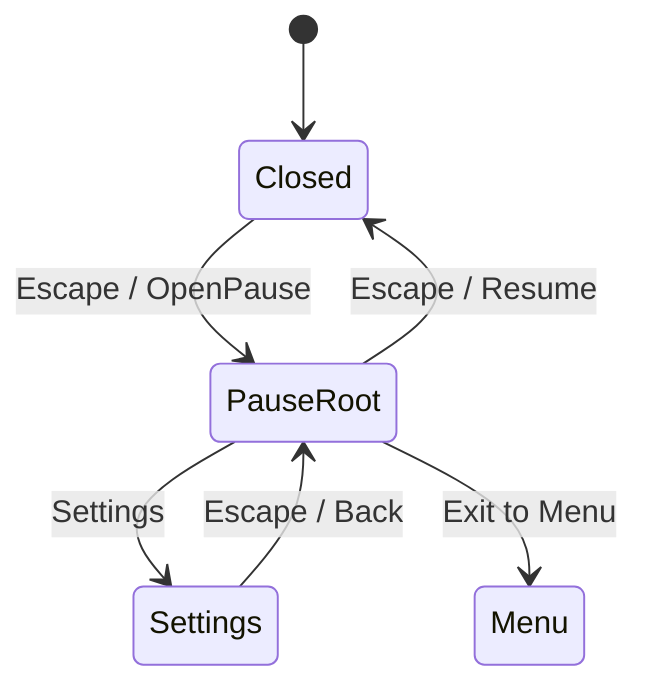

# HallowBlaze — walidacja M1.1

> Ticket: **M1.1 — Menu pauzy i bezpieczny powrót do menu głównego**  
> Data walidacji: **2026-08-31**  
> Unity: **6000.3.21f1**  
> Branch: `M1/StateFoundation`  
> Bazowy HEAD: `b36c689bec8bdc1d45c39d432c80e9b360fa8d53`  
> Kontrakt: [`../GameDesignContract.md`](../GameDesignContract.md), sekcja 6.6  
> Karta: [`../TechnicalRoadmap.md`](../TechnicalRoadmap.md), M1.1

## 1. Zakres wyniku

M1.1 dodaje modalną pauzę do sceny `Main`, współdzielone ustawienia audio dla `Menu` i `Main`, centralną bramkę inputu oraz tymczasowy cleanup niezapisanego legacy runu. Nie zmienia schemy save, nie implementuje `Continue`, profilu, nowego Input Systemu ani docelowego lifecycle runu.

Stan pauzy jest wyłącznie stanem prezentacji. Nie jest zapisywany w `RunState`, `ProfileState` ani `PlayerPrefs`.

## 2. Przejścia UI

`OpenPause` jest dozwolone tylko w scenie `Main`, po zakończeniu setupu, przed game over i przy istniejącym `GameManager`/`RunState`. `Settings` pozostaje częścią pauzy: nie przywraca czasu ani inputu.

## 3. Blokowanie rozgrywki

| Punkt | Zachowanie |
| --- | --- |
| `PauseMenuController.OpenPause` | najpierw ustawia `GameManager.SetGameplayInputBlocked(true)`, następnie `Time.timeScale = 0`, pokazuje `PauseRoot` i wybiera `Resume` |
| `GameManager.IsGameplayInputEnabled` | wymaga aktywnego managera, zakończonego setupu, braku blokady, aktywnej tury gracza oraz klatki późniejszej niż klatka Resume |
| `GameManager.Update` | nie rozpoczyna fazy AI przy aktywnej blokadzie |
| `GameManager.MoveEnemies` | czeka na zdjęcie blokady przed kolejnymi krokami AI i przed oddaniem tury |
| `PlayerScript.Update` | nie czyta ruchu ani gathering, gdy centralna bramka jest zamknięta |
| callbacki fizyki gracza | blokują pickupy/exit/Carrot tylko przy aktywnej pauzie; po oddaniu tury nadal działają podczas końcówki `SmoothMovement` |
| damage i game over | nie mutują health ani nie kończą gry przy aktywnej blokadzie |

Jednoklatkowy latch po `Resume` jest celowy. Legacy `StandaloneInputModule` używa Space jako UI Submit; bez latcha ten sam `GetKeyDown("space")` zamykał pauzę i natychmiast wykonywał gathering. Boolean blokady znika podczas Resume, ale gameplay input wraca dopiero w następnej klatce.

## 4. Przywracanie runtime

`Resume`, `ExitToMenu`, `OnDisable` i `OnDestroy` prowadzą przez wspólne odtworzenie:

- `Time.timeScale = 1`;
- `GameManager.SetGameplayInputBlocked(false)`, jeśli manager nadal istnieje;
- zamknięcie paneli przy zwykłym Resume.

`BackFromSettings` świadomie nie odtwarza runtime, ponieważ wraca do `PauseRoot`. `ExitToMenu` ustawia latch `isExiting` przed cleanupem, więc dwa wywołania powodują dokładnie jedno żądanie ładowania sceny.

## 5. Wspólne ustawienia

`Assets/Prefabs/SettingsPanel.prefab` jest jedynym prefabem ustawień używanym przez obie sceny. Zawiera jeden `SettingsPanelController`, cztery kompletne referencje tekstów i persistent callbacki:

| Przycisk | Callback |
| --- | --- |
| `MusicOnBttn` | `SetMusicOn` |
| `MusicOffBttn` | `SetMusicOff` |
| `SoundOnBttn` | `SetSoundOn` |
| `SoundOffBttn` | `SetSoundOff` |

`Menu` zachowuje animowany callback `BackBttn.SetTrigger`; instancja w `Main` nadpisuje go na `PauseMenuController.BackFromSettings`. Obie instancje pozostają połączone ze źródłowym prefabem.

Kontroler kieruje zmiany do żywego `SoundManager`, a bez niego zachowuje zgodny fallback do istniejących kluczy `Music` i `Sound`. `SoundManager` natychmiast stosuje stan do `AudioSource`; lokalny `HighScore` nie jest dotykany.

## 6. Cleanup legacy runu

`GameManager.AbandonLegacyRun`:

1. zamyka bramkę inputu i zatrzymuje coroutine managera;
2. usuwa bieżący obiekt `RunState`;
3. czyści statyczne `GameManager.instance`;
4. usuwa przetrwały między scenami obiekt `GameManager`;
5. nie usuwa `SoundManager`, `Music`, `Sound` ani `HighScore`.

Jest to świadomy adapter legacy bez zapisu runu. Docelowy lifecycle i relacja z `Continue` pozostają zakresem M1.4/M1.7 oraz decyzji O-006.

## 7. Testy automatyczne

Testy uruchomiono po finalnej kompilacji przez Unity CLI/Pipeline.

| Suite | Wynik | Zakres |
| --- | ---: | --- |
| EditMode | **1/1 passed** | infrastruktura EditMode |
| PlayMode | **15/15 passed** | 10 testów M1.1 oraz 5 istniejących regresji ruchu/offline |

Przypadki M1.1 pokrywają:

- pełną tabelę przejść `Closed`, `PauseRoot`, `Settings`;
- pauzę podczas tury AI i oczekiwanie bramki AI;
- odrzucenie kosztów, pickupów i damage w `PauseRoot`/`Settings`;
- zachowanie callbacków pickup/Carrot poza pauzą przy `playerTurn == false`;
- odrzucenie pauzy w złej scenie, setupie i game over;
- odtworzenie runtime po wyłączeniu kontrolera;
- jednoklatkowy latch po Resume;
- wspólny stan `SoundManager`/`PlayerPrefs` w dwóch hostach;
- zachowanie `Music`, `Sound`, `HighScore` i świeży następny manager;
- dwa wywołania `ExitToMenu`: jedno żądanie sceny, odtworzony czas i usunięty manager.

Testy ustawień snapshotują i dokładnie przywracają dotknięte `PlayerPrefs`; nie używają katalogu prawdziwego profilu gracza.

## 8. Windows Player build

| Pole | Wynik |
| --- | --- |
| Build ID | `build_76495045fa96` |
| Target | `StandaloneWindows64` |
| Output | `Build/M1.1Validation/HallowBlaze.exe` |
| Result | **Succeeded** |
| Errors | **0** |
| Warnings | **3** |
| Rozmiar | `147958417 B` |
| Czas | `23328 ms` |

Trzy ostrzeżenia nie są błędami M1.1:

- projekt nie jest połączony z Unity Services project ID;
- sceny builda nie zawierają `RuntimePipelineManager`, więc Pipeline jest wyłączony w Playerze;
- zastane `FindObjectOfType<RunState>()` w `GameManager` jest oznaczone jako deprecated (`CS0618`).

## 9. Ręczny smoke w PlayMode

Smoke wykonano na rzeczywistych scenach i legacy Input Managerze:

1. `Main` wystartował z food `100`, health `100`, pozycją `(0,0,0)` i gotową turą gracza.
2. Rozdzielony key-down/key-up Escape otworzył `PauseRoot`: `timeScale=0`, blokada `true`, fokus `ResumeButton`.
3. Space jako UI Submit zamknął pauzę, ale po latchu food/health pozostały `100/100`, pozycja `(0,0,0)`, a tura gracza nie została zużyta.
4. Persistent callback `Settings` otworzył stan `Settings`: `timeScale=0`, blokada `true`, fokus `BackBttn`.
5. Escape z `Settings` wrócił do `PauseRoot`, nie do gry.
6. Po ustawieniu wyłącznie runtime runu na food `17`, health `23`, level `9`, callback `Exit to Menu` załadował `Menu`, przywrócił `timeScale=1` i pozostawił `GameManager.instance == null`.
7. Callback `Start` utworzył świeży `Main`: food `100`, health `100`, level `1`, blokada `false`.
8. Po finalnym dodaniu testowalnego loadera powtórzono produkcyjny `ExitToMenu` z domyślnym `SceneManager.LoadScene`: wynik ponownie `Menu`, `timeScale=1`, `GameManager.instance == null`.

Trwałość `Music`, `Sound` i `HighScore` potwierdza izolowany test automatyczny, aby smoke nie modyfikował prawdziwych preferencji użytkownika.

## 10. Audyt scen i prefabu

| Kontrola | `Main` | `Menu` |
| --- | ---: | ---: |
| Missing Script | **0** | **0** |
| `PauseMenuController` | **1** | **0** |
| `SettingsPanelController` | **1** | **1** |
| źródło Settings | `Assets/Prefabs/SettingsPanel.prefab` | `Assets/Prefabs/SettingsPanel.prefab` |
| status instancji | `Connected` | `Connected` |
| scena dirty po audycie | `false` | `false` |

W `Main` wszystkie sześć pól serializowanych `PauseMenuController` wskazuje właściwe obiekty/sceny. `BackBttn` ma callback `BackFromSettings`. W `Menu` cztery referencje prezentacji `SettingsPanelController` są kompletne, a `BackBttn` zachowuje `SetTrigger`.

Po wyczyszczeniu starych logów diagnostycznych obie sceny otwarto ponownie. Console zgłosiła **0 błędów** po załadowaniu `Menu` i **0 błędów** po załadowaniu `Main`.

## 11. Integralność i review

Snapshot bazowy implementacji:

- ID: `20260830T153518Z-M1.1-GitHub-Copilot`;
- ścieżka: `C:/Users/Jakub/AppData/Local/HallowBlaze/agent-snapshots/20260830T153518Z-M1.1-GitHub-Copilot`;
- writer: `GitHub Copilot`;
- zamknięta allowlista: 20 ścieżek.

Finalny integrity gate względem tego snapshotu zakończył się wynikiem **PASS**:

- branch `M1/StateFoundation` i HEAD `b36c689bec8bdc1d45c39d432c80e9b360fa8d53` zgodne z manifestem;
- 14 istniejących kopii baseline'u zweryfikowanych przez SHA-256;
- zero naruszeń zamkniętej allowlisty;
- zero nowych lub zmienionych ścieżek, patchy i plików untracked poza allowlistą.

Niezależny `qwen-reviewer` zakończył review 2026-09-01 werdyktem **Accept** i nie znalazł problemów P0-P2. Zgłoszone uwagi P3 nie blokują akceptacji:

- podejrzenie mutacji `onCarrot` podczas pauzy zostało odrzucone, ponieważ guard na początku `OnTriggerEnter2D` wykonuje `return` przed każdym blokiem tagu;
- pełny scene load dla `ExitToMenu` jest sprawdzony produkcyjnym smoke, a test automatyczny izoluje idempotencję dwóch wywołań;
- odrzucenie pauzy po game over jest testowane przez ten sam stan produkcyjny `GameManager.enabled == false`, który ustawia `GameOver`.

Przed tym dokumentacyjnym closeoutem utworzono i zweryfikowano świeży snapshot `20260901T191746Z-M1.1-closeout-GitHub-Copilot` z zamkniętą allowlistą dwóch dokumentów. Po zmianie statusu wykonano końcową kontrolę integralności tej iteracji.