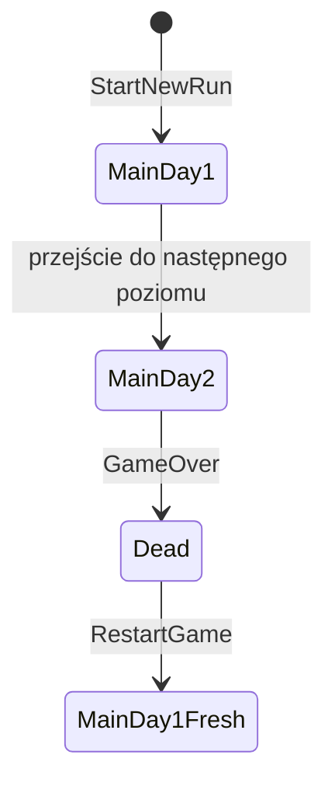

# HallowBlaze — walidacja M1.4

> Ticket: **M1.4 — GameSession i migracja własności stanu** 
> Data walidacji: **2026-09-04** 
> Unity: **6000.3.21f1** 
> Unity Test Framework: **1.6.0** 
> Branch: `M1/RunState` 
> Bazowy HEAD: `ac46b604ed50f660e64d36bfcf18c6e139afc9c9` 
> Kontrakt: [`../GameDesignContract.md`](../GameDesignContract.md) 
> Karta: [`../TechnicalRoadmap.md`](../TechnicalRoadmap.md), M1.4

## 1. Zakres wyniku

M1.4 wprowadza czysty domenowo `GameSession`, który posiada jeden `ProfileState` oraz opcjonalny aktywny `RunState`. Integracja Unity kieruje rozpoczęcie, kontynuację, porzucenie i restart runu przez tę sesję, a zasoby gracza i dzień mają jednego zapisywalnego właściciela w domenowym `RunState`.

Ticket nie dodaje zapisu profilu ani runu, migracji save'a, funkcji `Continue` ani docelowego repozytorium profili. Istniejący `PlayerPrefs` dla `HighScore` pozostaje świadomym adapterem tymczasowym.

## 2. Własność przed i po migracji

| Odpowiedzialność | Przed M1.4 | Po M1.4 |
| --- | --- | --- |
| profil gracza | brak właściciela sesyjnego | `GameSession.Profile` |
| bieżący run | Unity `RunState : MonoBehaviour` | `GameSession.ActiveRun` typu domenowego `HallowBlaze.Core.State.RunState` |
| health i food | zapisywalne kopie w komponencie gracza/legacy stanie | wyłącznie domenowy `RunState` |
| dzień runu | legacy komponent Unity | wyłącznie domenowy `RunState.Day` |
| lifecycle runu | bezpośrednie operacje komponentów Unity | `GameSession.StartNewRun`, `AdvanceDay`, `MarkDead` i `AbandonRun` |
| tura, setup i blokada inputu | wymieszane z zasobami runu | przejściowy stan orkiestracji w `GameManager` |
| UI gracza | odczyt i mutacja własnych pól | adapter inputu/widoku czytający aktywny run |

Usunięto legacy `Assets/Scripts/RunState.cs` wraz z jego `.meta`. W końcowym skanie `Assets/` nie znaleziono żadnego odwołania do GUID usuniętego skryptu (`442fe5f4ad19eb04faefd16af35e122f`), więc migracja nie pozostawia serializowanego Missing Script.

## 3. Granica domeny i sesji

`HallowBlaze.Core.Session`:

- referencjonuje tylko `HallowBlaze.Core.State`;
- ma `noEngineReferences: true`;
- nie posiada zależności od `UnityEngine`, `GameObject`, `MonoBehaviour`, scen ani `PlayerPrefs`;
- wymaga niepustego `ProfileState`;
- odrzuca mutacje bez aktywnego runu jawnym `InvalidOperationException`;
- przy zastępowaniu aktywnego runu najpierw waliduje argumenty nowego runu, a dopiero potem porzuca poprzedni;
- gwarantuje idempotentne `AbandonRun`.

Sesja nie jest globalnym singletonem domenowym. Jedną instancję tworzy i posiada przetrwały między scenami `GameManager`, pełniący rolę composition root integracji Unity.

## 4. Eventy i model odczytu UI

`GameSession` publikuje typowane eventy `RunStarted`, `RunChanged` i `RunAbandoned`. `PlayerScript` wiąże się z aktywną sesją i odświeża prezentację po `RunChanged`; wartości UI odczytuje z `ActiveRun.Health`, `ActiveRun.Food` i `ActiveRun.Day`.

Komendy gracza nie zapisują lokalnych kopii zasobów. Gathering, damage, pickup jedzenia i utrata food delegują do fasady sesji. Gathering bez aktywnej marchewki jest odrzucane bez kosztu i bez utraty tury. Poprawna akcja najpierw przyznaje nagrodę, następnie pobiera jeden bazowy koszt, sprawdza stan końcowy i oddaje turę przeciwnikom. Space ma pierwszeństwo w swojej klatce, więc równoczesny input kierunkowy nie uruchamia drugiej akcji.

## 5. Lifecycle scen i runu

Automatyczny test na rzeczywistej scenie `Main` potwierdził następujący przebieg:

W całym przebiegu zachowano tę samą instancję `GameSession` i tę samą instancję `ProfileState`. Przejście `Main → Main` zachowuje `RunState`, health i food oraz zwiększa dzień dokładnie o jeden. Obrażenie zadane przez produkcyjne `PlayerScript.LoseHealth` prowadzi przez `CheckIfGameOver` do `GameManager.GameOver`, oznacza run jako `Dead`, wyłącza gameplay, pokazuje rzeczywisty przycisk restartu i aktualizuje tymczasowy `HighScore`. Callback `RestartBttnScript.Restart` tworzy nowy aktywny `RunState` z health `100`, food `100` i dniem `1`, po czym przeładowuje rzeczywistą scenę `Main` bez podwójnego zwiększenia dnia.

## 6. Exit i restart

`PauseMenuController.ExitToMenu`:

1. ustawia latch idempotencji;
2. zleca `GameManager.AbandonRun`;
3. przywraca `Time.timeScale = 1` i zdejmuje blokadę inputu;
4. ładuje scenę menu dokładnie raz.

`GameSession.AbandonRun` odłącza bieżący `RunState` od `ActiveRun` i publikuje zdarzenie z odłączoną instancją; nie dodaje nowej wartości do `RunStatus`. Powtórne porzucenie nie publikuje kolejnego zdarzenia. Cleanup nie usuwa ustawień `Music`, `Sound` ani `HighScore`. Test regresyjny potwierdza, że po wyjściu input nie pozostaje zablokowany.

Restart po śmierci przechodzi przez `GameManager.RestartGame`: tworzy świeży run w istniejącej sesji przed przeładowaniem sceny. Zwykłe przejście do kolejnego poziomu nie tworzy nowego runu.

## 7. Tymczasowy `PlayerPrefs`

M1.4 nie rozszerza trwałości domeny. `HighScore` nadal używa istniejącego klucza `PlayerPrefs` i jest aktualizowany przy game over. Profil oraz aktywny run istnieją tylko w pamięci procesu; opuszczenie sesji aplikacji nie daje możliwości `Continue`.

Testy dotykające `PlayerPrefs` snapshotują i przywracają używane klucze. Nie zapisują danych w katalogu prawdziwego profilu gracza i nie zmieniają formatu save'a.

## 8. Testy automatyczne

Wszystkie wyniki pochodzą z Unity `6000.3.21f1` uruchomionego w batchmode na końcowym drzewie implementacji.

| Suite | Wynik | Zakres |
| --- | ---: | --- |
| pełny EditMode | **42/42 passed** | domena `ProfileState`, `RunState`, `GameSession` i istniejące regresje |
| pełny PlayMode | **21/21 passed** | lifecycle, pauza, restart, ruch, gathering i infrastruktura |
| filtrowany `GameSessionTests` | **10/10 passed** | kontrakt sesji i kolejność eventów |
| filtrowany `GameSessionLifecycleTests` | **4/4 passed** | realne sceny, produkcyjny game over, reload i restart przez przycisk |
| filtrowany ExitToMenu | **1/1 passed** | przywrócenie czasu/inputu i idempotencja |
| filtrowany `PlayModeInfrastructureTests` | **6/6 passed** | ruch oraz odrzucone/poprawne gathering, nagroda przed kosztem i jedna tura |

Końcowe artefakty pełnych suite'ów:

- EditMode XML: `%TEMP%/M14-Final2-Edit.xml`;
- EditMode log: `%TEMP%/M14-Final2-Edit.log`;
- PlayMode XML: `%TEMP%/M14-Final2-Play.xml`;
- PlayMode log: `%TEMP%/M14-Final2-Play.log`.

Oba pełne procesy Unity zakończyły się kodem `0`. XML raportuje odpowiednio `42/42` i `21/21`, bez testów failed ani skipped. Oba końcowe logi nie zawierają błędów kompilacji, `NullReferenceException`, `MissingReferenceException`, komunikatów Missing Script ani przerwania batchmode z powodu błędu.

## 9. Bramki statyczne i integralność

Snapshot bazowy bezpośredniego writera:

- ID: `20260904T125835428Z-M1.4-GitHub-Copilot`;
- ścieżka: `C:/Users/Jakub/AppData/Local/HallowBlaze/agent-snapshots/20260904T125835428Z-M1.4-GitHub-Copilot`;
- branch: `M1/RunState`;
- HEAD: `ac46b604ed50f660e64d36bfcf18c6e139afc9c9`;
- zamknięta allowlista: 21 ścieżek.

Przed poprawkami wynikającymi z audytu kontraktu utworzono i zweryfikowano świeży snapshot `20260904T181632344Z-M1.4-review-fixes-GitHub-Copilot` w `C:/Users/Jakub/AppData/Local/HallowBlaze/agent-snapshots/20260904T181632344Z-M1.4-review-fixes-GitHub-Copilot`, z zamkniętą allowlistą sześciu ścieżek.

Po formalnym review utworzono i zweryfikowano dokumentacyjny snapshot closeoutu `20260904T183817375Z-M1.4-closeout-GitHub-Copilot` w `C:/Users/Jakub/AppData/Local/HallowBlaze/agent-snapshots/20260904T183817375Z-M1.4-closeout-GitHub-Copilot`, z zamkniętą allowlistą raportu i roadmapy.

Końcowe kontrole przed review:

- `git diff --check`: kod wyjścia `0`;
- diagnostyka VS Code zmienionych plików: brak błędów;
- wyszukiwanie starych mutatorów i `GameSession.Instance`: zero trafień;
- wyszukiwanie zapisywalnych pól `food`, `health`, `day` i `level` w kodzie produkcyjnym: tylko autorytatywne `RunState.Health` i `RunState.Food`;
- chroniony `Assets/Scripts/PlayerScript.cs.meta`: SHA-256 `1BEA4BFC18A7FC94E717A7071DCAF39E8AB92311F7AC0062B0E35190FE55243C`, zgodny ze snapshotem;
- branch i HEAD zgodne ze snapshotem, staging pusty, `.vscode/tasks.json` nie istnieje;
- stan ścieżek poza allowlistą jest identyczny z baseline'em;
- jedyny zmieniony plik poza allowlistą, `.github/agents/qwen-developer.agent.md`, zachowuje dokładnie użytkowy patch obecny przed przyznaniem write ownership.

Ostrzeżenie Git o przyszłej konwersji LF→CRLF dotyczy zastanej zmiany `ProjectSettings/EditorBuildSettings.asset`; plik nie należał do zakresu M1.4 i nie został zmodyfikowany w tej iteracji.

## 10. Ograniczenia i status

Nie wykonano Player builda ani osobnego ręcznego smoke, ponieważ zakres zmienia czystą domenę i integrację istniejących scen, a pełna kompilacja Unity, EditMode oraz automatyczny real-scene PlayMode smoke dały bezpośredni dowód dla kryteriów M1.4. Nie wdrożono zapisu, `Continue`, migracji danych ani integracji `ProfileRunSummary`; wymagają kolejnych kart i kontraktu wersjonowanych DTO.

Niezależny, nazwany `qwen-reviewer` zakończył przegląd 2026-09-04 wynikiem **PASS**. Nie znalazł materialnego problemu blokującego M1.4; wskazał jedynie powyższe ograniczenia przyszłego lifecycle i persistence. Implementacja, walidacja, integrity gate oraz review M1.4 są zakończone.