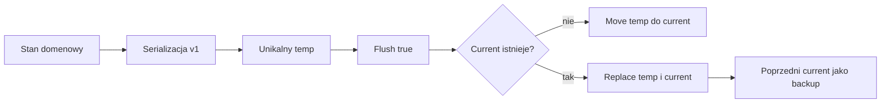

# HallowBlaze — walidacja M1.6

> Ticket: **M1.6 — Atomowy file store, backup i recovery**
> Data walidacji: **2026-09-08**
> Unity: **6000.3.21f1**
> Platforma referencyjna: **PC**
> Bazowy HEAD: `0bc81f4abfdbcc34270eb4fccb15de2d2f9fb39f`

## 1. Zakres

`FileSystemSaveStore` zapisuje `ProfileState` i `RunState` jako dwa niezależne dokumenty schema v1. Warstwa storage korzysta z mapperów i walidacji dostarczonych przez M1.5; nie przechowuje obiektów Unity i nie implementuje lifecycle, `Continue`, chmury, szyfrowania ani snapshotu planszy.

`PersistencePathProvider` jest adapterem Unity poza assembly Core. Produkcyjny root wskazuje `Application.persistentDataPath/saves`, natomiast testy PlayMode używają wyłącznie unikalnego potomka `Application.persistentDataPath/tests`.

## 2. Pliki i zamiana

```text
<root>/
  profile.json
  profile.backup.json
  .profile.json.<guid>.tmp
  run.json
  run.backup.json
  .run.json.<guid>.tmp
```



Temp powstaje w tym samym katalogu co plik docelowy. Na referencyjnym PC istniejący current jest zastępowany przez `File.Replace(temp, current, backup)`. Store nigdy nie usuwa current przed zamianą. Pozostały temp jest usuwany best-effort; cleanup nie obejmuje current ani backupu.

## 3. Load i recovery

| Warunek | Wynik | Reakcja |
| --- | --- | --- |
| poprawny current | `Success` | zwrot zwalidowanego stanu domenowego |
| brak current | `Missing` | normalny wynik bez wyjątku |
| uszkodzony current, poprawny backup | `Recovered` | zwrot stanu z backupu bez nadpisania pliku podczas load |
| uszkodzony current i brak/poprawności backupu | `Corrupt` | brak częściowej rekonstrukcji |
| future `schemaVersion` | `UnsupportedFutureSchema` | brak recovery i brak nadpisania current |
| błąd I/O lub uprawnień | `IoError` | ogólny komunikat bez treści dokumentu |

Profil i run mają oddzielne pliki current/backup. Awaria jednego rodzaju zapisu nie modyfikuje drugiego.

## 4. Migracja v0→v1

Minimalne v0 ma ten sam jawny zestaw pól co v1 i `schemaVersion: 0`. Migracja:

1. parsuje dokument z odrzuceniem duplikatów właściwości;
2. odrzuca brak wersji, wersję inną niż `0` oraz przyszłą wersję;
3. zmienia wyłącznie `schemaVersion` na `1`;
4. waliduje cały wynik istniejącym deserializerem v1;
5. zapisuje durable temp;
6. zastępuje current dopiero po walidacji, zachowując źródłowe v0 jako backup.

Nie jest to migracja prototypowych `PlayerPrefs` ani dowolnego historycznego formatu.

## 5. Izolacja testów

EditMode `PersistenceStorageTests` tworzy dla każdego testu osobny katalog:

```text
%TEMP%/HallowBlaze-M1.6-<guid>/
```

TearDown usuwa wyłącznie ścieżkę utworzoną przez konkretny test. Test I/O używa pliku znajdującego się wewnątrz tego katalogu jako niedozwolonego rootu; nie zależy od globalnych uprawnień maszyny.

PlayMode `PersistencePathTests` tworzy wyłącznie:

```text
Application.persistentDataPath/tests/M1.6-<guid>/
```

Test nie tworzy ani nie usuwa produkcyjnego katalogu `saves`.

## 6. Wyniki automatyczne

| Suite | Wynik | Exit code | Artefakt |
| --- | ---: | ---: | --- |
| `PersistenceStorageTests` po finalnej poprawce | **9/9 passed** | `0` | `%TEMP%/M16-Codex-Storage-Final.xml` |
| pełny EditMode | **69/69 passed** | `0` | `%TEMP%/M16-Codex-Full-EditMode.xml` |
| `PersistencePathTests` PlayMode | **1/1 passed** | `0` | `%TEMP%/M16-Codex-PersistencePath.xml` |

Każdy raport ma zero testów failed, skipped i inconclusive. Import Unity wygenerował `.meta` dla nowych assetów. Kompilacja assembly Core, EditMode i PlayMode zakończyła się powodzeniem.

## 7. Integralność

Bezpośrednią iterację Codexa chroni snapshot:

`M1.6-codex-20260908T151229226Z-4a9410d9`

Snapshot znajduje się poza repozytorium pod `%TEMP%/HallowBlaze-agent-snapshots/` i zawiera manifest, status, staged/unstaged patches, listę untracked, hashe oraz kopie istniejących plików allowlisty.

Po testach nie wykryto zmian w `Packages`, `ProjectSettings`, scenach ani prefabach. W repozytorium pozostają wyłącznie pliki i dokumentacja objęte allowlistą M1.6.

## 8. Ograniczenia

- Gwarancja `File.Replace` i durable flush jest walidowana dla referencyjnego PC.
- Mobile ma zachować tę samą semantykę, ale nie było walidowane w M1.6.
- Recovery podczas load zwraca poprawny backup, lecz nie naprawia current na dysku; zapis naprawczy należy do przyszłego lifecycle.