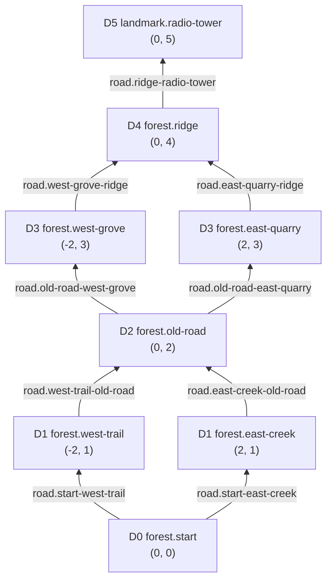

# M2.1 - World catalogue and five-day graph

## Baseline and scope

- branch: `M2/WorldCatalogueInitial`;
- baseline HEAD: `c5c1f1f12bc4ccb30201e8454aeb6c38363b9855`;
- Unity version: `6000.3.21f1`;
- save schema: unchanged;
- runtime travel, day advancement, discovery progression, map UI, and scene integration: unchanged.

M2.1 adds a versioned, read-only world catalogue and one hand-authored prototype fixture. It does not connect the catalogue to runtime travel. That integration belongs to M2.4-M2.5.

## Authoring and domain boundary

```text
Assets/GameData/World/prototype-world.json
    -> WorldDefinitionJson.Deserialize(json)
    -> WorldNodeDefinition[] + WorldEdgeDefinition[]
    -> immutable WorldDefinition catalogue
```

The JSON file is the only runtime source of the prototype topology. `WorldDefinitionJson` accepts JSON text and materializes plain C# values; it does not load scenes, assets, or Unity objects. `HallowBlaze.Core.World` has `noEngineReferences: true`, references only `Unity.Newtonsoft.Json`, and has no `UnityEngine` assembly dependency.

`WorldDefinition` defensively copies and sorts constructor inputs by stable ID. It exposes read-only node, edge, and outgoing-edge collections. Node and edge lookup use ordinal string comparison. Unknown node or edge lookups return `false`; requesting outgoing edges for an unknown node throws `KeyNotFoundException` instead of silently treating invalid data as a terminal node.

## World identity

| Field | Value | Compatibility meaning |
| --- | --- | --- |
| `WorldDefinitionId` | `world-1` | matches the current `ProfileState` identity |
| `Version` | `1` | matches `ProfileState.WorldDefinitionVersion` |
| `StartNodeId` | `forest.start` | matches the existing new-run start |
| `GoalNodeId` | `landmark.radio-tower` | explicit prototype landmark goal |

These values are now save-facing content contracts. Renaming an ID requires a migration or alias; an incompatible topology change requires a world-definition version increase.

## Graph diagram



Each edge traversal represents one day. The atlas Y coordinate equals the distance layer in this fixture, making the south-to-north progression explicit.

## Stable node registry

| `NodeId` | Layer | Atlas position | Place kind | Biome family | Meaning |
| --- | ---: | --- | --- | --- | --- |
| `forest.start` | 0 | `(0, 0)` | `shelter` | `temperate-forest` | fixed southern expedition start |
| `forest.west-trail` | 1 | `(-2, 1)` | `trail` | `temperate-forest` | western first branch |
| `forest.east-creek` | 1 | `(2, 1)` | `creek` | `wet-forest` | eastern first branch |
| `forest.old-road` | 2 | `(0, 2)` | `crossroads` | `temperate-forest` | first rejoin and second decision point |
| `forest.west-grove` | 3 | `(-2, 3)` | `grove` | `temperate-forest` | western second branch |
| `forest.east-quarry` | 3 | `(2, 3)` | `quarry` | `rocky-foothills` | eastern second branch |
| `forest.ridge` | 4 | `(0, 4)` | `ridge` | `rocky-foothills` | second route rejoin |
| `landmark.radio-tower` | 5 | `(0, 5)` | `landmark` | `rocky-foothills` | explicit prototype goal |

## Directed edge registry

| `EdgeId` | `FromNodeId` | `ToNodeId` | Direction | Clue key |
| --- | --- | --- | --- | --- |
| `road.start-west-trail` | `forest.start` | `forest.west-trail` | `northwest` | `clue.dense-trees` |
| `road.start-east-creek` | `forest.start` | `forest.east-creek` | `northeast` | `clue.running-water` |
| `road.west-trail-old-road` | `forest.west-trail` | `forest.old-road` | `northeast` | `clue.broken-signpost` |
| `road.east-creek-old-road` | `forest.east-creek` | `forest.old-road` | `northwest` | `clue.dry-roadbed` |
| `road.old-road-west-grove` | `forest.old-road` | `forest.west-grove` | `northwest` | `clue.ordered-treeline` |
| `road.old-road-east-quarry` | `forest.old-road` | `forest.east-quarry` | `northeast` | `clue.stone-dust` |
| `road.west-grove-ridge` | `forest.west-grove` | `forest.ridge` | `northeast` | `clue.rising-ground` |
| `road.east-quarry-ridge` | `forest.east-quarry` | `forest.ridge` | `northwest` | `clue.cold-wind` |
| `road.ridge-radio-tower` | `forest.ridge` | `landmark.radio-tower` | `north` | `clue.distant-metal` |

Roads are directed. A reverse journey is not implied and would require its own `EdgeId`.

## Intended route lengths

| First branch | Second branch | Edge traversals |
| --- | --- | ---: |
| `forest.west-trail` | `forest.west-grove` | 5 |
| `forest.west-trail` | `forest.east-quarry` | 5 |
| `forest.east-creek` | `forest.west-grove` | 5 |
| `forest.east-creek` | `forest.east-quarry` | 5 |

Every intended route visits 6 of the 8 nodes, so reaching the landmark does not require full atlas completion.

## Validation evidence

| Check | Evidence | Result |
| --- | --- | --- |
| focused EditMode topology and API tests | `TestResults/M2.1/WorldDefinitionTests.xml` | `6/6 Passed` |
| Unity completion log | `TestResults/M2.1/WorldDefinitionTests.log` | exit code `0`, `Test run completed` |
| failed / skipped / inconclusive | focused EditMode XML | `0 / 0 / 0` |
| fixture structure | parsed JSON | 8 nodes, 9 edges, unique IDs, all endpoints resolved |
| collection order | reversed node and edge inputs | identical identity, lookup, edges, and outgoing results |
| immutability | source-list mutation and exposed-view mutation attempts | catalogue unchanged; mutations rejected |
| engine independence | referenced-assembly inspection | no `UnityEngine` dependency |
| repository integrity | original 18-path allowlist and `git diff --check` | passed |
| independent review | `qwen-reviewer` | `PASS` |

The full EditMode and PlayMode suites were not run because M2.1 adds an isolated pure-domain assembly and focused EditMode coverage compiles the changed assembly and all of its tests. Unity batchmode removed the accepted `SENTIS_ANALYTICS_ENABLED` define during validation; the exact baseline value was restored and `ProjectSettings.asset` matches the baseline blob.

## Deferred boundaries

- reusable multi-error graph validation and diagnostics remain M2.2;
- persisted atlas knowledge states remain M2.3;
- route choice, run movement, day advancement, and checkpointing remain M2.4-M2.5;
- atlas presentation remains M2.6.