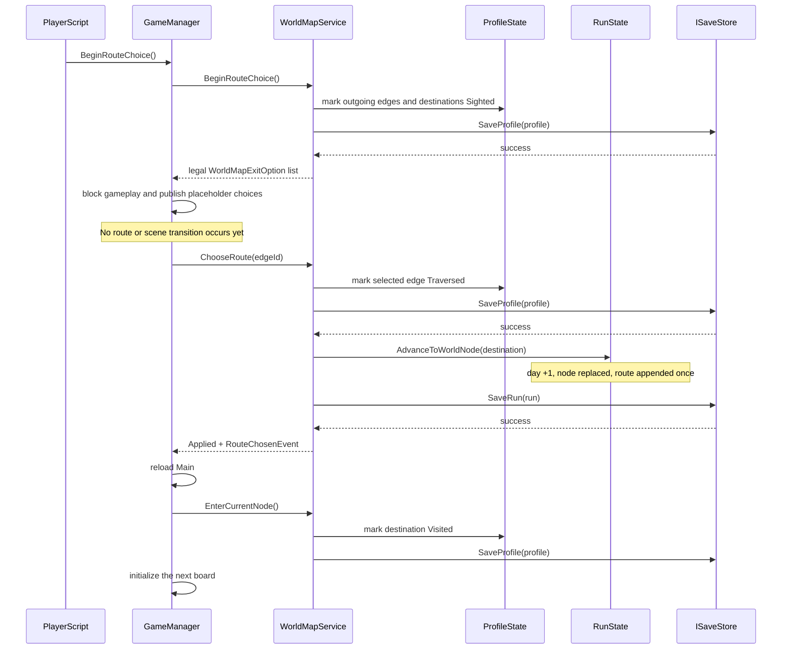

# M2.5 - Route selection between boards

## Baseline and scope

- branch: `M2/RouteChoosing`;
- baseline HEAD: `cac2b17114552d0be6654562619dee641fe7ee5f`;
- Unity version: `6000.3.21f1`;
- profile schema: unchanged at v2;
- run schema: unchanged at v1.

M2.5 adds an explicit route-choice lifecycle between a completed local board
and the next board. The pure `WorldMapService` owns validation and persistence
ordering. `GameManager` is the Unity adapter that exposes placeholder route
options, blocks gameplay, and reloads `Main` only after a newly applied route
has been checkpointed. `PlayerScript` reports the Exit interaction and no
longer selects or reloads a route itself.

Final atlas rendering, route recommendations, random/default selection, undo,
false clues, and resolution of O-002 remain outside this card.

## Exit-to-board sequence

Raw scene reloads and new-run scene entry do not advance the day. The initial
run starts at day `0`; each committed edge traversal advances it exactly once.
The world catalogue is the existing `prototype-world.json` `TextAsset`, assigned
to `GameManager.prefab` by its existing asset GUID.

## Command and retry contract

| Situation | Run mutation | Profile effect | Scene effect |
| --- | --- | --- | --- |
| missing, unknown, non-outgoing, or stale edge | none | none beyond already saved exit sighting | none |
| valid edge | node/day/route once | selected edge becomes `Traversed` | reload after successful `SaveRun` |
| identical submit after commit | none | none | none |
| different submit after commit | none | none | none |
| `SaveProfile` fails during traversal | none | monotonic in-memory transition remains pending | none; identical retry required |
| `SaveRun` fails after run advancement | no second mutation on retry | traversal is already durable | none; identical checkpoint retry required |

While a run checkpoint retry is pending, a different edge is rejected. A
`RouteChosenEvent` is published only after `SaveRun` succeeds. The Unity adapter
loads the next board only for the `Applied` status, not for `NoChange`, rejected,
or persistence-failed results.

The destination, current day, and route are already present in run schema v1.
The committed checkpoint therefore restores all three values after a crash
without a DTO migration. Profile discovery remains independently durable, so a
new run does not erase sighted or traversed world knowledge.

## Validation evidence

| Check | Result |
| --- | --- |
| focused Unity EditMode: `WorldMapServiceTests`, `RunStateTests`, `GameSessionTests` | `54/54 Passed` |
| final Unity PlayMode: `GameSessionLifecycleTests` | `12/12 Passed` |
| failed / skipped / inconclusive in both final Unity runs | `0 / 0 / 0` |
| final `dotnet build HallowBlaze.slnx --no-restore` after restore | Passed, `0` errors and `2` pre-existing warnings |
| `git diff --check` | Passed |
| `ProjectSettings.asset` after final Unity run | exact baseline blob restored |
| recovered `WorldMapServiceTests.cs.meta` | exact baseline blob preserved |
| independent final review | `PASS` |

The PlayMode path uses the real `Main` scene and `GameManager` prefab. It proves
that reaching Exit exposes both start edges without moving the run, explicitly
choosing the west edge saves day `1` and `forest.west-trail`, destroying the
runtime manager and continuing restores that checkpoint, and explicitly
choosing the next edge saves day `2` and `forest.old-road`. It also verifies
that each loaded current node is persisted as `Visited`.

Unity batchmode removed generated NuGet assets under `Temp/obj`; the affected
build gates were rerun after `dotnet restore`. Unity also removed the accepted
`SENTIS_ANALYTICS_ENABLED` define. Its exact baseline value was restored after
the final Unity process exited, and Unity was not run again afterward.

The final reviewer identified one non-blocking residual test gap: node-entry
profile-save failure is covered by the pure service retry tests, but there is no
dedicated PlayMode failure injection during scene load.