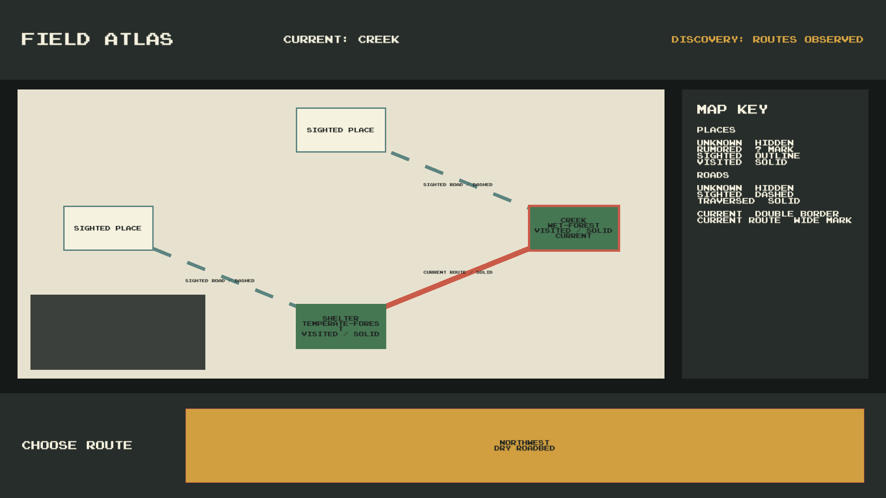

# M2.6 Atlas Screen Validation

## Status

Implementation validation and the original atlas review passed on 2026-09-13. The user accepted the map as a functional prototype on 2026-09-15. The New Game profile-reset regression and its transactional failure handling are fixed, validated, and independently reviewed. M2.6 is `Done`; detailed `Visited` semantics and a corresponding comprehension test are deferred to a later atlas-design task.

## Baseline and scope

- Original Git root: `E:/Repos/HallowBlaze`.
- Recovery Git root used for final closeout: `C:/Users/Jakub/HallowBlaze-Recovery/HallowBlaze-recovered-20260914-202601`.
- Branch: `M2/AtlasScreen`.
- Baseline HEAD: `6d1d9a1e28088118b4c861bf8d7e32f63423f588`.
- The preflight worktree was clean.
- O-004 is resolved in `GameDesignContract.md`: PC is the reference platform for the vertical slice; mobile parity follows after interaction stabilization.
- The original production scope was limited to the atlas runtime controller and its dedicated Resources prefab. Closeout additionally separates menu `New Game` from a same-profile `New Run` and atomically replaces the profile plus first run. Persistence DTO schemas, Packages, ProjectSettings, scenes, and existing prefabs remain unchanged.

## Data flow and ownership

```text
GameManager.BeginRouteChoice
  -> WorldMapService observes and saves legal exits
  -> GameManager.OnRouteChoicesChanged
  -> AtlasScreenController
       -> WorldMapService.GetAtlasSnapshot (read only)
       -> render known atlas state
       -> render GameManager.RouteChoices
  -> GameManager.ChooseRoute(edgeId)
```

The presenter creates a read-only `WorldMapService` over the active `GameSession.Profile` and the existing save-store boundary. It never issues discovery commands, advances a run, or writes UI-owned data. Refresh and reopen only request a new filtered snapshot. Route buttons submit the stable edge ID to `GameManager.ChooseRoute`; the existing M2.5 lifecycle remains the sole route owner.

## Visual state mapping

| Domain state | Atlas representation | Non-color signal | Information boundary |
| --- | --- | --- | --- |
| node `Unknown` | no visual | legend says `HIDDEN` | no name, type, position, or topology |
| node `Rumored` | anonymous entry in a separate rumor strip | `?` marker and `RUMORED PLACE` | no node ID, position, place kind, or biome |
| node `Sighted` | positioned light node | outline and `SIGHTED PLACE` | no node ID, place kind, or biome |
| node `Visited` | positioned filled node | solid body and `VISITED / SOLID` | place kind and biome are visible |
| edge `Unknown` | no visual | legend says `HIDDEN` | no topology |
| edge `Sighted` | segmented road | seven dashes and `SIGHTED ROAD / DASHED` | only known endpoints are connected |
| edge `Traversed` | continuous road | solid line and `TRAVERSED ROAD / SOLID` | durable traversal is visible |
| current node | visited-node overlay | heavier outline and `CURRENT` text | derived from active `RunState` |
| current route | traversed-road overlay | wider line and `CURRENT ROUTE / SOLID` | derived from ordered `RunState.Route` |

The palette uses off-white map paper, graphite bands, moss green, amber, teal, and coral. Color is redundant to text, shape, outline, dash pattern, and line width.

## Input and layout

- Fullscreen Screen Space Overlay canvas.
- `CanvasScaler.ScaleWithScreenSize`, reference resolution `1920x1080`, balanced width/height matching.
- Every current legal exit becomes exactly one Unity `Button`.
- Labels are derived only from `WorldDirection` and `ClueKey`; destination identity is not displayed.
- The first legal route receives `EventSystem` focus.
- Mouse click and keyboard Submit use the same `Button.onClick` path.
- Presentation animations are disabled in the reference prefab; all state remains readable without motion.
- `PressStart2P-Regular.ttf` is assigned in the prefab.

## Automated validation

### Focused PlayMode

Command shape:

```powershell
Unity.exe -batchmode -nographics -projectPath <project> -runTests -testPlatform PlayMode -testFilter HallowBlaze.Tests.PlayMode.AtlasScreenTests -testResults <xml> -logFile <log>
```

Final result from `AtlasScreenTests-Retry3.xml`:

- total: `1`;
- passed: `1`;
- failed: `0`;
- skipped: `0`;
- inconclusive: `0`;
- duration: `0.421775s`;
- Unity exit code: `0`.

The scenario verifies filtered node and edge states, non-color signals, current node and current route, exact legal-button projection, first-button focus, keyboard Submit, no profile/run/save mutation during repeated refresh, and reuse of first-run discovery by a second run.

### New Game profile reset regression

A manual prototype check found that choosing menu `New Game` reused the loaded `ProfileState`, causing visited and sighted atlas history to survive into a new game. The root cause was that both menu `New Game` and a post-death `New Run` selected the same launch mode.

The fixed lifecycle is:

```text
Menu New Game
  -> request NewGame launch mode
  -> construct a fresh profile and its first run
  -> ResetGame snapshots the previous profile/run and both recovery backups
  -> atomically replace both current saves and remove previous recovery backups
  -> commit the fresh in-memory session only after persistence succeeds

Any new-game I/O failure
  -> restore the previous profile/run and both recovery backups
  -> leave the current in-memory session unchanged

Death / same-campaign restart
  -> request NewRun launch mode
  -> preserve ProfileState and atlas
  -> create another run in the existing profile

Continue
  -> load the existing profile and active run
```

The regression test first visited `forest.west-trail`, returned to the menu, found the real non-Continue button, and invoked its `Button.onClick` callback. Before the fix it failed because the second game retained the same `ProfileState`. After the fix it passed and verified:

- the new game owns a different, empty profile instance;
- only `forest.start` is `Visited` immediately after entering the new game;
- previous nodes and edges return to `Unknown`;
- observing the first exits reveals only the legal neighbors as fresh `Sighted` knowledge;
- a farther node and edge from the previous game remain `Unknown`;
- the previous profile backup cannot recover old discovery after reset;
- a snapshot failure before commit leaves all four previous save files byte-identical and cleans transaction temporaries;
- failures while replacing either the profile or run restore all four previous save files;
- post-death `New Run` and `Continue` retain their existing semantics.

Final closeout validation on 2026-09-15:

- focused `PersistenceStorageTests.ResetGameCannotRecoverDiscoveryOrRunFromPreviousGame`: `1/1 Passed`;
- focused `PersistenceStorageTests.ResetGameSnapshotFailureLeavesEveryPreviousSaveUntouched`: `1/1 Passed` for an injected failure after the first successful snapshot;
- focused `PersistenceStorageTests.ResetGameWriteFailureRestoresEveryPreviousSave`: `2/2 Passed` for injected failures on replace calls 1 and 2;
- focused `GameSessionLifecycleTests.NewGameButtonStartsWithFreshAtlasHistory`: `1/1 Passed`;
- full EditMode: `172/172 Passed`;
- full `GameSessionLifecycleTests` PlayMode fixture: `13/13 Passed`;
- focused `AtlasScreenTests`: `1/1 Passed`, confirming that discovery still persists between runs of the same profile;
- final solution build: `0` errors and `2` pre-existing warnings (`CS0649` for the test-only `GameManager.PersistenceRootOverride` and `CS0618` for the legacy `FindObjectsOfType` test helper).

### Original full PlayMode observation

The original 2026-09-13 full PlayMode run completed `39` tests: `37 Passed`, `2 Failed`, `0 Skipped`, `0 Inconclusive`.

The two failures are outside the M2.6 execution path:

- `PlayModeInfrastructureTests.EnteringExitSnapsOnceAndStopsPlayerInput` creates a synthetic `GameManager` without `worldDefinitionJson`; M2.5 route choice reports the expected missing-world error before atlas presentation can run.
- `PlayModeInfrastructureTests.EnemyCannotEnterPlayersDestination` uses exact `Vector3` equality and reports visually identical `(1.00, 1.00, 0.00)` values; the generated test scene is not named `Main`, so the atlas bootstrap does not instantiate.

These tests were not modified because they are outside the M2.6 allowlist and neither stack trace enters `AtlasScreenController`.

### Solution build

`dotnet restore HallowBlaze.slnx` followed by `dotnet build HallowBlaze.slnx --no-restore` passed:

- errors: `0`;
- warnings: `2`, both pre-existing (`CS0618` in `GameSessionLifecycleTests.cs` and `CS0649` for the test-only `GameManager.PersistenceRootOverride`).

### Integrity

- `git diff --check`: passed.
- Unity-generated `.meta` files are present for both new folders, the controller, prefab, and PlayMode test.
- Prefab inspection through `AssetDatabase` confirmed the controller, prototype world JSON, and Press Start 2P font references.
- No changes remain in Packages, ProjectSettings, scenes, or existing prefabs.
- Unity batchmode's deterministic removal of `SENTIS_ANALYTICS_ENABLED` was compared with the baseline and restored after each test sequence.
- Test saves used isolated paths under the system temp directory or `TestResults/M2.6/SmokeSave`, never the player's profile directory.

## PC smoke and screenshot

The running Unity Editor loaded the real `Main` scene and an isolated smoke session, traversed the first route, entered the next node, and opened the next route choice. The marker reported:

```text
M2.6_SMOKE_READY nodes=5 edges=3 routes=1 selected=AtlasRouteButton-0 animations=False
```

The final PNG raster was independently read as `1920x1080`, 24-bit RGB. Visual inspection found no overlap between the header, map, legend, and route band; roads stay below nodes; labels remain inside their regions; the focused route is visible.

Composite evidence for node states, edge states, current position, current route, legal choice, and legend:



## Acceptance and deferred validation

The original atlas implementation review by `qwen-reviewer` returned `PASS` with no findings. Review of the first New Game regression fix requested transactional failure handling for the paired profile/run replacement. After adding pre-commit snapshot protection and focused fault-injection coverage, the final independent re-review returned `PASS` with no findings.

The fault-injection suite covers I/O exceptions during preparation and both replace operations. It does not simulate abrupt process termination between the profile and run replacements; crash-recovery journaling remains outside this prototype closeout.

The user confirmed that the overall map concept is understandable and accepted the current implementation as a prototype. A detailed moderated legend-comprehension playtest is deliberately deferred because the exact design threshold for when a location becomes `Visited` is not yet settled. Once that rule is designed, a later atlas task should record whether a participant can identify, without coaching:

1. which place is current;
2. which road belongs to the current run;
3. the difference between rumored, sighted, and visited places;
4. the difference between sighted and traversed roads;
5. which route can be selected next.

Failure to answer any item should drive that later UI/design iteration rather than reopen this functional prototype ticket or silently change atlas domain semantics.